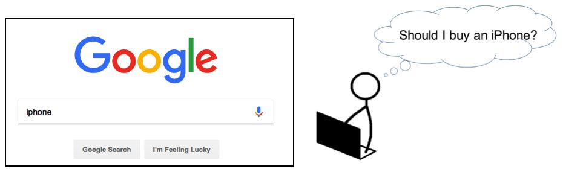
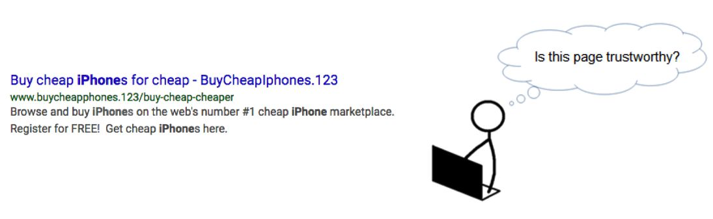
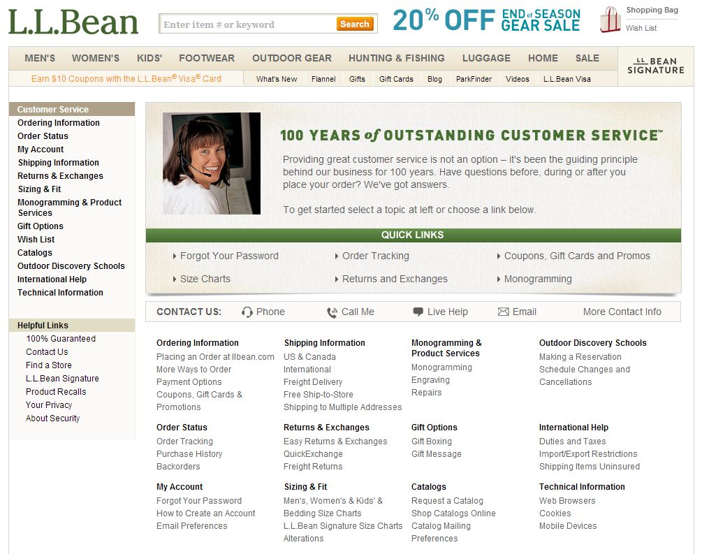

# [General Guidelines July 20, 2018](https://static.googleusercontent.com/media/www.google.com/en//insidesearch/howsearchworks/assets/searchqualityevaluatorguidelines.pdf)

## General Guidelines Overview

0. Introduction to Search Quality Rating
    1. The Purpose of Search Quality Rating
    2. Raters Must Represent the User
    3. Browser Requirements
    4. Ad Blocking Extensions
    5. Internet Safety Information

## Part 1: Page Quality Rating Guideline

1. Introduction to Page Quality Rating
2. Understanding Webpages and Websites
    1. Important Definitions
    2. What is the Purpose of a Webpage?
    3. Your Money or Your Life (YMYL) Pages
    4. Understanding Webpage Content
        1. Identifying the Main Content (MC)
        2. Identifying the Supplementary Content (SC)
        3. Identifying Advertisements/Monetization (Ads)
        4. Summary of the Parts of the Page
    5. Understanding the Website
        1. Finding the Homepage
        2. Finding Who is Responsible for the Website and Who Created the Content on the Page
        3. Finding About Us, Contact Information, and Customer Service Information
    6. Reputation of the Website or Creator of the Main Content
        1. Research on the Reputation of the Website or Creator of the Main Content
        2. Sources of Reputation Information
        3. Customer Reviews of Stores/Businesses
        4. How to Search for Reputation Information
        5. What to Do When You Find No Reputation Information
3. Overall Page Quality Rating
    1. Page Quality Rating: Most Important Factors
    2. Expertise, Authoritativeness, and Trustworthiness (E-A-T)
4. High Quality Pages
    1. Characteristics of High Quality Pages
    2. A Satisfying Amount of High Quality Main Content
    3. Clear and Satisfying Website Information: Who is Responsible and Customer Service
    4. Positive Reputation
    5. A High Level of Expertise/Authoritativeness/Trustworthiness (E-A-T)
    6. Examples of High Quality Pages
5. Highest Quality Pages
    1. Very High Quality MC
    2. Very Positive Reputation
    3. Very High Level of E-A-T
    4. Examples of Highest Quality Pages
6. Low Quality Pages
    1. Lacking Expertise, Authoritativeness, or Trustworthiness (E-A-T)
    2. Low Quality Main Content
    3. Unsatisfying Amount of Main Content
    4. Distracting Ads/SC
    5. Mixed or Mildly Negative Reputation of the Website or Creator of the Main Content
    6. Unsatisfying Amount of Information about the Website or Creator of the Main Content
    7. Examples of Low Quality Pages
7. Lowest Quality Pages
    1. Lack of Purpose Pages
    2. Pages that Fail to Achieve Their Purpose
        1. Lowest E-A-T
        2. No/Little Main Content
        3. Lowest Quality Main Content
        4. Copied Main Content
        5. How to Determine if Content is Copied
        6. Auto-Generated Main Content
        7. Obstructed or Inaccessible Main Content
        8. Inadequate Information about the Website or Creator of the Main Content
        9. Unmaintained Websites, and Hacked, Defaced, or Spammed Pages
    3. Pages that Potentially Spread Hate
    4. Potentially Harmful Pages
        1. Encourage Harm
        2. Malicious Pages
        3. Negative or Malicious Reputation
    5. Pages that Potentially Misinform Users
    6. Pages that Potentially Deceive Users
        1. Deceptive Page Purpose
        2. Deceptive Page Design
    7. Examples of Lowest Quality Pages
8. Medium Quality Pages
    1. Examples of Medium Quality Pages
9. Page Quality Rating Tasks
    1. Instructions for Rating Page Quality Tasks
        1. Rating on Your Phone
    2. Reputation and E-A-T: Website or the Creators of the Main Content?
10. Page Quality Criteria for Specific Types of Pages
    1. Ratings for Encyclopedia Pages
    2. Ratings for Pages with Error Messages or No MC
    3. Ratings for Forums and Q&A pages
11. Page Quality Rating FAQs

## Part 2: Understanding Mobile User Needs 63

12. Understanding Mobile Users, Mobile Queries, and Mobile Results
    1. Important Rating Definitions and Ideas
    2. Understanding the Query
    3. Locale and User Location
    4. Queries with an Explicit Location
    5. Queries with Multiple Meanings
    6. Query Meanings Can Change Over Time
    7. Understanding User Intent
        1. Know and Know Simple Queries
        2. Do and Device Action Queries
        3. Website Queries
        4. Visit-in-Person Queries and User Location
        5. Queries with Multiple User Intents
    8. Understanding Result Blocks
        1. Web Search Result Block Examples
        2. Special Content Result Block Examples
        3. Device Action Result Block Examples
        4. How Device Action Results are Displayed in Rating Tasks
    9. Rating on Your Phone Issues

## Part 3: Needs Met Rating Guideline 83

13. Rating Using the Needs Met Scale
    1. Rating Result Blocks: Block Content and Landing Pages
    2. Fully Meets (FullyM)
        1. Examples of Fully Meets (FullyM) Result Blocks
        2. Examples of Queries that Cannot Have Fully Meets Results
    3. Highly Meets (HM)
        1. Examples of Highly Meets (HM) Result Blocks
    4. Moderately Meets (MM)
        1. Examples of Moderately Meets (MM) Result Blocks
    5. Slightly Meets (SM)
        1. Examples of Slightly Meets (SM) Result Blocks
    6. Fails to Meet (FailsM)
        1. Examples of Fails to Meet (FailsM) Result Blocks
14. Rating Porn, Foreign Language, Did Not Load, and Upsetting-Offensive Results
    1. Porn Flag
    2. Needs Met Rating for Porn Results
        1. Needs Met Rating for Clear Non-Porn Intent Queries
        2. Needs Met Rating for Possible Porn Intent Queries
        3. Needs Met Rating for Clear Porn Intent Queries
    3. Reporting Illegal Images
    4. Foreign Language Flag
        1. Using the Foreign Language Flag
        2. Needs Met Rating for Foreign Language Results
    5. Did Not Load Flag
        1. Using the Did Not Load Flag
        2. Needs Met Rating for Did Not Load Results
    6. Upsetting-Offensive Flag
        1. Using the Upsetting-Offensive Flag
        2. Needs Met Rating for Upsetting-Offensive Tolerant Queries
15. The Relationship between E-A-T and Needs Met
16. Rating Queries with Multiple Interpretations and Intents
    1. Rating Queries with Both Website and Visit-in-Person Intent
17. Specificity of Queries and Landing Pages
18. Needs Met Rating and Freshness
19. Misspelled and Mistyped Queries and Results
    1. Misspelled and Mistyped Queries
    2. Name Queries
20. Non-Fully Meets Results for URL Queries
21. Product Queries: Importance of Browsing and Researching
22. Rating Visit-in-Person Intent Queries
    1. Examples Where User Location Does (and Does Not) Matter
23. Rating English Language Results in Non-English Locales
    1. Examples of English (and Non-English) Results in Non-English Locales

## Appendix: Using the Evaluation Platform 158

24. Overview
25. Acquiring Tasks
26. Rating Tasks Using the Rating Interface
27. Releasing Tasks
28. Understanding the User Location on the Task Page
29. Reporting Duplicate Results in Tasks
    1. Pre-Identified Duplicates
    2. Rater-Identified Duplicates
    3. Reporting Duplicate Results
30. Simplified Needs Met Tasks

# General Guidelines Overview

**Welcome to the Search Quality Rating Program!**

As a Search Quality evaluator, you will work on many different types of rating projects. The General Guidelines primarily cover Page Quality (PQ) rating and Needs Met (NM) rating; however, the concepts are also important for many other types of rating tasks.

For brevity, we refer to "Search Quality Evaluators" as "raters" in these guidelines.

# 0. Introduction to Search Quality Rating

## 0.1 The Purpose of Search Quality Rating

Your ratings will be used to evaluate search engine quality around the world. Good search engines give results that are helpful for users in their specific language and locale.

It is important that you are familiar with and comfortable using a search engine. We encourage you to be an expert in Google search! For example, experiment with using operators (e.g., quotes or a dash) in your searches or try using Google’s advanced search option.

## 0.2 Raters Must Represent the User

It is very important for you to represent users in the locale you evaluate. You must be very familiar with the task language and location in order to represent the experience of users in your locale. If you do not have the knowledge to do this, please inform your employer/company.

## 0.3 Browser Requirements

Check with your employer/company for browser requirements. You may use helpful browser add-ons or extensions, but please do not use add-ons or extensions that interfere with or alter the user experience of the page.

## 0.4 Ad Blocking Extensions

Do not use add-ons or extensions that block ads for Needs Met rating or Page Quality rating. These add-ons or extensions may cause you to give incorrect ratings. As a rater, only use an ad blocking extension or add-on if specifically instructed to do so in the project-specific instructions.

## 0.5 Internet Safety Information

In the course of your work, you will visit many different webpages. Some of them may harm your computer unless you are careful. Please do not download any executables, applications, or other potentially dangerous files, or click on any links that you are uncomfortable with.

**It is strongly recommended that you have antivirus and antispyware protection on your computer. This software must be updated frequently or your computer will not be protected. There are many free and for-purchase antivirus and antispyware products available on the web**.

See [here](http://en.wikipedia.org/wiki/Antivirus_software) for a Wikipedia page on antivirus software and [here](http://en.wikipedia.org/wiki/Spyware) for a Wikipedia page on spyware.

We suggest that you only open files with which you are comfortable. The file formats listed below are generally considered safe if antivirus software is in place.

- `.txt` (text file)
- `.ppt` or `.pptx` (Microsoft PowerPoint)
- `.doc` or `.docx` (Microsoft Word)
- `.xls` or `.xlsx` (Microsoft Excel)
- `.pdf` (PDF) files

If you encounter a page with a warning message, such as "Warning-visiting this web site may harm your computer," or if your antivirus software warns you about a page, you should not try to visit the page to assign a rating.

You may also encounter pages that require RealPlayer or the Adobe Flash plug-in. These are generally safe to download.

# Part 1: Page Quality Rating Guideline

## 1.0 Introduction to Page Quality Rating

A Page Quality (PQ) rating task consists of a URL and a grid to record your observations, in order to guide your exploration of the landing page and the website associated with the URL. Ultimately, the goal of Page Quality rating is to evaluate how well the page achieves its purpose. Because different types of websites and webpages can have very different purposes, our expectations and standards for different types of pages are also different.

Here's what you'll need to be a successful Page Quality rater:

- Your experience using the web as an ordinary user in your rating locale.
- In-depth knowledge of these guidelines.
- And most importantly—practice doing PQ rating tasks!

The examples in these guidelines are very important. Please view each one and keep in mind a few notes about the examples:

- Webpages and websites change rapidly, so we use images or "snapshots" of webpages in most of our examples.
- The information in the examples was accurate at the time it was added, but content and websites may change over time.
- Some examples show pages on desktop and some show pages on mobile devices.

# 2.0 Understanding Webpages and Websites

PQ rating requires an in-depth understanding of websites. We'll start with the basics. Along the way, we'll share important information about Page Quality rating, so please read through this section even if you are a website expert!

## 2.1 Important Definitions

Here are some important definitions:

A **webpage** is connected to the World Wide Web and can be viewed or "visited" using a web browser (e.g., Chrome), a browser on your phone, or a search app. In the 1990s, webpage content was mostly text and links. Today, webpage content includes many forms of media (such as images, videos, etc.) and functionality (such as online shopping features, email, calculator functionality, online games, etc.).

A **URL** is a character string that your web browser uses to "find" and display a webpage. Page Quality rating doesn't require you to have in-depth understanding of the structure of URLs, i.e., you don’t need to know the difference between host, domain, etc. But if you are interested, see here to read more.

A **website** or **site** is a group of World Wide Web pages usually containing hyperlinks to each other and made available online by an individual, company, educational institution, government, or organization. Popular websites include Facebook, Wikipedia, Yahoo, YouTube, etc.

> Note: In these guidelines, we will use the word "website" to refer to a collection of pages owned and controlled by a single entity (individual, business, etc.). But we will also use "website" to refer to major "independent" sections (or hosts) of some websites that were created to achieve separate purposes. For example, the Yahoo website is organized into different sections (or hosts), such as Yahoo Finance (finance.yahoo.com), Yahoo Mail (mail.yahoo.com), Yahoo Sports (sports.yahoo.com), etc. Each of these has its own purpose. It’s OK to refer to each of these sections as a website; for example, the Yahoo Finance website and the Yahoo Sports website. You may also refer to pages on Yahoo Finance or Yahoo Sports as belonging to the Yahoo website.

A **homepage** of a website is the main page of the site. It is usually the first page that users see when the site loads. For example, [http://www.apple.com](http://www.apple.com) is the homepage of the Apple site, [http://www.yahoo.com](http://www.yahoo.com) is the homepage of the Yahoo company site, and [http://finance.yahoo.com](http://finance.yahoo.com) is the homepage of Yahoo Finance. You can usually find the homepage of a website by clicking on a "home" link or logo link on subpages of a website.

A **subpage** on a website is any page on the site other than the homepage. For example, [http://www.apple.com/iphone](http://www.apple.com/iphone) is a subpage on the Apple website, and [http://finance.yahoo.com/options](http://finance.yahoo.com/options) is a subpage on the Yahoo Finance website.

A **webmaster** is the person who is responsible for maintaining a website.

**Important** _:_ You must be very comfortable exploring websites, both by clicking links and modifying URLs in the address bar of your web browser. Become a website detective and explorer!

## 2.2 What is the Purpose of a Webpage?

The purpose of a page is the reason or reasons why the page was created. Every page on the Internet is created for a purpose, or for multiple purposes. Most pages are created to be helpful for users, thus having a beneficial purpose. Some pages are created merely to make money, with little or no effort to help users. Some pages are even created to cause harm to users. The first step in understanding a page is figuring out its purpose.

Why is it important to determine the purpose of the page for PQ rating?

- The goal of PQ rating is to determine how well a page achieves its purpose. In order to assign a rating, you must understand the purpose of the page and sometimes the website.
- By understanding the purpose of the page, you'll better understand what criteria are important to consider when evaluating that particular page.
- Websites and pages should be created to help users. Websites and pages that are created with intent to harm users, deceive users, or make money with no attempt to help users, should receive the Lowest PQ rating. More on this later.

As long as the page is created to help users, we will not consider any particular page purpose or type to be higher quality than another. For example, encyclopedia pages are not necessarily higher quality than humor pages.

**Important**: There are highest quality and lowest quality webpages of all different types and purposes: shopping pages, news pages, forum pages, video pages, pages with error messages, PDFs, images, gossip pages, humor pages, homepages, and all other types of pages. The type of page does not determine the PQ rating—you have to understand the purpose of the page to determine the rating.

Common helpful or beneficial page purposes include (but are not limited to):

- To share information about a topic.
- To share personal or social information.
- To share pictures, videos, or other forms of media.
- To express an opinion or point of view.
- To entertain.
- To sell products or services.
- To allow users to post questions for other users to answer.
- To allow users to share files or to download software.

Here are a few examples where it is easy to understand the purpose of the page:

Type of Page|Purpose of the Page
---|---
[News website homepage](https://static.googleusercontent.com/media/www.google.com/en//insidesearch/howsearchworks/assets/GG/PQ.2.1.1.jpg)|To inform users about recent or important events.
[Shopping page](https://static.googleusercontent.com/media/www.google.com/en//insidesearch/howsearchworks/assets/GG/PQ.2.1.2.jpg)|To sell or give information about the product.
[Video page](https://static.googleusercontent.com/media/www.google.com/en//insidesearch/howsearchworks/assets/GG/PQ.2.1.3.jpg)|To share a cute video of a cat.
[Currency converter page](https://static.googleusercontent.com/media/www.google.com/en//insidesearch/howsearchworks/assets/GG/PQ.2.1.4.jpg)|To calculate equivalent amounts in different currencies.

[Here is an example (OmNomNomNom Page)](https://static.googleusercontent.com/media/www.google.com/en//insidesearch/howsearchworks/assets/GG/PQ.2.1.7.jpg) of a helpful page where the purpose of the page is not as obvious. At first glance, this page may seem pointless or strange. However, it is a page from a humorous site that encourages users to post photos with mouths drawn on them. The purpose of the page is humor or artistic expression. This page has a helpful or beneficial purpose. Even though the [About](https://static.googleusercontent.com/media/www.google.com/en//insidesearch/howsearchworks/assets/GG/OmNomNomNomAbout.jpg) page on this website is not very helpful, the website explains itself on its [FAQ](https://static.googleusercontent.com/media/www.google.com/en//insidesearch/howsearchworks/assets/GG/PQ.2.1.8.jpg) page.

## 2.3 Your Money or Your Life (YMYL) Pages

Some types of pages could potentially impact the future happiness, health, financial stability, or safety of users. We call such pages "Your Money or Your Life" pages, or YMYL. The following are examples of YMYL pages:

- **Shopping or financial transaction pages**: webpages that allow users to make purchases, transfer money, pay bills, etc. online (such as online stores and online banking pages).
- **Financial information pages**: webpages that provide advice or information about investments, taxes, retirement planning, home purchase, paying for college, buying insurance, etc.
- **Medical information pages**: webpages that provide advice or information about health, drugs, specific diseases or conditions, mental health, nutrition, etc.
- **Legal information pages**: webpages that provide legal advice or information on topics such as divorce, child custody, creating a will, becoming a citizen, etc.
- **News articles or public/official information pages important for having an informed citizenry**: webpages that include information about local/state/national government processes, policies, people, and laws; disaster response services; government programs and social services; news about important topics such as international events, business, politics, science, and technology; etc. Please use your judgment and knowledge of your locale. Keep in mind that not all news articles are necessarily considered YMYL.
- **Other**: there are many other topics that you may consider YMYL, such as child adoption, car safety information, etc. Please use your judgment.

We have very high Page Quality rating standards for YMYL pages because low quality YMYL pages could potentially negatively impact users’ happiness, health, financial stability, or safety.

## 2.4 Understanding Webpage Content

All of the content on a webpage can be classified as one of the following: Main Content (MC), Supplementary Content
(SC), or Advertisements/Monetization (Ads). In order to understand the purpose of a webpage and do PQ rating, you will need to be able to distinguish among these different parts of the page.

Webpage design can be complicated, so make sure to click around and explore the page. See what kind of content is behind the tabs and test out the interactive page features. Content behind the tabs may be considered part of the MC, SC, or Ads, depending on what the content is.

###2.4.1 Identifying the Main Content (MC)

Main Content is any part of the page that directly helps the page achieve its purpose. Webmasters directly control the MC of the page (except for user-generated content). MC can be text, images, videos, page features (e.g., calculators, games), or it can be user-generated content such as videos, reviews, articles, etc. that users have added or uploaded to the page. Note that tabs on some pages lead to even more information (e.g., customer reviews) and can sometimes be considered part of the MC of the page.

The MC also includes the title at the top of the page ([example](https://guidelines.raterhub.com/images/2.2.4mc-title.jpg)). Descriptive MC titles allow users to make informed decisions about what pages to visit. Helpful titles summarize the MC on the page.

|**Type of Page and Purpose**|**MC Highlighted in Yellow**|
|---|---|
|News website homepage: the purpose is to inform users about recent or important events.|[MC - News Homepage](https://guidelines.raterhub.com/images/2.2.1m.jpg)|
|News article page: the purpose is to communicate information about an event or news topic.|[MC - News Article](https://guidelines.raterhub.com/images/2.4.news.MC.jpg)|
|Store product page: the purpose is to sell or give information about the product. <ul><li>Content behind the Reviews, Shipping, and Safety Information tabs are considered to be part of the MC.</ul>|[MC - Shopping Page](https://guidelines.raterhub.com/images/2.2.4mc.jpg)|

**Type of Page and Purpose**|**MC Highlighted in Yellow**
|---|---|
Video page: the purpose is to share a video about cats.|[MC - Video Page](https://guidelines.raterhub.com/images/EngineerGuideCatsMC.jpg)
Currency converter page: the purpose is to calculate equivalent amounts in different currencies.|[MC - Currency Converter](https://guidelines.raterhub.com/images/PQ.2.2.6m.jpg)
Blog post page: the purpose is to share music used on a TV show.|[MC - Blog Post Page](https://guidelines.raterhub.com/images/PQ.2.2.9m.jpg)
Search engine homepage: the purpose is to allow users to enter a query and search the Internet.|[MC - Search Engine Homepage](https://guidelines.raterhub.com/images/PQ.2.2.7m.jpg)
Bank login page: the purpose is to allow users to log in to bank online.|[MC - Bank Login Page](https://guidelines.raterhub.com/images/PQ.2.2.8m.jpg)

### 2.4.2 Identifying the Supplementary Content (SC)

Supplementary Content contributes to a good user experience on the page, but does not directly help the page achieve its purpose. SC is controlled by webmasters and is an important part of the user experience. One common type of SC is navigation links that allow users to visit other parts of the website. Note that in some cases, content behind tabs may be considered part of the SC of the page.

Sometimes the easiest way to identify SC is to look for the parts of the page that *are not* MC or Ads.

**Type of Page and Purpose**|**SC Highlighted in Blue**
|---|---|
News article page: the purpose is to communicate information about an event or news topic.|[SC - News Article](https://guidelines.raterhub.com/images/2.4.news.SC.jpg)
Store product page: the purpose is to sell or give information about the product.|[SC - Shopping Page](https://guidelines.raterhub.com/images/PQ.2.2.4s.jpg)
Video page: the purpose is to share a video about cats.|[SC - Video Page](https://guidelines.raterhub.com/images/EngineerGuideCatsSC.jpg)
Blog post page: the purpose is to share music used on a TV show.|[SC - Blog Post Page](https://guidelines.raterhub.com/images/PQ.2.2.9s.jpg)

### 2.4.3 Identifying Advertisements/Monetization (Ads)

Ads may contribute to a good user experience. Advertisements/Monetization (Ads) is content and/or links that are displayed for the purpose of monetizing (making money from) the page. The presence or absence of Ads is not by itself a reason for a **High** or **Low** quality rating. Without advertising and monetization, some webpages could not exist because it costs money to maintain a website and create high quality content.

There are several different ways to monetize a webpage, including advertisements and affiliate programs. See [here](http://en.wikipedia.org/wiki/Website_monetization) for more information on website monetization. Note that monetization on mobile pages may be more subtle than monetization on desktop pages.

The most common type of monetization is advertisements. Ads may be labeled as "ads," "sponsored links," "sponsored listings," "sponsored results," etc. Usually, you can click on the links or mouse over the content to determine whether they are Ads, as they often refer to a URL outside of that website. Ads may change when you reload the page, and different users may see different Ads on the same page.

Webmasters can choose to display Ads on their page (such as by joining an [advertising network](http://en.wikipedia.org/wiki/Advertising_network)), but they may not always directly control the content of the Ads. However, we will consider a website responsible for the overall quality of the Ads displayed.
**Important:** For the purpose of this guideline, we will consider monetized links of any type to be "Ads." See [here](http://en.wikipedia.org/wiki/Website_monetization) for different types of website monetization.

**Type of Page and Purpose**|**Ads Highlighted in Red**
|---|---|
News article page: the purpose is to communicate information about an event or news topic.|[Ads - News Article](https://guidelines.raterhub.com/images/2.4.news.Ads.jpg)
Video page: the purpose is to share a video about cats.|[Ads - Video Page](https://guidelines.raterhub.com/images/EngineerGuideCatsAd.jpg)
Blog post page: the purpose is to share music used on a TV show.|[Ads - Blog Post Page](https://guidelines.raterhub.com/images/PQ.2.2.9a.jpg)
Store product page: the purpose is to sell or give information about the product.|[No ads – Shopping Page](https://guidelines.raterhub.com/images/2.2.4-Ads.jpg)

### 2.4.4 Summary of the Parts of the Page

Let's put it all together.

- **Main Content (MC)** is any part of the page that directly helps the page achieve its purpose. MC is (or should be!) the reason the page exists. The quality of the MC plays a very large role in the Page Quality rating of a webpage.
- **Supplementary Content (SC)** is also important. SC can help a page better achieve its purpose or it can detract from the overall experience.
- Many pages have **advertisements/monetization (Ads)**. Without advertising and monetization, some webpages could not exist because it costs money to maintain a website and create high quality content. The presence or absence of Ads is not by itself a reason for a **High** or **Low** quality rating.

On some pages, reviews may be considered MC, and on other pages they may be considered SC. Use your best judgment and think about the purpose of the page.

Do not worry too much about identifying every little part of the page. Think about which parts of the page are the MC. Next, look for the Ads. Anything left over can be considered SC.

**Type of Page and Purpose**|**MC, SC, and Ads Highlighted**
|---|---|
News article page: the purpose is to communicate information about an event or news topic.|[Summary - News Article](https://guidelines.raterhub.com/images/2.4.news.All.jpg)
Store product page: the purpose is to sell or give information about the product.|[Summary - Shopping Page](https://guidelines.raterhub.com/images/PQ.2.2.4all.jpg)
Video page: the purpose is to share a video about cats.|[Summary - Video Page](https://guidelines.raterhub.com/images/EngineerGuideCatsAll.jpg)
Currency converter page: the purpose is to calculate equivalent amounts in different currencies.|[Summary - Currency Converter](https://guidelines.raterhub.com/images/PQ.2.2.6all.jpg)
Blog post page: the purpose is to share music used on a TV show.|[Summary - Blog Post Page](https://guidelines.raterhub.com/images/PQ.2.2.9all.jpg)
Bank login page: the purpose is to allow users to log in to bank online.|[Summary - Bank Login Page](https://guidelines.raterhub.com/images/PQ.2.2.8all.jpg)

## 2.5 Understanding the Website

Pages often make more sense when viewed as part of a website. Some of the criteria in Page Quality rating are based on the website the page belongs to.

In order to understand a website, look for information about the website on the website itself. Websites are usually very eager to tell you all about themselves!

You must also look for reputation information about the website. We need to find out what outside, independent sources say about the website. When there is disagreement between what the website says about itself and what reputable independent sources say about the website, we’ll trust the independent sources.

### 2.5.1 Finding the Homepage

The homepage of a website usually contains or has links to important information about the website. Webmasters usually make it easy to get to the homepage of the website from any page on the site.

Here's how to find the homepage of a website:

- Examine the landing page of the URL in your PQ rating task.
- Find and click on the link labeled "home" or "main page."
- Having trouble finding it? Try using "Ctrl-F" ("command-F" on a Mac) to search the page for the text "home" or "main." You may also try clicking on the website logo, which is usually at the top of the page.

Sometimes, you may be given a webpage or website that appears to have no navigation links, no homepage link, and no logo or other means to find the homepage. Even some **High** or **Highest** quality pages lack a way to navigate to the homepage. If you can't find a link to the homepage, modify the URL by removing everything to the right of ".com," ".org,"
".net," ".info," etc. and refresh the page.

Occasionally, your rating task will include a URL for which there are two or more justifiable "homepage" candidates. For example, you may not be sure whether the homepage of the URL [http://finance.yahoo.com/news/category-stocks](http://finance.yahoo.com/news/category-stocks) is
[http://finance.yahoo.com](http://finance.yahoo.com) or [http://www.yahoo.com.](http://www.yahoo.com.)

**Important**: When you have more than one homepage "candidate," please use whichever one offers the most information about the specific webpage in the rating task. Use your judgment. The goal is to understand the webpage and the website(s) it is associated with, not find the one unique, correct homepage.

In the following examples, we have included the URL of the page to be evaluated in the rating task, as well as the URL of its associated homepage. We have also included an image that shows where to click on the landing page to navigate to the homepage. In the image, you will see a red box around the link or logo you would click to navigate to the homepage.

**URL of the Task Page**|**Homepage of the Website**|**Image that shows where to click to get to the homepage**
|---|---|---|
http://www.williams-sonoma.com/products/shun-premier-7-piece-knife-block-set|http://www.williams-sonoma.com|Williams-Sonoma Homepage  This "WILLIAMS-SONOMA" logo shown in the upper center of the page is clickable and takes users to the homepage of the website.
[http://answers.yahoo.com/question/index;_ylt=...](http://answers.yahoo.com/question/index;_ylt=AnAYEU1fED6ncg1jRCFy30kk5XNG;_ylv=3?qid=20091214193523AAQqHQS)|http://answers.yahoo.com  In this case, we will consider http://answers.yahoo.com the homepage, rather than http://www.yahoo.com. Why? Because clicking on the logo takes the user to http://answers.yahoo.com. In addition, http://answers.yahoo.com has information about the Yahoo Answers website. It is very difficult to find specific information about http://answers.yahoo.com on the http://www.yahoo.com homepage.|[Specific Yahoo Answers Page](https://guidelines.raterhub.com/images/PQexamples.3.1.5.jpg)  This "YAHOO ANSWERS" logo in the upper left part of the page is clickable and takes users to the homepage of the website.
http://hms.harvard.edu/about-hms/facts-figures|http://hms.harvard.edu  In this case, we will consider the Harvard Medical School page at http://hms.harvard.edu to be the homepage, rather than http://www.harvard.edu (which is the homepage of Harvard University). Clicking the logo at the top of http://hms.harvard.edu/about-hms/facts-figures takes users to http://hms.harvard.edu, not to http://www.harvard.edu.|[Harvard Medical School Facts and Figures Page](https://guidelines.raterhub.com/images/HMS.jpg)  This "Harvard Medical School" logo in the upper left part of the page is clickable and takes users to the homepage of the Harvard Medical School website.

### 2.5.2 Finding Who is Responsible for the Website and Who Created the Content on the Page

Every page belongs to a website, and it should be clear:

- Who (what individual, company, business, foundation, etc.) is responsible for the website.
- Who (what individual, company, business, foundation, etc.) created the content on the page you are evaluating.

Websites are usually very clear about who created the content on the page. There are many reasons for this:

- Commercial websites may have copyrighted material they want to protect.
- Businesses want users to know who they are.
- Artists, authors, musicians, and other original content creators usually want to be known and appreciated.
- Foundations often want support and even volunteers.
- High quality stores want users to feel comfortable buying online.

Most websites have "contact us" or "about us" or "about" pages that provide information about who owns the site. Many companies have an entire website or blog devoted to who they are and what they are doing, what jobs are available, etc. Google and Marriott are both examples of this, and there are many others:

- [Google Official Blog](http://blog.google/)
- [Marriott Blog](http://www.blogs.marriott.com/)
- [Southwest Airlines Blog](http://www.southwestaircommunity.com/)
- [Netflix Tech Blog](http://techblog.netflix.com/)

Often a business or organization is responsible for the content of a website, not an individual person. The IBM Corporation is responsible for the content on ibm.com. The Cleveland Clinic is responsible for the content on clevelandclinic.org. An individual is not responsible for the content on these websites, even though many individuals contributed to creating and maintaining the content. In these cases, we will view the business or organization as responsible for the content on every single page, as well as maintenance of the website.

On some websites, users create the MC of many pages, while the business or organization itself maintains the website. The company Facebook is responsible for the Facebook website, but individuals create the content on their personal Facebook pages. The company Wikipedia is responsible for the Wikipedia website, but individuals create article content. Other websites with user-generated content include YouTube, Twitter, other social networking websites, other article publishing websites, Q&A websites, forums, etc. For these websites, you must look at each page to determine the author(s) or creator(s) of the content on that page.

Finally, there are some websites that show licensed or syndicated content. This means that the website has paid money or has some business relationship with the creator of the content. In these cases, we will consider the website itself to be responsible for the licensed or syndicated content, even if it wasn’t created by the website.

### 2.5.3 Finding About Us, Contact Information, and Customer Service Information

Many websites are interested in communicating with their users. There are many reasons that users might have for contacting a website, from reporting problems such as broken pages, to asking for content removal. Many websites offer multiple ways for users to contact the website: email addresses, phone numbers, physical addresses, web contact forms, etc. Sometimes, this contact information is even organized by department and provides the names of individuals to contact.

The types and amount of contact information needed depend on the type of website. Contact information and customer service information are extremely important for websites that handle money, such as stores, banks, credit card companies, etc. Users need a way to ask questions or get help when a problem occurs.

For shopping websites, we'll ask you to do some special checks. Look for contact information—including the store’s policies on payment, exchanges, and returns. Sometimes this information is listed under "customer service."

Some kinds of websites need fewer details and a smaller amount of contact information for their purpose. For example, humor websites may not need the level of detailed contact information we would expect from online banking websites.

Occasionally, you may encounter a website with a legitimate reason for anonymity. For example, personal websites may not include personal contact information such as an individual’s home address or phone number. Similarly, websites with user-generated content may allow the author to identify him/herself with an alias or username only.

To find contact or customer service information for a website, start with the homepage. Look for a "contact us" or "customer service" link. Explore the website if you cannot find a "contact us" page. Sometimes you will find the contact information on a "corporate site" link or even on the company’s Facebook page. Be a detective!

Note that different locales may have their own specific standards and requirements for what information should be available on the website.

## 2.6 Reputation of the Website or Creator of the Main Content

A website's reputation is based on the experience of real users, as well as the opinion of people who are experts in the topic of the website. Keep in mind that websites often represent real companies, organizations, and other entities. Therefore, reputation research applies to both the website and the actual company, organization, or entity that the website is representing.

A website's reputation can also help you understand what a website is best known for, and as a result how well it accomplishes its purpose. For example, newspapers may be known for high quality, independent investigative reporting while satire websites may be known for their humor.

Many websites are eager to tell users how great they are. Some webmasters have read these rating guidelines and write "reviews" on various review websites. But for Page Quality rating, you must also look for outside, independent reputation information about the website. When the website says one thing about itself, but reputable external sources disagree with what the website says, trust the external sources.

Your job is to truly evaluate the Page Quality of the site, not just blindly accept information on one or two pages of the website. Be skeptical of claims that websites make about themselves.

### 2.6.1 Research on the Reputation of the Website or Creator of the Main Content

Use reputation research to find out what real users, as well as experts, think about a website. Look for reviews, references, recommendations by experts, news articles, and other credible information created/written by individuals about the website.

Stores frequently have user ratings, which can help you understand a store’s reputation based on the reports of people who actually shop there. We consider a large number of positive user reviews as evidence of positive reputation.

Many other kinds of websites have reputations as well. For example, you might find that a newspaper website has won journalistic awards. Prestigious awards, such as the Pulitzer Prize award, are strong evidence of positive reputation.

When a high level of authoritativeness or expertise is needed, the reputation of a website should be judged on what expert opinions have to say. Recommendations from expert sources, such as professional societies, are strong evidence of very positive reputation.

Reputation research is necessary for all websites you encounter. Do not just assume websites you personally use have a good reputation. Please do research! You might be surprised at what you find.

### 2.6.2 Sources of Reputation Information

Look for information written by a person, not statistics or other machine-compiled information. News articles, Wikipedia articles, blog posts, magazine articles, forum discussions, and ratings from independent organizations can all be sources of reputation information. Look for independent, credible sources of information.

Sometimes, you will find information about a website that is not related to its reputation. For example, pages like [Alexa](http://www.alexa.com/) have information about Internet traffic to the website, but do not provide evidence of positive or negative reputation. You can ignore this information since it's not helpful for Page Quality rating.

### 2.6.3 Customer Reviews of Stores/Businesses

Customer reviews can be helpful for assessing the reputation of a store or business. However, you should interpret these reviews with care, particularly if there are only a few. Be skeptical of both positive and negative user reviews. Anyone can write them, including the creator of the website or someone the store or business hires for this purpose. See [here](https://guidelines.raterhub.com/images/FerretingOutFakeReviewsOnline.jpg) for a New York Times article on fake reviews and [here](http://www.theguardian.com/money/2013/jan/26/fake-reviews-plague-consumer-websites) for a Guardian article on fake reviews.

When interpreting customer reviews, try to find as many as possible. Any store or website can get a few negative reviews. This is completely normal and expected. Large stores and companies have thousands of reviews and most receive some negative ones.

It is also important to read the reviews because the content of the reviews matter, not just the number. Credible, convincing reports of fraud and financial wrongdoing is evidence of extremely negative reputation. A single encounter with a rude clerk or the delayed receipt of a single package should not be considered negative reputation information. Please use your judgment.

### 2.6.4 How to Search for Reputation Information

Here is how to research the reputation of the website:

1. Identify the "homepage" of the website. For example, for the IBM website, ibm.com is the homepage. You may eed to identify the creator of the content, if it is different from that of the overall website.

2. Using ibm.com as an example, try one or more of the following searches on Google:
    - [`ibm -site:ibm.com`]: A search for IBM that excludes pages on ibm.com.
    - [`"ibm.com" -site:ibm.com`]: A search for "ibm.com" that excludes pages on ibm.com.
    - [`ibm reviews -site:ibm.com`] A search for reviews of IBM that excludes pages on ibm.com.
    - [`"ibm.com" reviews -site:ibm.com`]: A search for reviews of "ibm.com" that excludes pages on ibm.com.
    - For content creators, try searching for their name or alias.
    > Note: When searching for reputation information, try to find sources that were not written or created by the website, the company itself, or the individual. For example, IBM might have official Facebook or Twitter pages that it closely maintains, which would not be considered independent sources of reputation information about the company. See [here](https://en.wikipedia.org/wiki/Wikipedia:Identifying_and_using_independent_sources) for a Wikipedia article on identifying and using independent sources.

3. Look for articles, reviews, forum posts, discussions, etc. written by people about the website. For businesses, here are many sources of reputation information and reviews. Here are some examples: [Yelp](https://guidelines.raterhub.com/images/PQ.ReputationResearchExampleWebsite1.jpg), [Better Business Bureau](https://guidelines.raterhub.com/images/PQ.ReputationResearchExampleWebsite3.jpg) (a nonprofit organization that focuses on the trustworthiness of businesses and charities), [Amazon](https://guidelines.raterhub.com/images/PQ.ReputationResearchExample4.jpg), and [Google Shopping](https://guidelines.raterhub.com/images/PQ.ReputationResearchExample5.jpg). You can try searching on specific sites to find reviews. For example, you can try [`ibm ite:bbb.org`] or [`"ibm.com" site:bbb.org`].

    For content creators, look for biographical data and other sources that are not written by the individual.

    > Note: You will sometimes find high ratings on the Better Business Bureau (BBB) website because there is very little data on the business, not because the business has a positive reputation. However, very low ratings on BBB are usually the result of multiple unresolved complaints. Please consider very low ratings on the BBB site to be evidence for a negative reputation.

4. See if there is a Wikipedia article or news article from a well-known news site. Wikipedia can be a good source of nformation about companies, organizations, and content creators. For example, try [`ibm site:en.wikipedia.org`] or [`"ibm.com" site:en.wikipedia.org`]. News articles and Wikipedia articles can help you learn about a company and ay include information specific to reputation, such as awards and other forms of recognition, or also ontroversies and issues. Note that some Wikipedia articles include a message warning users that there are isagreements on some of the content, or that the content may be outdated. This may be an indication that dditional research is necessary.

Here are some examples of reputation information:

Website|Reputation Information About the Site|Description
|---|---|---|
[annualcreditreport.com](https://guidelines.raterhub.com/images/PQ_AnnualCreditReport.jpg)|[Search results for [`annualcreditreport.com -site:annualcreditreport.com`]](https://guidelines.raterhub.com/images/SearchResultsForannualcreditreport.comminussiteannualcreditreport.com.jpg)  [Wikipedia article about annualcreditreport.com](https://guidelines.raterhub.com/images/PQ_AnnualCreditReport_Wikipedia.jpg)  [Wall Street Journal article about annualcreditreport.com](https://guidelines.raterhub.com/images/PQ_annualcreditreport_WSJ.jpg)|**Positive reputation information**: Users in the U.S. can obtain free credit reports on this website by providing their Social Security Number. Note that the Wikipedia article tells us that "AnnualCreditReport.com is the only federally mandated and authorized source for obtaining a free credit report."  Note: Almost every website will have complaints about customer service, so it is important to look at various sources and reviews in your reputation research.
[clevelandclinic.org](https://guidelines.raterhub.com/images/PQ_Cleveland_Clinic.jpg)|  [Search results for [`clevelandclinic.org`]](https://guidelines.raterhub.com/images/SearchResultsforclevelandclinic.org.jpg)  [Wikipedia article about clevelandclinic.org](https://guidelines.raterhub.com/images/PQ_ClevelandClinic_Wikipedia.jpg)  [US News & World Report article about the best hospitals in the U.S.](https://guidelines.raterhub.com/images/PQ_ClevelandClinic_USNews.jpg)|**Positive reputation information**: According to Wikipedia, the Cleveland Clinic "is currently regarded as one of the top 4 hospitals in the United States as rated by U.S. News & World Report," which you will also find in the article on the best hospitals in the U.S. Users can trust medical information on this website.
[csmonitor.com](https://guidelines.raterhub.com/images/PQ.3.5.8.jpg)|  [Search results for [`csmonitor.com -site:csmonitor.com`]](https://guidelines.raterhub.com/images/PQ.3.5.8.ReputationResearchQuery1.jpg)  [Wikipedia article about The Christian Science Monitor](https://guidelines.raterhub.com/images/RG3.3.5.8.1.jpg)|**Positive reputation information**: Notice the highlighted section in the Wikipedia article about The Christian Science Monitor newspaper, which tells us that the newspaper has won seven Pulitzer Prize awards. From this information, we can infer that the csmonitor.com website has a positive reputation.
[kernel.org](https://guidelines.raterhub.com/images/kerneldotorg.jpg)|  [Search results for [`kernel.org –site:kernel.org`]](https://guidelines.raterhub.com/images/PQ_Examples_site-kernel.org_Google_Search.jpg)  [Wikipedia article about kernel.org](https://guidelines.raterhub.com/images/kernel.org_wikipedia.jpg)|**Positive reputation information**: We learn in the Wikipedia article that "Kernel.orgis a mainrepositoryof source code for theLinux kernel, the base of the popularLinuxoperating system. It makes all versions of the source code available to all users. It also hosts various other projects, likeGoogle Android. The main purpose of the site is to host a repository for Linux kernel developers and maintainers of Linux distributions."
[Site selling children’s jungle gym](https://guidelines.raterhub.com/images/domeclimber.com.jpg)|  [Search to find reputation information](https://guidelines.raterhub.com/images/searchreusltsfordomeclimber.com_site_bbb.org.jpg)  [Search to find reviews](https://guidelines.raterhub.com/images/SearchResultsDomeClimber.comReviews.jpg)  [BBB negative review](https://guidelines.raterhub.com/images/DomeClimberBBBReview.jpg)  [TrustLink negative reviews](https://guidelines.raterhub.com/images/TrustLinkDomeClimberNegativeReviews.jpg)  [Negative news article](https://guidelines.raterhub.com/images/DupedByDomeClimberArticle.jpg)|**Extremely negative reputation information**: This business has a BBB rating of F (i.e., lowest rating given by BBB). There is a news article about financial fraud. There are many reviews on websites describing users sending money and not receiving anything from various sources.
[Site selling products related to eyewear](https://guidelines.raterhub.com/images/RG3_3.5-40.jpg)|  [Search to find reputation information](https://guidelines.raterhub.com/images/SearchResultsfordecormyeyes.comminussitedecormyeyes.com.jpg)  [BBB page](https://guidelines.raterhub.com/images/PQ.3.5.5.jpg)  [Wikipedia article](https://guidelines.raterhub.com/images/PQ_DecorMyEyes_Wikipedia.jpg)  [New York Times article](https://guidelines.raterhub.com/images/PQ_decormyeyes_NYTimes.jpg)|**Extremely negative/malicious reputation information**: This website engaged in criminal behavior such as physically threatening users.
[Organization serving the hospitalized veteran community](https://guidelines.raterhub.com/images/PQ.3.5.10.jpg)|  [Search to find scams related this organization](https://guidelines.raterhub.com/images/PQ.3.5.10.ReputationResearchQuery2.jpg)  [Negative review 1](https://guidelines.raterhub.com/images/PQ.3.5.10.ReputationInformation1.jpg)  [Negative review 2](https://guidelines.raterhub.com/images/PQ.3.5.10.ReputationInformation2.jpg)  [Negative review 3](https://guidelines.raterhub.com/images/PQ.3.5.10.ReputationInformation3.jpg)  [Negative review 4](https://guidelines.raterhub.com/images/PQ.3.5.10.ReputationInformation4.jpg)|**Extremely negative reputation information**: There are many detailed negative articles on news sites and charity watchdog sites about this organization describing fraud and financial mishandling.

### 2.6.5 What to Do When You Find No Reputation Information

You should expect to find reputation information for large businesses and websites of large organizations, as well as well-known content creators.

Frequently, you will find little or no information about the reputation of a website for a small organization. This is not indicative of positive or negative reputation. Many small, local businesses or community organizations have a small "web presence" and rely on word of mouth, not online reviews. For these smaller businesses and organizations, lack of reputation should not be considered an indication of low page quality.

# 3.0 Overall Page Quality Rating

At a high level, here are the steps of Page Quality rating:

1. Understand the true purpose of the page. Websites or pages without any beneficial purpose, including pages that re created with no attempt to help users, or pages that potentially spread hate, cause harm, or misinform or eceive users, should receive the **Lowest** rating. No further assessment is necessary.
2. Otherwise, the PQ rating is based on how well the page achieves its purpose using the criteria outlined in the ollowing sections on **Lowest** , **Low** , **Medium** , **High,** and **Highest** quality pages.

On Page Quality rating tasks, you will use the Page Quality sliding scale (slider) to assign the overall PQ rating. The slider looks like this:

You may also use the in-between ratings of **Lowest+** , **Low+** , **Medium+** , and **High+**. Please interpret the "+" as "+ ½,"
meaning that the **Lowest+** rating is halfway between **Lowest** and **Low** , **Low+** is halfway between **Low** and **Medium** , etc.

In the following sections, you will learn about characteristics of **Lowest** , **Low** , **Medium** , **High,** and **Highest** quality pages.

## 3.1 Page Quality Rating: Most Important Factors

Here are the most important factors to consider when selecting an overall Page Quality rating:

- The Purpose of the Page
- Expertise, Authoritativeness, Trustworthiness: This is an important quality characteristic. Use your research on the additional factors below to inform your rating.
- Main Content Quality and Amount: The rating should be based on the landing page of the task URL.
- Website Information/information about who is responsible for the MC: Find information about the website as well as the creator of the MC.
- Website Reputation/reputation about who is responsible for the MC: Links to help with reputation research will be provided.

> Note: Some tasks may ask you to view the page on your phone, but to do research (e.g., finding website information and reputation) on your desktop. Other tasks may ask you to do everything on desktop. Please follow instructions in the task.

## 3.2 Expertise, Authoritativeness, and Trustworthiness (E-A-T)

Remember that the first step of PQ rating is to understand the true purpose of the page. Websites or pages without some sort of beneficial purpose, including pages that are created with no attempt to help users, or pages that potentially spread hate, cause harm, or misinform or deceive users, should receive the **Lowest** rating.

For all other pages that have a beneficial purpose, the amount of expertise, authoritativeness, and trustworthiness (E-A-T)
is very important. Please consider:

- The expertise of the creator of the MC.
- The authoritativeness of the creator of the MC, the MC itself, and the website.
- The trustworthiness of the creator of the MC, the MC itself, and the website.

Keep in mind that there are high E-A-T pages and websites of all types, even gossip websites, fashion websites, humor websites, forum and Q&A pages, etc. In fact, some types of information are found almost exclusively on forums and discussions, where a community of experts can provide valuable perspectives on specific topics.

- High E-A-T medical advice should be written or produced by people or organizations with appropriate medical

expertise or accreditation. High E-A-T medical advice or information should be written or produced in a professional style and should be edited, reviewed, and updated on a regular basis.
- High E-A-T news articles should be produced with journalistic professionalism—they should contain factually accurate content presented in a way that helps users achieve a better understanding of events. High E-A-T news sources typically have published established editorial policies and robust review processes (example 1, example
2 ).
- High E-A-T information pages on scientific topics should be produced by people or organizations with appropriate scientific expertise and represent well-established scientific consensus on issues where such consensus exists.
- High E-A-T financial advice, legal advice, tax advice, etc., should come from trustworthy sources and be maintained and updated regularly.
- High E-A-T advice pages on topics such as home remodeling (which can cost thousands of dollars and impact your living situation) or advice on parenting issues (which can impact the future happiness of a family) should also come from "expert" or experienced sources that users can trust.
- High E-A-T pages on hobbies, such as photography or learning to play a guitar, also require expertise.

Some topics require less formal expertise. Many people write extremely detailed, helpful reviews of products or restaurants. Many people share tips and life experiences on forums, blogs, etc. These ordinary people may be considered experts in topics where they have life experience. If it seems as if the person creating the content has the type and amount of life experience to make him or her an "expert" on the topic, we will value this "everyday expertise" and not penalize the person/webpage/website for not having "formal" education or training in the field.

It’s even possible to have everyday expertise in YMYL topics. For example, there are forums and support pages for people with specific diseases. Sharing personal experience is a form of everyday expertise. Consider this example. Here, forum participants are telling how long their loved ones lived with liver cancer. This is an example of sharing personal experiences (in which they are experts), not medical advice. Specific medical information and advice (rather than descriptions of life experiences) should come from doctors or other health professionals.

Think about the topic of the page. What kind of expertise is required for the page to achieve its purpose well? The standard for expertise depends on the topic of the page.

# 4.0 High Quality Pages

In this section, we will describe characteristics of **High** quality pages and give many examples. Examples help calibrate your ratings, so please review each one.

## 4.1 Characteristics of High Quality Pages

**High** quality pages exist for almost any beneficial purpose, from giving information to making people laugh to expressing oneself artistically to purchasing products or services online.

What makes a **High** quality page? A **High** quality page should have a beneficial purpose and achieve that purpose well. In addition, **High** quality pages have the following characteristics:

- *High level of Expertise, Authoritativeness, and Trustworthiness (E-A-T).*
- A satisfying amount of high quality MC, including a descriptive or helpful title.
- Satisfying website information and/or information about who is responsible for the website. If the page is primarily for shopping or includes financial transactions, then it should have satisfying customer service information.
- Positive website reputation for a website that is responsible for the MC on the page. Positive reputation of the creator of the MC, if different from that of the website.

## 4.2 A Satisfying Amount of High Quality Main Content

The quality of the MC is one of the most important criteria in Page Quality rating, and informs the E-A-T of the page. For

all types of webpages, creating high quality MC takes a significant amount of at least one of the following: time, effort,

expertise, and talent/skill. For news articles and information pages, high quality MC must be factually accurate for the

topic and must be supported by expert consensus where such consensus exists.

For each page you evaluate, spend a few minutes examining the MC before drawing a conclusion about it. Read the article, watch the video, examine the pictures, use the calculator, play the online game, etc. Remember that MC also includes page features and functionality, so test the page out. For example, if the page is a product page on a store website, put at least one product in the cart to make sure the shopping cart is functioning. If the page is an online game, spend a few minutes playing it.

The purpose of the page will help you determine what high quality content means for that page. For example, High quality information pages should be factually accurate, clearly written, and comprehensive. High quality shopping content should allow users to find the products they want and to purchase the products easily. High quality humor or satire should be entertaining, while factual accuracy is not a requirement as long as the page would be understood as satire by users.

The amount of content necessary for the page to be satisfying depends on the topic and purpose of the page. A **High**
quality page on a broad topic with a lot of available information will have more content than a **High** quality page on a narrower topic. Here are some examples of pages with a satisfying amount of high quality MC.

Webpage Discussion

Siberian Husky Information Page

The Siberian Husky (a breed of dog) is a narrow topic. Although this encyclopedia landing page has less MC than some encyclopedia pages on broader topics, it has a satisfying amount of clearly written, high quality MC.

Kitchen Stand Mixer Shopping Page

This shopping page on a reputable shopping website has a satisfying amount of high quality MC. The page provides the manufacturer’s product specs, as well as original product information, over 90 user reviews, shipping and returns information, multiple images of the product, etc. Note: Some of the MC is behind links on the page ("item details," "item specifications," "guest reviews," etc.). Even though you have to click these links to see the content, it is still considered MC.

Movie Review Page This movie review written by a movie critic has a satisfying amount of high quality MC. Time, effort, and^
talent/skill went into writing this movie review.

## 4.3 Clear and Satisfying Website Information: Who is Responsible and Customer Service

Understanding who is responsible for a website is a critical part of assessing E-A-T for most types of websites. High quality pages should have clear information about the website so that users feel comfortable trusting the site.

The amount of information needed for E-A-T assessment depends on the type of website. For example, YMYL websites demand a high degree of trust, so they generally need satisfying information about who is responsible for the content of the site. In addition, High quality stores and financial transaction websites also need clear and satisfying customer service information to help users resolve issues.

Other websites that are not YMYL websites may need less website information, depending on the purpose of the website. For example, an email address may be sufficient for some non-YMYL websites.

## 4.4 Positive Reputation

Reputation is an important criteria when using the **High** rating, and informs the E-A-T of the page. While a page can merit the **High** rating with no reputation, the **High** rating cannot be used for any website that has a convincing negative reputation. Remember that when doing research, make sure to consider the reasons behind a negative rating and not just the rating itself.

## 4.5 A High Level of Expertise/Authoritativeness/Trustworthiness (E-A-T)

**High** quality pages and websites need enough expertise to be authoritative and trustworthy on their topic. Remember that there are "expert" websites of all types, even gossip websites, fashion websites, humor websites, forum and Q&A pages, etc. In fact, some types of information are found almost exclusively on forums and discussions, where a community of experts can provide valuable perspectives on specific topics.

Think about the topic of the page. What kind of expertise is required for the page to achieve its purpose well? The standard for expertise depends on the topic of the page. For example, high quality news articles and information pages on scientific topics should represent established scientific consensus where such consensus exists.

## 4.6 Examples of High Quality Pages

Webpage/Type of Content High Quality Characteristics PQ Rating and Explanation

High: News 1

Homepage of a newspaper
(YMYL)

- A satisfying amount of high quality MC
- Positive reputation (website)
This newspaper has won seven Pulitzer Prize awards.

High: News 2

Article on a newspaper website
(YMYL)

- A satisfying amount of high quality MC
- Positive reputation (website)
- High E-A-T of the publisher and/or author

This is an article on a newspaper website that has won ten Pulitzer Prize awards. There is a satisfying amount of high quality MC. While there are Ads on the page, the MC is easy to find and the Ads are clearly labeled as Ads.

High: News 3

Opinion article on a newspaper website

- A satisfying amount of high quality MC
- Positive reputation (website)
- High E-A-T of the publisher and/or author

This is an opinion piece written by the Editorial Board of the the largest newspaper in the U.S. state of Minnesota. The page is clearly labelled as an opinion piece, welcoming a new football coach to the University of Minnesota.

High: Government agency

US Naval Observatory Master Clock page

- High E-A-T for the purpose of the page

The purpose of this page is to display the official US Naval Observatory Master Clock time in 7 different time zones. The page displays the clock information in a clear, easy-to-read format. The Naval Observatory is highly trustworthy and authoritative for this type of information.

High: Humor

Article on a humor website

- High quality humorous MC
- Positive reputation (website)
- Expertise as a farcical humor website This website is well-known for its humorous, satirical articles. This is a cute example of a satisfying and funny article.

**Webpage/Type of Content High Quality Characteristics PQ Rating and Explanation**

High: Small business 1

Local fish & chips restaurant

- High E-A-T for the purpose of the page

This is an "about us" page on a restaurant website. This page provides information on when the restaurant opened and what visitors can expect. Other pages on the website provide information about the restaurant including the address, menu, other contact information, etc. This website is highly authoritative because it is about itself.

High: Small business 2

Local preservation center

- High E-A-T for the purpose of the page
- A satisfying amount of high quality MC

This is the News and Updates section of a local preservation center selling poultry, vegetables, and more.

> Note: This example was added in 2014 so the
"News and Updates" were timely.

High: Blog post

Parenting article about strollers

- A satisfying amount of high quality MC
- Very positive reputation (website)
- Specifically, high E-A-T and positive reputation for this specific blog and author

This is a blog post on a newspaper that has won over 100 Pulitzer Prize awards. The author of this blog post has become known as an expert on parenting issues. She is a regular contributor to this and other media websites.

High: Shopping 1

Backpack shopping page on a popular store website (YMYL)

- A satisfying amount of high quality MC
- Positive reputation (website)

The purpose of this page is to allow users to buy a school backpack. The page provides a lot of different backpack options, and some of them have user reviews.

This is a well-known, reputable merchant, with detailed Customer Service information on the site.

High: Shopping 2

Bathroom décor page on a store website (YMYL)

- High E-A-T for the purpose of the page
- Positive reputation (website)

This company sells its own line of high end, fashionable baby and children’s furniture and accessories. It has a positive reputation as well as expertise in these specific types of goods. Many products sold on the site are unique to this company.

**Webpage/Type of Content High Quality Characteristics PQ Rating and Explanation**

High: Shopping 3

TomTom GPS page on an electronics website (YMYL)

- A satisfying or comprehensive amount of very high quality MC
- High E-A-T for the purpose of the page
- Positive reputation (website)

There is a very large quantity of MC on this page. Note that the tabs on the page lead to even more information, including many customer reviews. The tabs should be considered part of the MC.

High: Video 1

Saturday Night Live video on a video website

- A satisfying or comprehensive amount of very high quality MC
- High E-A-T for the purpose of the page The MC of this video page is an episode of Saturday Night Live, a very popular television show.

High: Video 2

"An Engineer’s Guide to Cats"
video

- A satisfying amount of high quality MC
- High E-A-T (everyday expertise) on the topic of cat ownership

This is a humorous, high quality, well produced video with more than 6.5 million views (and counting), illustrating the proper care and practical benefits of cats. The two engineers in the video have everyday expertise on cat ownership. For a humorous video like this one, expertise does not have to be in the form of a trained veterinarian.

High: Game

Online game

- A satisfying or comprehensive amount of very high quality MC
- Positive reputation (website) as an educational tool for kids

Highly engaging game with multiple levels that could entertain a child for hours. This website has a positive reputation for educating children about animals.

High: Q&A

How long do cancer patients live

- A satisfying amount of high quality MC in the form of personal narratives

The question on the page asks how long people live with cancer. There are many responses describing how long a loved one lived after diagnosis. There is very little medical advice and the focus of the page is sharing personal experience. Many responses are heartfelt and well written.

**Webpage/Type of Content High Quality Characteristics PQ Rating and Explanation**

High: Encyclopedia

Encyclopedia article about the American Civil War

- A satisfying or comprehensive amount of high quality MC
- Positive reputation (website)
- High E-A-T for the article

This is a detailed article about the American Civil War. The citations support the E-A-T of this article.

> Note: Although much of the content is visible on the mobile page, we consider the content under the headings (which you need to expand) to be part of the MC. (To see the screenshot, you will need to zoom in to the image.)

High: Forum 1

Authenticating a luxury designer purse

- High E-A-T for the purpose of the page
- A satisfying amount of high quality MC

This forum is well-known for discussions on luxury designer purses. On this particular forum page, members are consulting forum experts who have expertise authenticating bags from this brand. These experts can tell if a particular bag is authentic or fake. While there is an ad at the top and a few ads within the forum message, it does not distract from the MC, which is easy to find.

(To see the screenshot, you will need to zoom in to the image.)
High: Forum 2

Landscaping an aquarium

- High E-A-T for the purpose of the page
- A satisfying amount of high quality MC

This discussion focuses on the landscaping for a particular paludarium (an aquarium with terrestrial and aquatic elements). There is a lot of discussion and interaction between forum members about the types of materials and species used in the aquarium. The posts show expertise in a niche topic aquarium landscaping.

# 5.0 Highest Quality Pages

**Highest** quality pages are created to serve a beneficial purpose and achieve their purpose very well. The distinction between **High** and **Highest** is based on the quality and quantity of MC, as well as the level of reputation and E-A-T.

What makes a page **Highest** quality? In addition to the attributes of a **High** quality page, a **Highest** quality page must have at least one of the following characteristics:

- *Very high level of Expertise, Authoritativeness, and Trustworthiness (E-A-T).*
- A very satisfying amount of high or highest quality MC.
- Very positive website reputation for a website that is responsible for the MC on the page. Very positive reputation of the creator of the MC, if different from that of the website.

## 5.1 Very High Quality MC

We will consider the MC of the page to be very high or highest quality when it is created with a high degree of time and effort, and in particular, expertise, talent, and skill—this may provide evidence for the E-A-T of the page. Very high quality MC may be created by experts, hobbyists, or even people with everyday expertise. Our standards depend on the purpose of the page and the type of content. However, for news articles and information pages on YMYL topics, there is a high standard for accuracy and well-established medical/scientific/historical consensus where such consensus exists. The **Highest** rating may be justified for pages with a satisfying or comprehensive amount of very high quality MC.

## 5.2 Very Positive Reputation

Extensive reputation research is important when giving **Highest** ratings, and is evidence of the E-A-T of the page. Very positive reputation is often based on prestigious awards or recommendations from known experts or professional societies on the topic of the page. Wikipedia and other informational sources can be a good starting point for reputation research.

For some topics, such as humor or recipes, less formal expertise is OK. For these topics, popularity, user engagement, and user reviews can be considered evidence of reputation. For topics that need less formal expertise, websites can be considered to have a positive reputation if they are highly popular and well-loved for their topic or content type, and are focused on helping users.

## 5.3 Very High Level of E-A-T

**Highest** quality pages and websites have a very high level of expertise or are highly authoritative or highly trustworthy.

Formal expertise is important for topics such as medical, financial, or legal advice. Expertise may be less formal for topics such as recipes or humor. An expert page on cooking may be a page on a professional chef’s website, or it may be someone who posts popular cooking videos on YouTube. Please value life experience and "everyday expertise." For some topics, the most expert sources of information are ordinary people sharing their life experiences on personal blogs, forums, reviews, discussions, etc.

Think about what expertise, authoritativeness, and trustworthiness mean for the topic of the page. Who are the experts?
What makes a source trustworthy for the topic? What makes a website highly authoritative for the topic?

## 5.4 Examples of Highest Quality Pages

Webpage/Type of Content Highest Quality Characteristics PQ Rating and Explanation

Highest: News

Article on a newspaper website

- Very high level of E-A-T for the purpose of the page, including of the publisher and/or authors for a news article
- A satisfying or comprehensive amount of very high quality MC for the purpose of the page
- Very positive reputation (website)

This is a feature article from a newspaper that has won 40 Pulitzer Prize awards and is the largest newspaper in the U.S. by circulation at the time this example was written.

The page has a comprehensive amount of very high-quality MC, including in-depth reporting by two authors with extensive knowledge and experience in investigative journalism.

Highest: Informational 1

Fact-checking page on an Internet rumor debunking website

- A satisfying or comprehensive amount of very high quality MC
- Very high level of E-A-T for the purpose of the page
- Positive reputation (website)

This page is on a well-known fact-checking and debunking website that covers urban legends, Internet rumors, and other stories of unknown or questionable origin.

The page has a very satisfying amount of MC for users seeking to validate a claim about a documentary film about mermaids. Users can trust the information on this page due to the website's positive reputation and high level of expertise in debunking non-YMYL stories of this type.

Highest: Informational 2

Ball gown wedding dress page

- A satisfying or comprehensive amount of very high quality MC
- Very high level of E-A-T for the purpose of the page
- Positive reputation (website)

This page has a very satisfying amount of MC for users interested in ball gown wedding dresses. An abundance of pictures, plus options to view by price range, style, etc., are part of what makes this page so satisfying. This page is on a popular wedding planning website.

Highest: Government agency

Yosemite National Park information

- Very high level of E-A-T for the purpose of the page
- A satisfying or comprehensive amount of very high quality MC for the purpose of the page

This page has a highly satisfying amount of helpful information about Yosemite National Park, including traffic alerts and links to other parts of the website with additional information. Since the page is on the official national park website, it is uniquely authoritative.

**Webpage/Type of Content Highest Quality Characteristics PQ Rating and Explanation**

Highest: Technical 1

Software tips

- Very high level of E-A-T for the purpose of the page
- A satisfying or comprehensive amount of high quality MC

This page offers a satisfying amount of helpful and very high quality MC for the purpose of the page. Because the page is on the official website of the company that produces the software, it is highly authoritative.

Highest: Technical 2

Linux Kernel archives

- Very high level of E-A-T for the purpose of the page
- A satisfying or comprehensive amount of high quality MC

From this Wikipedia article, we learn that
"Kernel.org is a main repository of source code for the Linux kernel, the base of the popular Linux operating system. It makes all versions of the source code available to all users... The main purpose of the site is to host a repository for Linux kernel developers and maintainers of Linux distributions."

This website is the most authoritative source for information about Linux.

Highest: Financial 1

Credit report information website
(YMYL)

- Very high level of E-A-T for the purpose of the page
- Very positive reputation (website)

Users in the U.S. can obtain free credit reports on this website by providing their Social Security Number. This Wikipedia article tells us that this website is "the only federally mandated and authorized source for obtaining a free credit report."

Highest: Financial 2

Tax forms page (YMYL)

- Very high level of E-A-T for the purpose of the page
- A satisfying or comprehensive amount of very high quality MC for the purpose of the page

The purpose of the page is to provide income tax forms and publications. The website represents an agency of the U.S. federal government that handles taxes, so the page and forms are uniquely authoritative and trustworthy.

Highest: Magazine Article 1

Article titled "Secret Fears of the Super-Rich"

- Very high level of E-A-T for the purpose of the page
- A satisfying or comprehensive amount of very high quality MC
- Very positive reputation (website)
This is a very high quality and in-depth article on an award winning magazine website.

Highest: Magazine Article 2

Interview with musical artist

- Very high level of E-A-T for the purpose of the page
- A satisfying or comprehensive amount of very high quality MC
- Very positive reputation (website)

This magazine is very well-known and well regarded for content about artists and bands, and specifically has a positive reputation for interviews with musicians. There is a large quantity of high quality MC.

**Webpage/Type of Content Highest Quality Characteristics PQ Rating and Explanation**

Highest: Medical 1

BMI calculator (YMYL)

- Very high level of E-A-T for the purpose of the page
- Very positive reputation (website)

The purpose of this page is to provide an online BMI (Body Mass Index) calculator. The calculator is functional and easy to use.

The website represents an institute that is part of the National Institutes of Health. It has an extremely good reputation and is an expert in medical topics.

Highest: Medical 2

Page about meningitis (YMYL)

- Very high level of E-A-T for the purpose of the page
- Very positive reputation (website)

This is a meningitis reference page on a trustworthy and authoritative website for a nonprofit medical research group. This website has a reputation of being one of the best web resources for medical information.

Highest: Medical 3

Page about seasonal flu (YMYL)

- Very high level of E-A-T for the purpose of the page
- Very positive reputation (website)

This is an influenza reference page on a trustworthy and authoritative medical website. This website has a reputation of being one of the best web resources for medical information of this type.

Highest: Medical 4

Health information on a hospital page (YMYL)

- Very high level of E-A-T for the purpose of the page

According to this Wikipedia article, this hospital is "currently regarded as one of the top 4
hospitals in the United States as rated by U.S. News & World Report." Users can trust medical information on this website.

Highest: Entertainment

Humor website

- A satisfying or comprehensive amount of very high quality MC
- Very positive reputation (website)

This comedian has won multiple prestigious awards for his TV show (on the air when the example was written), and this is the homepage of his official website.

Keep in mind that for any type of page, including humor websites, there may be a range of highest quality to lowest quality pages. Therefore, it’s important to evaluate the page using the same criteria as all other pages, regardless of what type of page it is.

**Webpage/Type of Content Highest Quality Characteristics PQ Rating and Explanation**

Highest: Shopping

Backpack shopping page
(YMYL)

- Very high level of E-A-T for the purpose of the page
- Very positive reputation (website)
- A satisfying or comprehensive amount of high quality MC

The purpose of this page is to provide information about, and allow users to buy, a specific type of school backpack. The page provides a lot of helpful product information, as well as 600 user reviews.

Since the store produces this backpack, they are experts on the product, making the page on their own website authoritative. In addition, this store has a reputation for producing one of the highest quality and most popular school backpacks on the market.

Highest: Login

Online banking login page
(YMYL)

- A satisfying amount of high quality MC for its purpose (login page)
- Positive reputation (website)
- Very high level of E-A-T for the purpose of the page

This page has login functionality, as well as clear information about what the user is logging into. This is a large, popular bank with a good reputation.

Highest: Charity

Homepage of a charity (YMYL)

- Very high level of E-A-T for the purpose of the page
- Very positive reputation (website)
This is a highly reputable charity according to multiple charity rating organizations.

Highest: Page with Error Message

"Custom 404" page

- A satisfying amount of high quality MC for its purpose (error page)
- Very positive reputation (website)
- Very high level of E-A-T for the purpose of the page

This is an example of a "custom 404" page. These pages are designed to alert users that the URL they are trying to visit no longer exists. The MC of this page is the cartoon, the caption, and the search functionality, which is specific to the content of the website. It is clear that time, effort, and talent were involved in its creation.

This publication has a very positive reputation and is specifically known for its cartoons.

Keep in mind that for any type of page, including pages with error messages, there may be a range of highest quality to lowest quality. Therefore, it’s important to evaluate the page using the same criteria as all other pages, regardless of what type of page it is.

Highest: PDF File

Campus map

- A satisfying or comprehensive amount of very high quality MC
- Very high level of E-A-T for the purpose of the page

This PDF file is a detailed campus map of a major university, which is hosted on the official university website. This is a highly authoritative source for this information. The map includes a listing of the all the buildings, parking structures, parking lots, construction areas, etc.

**Webpage/Type of Content Highest Quality Characteristics PQ Rating and Explanation**

Highest: Recipes 1

Pumpkin pie recipe

- Very high level of E-A-T for the purpose of the page
- A satisfying amount of high quality MC and features

The website is one of the most popular recipe websites and the author of the recipe is a well-known celebrity chef who specializes in southern cooking.

This page has a large number of user reviews of the recipe, detailed preparation time information, a "recipe box" feature, etc.

Highest: Recipes 2

Chocolate chip cookie recipe on a recipe blog

- Very high level of E-A-T for the purpose of the page
- A satisfying amount of high quality MC and features

Even though this user does not seem to be a well-known professional chef, recipes are an example of everyday expertise. The author of this blog has documented her extensive experimentation with a chocolate chip cookie recipe, and her expertise is demonstrated in the large quantity of high or highest quality MC.

Highest: Video 1

The band OK Go’s music video for the song "This Too Shall Pass"

- A satisfying or comprehensive amount of very high quality MC
- Very high level of E-A-T for the purpose of the page This is a high quality, professionally produced video on the band’s official channel.

Highest: Video 2

"Henri 2, Paw de Deux" video

- A satisfying or comprehensive amount of very high quality MC
- Very positive reputation for the content of this particular video

This is a high quality, popular video. It won the
"Golden Kitty Award" for "Best Cat Video On The Internet" at theWalker Art Center'sInternet Cat Video Film Festival.

Highest: Video 3

Saturday Night Live video on the TV network’s website

- A satisfying or comprehensive amount of very high quality MC
- Very high level of E-A-T for the purpose of the page

The MC of this video page is an episode of Saturday Night Live on the TV network’s official website, making it highly authoritative and trustworthy. Below the main video, there are many other videos that users may be interested in.

Highest: Q&A

Q&A page on abbreviations

- Very high level of E-A-T for the purpose of the page
- Very positive reputation (website)

The purpose of the page is to answer questions about the usage of abbreviations. This website has a very good reputation as a reference for information on writing, publishing, etc. It is considered highly authoritative and trustworthy for the topic of the page.

Webpage/Type of Content Highest Quality Characteristics PQ Rating and Explanation

Highest: Social Media Profile

The official Twitter profile page of the Tennessee Republican Party (YMYL)

- Very high level of E-A-T for the purpose of the page
- A satisfying or comprehensive amount of high quality MC

This is the official Twitter account for the Tennessee Republican Party (TNGOP). It is an expert and authoritative source of information about the Tennessee Republican Party.

# 6.0 Low Quality Pages

**Low** quality pages may have been intended to serve a beneficial purpose. However, **Low** quality pages do not achieve their purpose well because they are lacking in an important dimension, such as having an unsatisfying amount of MC, or because the creator of the MC lacks expertise for the purpose of the page.

If a page has one or more of the following characteristics, the **Low** rating applies:

- *An inadequate level of Expertise, Authoritativeness, and Trustworthiness (E-A-T).*
- The quality of the MC is low.
- There is an unsatisfying amount of MC for the purpose of the page.
- The title of the MC is exaggerated or shocking.
- The Ads or SC distracts from the MC.
- There is an unsatisfying amount of website information or information about the creator of the MC for the purpose of the page (no good reason for anonymity).
- A mildly negative reputation for a website or creator of the MC, based on extensive reputation research.

If a page has multiple **Low** quality attributes, a rating lower than **Low** may be appropriate.

## 6.1 Lacking Expertise, Authoritativeness, or Trustworthiness (E-A-T)

**Low** quality pages often lack an appropriate level of E-A-T for the purpose of the page. Here are some examples:

- The creator of the MC does not have adequate expertise in the topic of the MC, e.g. a tax form instruction video made by someone with no clear expertise in tax preparation.
- The website is not an authoritative source for the topic of the page, e.g. tax information on a cooking website.
- The MC is not trustworthy, e.g. a shopping checkout page that has an insecure connection.

Note: Websites with user-generated content span the Page Quality rating spectrum. Please pay careful attention to websites that allow users to publish content with little oversight, such as social networking pages, video sharing websites, volunteer-created encyclopedias, article sharing websites, forums, etc. Depending on the topic, pages on these websites may lack E-A-T.

**Important**: The **Low** rating should be used if the page lacks appropriate E-A-T for its purpose.

## 6.2 Low Quality Main Content

The quality of the MC is an important consideration for PQ rating. We will consider content to be **Low** quality if it is created without adequate time, effort, expertise, or talent/skill. Pages with low quality MC do not achieve their purpose well.

In addition, please examine the title on the page. The title of the page should describe the content.

Exaggerated or shocking titles can entice users to click on pages in search results. If pages do not live up to the exaggerated or shocking title or images, the experience leaves users feeling surprised and confused. Here is an example of a page with an exaggerated and shocking title: "Is the World about to End? Mysterious Sightings of 25ft Sea Serpents Prompt Panic!" as the title for an article about the unidentified remains of one small dead fish on a beach. Pages with exaggerated or shocking titles that do not describe the MC well should be rated **Low**.

**Important**: The **Low** rating should be used if the page has **Low** quality MC.

## 6.3 Unsatisfying Amount of Main Content

Some **Low** quality pages are unsatisfying because they have a small amount of MC for the purpose of the page. For example, imagine an encyclopedia article on a very broad topic such as World War II that has just a few paragraphs.

**Important**: The **Low** rating should be used if the page has an unsatisfying amount of MC for the purpose of the page.

## 6.4 Distracting Ads/SC

We expect Ads and SC to be visible. However, some Ads, SC, or interstitial pages (i.e., pages displayed before or after the content you are expecting) make it difficult to use the MC. Pages with Ads, SC, or other features that distract from or interrupt the use of the MC should be given a **Low** rating.

A single pop-over Ad with a clear and easy-to-use close button is not terribly distracting, though may not be a great user experience. However, difficult-to-close Ads that follow page scrolls can be truly distracting and make the MC difficult to use.

The content of the Ads, SC, or other features may be distracting as well: sexually suggestive images such ashere, grotesque images such as here, and porn Ads on non-porn pages should be considered very distracting.

Finally, Ads and SC can be distracting if the titles or images of the Ads or SC are shocking or disturbing. Here is an example of a page with shocking and exaggerated titles, images, and text in the Ads and SC.

**Important**: The **Low** rating should be used if the page has Ads, SC, or other features that interrupt or distract from using the MC.

## 6.5 Mixed or Mildly Negative Reputation of the Website or Creator of the Main Content

Extensive reputation research is required for all PQ rating tasks unless you have previously researched the reputation of the website. Many websites have little reputation information, unfortunately. Of the websites with reputation information, most websites have a good reputation. Please exercise care when researching the reputation of businesses. Try to find as many reviews and ratings as possible, and read the details of negative reviews and low ratings before inferring that the business overall has a negative reputation. A few negative customer service reviews are typical for businesses such as restaurants.

If the MC was not created by the website, research the reputation of the creator of the MC. While many ordinary people do not have reputation information available on the Internet, you can find reputation information on well-known YouTubers, journalists, authors, bloggers and vloggers, professionals such as lawyers and doctors, etc.

Pay attention when there is evidence of mixed or mildly negative—though not malicious or financially fraudulent—reputation. The **Low** rating should be used if the website or the creator of the MC has a mildly negative reputation.

**Important**: For a YMYL website, a mixed reputation is cause for a **Low** rating.

## 6.6 Unsatisfying Amount of Information about the Website or Creator of the Main Content

We expect some form of website information for many or most websites. We expect clear information about who (e.g., what individual, company, business, foundation, etc.) created the MC, unless there is good reason for anonymity. A long-standing Internet alias or username can also serve the same function as identifying the MC creator. However, the amount of information needed about the website or creator of the MC depends on the purpose of the page. For personal websites or non-YMYL forum discussions, an email address or social media link alone may be sufficient.

Stores and websites that process financial transactions require a high level of user trust. If a store or financial transaction website has just an email address and physical address, it may be difficult to get help if there are issues with the transaction. Likewise, many other types of YMYL websites also require a high degree of user trust.

**Important**: For YMYL pages and other pages that require a high level of user trust, an unsatisfying amount of any of the following is a reason to give a page a **Low** quality rating: customer service information, contact information, information about who is responsible for the website or information about who created the content. For other types of websites, use your judgment.

## 6.7 Examples of Low Quality Pages

Type of Webpage/Content Low Quality Characteristics PQ Rating and Explanation

Low: News 1

Article about nuclear power

- Low quality MC
- Lacking E-A-T

The writing of this article is unprofessional, including many grammar and punctuation errors. The MC also appears to have been paraphrased from a science article found on a different source, but with factual inaccuracies introduced throughout. The combination of low quality MC and lack of E-A-T justify the Lowest+ to Low rating.

Low: News 2

Article titled "Getting Rid Of Toxins After The Holiday Season"

- Low quality MC
- Misleading page title
- Lacking E-A-T

The title of the article is misleading and does not reflect the actual content of the page. The MC does not explain how to get rid of toxins or what the word "toxins" in the headline refers to.

The content also has many problems: the writing quality is poor, and the article includes meaningless statements such as "water therapy is one of the easiest ways of beauty regimen since it will give enough moisture on the skin". The article fails to cite sources, and there is no evidence of E-A-T.

**Type of Webpage/Content Low Quality Characteristics PQ Rating and Explanation**

Low: Informational 1

40th birthday party food ideas

- Low quality MC
- Disruptive Ads

This page and website have many of characteristics of Low quality pages. Close observation shows MC that contains mostly commonly known information and poor quality writing. The MC is broken up by large Ads that disrupt the user experience.

Low: Informational 2

Q&A unanswered question

- Unsatisfying amount of MC for the purpose of the page Some websites rely on users to create virtually all of their MC. In this case, the MC is the user’s question. If there are no answers, the amount of MC on the page is unsatisfying.

Low: Article 1

Article with tips for dressing for the office

- Low or Lowest quality MC
- Lacking E-A-T This content has many problems:
inaccurate/meaningless information and complete lack of editing with poor spelling and grammar—both of these characteristics in combination justify the Lowest+ to Low rating.

Low: Article 2

Using ginger for your health

- Low or Lowest quality MC
- Lacking E-A-T This content has many problems: garbled information and a lack of editing. Both of these characteristics in combination justify the Lowest+ to Low rating. In addition, lacking E-A-T on this topic is concerning.

Low: Article 3

How to adopt children from Iraq
(YMYL)

- Low quality MC: commonly known information only
- Lacking E-A-T on a YMYL topic

This is a YMYL topic. However, the steps listed here are merely commonly-known information that would be of little benefit to someone interested in adopting a child from Iraq.

For example, step 1 says "Choose an adoption agency" and suggests looking in a phone book. There is almost no information specific to Iraq. There is no evidence of expertise on adoption from the description about the author.

Note that some Ads have the same format as links to other articles on this website, potentially making it a bit harder for users to visually distinguish these Ads from the MC and SC.

**Type of Webpage/Content Low Quality Characteristics PQ Rating and Explanation**

Low: Financial

Page with advice on picking a quality stock for investment
(YMYL)

- Lacking E-A-T on a YMYL topic There is no evidence that the author has financial expertise. Because this is a YMYL financial article, lacking expertise is a reason for a Low rating.

Low: Medical

Page with information about how long the flu lasts (YMYL)

- Lacking E-A-T on a YMYL topic There is no evidence that the author has medical expertise. Because this is a YMYL medical article, lacking expertise is a reason for a Low rating.

Low: Recipes 1

Apple pie recipe

- Low quality and unsatisfying amount of MC

This page and website have many of characteristics of Low quality pages. The MC is low quality and lacks important information. For example, it gives no indication of how to make a crust and doesn’t list premade crust as an ingredient. It would be very difficult to actually make an apple pie using this recipe.

This page is lacking the kind of helpful content we expect in recipe pages, such as user reviews or comments. Without such information, it’s hard to tell if the recipe is any good. The small pink text at the top is not helpful for users.

Low: Recipes 2

Gluten-free New York cheesecake recipe

- Very distracting SC or Ads (not clear) in the right column
- Disruptive Ads in the middle column

This is an example of distracting and disruptive Ads/SC: there are large Ads in the main column pushing down the MC as well as highly distracting content on the right that are labeled
"Top Posts & Pages." It is unclear whether these are SC or Ads.

Low: Q&A1

Page about Native American customs

- Lacking E-A-T There are 94 answers to this question with a few results that seem helpful. Many of the posts appear to be deliberately incorrect or misleading, including the top answer, which is labeled the "best answer."

Type of Webpage/Content Low Quality Characteristics PQ Rating and Explanation

Low: Q&A 2

Page about a 2002 Volvo part

- Misleading Ads
- Unsatisfying amount of MC for the purpose of the page

Please read the MC (areas with red boxes around it), including the completely unhelpful
"answer." This answer is so unhelpful, we can consider this question to be unanswered. This page has an unsatisfying amount of MC.

In addition to a very unhelpful "answer," the page design makes it difficult to distinguish the MC from Ads. For example, below the answer, we see a "sponsored answer," which has the same format as the real answer, but is actually an Ad and not an answer to the question—this is misleading to users.

Low: Q&A 3

Page about water and soil

- Misleading Ads/SC
- Unsatisfying amount of MC for the purpose of the page

This is a page from a Q&A site with an unanswered question. Q&A pages exist to answer user questions. Pages with unanswered questions should generally be rated Low because they have little MC (just a question and no answer) and don’t achieve their purpose well.

In addition to having no answer, this page has Ads and links to other questions (misleadingly labeled as "Relevant answers") displayed prominently, which users may mistake for answers to the question. It takes a moment to notice that this page actually has no answer.

# 7.0 Lowest Quality Pages

This section describes **Lowest** quality pages. The examples at the end of this section are critical for understanding these concepts, so please review them carefully. As a reminder, here are the steps for doing PQ rating.

1. Understand the true purpose of the page. Websites and pages should be created for users in order to serve a eneficial purpose, in other words, they should exist to help users.
2. Websites or pages without a beneficial purpose, including pages that are created with no attempt to help users, or ages that potentially spread hate, cause harm, or misinform or deceive users, should receive the **Lowest** rating. -A-T and other page quality characteristics do not play a role for these pages. For example, any page ttempting to scam users should receive the **Lowest** rating, whether the scam is created by an expert or not.
3. Otherwise, the PQ rating is based on how well the page achieves its purpose using the criteria outlined in these uidelines. Pages that fail to achieve their purpose should receive the **Lowest** rating.

Here is a summary of what different types of **Lowest** pages look like:

Type of Lowest Page What Pages Looks Like

Pages that potentially spread hate

- Promote hate or violence towards a group of people

Potentially harmful pages - Encourage harm to self or others
- Malicious pages, e.g., scams, phishing, malware downloads
- Extremely negative or malicious reputation

Pages that potentially misinform users

- Demonstrably inaccurate content
- YMYL content that contradicts well-established expert consensus
- Debunked or unsubstantiated conspiracy theories

Pages that potentially deceive users

- Deceptive intent, e.g., websites created to deceive users
- Deceptive design, e.g., Ads that are disguised as MC

Lack of purpose pages - No MC
- Gibberish MC
- Cannot determine a purpose

Pages that fail to achieve their purpose

- Lowest E-A-T
- No/little MC or lowest quality MC
- Copied MC or auto-generated MC
- Obstructed or inaccessible MC
- Inadequate information about the website or creator of the MC
- Unmaintained websites, and hacked, defaced, or spammed pages

## 7.1 Lack of Purpose Pages

Sometimes it is impossible to figure out the purpose of the page. For example, some pages are either accidentally or deliberately created with no MC or gibberish and/or meaningless MC. Some pages fail to achieve their purpose so profoundly that the purpose of the page cannot be determined. Such pages serve no real purpose for users.

No matter how or why they are created, lack of purpose pages should be rated **Lowest** quality.

## 7.2 Pages that Fail to Achieve Their Purpose

### 7.2.1 Lowest E-A-T

One of the most important criteria of PQ rating is E-A-T. Expertise of the creator of the MC, and authoritativeness or trustworthiness of the page or website, is extremely important for a page to achieve its purpose well.

If the E-A-T of a page is low enough, users cannot or should not use the MC of the page. This is especially true of YMYL topics. If the page is highly inexpert, unauthoritative or untrustworthy, it fails to achieve its purpose.

**Important**: The **Lowest** rating should be used if the page is highly inexpert, unauthoritative, or untrustworthy.

### 7.2.2 No/Little Main Content

Pages exist to share their MC with users. The following pages should be rated **Lowest** because they fail to achieve their

purpose:

- Pages with no MC.
- Pages with a bare minimum of MC that is unhelpful for the purpose of the page.

### 7.2.3 Lowest Quality Main Content

The **Lowest** rating applies to any page with Lowest Quality MC. Lowest quality MC is content created with such insufficient time, effort, expertise, talent, and/or skill that it fails to achieve its purpose. The **Lowest** rating should also apply to pages where users cannot benefit from the MC, for example:

- Informational pages with demonstrably inaccurate MC.
- The MC is so difficult to read, watch, or use, that it takes great effort to understand and use the page.
- Broken functionality of the page due to lack of skill in construction, poor design, or lack of maintenance.

Have high standards and think about how typical users in your locale would experience the MC on the page. A page may have value to the creator or participants in the discussion, but few to no general users who view it would benefit from the MC.

### 7.2.4 Copied Main Content

One way to create MC with little to no time, effort, or expertise is to copy it from another source.

The word "copied" refers to the practice of "scraping" content, or copying content from other non-affiliated websites without adding any original content or value to users (see here for more information on copied or scraped content).

**Important**: We do not consider legitimately licensed or syndicated content to be "copied" (see here for more on web syndication). Examples of syndicated content in the U.S. include news articles by AP or Reuters.

The **Lowest** rating is appropriate if all or almost all of the MC on the page is copied with little or no time, effort, expertise, manual curation, or added value for users. Such pages should be rated **Lowest** , even if the page assigns credit for the content to another source.

All of the following are considered copied content:

- Content copied exactly from an identifiable source. Sometimes an entire page is copied, and sometimes just parts of the page are copied. Sometimes multiple pages are copied and then pasted together into a single page. Text that has been copied exactly is usually the easiest type of copied content to identify.
- Content that is copied, but changed slightly from the original. This type of copying makes it difficult to find the exact matching original source. Sometimes just a few words are changed, or whole sentences are changed, or a "find and replace" modification is made, where one word is replaced with another throughout the text. These types of changes are deliberately done to make it difficult to find the original source of the content. We call this kind of content "copied with minimal alteration."
- Content copied from a changing source, such as a search results page or news feed. You often will not be able to find an exact matching original source if it is a copy of "dynamic" content (content that changes frequently). However, we will still consider this to be copied content.

**Important**: The **Lowest** rating is appropriate if all or almost all of the MC on the page is copied with little or no time, effort, expertise, manual curation, or added value for users. Such pages should be rated **Lowest** , even if the page assigns credit for the content to another source.

### 7.2.5 How to Determine if Content is Copied

How do you determine whether all or most of the MC is copied? How do you identify the original source of the content?
These things can be difficult to determine, but the following steps may help.

1. Copy a sentence or phrase in the text. It may be necessary to try a few sentences or phrases from the page just to be sure. When deciding what sentence or phrase to copy, try to find a sentence or series of several words without punctuation, unusual characters, or suspicious words that may have replaced the original text.
2. Search on Google by pasting the sentence or phrase (surrounded by quotation marks) inside the Google search box. Try a few sentences from the page.

Here are some sentences and phrases from this page about "The Wizard of Oz" film and how to search for them.

Sentence or Phrase From a Sentence Query to Find the Sentence or Phrase

A sentence on the page:

All are convinced by Dorothy that the Wizard can help them too

Try the query both with and without quotation marks around the sentence:
[ "All are convinced by Dorothy that the Wizard can help them too" ]
[ All are convinced by Dorothy that the Wizard can help them too ]

A phrase on the page:

Dorothy uses the Golden Cap to summon the Winged Monkeys

Try the query both with and without quotation marks around the sentence:
[ "Dorothy uses the Golden Cap to summon the Winged Monkeys" ]
[ Dorothy uses the Golden Cap to summon the Winged Monkeys ]

A different phrase on the page:

revealing an old man who had journeyed to Oz from Omaha long ago in a hot air balloon

Try the query both with and without quotation marks around the sentence:
[ "revealing an old man who had journeyed to Oz from Omaha long ago in a hot air balloon" ]
[revealing an old man who had journeyed to Oz from Omaha long ago in a hot air balloon ]
3. Compare the pages you find that match the sentence or phrase. Is most of their MC the same? If so, does one clearly come from a highly authoritative source that is known for original content creation (newspaper, magazine, medical foundation, etc.)? Does one source seem to reasonably be the original? Does one source appear to have the earliest publication date, verified by sources like the Wayback Machine?

Use your best judgment. Sometimes it is clear that the content is copied from somewhere, but you cannot tell what the original source is. Other times the content found on the original source has changed enough that searches for sentences or phrases may no longer match the original source. For example, Wikipedia articles can change dramatically over time. Text copied from old copies may not match the current content. If you strongly suspect the page you are evaluating is not the original source, consider it likely to be copied.

We have confirmed that the above text (the text in the sentence and phrases in the table) comes from an older version of a Wikipedia article about "The Wizard of Oz," which can be found using the Internet Archive Wayback Machine. Please note that searching for the above sentence and phrases will not lead you to a current Wikipedia article about "The Wizard of Oz," which demonstrates how confirming that the MC of a page contains copied content can sometimes be difficult.

**Important**: The **Lowest** rating is appropriate if all or almost all of the MC on the page is copied with little or no time, effort, expertise, manual curation, or added value for users. Such pages should be rated **Lowest** , even if the page assigns credit for the content to another source.

### 7.2.6 Auto-Generated Main Content

Another way to create MC with little to no time, effort, or expertise is to create pages (or even entire websites) by designing a basic template from which hundreds or thousands of pages are created, sometimes using content from freely available sources (such as an RSS feed or API). These pages are created with no or very little time, effort, or expertise, and also have no editing or manual curation.

Pages and websites made up of auto-generated content with no editing or manual curation, and no original content or value added for users, should be rated **Lowest**.

### 7.2.7 Obstructed or Inaccessible Main Content

MC cannot be used if it is obstructed or inaccessible due to Ads, SC, or interstitial pages. If you are not able to access the

MC, please use the **Lowest** rating.

Here are some examples of pages with obstructed MC that should be rated **Lowest** :

- Ads that continue to cover the MC as you scroll down the page, that are virtually impossible to close without clicking on the Ad.
- An interstitial page that redirects the user away from the MC without offering any path back to the MC.

### 7.2.8 Inadequate Information about the Website or Creator of the Main Content

As discussed in Section 2.5.3, we expect most websites to have some information about who (e.g., what individual,

company, business, foundation, etc.) is responsible for the website and who created the MC, as well as some contact

information, unless there is a good reason for anonymity. For websites with YMYL pages, such as online banks, we

expect to find a lot of information about the site, including extensive customer service information.

Think about the purpose of the website and the type of website information users would expect or demand.

YMYL pages with absolutely no information about the website or creator of the MC, or other pages where the available

information is completely inadequate for the purpose of the website (e.g., an online bank with only an email address),

should be rated **Lowest**.

### 7.2.9 Unmaintained Websites, and Hacked, Defaced, or Spammed Pages

Some websites are not maintained or cared for at all by their webmaster. These "abandoned" websites will fail to achieve their purpose over time, as content becomes stale or website functionality ceases to work on new browser versions. Unmaintained websites should be rated **Lowest** if they fail to achieve their purpose due to the lack of maintenance.

Unmaintained websites may also become hacked, defaced, or spammed with a large amount of distracting and unhelpful content. These pages should also be rated **Lowest** because they fail to accomplish their original purpose.

For reference, a hacked or defaced website is a site that has been modified without permission from the website owner(s). Responsible webmasters should regularly check their websites for suspicious behavior and take steps to protect users.

We’ll consider a comment or forum discussion to be "spammed" if there are posts with unrelated comments that are not

intended to help other users, but rather to advertise a product or create a link to a website. Frequently these comments

are posted by a "bot" rather than a real person. While a specific page on a website may have a large amount of spammed

forum discussions or spammed user comments, it does not mean that the entire website contains only spam.

## 7.3 Pages that Potentially Spread Hate

Use the **Lowest** rating for pages that promote hate or violence against a group of people based on criteria including—but

not limited to—race or ethnicity, religion, gender, nationality or citizenship, disability, age, sexual orientation,

socio-economic status, political beliefs, veteran status, victims of atrocities, etc. Websites advocating hate or violence can

cause real world harm.

Hate may be expressed in inflammatory, emotional, or hateful-sounding language, but may also be expressed in polite or

even academic-sounding language.

Extensive reputation research is important for identifying websites that promote hate or violence. Please identify

reputable and well-established organizations that provide information about hate groups in your locale when researching

reputation. Some websites may not have reputation information available. In this case, please use your judgment based

on the MC of the page and knowledge of your locale.

## 7.4 Potentially Harmful Pages

### 7.4.1 Encourage Harm

Use the **Lowest** rating for pages that encourage or incite harm. Harm includes mental, physical, or emotional harm to self

or others. For example:

- User discussions that attempt to justify sexual abuse of children.
- How-to or step-by-step information on how to commit acts of terrorism or violent extremism.
- Depictions of extreme gore or violence, without a beneficial purpose.
- Suicide promotion or pro-anorexia webpages that encourage users to engage in behavior that can result in hospitalization or death.
- Pages with scary death threats or other realistic-sounding threatening language.

### 7.4.2 Malicious Pages

Malicious pages are created with harmful intent or created to benefit the website or other organization at the cost of the

user. Use the **Lowest** rating for any harmful or malicious page, including the following:

- Pages or websites that you strongly suspect are scams (see these links for more information about Internet scams: Avoid Scams 1, Avoid Scams 2, Internet Fraud).
- Pages that ask for personal information without a legitimate reason (for example, pages that ask for name, birthdate, address, bank account, government ID number, etc.).
- Pages that "phish" for passwords to Facebook, Gmail, or other popular online services. See here for information about "phishing" fraud.
- Pages with suspicious links, including malware download links or other types of links that are detrimental to users.

If you suspect a link is malicious, please do not click on it. You do not need to personally experience a malicious download in order to confirm that a website is harmful. Likewise, if you feel strongly that a website is a scam, you do not need to engage with it to get proof.

Use the **Lowest** rating if you suspect a page is malicious, even if you’re not able to completely confirm that the page is harmful. Please exercise caution and practice good Internet safety skills.

### 7.4.3 Negative or Malicious Reputation

Use the **Lowest** rating if the website and the creators of the MC have a negative or malicious reputation. Here are some examples originally shown in Section 2.6.4. All pages on these websites should be rated **Lowest** because of the negative or malicious reputation of these websites.

Website Description

Site selling children’s jungle gym

Negative reputation information: This business has a BBB rating of F. There is a news article about financial fraud. There are many reviews on websites describing how users sent money and did not receive anything in return.

Site selling products related to eyewear

Negative/malicious reputation information: This website engaged in criminal behavior such as physically threatening users.

Organization serving the hospitalized veteran community

Negative reputation information: There are many detailed negative articles on news sites and charity watchdog sites describing fraud and financial mishandling about this organization.

## 7.5 Pages that Potentially Misinform Users

The purpose of an informational page is to communicate accurate information. Assume an informational purpose for

pages that look as though they are informational or pages that many users go to for information, even if it is not an official

news source or an official encyclopedia article. This includes pages that appear to be news, social profile pages

spreading news or information, forum discussions about informational topics such as current events, videos which cover

news topics, etc.

The **Lowest** rating must be used for any of the following types of content on pages that could appear to be informational:

- Demonstrably inaccurate content.
- YMYL content that contradicts well-established expert consensus.
- Debunked or unsubstantiated conspiracy theories.

**Lowest** should also be used under these circumstances:

- The content creator may believe that the conspiracy theory or demonstrably inaccurate content is correct, or it is unclear whether they do.
- The content creators may be deliberately attempting to misinform users.
- The content creators describe, repeat or spread conspiracy theories or demonstrably inaccurate content without a clear effort to debunk or correct it, regardless of whether the creators believe it to be true. For example, content creators may produce this content in order to make money or gain attention.

Some examples of information that would be found on **Lowest** quality pages include: the moon landings were faked,

carrots cure cancer, and the U.S. government is controlled by lizard people. While some of these topics may seem funny,

there have been real world consequences from people believing these kinds of internet conspiracy theories and

misinformation.

Find high quality, trustworthy sources to check accuracy and the consensus of experts if you are unsure about a topic. Be

especially careful with YMYL topics such as medical, scientific, financial, historical, or current events that are necessary

for maintaining an informed citizenry.

Please research conspiracy theories. Fact-checking websites cannot keep up with the volume of conspiracy theories

produced by the Internet. Some conspiracy theories are impossible to debunk because they claim all debunking

information is inaccurate. If a claim or conspiracy theory seems wildly improbable and cannot be verified by independent

trustworthy sources, consider it unsubstantiated.

## 7.6 Pages that Potentially Deceive Users

We will consider a page to be "deceptive" if it may deceive users or trick search engines. All deceptive pages should be

rated **Lowest**.

The following sections describe characteristics of deceptive pages. However, no list of deceptive characteristics will be

complete—deceptive websites continue to evolve as users and search engines figure out how they are being tricked.

With practice, you will be able to identify deceptive pages accurately.

### 7.6.1 Deceptive Page Purpose

Some pages are deliberately created to deceive users, for example:

- A webpage or website that impersonates a different site (e.g., copied logo or branding of an unaffiliated site, URL that mimics another site's name, etc.).
- A non-satirical social network profile made by an impersonator.
- A webpage or website that looks like a news source or information page, but in fact has articles to manipulate users in order to benefit a person, business, government, or other organization politically, monetarily, or otherwise.
- A webpage claims to offer an independent review or share other information about a product, but is in fact created to make money for the owner of the website without attempting to help users. For example, the MC may contain intentionally misleading or inaccurate information created with the sole purpose of getting users to click on monetized links or buy the product.
- A website claims to be the personal website of a celebrity, but the website is actually created to make money for the owner of the website without the permission of the celebrity. For example, the page may have false testimonials for a product and is created for the sole purpose of getting users to click on monetized links or buy the product.
- A webpage with a misleading title or a title that has nothing to do with the content on the page. Users who come to the page expecting content related to the title will feel tricked or deceived.
- A webpage or website with deceptive website information. For example, the website may misrepresent who owns the site, what the website purpose really is, how the content was created, how to contact the site, etc.

Any page or website that may deceive or trick users should be rated **Lowest** , regardless of intent. Use the **Lowest** rating even if you cannot see a reason for the deception or even if you think most users wouldn’t "fall" for the trick.

You should also use the **Lowest** rating if you suspect a page is deceptive, even if you’re not able to completely confirm it. Please exercise caution and practice good Internet safety skills since deceptive pages may be malicious.

### 7.6.2 Deceptive Page Design

Some pages are deliberately designed to manipulate users to take an action that will benefit the owner of the website rather than help the user.

Here are some common types of deceptively designed pages:

- Pages that disguise Ads as MC. Actual MC may be minimal or created to encourage users to click on the Ads. For example, fake search pages (example) that have a list of links that look like a page of search results. If you click on a few of the links, you will see that the page is just a collection of Ads disguised as search engine results. A "search box" is present, but submitting a new query just gives you a different page of Ads disguised as search results.
- Pages that disguise Ads as website navigation links. For example, fake directory pages (example) that look like a personally curated set of helpful links, possibly with unique descriptions. In reality, the links are Ads or links to other similar pages on the site. Sometimes the descriptions of the links are unrelated to the page.
- Pages where the MC is not usable or visible. For example, a page that has such a large amount of Ads at the top of the page (before the MC), so that most users will not see the MC, or a page where the MC is invisible text.
- Any page designed to trick users into clicking on links , which may be Ads or other links intended to serve the needs of the website rather than to the benefit of the user.

Take a good look at the page and use your judgment. If you believe the page was deliberately created to manipulate users to click on Ads, monetized links, questionable download links, etc., rather than help users, the page should be rated
**Lowest**.

## 7.7 Examples of Lowest Quality Pages

Type of Webpage/Content Lowest Quality Characteristics PQ Rating and Explanation

Lowest: Deceptive page purpose and design – News website
(YMYL)

- Harmful purpose
- Deceptive design: impersonates a different website
- Lowest quality MC: demonstrably inaccurate content

This page is deceptively designed to make users believe they are on the official ABC News website. The official ABC logo is copied and used prominently throughout the page, and the URL of this website (http://abcnews.com.co/) is very similar to the official site's URL
(http://abcnews.go.com/).

The articles on this website include demonstrably inaccurate content, such as an inaccurate news report that Obama banned the Pledge of Allegiance.

The deceptive website design and inaccurate content can misinform users. This website was created with a harmful purpose.

Lowest: Potentially misinform users – Unsubstantiated conspiracy theories

- Presents unsubstantiated conspiracy theories as if the information were factual
- Lowest quality MC: unsubstantiated conspiracy theory

The MC on this page contains factually unsupported theories related to the Vatican's knowledge of the planet Nibiru, the existence of aliens, and upcoming world events. Although various Vatican officials and scientists are quoted in the article, the quotations do not support the article's claims, and in some cases do not seem to come from the person quoted.

The Nibiru cataclysm and related events have also been thoroughly debunked by authoritative sources (Reference 1, Reference 2). The demonstrably inaccurate content on this page can misinform users.

Lowest: Potentially misinform users – Unsubstantiated conspiracy theory video (YMYL)

- Presents unsubstantiated conspiracy theories as if the information were factual
- Lowest quality MC: unsubstantiated conspiracy theory

This video describes the unsubstantiated and outlandish conspiracy theory that shape-shifting lizard people interbred with humans and are now running the world via government, monetary, and religious organizations.

The video has high production quality, and some viewers may find it funny or entertaining. However, the video could appear to be informational and should be rated Lowest.

**Type of Webpage/Content Lowest Quality Characteristics PQ Rating and Explanation**

Lowest: Promotes hate or violence – Hate organization homepage

- Promotes hate or violence towards a group of people

The Stormfront website promotes white supremacist ideology and is considered to be a hate site/group by many organizations and articles, including: Anti-Defamation League,

## Fox News article, USA Today article, Pew

Research Center, etc.

Lowest: Deceptive page purpose

- Social media profile (YMYL)
- Deceptive purpose: non-satirical page made by an impersonator

This Twitter profile page (username TEN_GOP)
was created to impersonate the Tennessee Republican Party (username TNGOP). For more information, see this article: Fake Tennessee GOP Twitter account highlighted in indictment of 13 Russians.

Lowest: Demonstrably inaccurate content – Social media profile

- Harmful purpose
- Lowest quality MC: demonstrably inaccurate content

At the time this example was written, Betty White was alive. This profile page on a social media website leads users to believe she is dead. Comments on the page indicate that some users have realized that it is inaccurate. If the page were truly created in error, these comments should have led the creator to realize the mistake and delete the page.

While it is not clear why this type of page was created in the first place, it appears to be a deliberate intent to misinform users, which is a harmful purpose.

Lowest: Demonstrably inaccurate content – News article

- Harmful purpose
- Deceptive page design
- Lowest quality MC: demonstrably inaccurate content
- An unsatisfying amount of information about the website and author

This news article is demonstrably inaccurate. The event described here (the death of Miley Cyrus) did not happen. Note that no date is given, no sources are cited, and there is no author. This website is designed to look like a news source, but there is no information on the news organization that created the website or its content. The SC also features distracting pictures and outrageously titled links.

This page was created to misinform users, which is a harmful purpose.

**Type of Webpage/Content Lowest Quality Characteristics PQ Rating and Explanation**

Lowest: Keyword Stuffing –Forum page: Watch RoboCop online

- Lowest quality MC: large amount of
"Keyword Stuffed" MC

This is an example of a spammed forum page, where the goal is to try and get users to watch a movie online, which has nothing to do with the purpose of the site. For a forum page, the user comments are the MC, and much of the content is not helpful for users. Here is an example of some of the "keyword stuffing" on this page that is not meant to be read by a human, found near the bottom of the page.

Lowest: Copied content – Wizard of Oz

- Lowest quality MC: copied content with little or no time, effort, expertise, manual curation, or added value for users
- No evidence of E-A-T

All MC is a copy of an old Wikipedia article, which you can see here by researching it on the Internet Archive Wayback Machine.

The current Wikipedia page offers much more content, links, references, etc. This page doesn’t add much value for users.

Lowest: Unsatisfying amount of MC – Wedding dresses

- An unsatisfying amount of MC for the topic of the page
- Very low quality MC
- No evidence of E-A-T
- True purpose of the page and website is questionable

This page has so many low quality characteristics that the Lowest+ rating is appropriate. There is a question about what the true purpose of the page is—Lowest is appropriate if you feel this page was created with little attempt to help users.

Lowest: Malicious, harmful, or deceptive – Asks for personal information (YMYL)

- Malicious, harmful, or deceptive This is a shopping checkout page, but it asks for the user’s government ID number, driver’s license number, ATM pin number, bank account information, etc.

Lowest: Auto-generated with Little Attempt to Help Users – Engine Code (YMYL)

- Auto-generated MC, created with little to no time, effort, expertise, manual curation, or added value for users
- No evidence of E-A-T

The first sentence is incomplete, and doesn’t provide an explanation for the code, and therefore fails the purpose of the page. Other pages on the website have inaccurate, misleading, and/or incomplete information. In fact, some pages seem borderline gibberish, with contradicting information. It appears the page exists only to make money, with no attempt to help users.

**Type of Webpage/Content Lowest Quality Characteristics PQ Rating and Explanation**

Lowest: Fraudulent – Charity
(YMYL)

- Extremely negative or malicious reputation There are many claims of fraud and financial problems about this organization on reputable news sites and charity watchdog sites:
Negative review 1, Negative review 2, Negative review 3, and Negative review 4.

Lowest: No website information –
About dry sockets (YMYL)

- No website information for YMYL website
- No evidence of E-A-T

There is no information about who created this website, no contact information, and no authorship information.

Medical pages require a high degree of user trust. Because there is no information about who owns this website and who created this content, we will consider this an untrustworthy website.

Lowest: Fake directory page -
Mesothelioma (YMYL)

- Deceptive purpose (fake directory page)
- No website information for YMYL topic
- No evidence of E-A-T

The links on the page appear to link to helpful articles, but in fact the links are Ads that do not go to articles. This is a YMYL topic, but there is no indication about who is responsible for this content or website.

Lowest: Fake search page –
Chicken recipes - Deceptive purpose (fake search page)^
Advertising should never disguise itself as the MC of the page. Pages with Ads that are designed to look like MC should be considered deceptive.

Lowest: Fake search page –
Chairs

- Deceptive purpose (fake search page)
This page was created to make money from clicks on Ads rather than to help users.

Lowest: Deceptive purpose –
Viagra (YMYL)

- Lowest quality MC (copied content with little or no time, effort, expertise, manual curation, or added value for users)
- No website information for YMYL website
- No evidence of E-A-T

This looks like an information website for a drug. The real purpose of this page is to get users to this website, and then get them to click on the "order now" link, which takes users to another website.

All MC on this page is copied with little or no time, effort, expertise, manual curation, or added value for users. Here is the original source.

**Type of Webpage/Content Lowest Quality Characteristics PQ Rating and Explanation**

Lowest: Deceptive page purpose and design – Washing machine reviews

- Purpose of the page to make money with very little or no attempt to help users
- Lowest quality MC (copied content with little or no time, effort, expertise, manual curation, or added value for users)

This page is titled "Washing Machine Reviews,"
but there are no reviews on the page and the content is copied from another website. The links all go to a single Internet retailer selling washing machines. This is a deceptive page because it is designed to get users to click on the prominent links.

Lowest: Deceptive page purpose

- Fake survey page
- Deceptive purpose
- Highly untrustworthy

This page contains a fake survey, which appears to promise users the opportunity to win an Apple MacBook Air, an iPhone 5c, or a Galaxy S4. However, after completing some survey questions and selecting the product the user would like to win, the user is redirected to website after website to complete more and more survey questions, while being asked to supply more and more personal information, including medical information and bank account information.

There is no information about who is responsible, even though this website asks for highly personal information such as bank account numbers. Despite appearances, there is no affiliation with Google.

Lowest: Deceptive page design –
Javascript alert box - Deceptive or misleading page design^
Some users might not even notice the MC because it is under a long list of Ads. Users may mistake the Ads for MC.

Lowest: Deceptive page purpose

- Rachael Ray diet blog
- Deceptive purpose and deceptive content

The title of this page is "Rachael Ray Diet Blog," but the page has nothing to do with Rachael Ray or her diet or her products. This page exists to sell products using Rachael Ray’s name and image. In fact, there is a brown-text-on-brown-background section at the bottom of the page (which we consider to be hidden text) that says "Disclaimer: Rachael Ray is not affiliated with nor does she sponsor or endorse this blog." This page is deceptive in spite of the disclaimer!

This example has been annotated with red text at the top to point out deceptive aspects of this page.

**Type of Webpage/Content Lowest Quality Characteristics PQ Rating and Explanation**

Lowest: Keyword stuffing and gibberish– Imodium for dogs

- Lacking in purpose
- Lowest quality MC (gibberish, keyword stuffing)
This page has no helpful MC and no helpful purpose.

Lowest: Malicious website – Site selling products related to eyewear (YMYL)

- Very negative, malicious, orfinanciallyfraudulent reputation

This website took users’ money and physically threatened users who complained. These articles on Wikipedia and the New York Times describe the deceptive techniques used by this website and provide other negative information about the website and its owner.

Lowest: Gibberish – Celebrity site

- Lacking in purpose
- Lowest quality MC (gibberish)
This page has no helpful MC and no helpful purpose.

Lowest: Gibberish – PDF file
- Lowest quality MC (gibberish)
- Lack of purpose This is a gibberish PDF file. We don’t have any idea why this was created. There are no links or Ads. This page has no purpose and no reason to exist.

Lowest: Lack of purpose – Free credit report (YMYL)

- Lowest quality MC (gibberish)
- Highly untrustworthy This page has deceptive features, such as a friend request, a prize alert, and a download button.

Lowest: Lack of purpose – Las Vegas gambling terms

- Lacking in purpose
- Lowest quality MC (gibberish, keyword stuffing)
This page has no MC and no helpful purpose.

Lowest: Highly untrustworthy –
Article about how to cure stomach flu (YMYL)

- No evidence of E-A-T
- Inaccurate or misleading
- No website information for YMYL topic This content is poorly written and uses a lot of words to say very little. There is no information about who is responsible for the content and no contact information for this YMYL medical topic.

**Type of Webpage/Content Lowest Quality Characteristics PQ Rating and Explanation**

Lowest: Highly untrustworthy –
Download page - Highly untrustworthy (suspect download)^

This is a download website with only one page
- this page. There is a lot of text (with grammar and spelling errors) promising that users will make money from this free download. The purpose of the page seems to be to entice users into clicking on the links with the promise of making money.

Remember that you are not required to click on any links that are suspicious.

Lowest: Deliberately created with no MC

- Large amount of prominent Ads and no attempt to help users

This is an example of a page with no MC. You might think that the MC is "missing" due to a problem with this particular page, but in fact, this website has hundreds of pages that look the same way—no MC, just Ads. This website shows Ads with little or no attempt to help users, and should be rated Lowest quality.

Lowest: Low quality MC – Article about popping pimples

- Lowest quality MC
- No evidence of E-A-T

This content has many problems: poor grammar, and sentences that are meaningless or state something obvious. For example:
"Popping pimples could be or could be not the new trend of getting rid of them." In addition, the "About the Author" section of the page has an Ad, but no information about the author.

Lowest: Low quality MC – Article about getting a mortgage in Texas
(YMYL)

- Lowest quality MC
- No evidence of E-A-T The level of expertise of the author of this content is not clearly communicated. Providing this background information is particularly important for medical, financial, or other YMYL topics for which expertise is needed.

Lowest: YMYL page with inaccurate information – Chest pains and smoking (YMYL)

- YMYL page with inaccurate potentially dangerous medical advice
- Lowest quality MC

We must evaluate this page from the point of view of a user visiting this page from a search engine, rather than a participant. The question is poorly worded and difficult to understand. The answers are poorly worded and have incorrect and potentially dangerous medical advice. The MC is low quality.

Type of Webpage/Content Lowest Quality Characteristics PQ Rating and Explanation

Lowest: YMYL page with bad information – Paying off loans
(YMYL)

- YMYL page with potentially damaging financial advice
- No evidence of E-A-T
- Inaccurate or misleading

This page gives loan advice that can be potentially damaging, for example, instructing people not to pay back their loans. The article has grammar and spelling errors, and the page is highly untrustworthy.

Lowest: Potentially untrustworthy shopping page with insufficient contact info (YMYL)

- Completely inadequate or untrustworthy customer service information for a shopping website
- No evidence of E-A-T
- Inaccurate or misleading

This page is selling Nike Air Jordan shoes. When you look at the "Contact Us" page, it does not give the name of a company or a physical address, which also cannot be found anywhere else on the website. This amount of contact information is not sufficient for a shopping website.

In addition, the "Shipping and Returns" page has the name of another company that seems to be unrelated. There are also official looking logos at the bottom of the homepage, including the Better Business Bureau logo and Google Checkout logo, that don’t appear to be affiliated with the website.

# 8.0 Medium Quality Pages

In this section, we will describe pages that should get the **Medium** quality rating. **Medium** pages have a beneficial purpose and achieve their purpose.

There are two types of **Medium** quality pages:

Type of Medium Page Discussion

Nothing wrong, but nothing special

The page achieves its purpose, however, it does not merit a High quality rating, nor is there anything to indicate that a Low quality rating is appropriate.

Mixed with strong High quality rating characteristics

The page or website has strong High quality rating characteristics, but also has mild Low quality characteristics. The strong High quality aspects make it difficult to rate the page Low.

## 8.1 Examples of Medium Quality Pages

Webpage/Type of Content Medium Quality Characteristics PQ Rating and Explanation

Medium: Encyclopedia

Wikipedia article about baroque pearls

- Nothing wrong, but nothing special This is a short Wikipedia article about baroque pearls, a fairly narrow topic. This page is OK for its purpose, but it doesn’t display characteristics associated with a High rating.

Medium: Humor

Page from a humorous site
- Nothing wrong, but nothing special This page is from a humorous site that encourages users to post photos with mouths drawn on them. This page is OK for its purpose, but it doesn’t display characteristics associated with a High rating.

Medium: Entertainment 1

Article about "Keeping Up with the Kardashians" show

- Nothing wrong, but nothing special This page is on a website dedicated to entertainment news. This page is OK for its purpose, but it doesn’t display characteristics associated with a High rating.

Medium: Entertainment 2

Article about Miley Cyrus

- Nothing wrong, but nothing special This page is from a news/entertainment website. This page is OK for its purpose, but it doesn’t display characteristics associated with a High rating.

Medium: Q&A

Q&A page where a user is looking for advice on where to buy high quality women's clothing online

- Nothing wrong, but nothing special This Q&A page has a discussion of different online merchants. There is some everyday expertise, but it doesn’t display characteristics associated with a High rating.

**Webpage/Type of Content Medium Quality Characteristics PQ Rating and Explanation**

Medium: Page with Error Message

"Custom 404" page

- Nothing wrong, but nothing special

This is an example of a "custom 404" page. These pages are designed to alert users that the URL they are trying to visit no longer exists. Some websites do a nice job of not only alerting users about a problem, but also giving them help.

This page is on a well-known merchant website with a good reputation. However, this particular page displays the bare minimum of content needed to explain the problem to users, and the only help offered is a link to the homepage.

Medium: Informational

Page about propulsion on the
"Quality Reasoning Group"
section of a university’s website

- Mixed, but has some E-A-T
- Website has a good reputation
- Content is likely to be accurate and trustworthy because of the website, though no reference links are provided

Although this is a well-known, highly-respected university with a high quality site, this page is on a very specialized section of the university website. No author is listed and the page may have been a one-time project, possibly from a student, which is no longer maintained.

Medium: Lyrics

Song lyrics for the song "Never You/Fear Love"

- Nothing wrong, but nothing special There are many lyrics websites that have similar content. This page is OK for its purpose, but it doesn’t display characteristics associated with a High rating.

Medium: Recipe 1

Mexi-Chicken Casserole on a newspaper website

- Nothing wrong, but nothing special This recipe was contributed by an author of cookbooks. However, the page has no SC related to the purpose of the page, such as reviews or links to other recipes, etc. This page is OK for its purpose, but it doesn’t display characteristics associated with a High rating.

Medium: Recipe 2

Recipe for cherry-topped cake

- Nothing wrong, but nothing special This website is known for high quality content about animals and the environment. This particular page has a recipe for kids. There isn’t much MC or SC. This page is OK for its purpose, but it doesn’t display characteristics associated with a High rating.

Webpage/Type of Content Medium Quality Characteristics PQ Rating and Explanation

Medium: Video

Video of a kitten meowing a lot

- Nothing wrong, but nothing special This is a professionally-created video of a cute kitten meowing. This page is OK for its purpose, but it doesn’t display characteristics associated with a High rating.

Medium: Forum 1

Forum page on an online auction website. A user is looking for help choosing a product category.

- Mixed, but with some redeeming qualities The relative lack of MC is balanced a bit by the expertise of this forum. This forum is dedicated to this kind of question.

Medium: Forum 2

Forum page on a dance website. A user is looking for advice on how to wash ballet shoes.

- Mixed, but with some redeeming qualities

This forum is about dance topics, and many pages have expertise from a community of ballet dancers. On this particular page, participants have everyday experience washing ballet shoes and make recommendations based on their own experiences.

This page is "mixed" because there is some distracting content that makes it hard to read the MC. However, this is not a beauty contest!
Even though the page may be cluttered, there is some valuable everyday expertise and helpful MC, making Medium a good rating for this page.

# 9.0 Page Quality Rating Tasks

At first, PQ rating may seem difficult. There are several aspects of the page and the website to look at and think about. This type of rating takes practice. Rereading sections of these guidelines and thinking about the examples may help when you encounter difficult rating tasks.

**Important**: Do not struggle with each PQ rating. Please give your best rating and move on. If you are having trouble deciding between two ratings, use the lower rating. If you are torn between three ratings, choose the one in the middle.

Do not consider the country or location of the page or website for PQ rating. For example, English (US) raters should use the same PQ standards when rating pages from other English language websites (UK websites, Canadian websites, etc.)
as they use when rating pages from U.S. websites. In other words, English (US) raters should not lower the PQ rating because the page location (UK, Canada) does not match the task location.

These guidelines are specific to "regular" webpages. Occasionally, you may be asked to rate a landing page that is not a webpage. For example, you may be asked to rate a PDF file, a PNG or JPEG image file, etc. When the landing page of the URL is not a webpage, some of the criteria in these guidelines may not apply. In this case, please use your judgment.

Finally, this Page Quality Rating Guideline does not completely cover every aspect of page quality. If you find pages that you truly believe to be **High** or **Low** quality, please rate them as such, even if the reason is based on something not covered in this document. Please use the comment section to explain your reasoning. As always, use your judgment.

## 9.1 Instructions for Rating Page Quality Tasks

**The Page Quality task page is broken up into several parts:**

1. Some initial questions about the task landing page.
2. A "PQ grid" to record your observations about PQ characteristics of the landing page.
3. The Overall PQ rating slider which records your Overall PQ rating.
4. A comment box to explain your rating.

Some results to the initial questions will end the task early. If the page is Porn, Foreign Language, or Did Not Load, you will not fill in the PQ grid or assign an overall rating.

- Foreign Language should be used when the language on the landing page is NOT the task language, a language that is commonly used by a significant percentage of the population in the task location, or English.
- Did Not Load should be used for pages where there is absolutely no content on the page created by the website. There is no MC, SC, or Ads on the page. See this Wikipedia article for descriptions of different types of error messages.

Similarly, if you respond that the page is malicious, harmful, deceptive, or lacking in purpose, you will also not fill in the PQ grid or assign an overall rating.

The PQ grid is designed to be your "note pad." It allows you to record your observations about the landing page and the website it belongs to.

### 9.1.1 Rating on Your Phone

You should open the task landing page on your phone using the standard Send to Device feature, unless otherwise instructed. However, more intensive analysis on the website can be done on your computer. For example, you should open and explore the links that are provided to help you do research on website information and reputation on your computer.

**Important:** Clicking on the task URL may bring up an interstitial page. You can ignore this page in your rating criteria if you can easily get to the MC. However, if the interstitial page makes it extremely hard (or impossible) to get to the MC, that should factor into your Page Quality rating.

## 9.2 Reputation and E-A-T: Website or the Creators of the Main Content?

You must consider the reputation and E-A-T of both the website and the creators of the MC in order to assign a Page Quality rating.

The reputation and E-A-T of the creators of the MC is extremely important when a website has different authors or content creators on different pages. This is true of forum and Q&A pages, news websites, or websites that have user-generated content, such as YouTube, Twitter, etc. The reputation and E-A-T assessment for pages on these types of websites may differ drastically depending on what page you are evaluating. There are **Highest** quality YouTube videos created by highly reputable and expert content creators, as well as **Lowest** quality YouTube videos created with a dangerous lack of E-A-T on YMYL topics.

**Important:** Research the reputation and E-A-T of both the website and the creators of the MC. If either are lacking for the purpose of the page, the **Low** or **Lowest** rating is appropriate.

# 10.0 Page Quality Criteria for Specific Types of Pages

## 10.1 Ratings for Encyclopedia Pages

There are many encyclopedia-type websites. Some are highly-respected publications that are standard references, while some are websites with content created and edited by anonymous users, with no editorial oversight or fact checking. We may not always know the author of the specific encyclopedia article, and therefore must rely on website reputation research to determine the E-A-T of the article. High and Highest quality ratings should only be used for encyclopedias with very good reputations for accuracy and expertise, where the article itself is well-researched with appropriate references cited.

A note about Wikipedia: in general, the website has a good reputation and is a very popular resource that is generally valued for accuracy. However, there is no single author or organization that vouches for the accuracy of Wikipedia articles, and the quality of pages varies. You should perform page-level checks on individual articles.

A Wikipedia article on a non-YMYL topic (example) with a satisfying amount of accurate information and trustworthy external references can usually be rated in the High range. Some Wikipedia articles may even be rated higher, although remember that a high level of expertise is required for YMYL topics. A PQ rating in the Medium range is often appropriate for pages with less extensive MC and external references. Naturally, Wikipedia articles with very little MC should get lower PQ ratings. Factual inaccuracy is a sufficient reason for a **Low** or **Lowest** rating.

## 10.2 Ratings for Pages with Error Messages or No MC

Some pages are temporarily broken pages on otherwise functioning websites, while some pages have an explicit error (or custom 404) message. In some cases, pages are missing MC as well. Please think about whether the page offers help for users—did the webmaster spend time, effort, and care on the page?

Here are some examples.

Webpage/Type of Content Characteristics of the Page PQ Rating and Explanation

Deliberately created with no MC - Large amount of prominent Ads and no^
attempt to help users

This is an example of a page with no MC. You might think that the MC is "missing" due to a problem with this particular page, but in fact, this website has hundreds of pages that look the same way—no MC, just Ads. This website shows Ads with little or no attempt to help users, and should be rated Lowest quality.

Page didn't fully load and has no MC

- No MC (probably due to a temporary technical error)
- Sufficient SC
- Positive reputation

This page has no MC and no error message. It is an isolated example of a page with no MC or error message on a website for a reputable newspaper for a town in Michigan. All of the navigation links work, and the page was later fixed.

Webpage/Type of Content Characteristics of the Page PQ Rating and Explanation

Error page with custom 404
message 1 - Nothing wrong, but nothing special^

This is an example of a "custom 404" page, alerting users that the URL they are trying to visit no longer exists. Some websites do a nice job of alerting users about a problem and providing helpful tips.

This page is on a well-known merchant website with a good reputation. However, this particular page displays the bare minimum of content needed to explain the problem to users, and the only helpful content is a link to the homepage.

Error page with custom 404
message 2

- A satisfying amount of high quality MC for its purpose
- Helpful SC that improves the user experience
- Positive reputation

This is an example of a "custom 404" page, alerting users that the URL they are trying to visit no longer exists. This website does a nice job of explaining the issue and providing helpful tips, including a search box.

Error page with custom 404
message 3

- A satisfying amount of high quality MC for its purpose
- Helpful SC that improves the user experience
- Very positive reputation

This is an example of a "custom 404" page. These pages are designed to alert users that the URL they are trying to visit no longer exists. The MC of this page is the cartoon, the caption, and the search functionality, which is specific to the content of the website. It is clear that time, effort, and talent was involved in the creation of the MC.

This publication has a very positive reputation and is specifically known for its cartoons, which allows us to go as high as High+ to Highest.

## 10.3 Ratings for Forums and Q&A pages

Ratings for forum and Q&A pages can be challenging. The most important aspect is the E-A-T of the participants in the discussion, which can be difficult to judge. Keep in mind the following:

- The Main Content on forum and Q&A pages includes both the question as well as the answers/responses and resulting discussions.
- Rate forum and Q&A pages from the point of view of a user who visits the page, rather than a participant involved

# in the discussion.

Here are some examples.

Webpage/Type of Content Characteristics of the Page PQ Rating and Explanation

Q&A page about chest pains and smoking (YMYL)
- YMYL page with inaccurate potentially dangerous medical advice

We must evaluate this page from the point of view of a user visiting this page from a search engine, rather than a participant. The question is poorly worded and difficult to understand. The answers are poorly worded and have incorrect and potentially dangerous medical advice, making it lowest quality MC.

Q&A page with unanswered question

- Misleading page design
- Unsatisfying amount of MC for the purpose of the page

In addition to having no answer, this page has Ads and links to other questions (misleadingly labeled as "Relevant answers") displayed prominently, which users may mistake for answers to the question. It takes a moment to notice that this page actually has no answer. Deceptive design and lack of an answer make this page a frustratingly poor user experience and cause this page to completely fail to achieve its purpose.

Q&A page about a 2002 Volvo part

- Misleading page design
- Unsatisfying amount of MC for the purpose of the page

In this example, the MC is boxed in red. Please read the MC, including the completely unhelpful
"answer" to the question in the red box. This answer is so unhelpful, we can consider this question to be unanswered. This page has an unsatisfying amount of MC.

In addition to a very unhelpful "answer," the page design makes it difficult to distinguish the MC from Ads. For example, below the answer, we see a "sponsored answer," which has the same format as the real answer, but is actually an Ad and not an answer to the question. This page design is somewhat misleading.

Q&A page about a game console issue

- Unsatisfying amount of MC for the purpose of the page Some websites rely on users to create virtually all of their MC. In this case, the MC is the user’s question. If there are no answers, the amount of MC on the page is unsatisfying.

**Webpage/Type of Content Characteristics of the Page PQ Rating and Explanation**

Q&A page about Native American customs

- Lacking E-A-T for the purpose of the page There are 94 answers to this question with a few results that seem helpful. Many of the posts are wrong or misleading, including the top answer, which is labeled the "best answer."

Forum page on how to wash ballet shoes
- Mixed, but with some redeeming qualities

This forum is about dance topics, and many pages have expertise from a community of ballet dancers. On this particular page, participants have everyday experience washing ballet shoes and make recommendations based on their own experiences.

This page is "mixed" because there is some distracting content that makes it hard to read the MC. However, this is not a beauty contest!
Even though the page may be cluttered, there is some valuable everyday expertise and helpful MC, making Medium a good rating for this page.

Q&A page about whether a Roomba will work

- Everyday expertise for the purpose of the page

Many participants share their personal experiences with these products, giving details such as how well certain models work with pet hair. There are many descriptions of participants’ own experiences with this product and how well it works for them.

Q&A page about interviewing at Build-A-Bear

- Everyday expertise for the purpose of the page

The answer on this page is written by an employee of Build-A-Bear, so it offers a somewhat unique and presumably somewhat expert answer.

The page design allows users to read the MC as the Ads are clearly labeled, as well as both the question and answer.

Forum post on the magic loop technique in knitting

- High level of E-A-T for the topic and purpose of the page

The person who posted the first message on this forum page provides a helpful resource on how to master the magic loop technique in knitting. She also shares pictures of her own version using an old pair of blue jeans. With over 20 years of experience knitting socks, we would consider her to be an expert on the topic.

**Webpage/Type of Content Characteristics of the Page PQ Rating and Explanation**

Q&A page about how long most cancer patients live

- Everyday expertise
- A satisfying amount of high quality MC

The question on the page asks how long people live with cancer. There are many results describing how long a loved one lived after diagnosis. There is very little medical advice and the focus of the page is sharing personal experience. Many results are heartfelt and well written.

Forum page on authenticating a purse

- High level of E-A-T for the topic and purpose of the page
- A satisfying amount of high quality MC

This forum is well-known for discussions on luxury designer purses. On this particular forum page, members are consulting forum experts who have expertise authenticating bags from this brand. These experts can tell if a particular bag is authentic or fake. While there is an ad at the top and a few ads within the forum message, it does not distract from the MC, which is easy to find.

Forum page on KPIs to track

- High level of E-A-T for the topic and purpose of the page
- A satisfying amount of high quality MC

This forum is well-known for its community of experts on quality assurance. The responses are authoritative and trustworthy for the purpose of the page. While there are Ads on the page, it is easy to find the MC and they are clearly labeled as "Sponsored Link."

Forum page on landscaping an aquarium

- High level of E-A-T for the topic and purpose of the page
- A satisfying amount of high quality MC

This discussion focuses on landscaping for a particular paludarium (an aquarium with terrestrial and aquatic elements). There is a lot of discussion and interaction between forum members about the types of materials and species used in the aquarium. The posts show expertise in the niche topic of aquarium landscaping.

Q&A page on abbreviations

- Very high level of E-A-T for the purpose of the page
- Very positive reputation, and the website is responsible for all content on the website

The purpose of the page is to answer questions about the usage of abbreviations. This website has a very good reputation as a reference for information on writing, publishing, etc. It is considered highly authoritative and trustworthy for the topic of the page.

# 11.0 Page Quality Rating FAQs

Question Answer

Why do we have to do all these steps? This takes a long time!

With practice, the amount of time needed for accurate PQ ratings will decrease. The steps are important and are designed to help you assess many different aspects of PQ. You may be surprised by what you find. Pages that initially look Low quality may turn out to be Medium or High quality with careful inspection. The reverse may happen as well. We want your most informed, thoughtful opinion.

Are we just giving High quality ratings to pages that "look"
good?

No! The goal is to do the exact opposite. These steps are designed to help you analyze the page without using a superficial "does it look good?" approach.

You talked about expertise when rating MC. Does expertise matter for all topics?
Aren't there some topics for which there are no experts?

Remember that we are not just talking about formal expertise. High quality pages involve time, effort, expertise, and talent/skill. Sharing personal experience is a form of everyday expertise.

Pretty much any topic has some form of expert, but E-A-T is especially important for YMYL pages.

For most page purposes and topics, you can find experts even when the field itself is niche or non-mainstream. For example, there are expert alternative medicine websites with leading practitioners of acupuncture, herbal therapies, etc. There are also pages about alternative medicine written by people with no expertise or experience. E-A-T should distinguish between these two scenarios.

One final note: if the purpose of the page is harmful, then expertise doesn't matter. It should be rated Lowest!

Aren't there some types of pages or topics, such as celebrity gossip, that always have Low quality content?

For almost any type of page or informational topic, there is a range of content quality. Remember that high quality content is defined as content that takes time, effort, expertise, and talent/skill. Pages that have a harmful purpose should be rated Lowest quality, regardless of their topic.

For example, there are both High and Low quality celebrity gossip pages. Often, the purpose of these pages is to share scandalous, but potentially true personal information about celebrities. We can consider the MC of a gossip page to be high quality if it is accurate and interesting information from a reliable source. On the other hand, demonstrably inaccurate information and unsubstantiated conspiracy theories, etc., should be rated Lowest.

I've never seen a High quality page of type X. If there are no high quality pages of this type, why are we giving existing pages a Low quality rating?

For some topics or types of pages, there may not be many (or any!) High quality pages now, but there may be in the future. We need a uniform set of standards that apply to all pages, even for pages that have not yet been created.

Some of these criteria seem unfair. For example, some art pages do not have a purpose. Are these pages Low quality?

Art pages do have a purpose: artistic expression. Pages created for artistic expression do not deserve the Low quality rating simply because they have no other purpose. Artistic expression, humor, entertainment, sharing photos and videos, etc. are all valid and valued page purposes.

If I have to open the task URL on my phone, can I check for E-A-T on my desktop/laptop?

Yes! More intensive analysis on the website (e.g., researching E-A-T) can be done on your computer. Any time that using your computer will help you complete the task, feel free to use it.

## Part 2: Understanding Mobile User Needs

# 12.0 Understanding Mobile Users, Mobile Queries, and Mobile Results

What do you do on your mobile smartphone?

People rely on their phones for many different tasks in different environments. Users may want to search the web or may want to tell the phone to do something specific. Keep in mind that tasks can be simple or complex, and may take multiple steps to complete. For example, a simple task may be to find the director of a movie. A complex task may be to find a movie’s showtimes nearby, purchase tickets, get directions, and then use the phone’s navigation to go to the theater.

We expect our phones to do a lot. At the same time, phones can be challenging to use, especially compared to a desktop computer or laptop:

- Entering data may be cumbersome: typing is difficult on mobile smartphones, and when users speak to their phones instead of typing, voice recognition may not always be accurate.
- Small screen sizes make it difficult to use some phone features, apps, and webpages.
- Some webpages are difficult to use on a mobile phone. Website navigation can be difficult as menus and navigation links may be small. Webpages may require left-to-right scrolling to read text. Images may not fit on the screen. In addition, many mobile devices cannot access webpages with Flash or other similar features.
- Internet connectivity can be slow and inconsistent for mobile users going in and out of networks. App opening, recognition of voice commands, and webpage load times can be very slow on a mobile phone.

**Important: Mobile smartphones should make tasks easy, even for mobile users with a small screen device (i.e., size of smartphone, not a tablet).** Users want results right away, at that moment, and may not be able to spend a lot of time to find what they are looking for.

In order to do mobile rating tasks, you must have experience using a mobile smartphone, which we’ll also refer to as a mobile phone in these guidelines. If you are not familiar with voice commands, device actions, or phone features, please take some time to experiment on a mobile smartphone. For example, you can try some of these voice commands:

- iPhone Siri voice commands
- Android voice commands, or say "OK Google" and then "Help" on an Android device

## 12.1 Important Rating Definitions and Ideas

**Query**: This refers to the word(s) and/or number(s) that a user types or speaks into a mobile phone. In these guidelines, queries have square brackets around them. If a user says "navigate home," we display: [navigate home]. If a user types
"iPhone" in the search box, we display: [iphone].

There are many different types of queries because users ask their phones to do many things, from opening an app to calling a friend to searching the web.

**User:** The user is the person trying to accomplish something by typing or speaking into a mobile phone with a small screen (i.e., size of a smartphone, not a tablet).

**User Intent**: When a user types or speaks a query, he or she is trying to accomplish something. We refer to this goal as the user intent.

**Locale**: All queries have a locale, which is the language and location for the task. Locales are represented by a two-letter country code. For a current list of country codes, click here. We sometimes refer to the locale as the task location.

**User Location**: This tells us where the user is located, and should be inferred from the map provided.

**Search Engine Results Page (SERP):** The page a search engine shows after a user enters a query in the search box. The SERP is made up of **result blocks**.

**Result**: We will use the word **result** to refer to the result block _and_ the landing page.

- Result Block: This is an individual "block" that appears on the user’s phone in response to the query. The result block may display information in the block itself or contain links, or may do both.
- The Landing Page ( LP ) is the page you see after you click a link in the result block.

**Device Actions**: Mobile phones and other devices can respond to voice commands to perform many actions, such as setting an alarm or opening an app. This is a specific type of query that we’ll refer to as a **Device Action** query.

- Device Action query: Specific type of query where users ask their phone to perform an action. These are frequently spoken commands used to complete actions that would normally require interaction with the screen or the device's controls.
- Device Action result: The phone may respond to a Device Action query by performing an action, suchas calling a phone number, etc.

## 12.2 Understanding the Query

Understanding the query is the first step in evaluating the task. Remember, a query is what a user types or speaks into a mobile phone.

Some tasks include a query research link, which you should use if you don’t understand the query or user intent. Otherwise, please do web research using Google or an online dictionary or encyclopedia. If you still don’t understand the query or user intent, please release the task.

**Important**: If you research the query on Google, please do not rely on the top results on the SERP. A query may have other meanings not represented on Google’s search results pages. Do not assign a high rating to a webpage just because it appears at the top of a list of search results on Google.

Think about users in your locale typing or speaking the following queries into their phone.

Query Likely User Intent

[population of paris], English (US) Find the current population of Paris, France.

[starbucks near me], English (US) Find the nearest Starbucks location.

[weather], English (US) Find weather information in the user location right now.

[call mom], English (US) Call/dial the number stored for the contact "Mom" on the device.

## 12.3 Locale and User Location

All queries have a task language and task location (referred to in rating tasks as the "Locale"). The locale is important for understanding the query and user intent. Users in different locations may have different expectations for the same query. Each rating task will show you the User Location information: some tasks have an approximate user location area and some tasks have a very specific user location.

Note: Examples in the following sections will include a User Location in the form of a city and state. Note that in the actual rating tasks, you will need to infer the User Location based on the map that is provided, as discussed in Section 28.

For many or most queries, the user location does not change our understanding of the query and user intent. Here are some examples: [facebook.com], [pictures of kittens], [distance between the earth and the moon], [call mom]. If the task does not display a user location, please evaluate it as a query where the location does not matter and use your judgment.

When is the user location important in understanding query interpretation and user intent? Please use both web research and your personal judgment to answer this question. Ask yourself, "Would users in one city or country be looking for

## something different than users in another city or country?"

## 12.4 Queries with an Explicit Location

Sometimes users tell search engines exactly what kinds of results they are looking for by adding the desired location in the query, regardless of their user location. We'll call this location inside the query the "explicit location." The explicit location makes queries much easier to understand and interpret.

Sometimes the explicit location matches the user location or locale, and sometimes it doesn't.

When there is an explicit location in the query, pay attention to it! Users use explicit locations to indicate exactly what they are looking for.

## 12.5 Queries with Multiple Meanings

Many queries have more than one meaning. For example, the query [apple] might refer to the computer brand or the fruit. We will call these possible meanings **query interpretations**.

**Dominant Interpretation**: The _dominant interpretation_ of a query is what most users mean when they type the query. Not all queries have a dominant interpretation. The dominant interpretation should be clear to you, especially after doing a little web research.

**Common Interpretation**: A _common interpretation_ of a query is what many or some users mean when they type a query. A query can have multiple common interpretations.

**Minor Interpretations**: Sometimes you will find less common interpretations. These are interpretations that few users have in mind. We will call these _minor interpretations_.

**Query: [apple]
Locale: English (US)**

**Query: [mercury]
Locale: English (US)**

## 12.6 Query Meanings Can Change Over Time

Remember to think about the query and its current meaning as you are rating. We will assume users are looking for current information about a topic, the most recent product model, the most recent occurrence of a recurring event, etc., unless otherwise specified by the query.

The interpretation of the query [iphone], English (US) has changed over time as new iPhone models are released. The first iPhone was introduced in 2007. Users searching for [iphone], English (US) at that time were looking for the new (at the time) first iPhone model. Most users now are looking for the most recent or upcoming iPhone model. In the future, new models will come out and the dominant interpretation will change again.

## 12.7 Understanding User Intent

It can be helpful to think of queries as having one or more of the following intents.

- Know query, some of which are Know Simple queries
- Do query, some of which are Device Action queries
- Website query, when the user is looking for a specific website or webpage
- Visit-in-person query, some of which are looking for a specific business or organization, some of which are looking for a category of businesses

### 12.7.1 Know and Know Simple Queries

The intent of a **Know** query is to find information on a topic. Users want to **Know** more about something.

**Know Simple** queries are a special type of **Know** query. **Know Simple** queries seek a very specific answer, like a fact, diagram, etc. This answer has to be correct and complete, and can be displayed in a relatively small amount of space:
the size of a mobile phone screen. As a rule of thumb, if most people would agree on a correct answer, and it would fit in
1-2 sentences or a short list of items, the query can be called a **Know Simple** query.

**Know Simple** queries may be questions such as [how tall is barack obama]. Frequently, **Know Simple** queries do not have question words. For example, [barack obama height] has the same user intent as [how tall is barack obama], but is not in a question format.

Most queries are _not_ **Know Simple** queries, such as:

- Broad, complex, and/or in-depth informational queries that do not have a short answer
- Ambiguous or unclear informational queries
- Informational queries on controversial topics
- Informational queries with no definitive "right answer"
- Queries where different users may want different types of information, or different sources of information

Here are some examples where the **Know Simple** query asks for a simple fact, which can be answered correctly and completely in a small amount of space, and the **Know** query answer is more complex.

Know Simple Query Know Query Explanation

[barack obama height]
[how tall is obama] [barack obama]^

The Know query is a broad information query and different users may be looking for different things (e.g., biography, books, social media posts, etc.).

[new york city population 2013] [new york city]

The Know query is a broad information query and different users may be looking for different things (e.g., tourist and trip planning information, facts, photographs, history).

[who is graves disease named after] [graves disease]^

The Know query is a broad query for medical information and different users may have different needs. There is no single "answer" for this query.

[macy’s store hours] [macy’s gift wrap options]

The Know query is a broad query for a particular service offered by a department store, and does not have a short answer.

[what is the symbol for the element nickel] [what nickel is used for]^

The Know query is a broad query and there is no short, complete answer.

[who won the 2014 bcs national championship game]

[who is going to win the bcs national championship game]

The Know query asks for an opinion and there is no definitive answer.

[what is starbucks stock price] [should i invest in starbucks stock]

Even though the Know query is theoretically a yes/no question, there is not a single answer that everyone would agree on.

Raters must think about mobile users when deciding if queries are **Know Simple**. Use your judgment here.

**Important Rating Example**: The query [weather] may seem like a broad information query, but most mobile users likely have a fairly simple informational need: to find the current or upcoming temperature, and the chance of local weather events, such as rain or snow. Therefore, we will consider queries like [weather], [weather today], [weather tomorrow],
[weather this week] to be **Know Simple** queries for mobile phone users.

### 12.7.2 Do and Device Action Queries

The intent of a **Do** query is to accomplish a goal or engage in an activity on a phone. The goal or activity may be to download, to buy, to obtain, to be entertained by, or to interact with a website or app. Users want to **Do** something.

Here are some examples.

Query Likely User Intent

[get candy crush game] Install the Candy Crush game.

[online personality test] Take an online personality test.

[what is my bmi?] Calculate BMI (body mass index).

[buy citizen kane dvd] Purchase this DVD.

**Device Action** queries are a special kind of **Do** query. Users are asking their phone to do something for them. Users giving **Device Action** queries may be using phones in the hands-free mode, for example, while in a car. It’s very important for mobile phones to accommodate **Device Action** queries, and we have a high standard for rating these results.

A **Device Action** query usually has a clear action word and intent. The verb or action word is often at the beginning of the query, but a query might start with "OK Google" or "Google" or "Siri" or "I want to." Use your judgment.

Here are some examples of **Device Action** queries.

Type of Action Device Action Query Examples (verb or action shown in bold)

Call someone

[ call mom’s mobile phone], [place a call to anne jones], [ok google, could you please call my mom]

Send a message [ send a text to john smith], [ text john smith], [ sms john smith]

Get map information (e.g., directions, traffic, etc.) [ navigate to central park], [ show me traffic], [ show me a map]^

Open an app or webpage, or install an app

[ go to amazon.com], [ open facebook app], [ open facebook.com], [ open the business section of the new york times], [siri, would you open facebook for me], [ get candy crush app]

Play or view media [ lookplay at cute kittens], [i want to me songs from the white album], [ listen to imagine dragons radioactive] watch the life of pi], [ show me cute kittens], [i want to

Schedule a meeting [ schedule a meeting for 9am]

Set an alarm or timer [ set an alarm for 6am], [alarm for 6am], [countdown timer for 30 secs]
Here are some examples of queries that are **not Device Action** queries.

Query Query is NOT a Device Action Query: Explanation

[phone number empire state building]

There is no action word. The user may be looking for the phone number without the intention of calling the number. We’ll consider this a Know Simple query.

[facebook.com] There is no action word, such as "open." We will consider this a Website query.

[amazon.com] There is no action word, such as "open." We will consider this a Website query.

[anne jones]

There is no action word, such as "call" or "text." We will consider this a Know query for information.

### 12.7.3 Website Queries

The intent of a **Website** query is to locate a specific website or webpage that users have requested. This single webpage is called the **target** of the query.

One type of **Website** query is a URL Query, which can be:

- Exact, perfectly-formed, working URLs, such as [http://www.ibm.com] or [www.ibm.com] or [ibm.com].
- Imperfect URL queries: Queries that look like URL queries, but are not "working URLs". These URLs do not load if you type or paste them into your browser address bar. Even so, we believe users have a specific page in mind.

Here are some examples.

Query Likely User Intent

[kayak], English (US) View the Kayak website.

[youtube], English (US) View the YouTube website.

[ebay], Italian (IT) View the Italian eBay website.

[new york time health section], English (US) View the Health section of the New York Times website.

[canon.com eos digital camera], English (US) View the EOS digital cameras page on the Canon website.

### 12.7.4 Visit-in-Person Queries and User Location

Users carry mobile phones with them throughout the day, for example, at work, to school, to restaurants, or running errands. One reason to carry a mobile phone is to have help with **Visit-in-Person** queries, such as finding coffee shops, gas stations, ATMs, restaurants, etc. Because mobile phones are often used for **Visit-in-Person** queries, make sure to consider visit-in-person intent as a possibility for mobile phone users.

Some queries clearly "ask" for nearby information or nearby results (e.g., businesses, organizations, other nearby places). Some queries are not asking for nearby information or nearby results. Here are some examples.

Queries with Visit-in-Person Intent Query with Non-Visit-in-Person Intent
(^)
**More examples**: [pizza], [yoga class], [coffee shops], [movie showtimes], [car repair], [dentists], [bank of america atm locations], [starbucks near me]
**More examples**: [boston red sox], [washington post], [scrabble cheat], [definition of sedentary], [aapl], [beyonce], [angry birds],
[small dog breeds], [dance videos], [oscars 2012], [pick up lines],
[bank of america login]

And some queries could go either way. Some users may want nearby results and others may not.

Here are some examples of queries with both visit-in-person and non-visit-in-person intent:

- [hotels]
- [post office]
- [apple store]
- [citibank]
- [best buy]
- [office depot]
- [target]
- [library]
- [bank of america]
- [the gap]

Sometimes, the user location can change our understanding of the query. For users close to Sunnyvale, California, the query [turmeric] could have two different interpretations: a popular restaurant named Turmeric or the spice turmeric.

In most other user locations, there is no restaurant (or anything else) named Turmeric and there is just one interpretation of the query [turmeric]: the spice. The Sunnyvale restaurant is not well-known outside of Sunnyvale, California.

Use your common sense when thinking about queries and whether they have possible visit-in-person intent.

### 12.7.5 Queries with Multiple User Intents

Many queries have more than one likely user intent. Please use your judgment when trying to decide if one intent is more likely than another intent.

Query Likely User Intent

[harvard] Depending on the user need and location, users may want to visit the official homepage (get directions ( Visit-in-Person ), or learn more about the school ( Know ). Website ),^

[walmart] Most users want to go to a nearby W( Website ). Some or few users may want to learn more information about the company (almart ( Visit-in-Person ) or view the homepage to shop online Know ).

## 12.8 Understanding Result Blocks

The following sections contain examples of different types of queries and results. In these guidelines, please assume that the result blocks and pages are easy to use on the phone, unless otherwise noted.

### 12.8.1 Web Search Result Block Examples

Web Search Result Blocks typically have a title link, a URL and a "snippet" of text describing the page. For many queries, Web Search Result Blocks are the most helpful type of result.

Query, User Location, User Intent Web Search Result Block

Query: [cuisinart food processor reviews]

User Location: Oklahoma City, Oklahoma

User Intent: This is a Know query. The user wants to find recent reviews of Cuisinart food processors.

Result: This is a Web Search Result Block that has a link to a landing page with Cuisinart reviews.

Query: [broadway tickets]

User Location: New York City, New York

User Intent: This is a Know query or Do query. The user wants to search prices and/or purchase tickets to a Broadway show in New York City.

### 12.8.2 Special Content Result Block Examples

Special Content Result Blocks (SCRBs) appear in the search results page, along with Web Search Result Blocks. They are frequently, but not always, the first result on the search results page.

Special Content Result Blocks are designed to show content directly to users on the search results page. From working calculators to playable videos to interactive weather information, these results help users immediately get information or content, and may not require additional "clicks" or page loads.

Because mobile phones can be difficult to use, SCRBs can help mobile phone users accomplish their tasks very quickly, especially for certain **Know Simple** , **Visit-in-Person** , and **Do** queries.

**Important**: Please assume that any interactive features work and function properly. Some notes:

- All result blocks are "screenshots" or images of search results with prominent links enabled. Unfortunately, a screenshot or image of an interactive result block will not function as it would for a real user. For the purpose of rating, please assume that interactive result blocks do function as intended. Try to interact with the result block as some links, buttons, or other features may work.
- There may be a delay between when the rating task is created and when you actually rate the block, causing some information in special content result blocks to be a few hours or even days out of date. Stock price or weather informational blocks are designed to give users extremely current and timely information. However, due to a delay in rating time, the information may no longer be accurate.Don’t penalize a special content result block for being out of date. Assume that the blocks show current information for users, unless instructed otherwise.

Query, User Location, User Intent Special Content Result Block

Query: [weather]

User Location: Chicago, Illinois

User Intent: This is a Know Simple query since mobile users have a fairly simple informational need: find the current temperature and chance of rain or snow. The user wants to know the weather for the User Location.

> Note: Assume the block shows current information for users.

**Query, User Location, User Intent** **Special Content Result Block**

**Query:** [emma stone movies]

**User Location:** Des Moines, Iowa

**User Intent:** This is a **Know** query. The user wants to get information on movies with Emma Stone.

**Result:** In this result block, users can immediately see some popular movies starring Emma Stone, with an option to click on the links to learn more about each movie. Users can also swipe to see a list of more movies.

**Query:** [calories in a banana]

**User Location:** Oakland, California

**User Intent:** This is a **Know Simple** query. The user wants to find out how many calories are in a banana.

**Query:** [baseball scores]

**User Location:** Wichita, Kansas

**User Intent:** This is a **Know** query. The user wants to find the most recent Major League Baseball scores.

Query, User Location, User Intent Special Content Result Block

Query: [coldplay fix you video]

User Location: New Orleans, Louisiana

User Intent: This is a Do query. The user wants to watch the music video for the song
"Fix You" by Coldplay.

Result: By clicking on this result block, users can play the music video for the song on their phone, learn more about the artist/album, etc.

Query: [what is the tallest tree]

User Location: Boise, Idaho

User Intent: This is a Know Simple query. The user wants to know what type of tree is the tallest.

### 12.8.3 Device Action Result Block Examples

A mobile phone should respond to a **Device Action** query and do what the user is asking. If the block is a **Device Action**
query to open an app, please assume that the user has the app installed on their phone. If the query is to download the app, please assume that the user does not have the app installed on their phone.

Query, User Location, User Intent, Result Device Action Result Block

Query: [open angry birds]

User Location: Little Rock, Arkansas

User Intent: This is a Device Action query. The user wants the device to open the Angry Birds app so he/she can play the game.

Result: In this result block, users can click the link to open the app.

**Query, User Location, User Intent, Result Device Action Result Block**

**Query:** [go to amazon.com]

**User Location**: Glendale California

**User Intent:** This is a **Device Action** query. The user wants to go to amazon.com to interact with the website.

**Result:** In this result block, users can click the links to go directly to the website.

**Query**: [set alarm for 5 o’clock am]

**User Location**: Tacoma, Washington

**User Intent:** This is a **Device Action** query. The user wants to set the device’s alarm to go off at 5:00 AM.

**Result:** In this result block, the query has initiated the alarm on the phone to be set for
5:00 AM.^

**Query**: [send text to mom]

**User Location**: Tacoma, Washington

**User Intent:** This is a **Device Action** query. The user wants to send a text message to a contact nicknamed "Mom."

**Result:** In this Device Action Result Block, the query has initiated a text to the contact nicknamed "Mom," with an option to text either the work or mobile number.

Query, User Location, User Intent, Result Device Action Result Block

Query: [call best buy]

User Location: Mountain View, California

User Intent: This is a Device Action query. The user wants to call the nearest Best Buy store.

Result: In this Device Action Result Block, the query has initiated a call to the nearest Best Buy location.

### 12.8.4 How Device Action Results are Displayed in Rating Tasks

**Important note**: Users issuing queries actually experience the phone’s response to the query, while raters are given a description of it. If an iPhone user says "Siri, call Mom," the iPhone displays a visual prompt to show that it’s dialing a phone number. In these rating tasks, you will see a description of this action.

Please also assume that the phone successfully performs the action in a fully satisfying way.

Below are some additional examples of **Device Action** queries, along with the corresponding "action text" displayed in the rating task.

This is what the user sees on his or her phone for the Device Action query

This is what you (the rater) might see in the rating task

The left side shows what the user sees on the phone for the query [set alarm for 30 mins], while the right side shows the
"action text" that you (the rater) might see in the rating task. The text on the right indicates that the user issued the query at 1:48 PM (13:48:00), and the device has set its alarm to go off 30 minutes later at 2:18 PM (14:18:00).

This is what the **user** sees on his or her phone for the
**Device Action** query

This is what you (the rater) might see in the rating task

The left side shows what the user sees on the phone for the query [open facebook app]. In this case, the phone shows an "Opening app" message and then opens the app. The right side shows the "action text" that you (the rater) might see in the rating task. The text indicates that the device responded by opening the Facebook app on the user’s phone.

The left side shows what the user sees on the phone for the query [call dan], while the right side shows the "action text"
that you (the rater) might see in the rating task. The user wants to dial the number stored for the contact "Dan" on the device. This text indicates that the device responded by displaying the contact’s phone number and dialing the number.

This is what the **user** sees on his or her phone for the
**Device Action** query

This is what you (the rater) might see in the rating task

For some **Device Action** queries, the device displays a list of options to choose from before it can respond to the
**Device Action** query. Here is an example for the query [call target]. The user is shown a list of Target stores in the area to choose from. This example shows that the Device Action result taken by the device will be to call the desired Target store after the user makes his/her selection.

Here is an example for the query [play adele]. The user is shown a "Play media" type of result. In this case, since the user wants to play music, the Device Action result shown is a "Play Music" button to click. Clicking this button will play the specified song if the user has the song on his/her device. If not, clicking the result box will give the user options to hear the specified song online.

## 12.9 Rating on Your Phone Issues

We understand that raters using different phones, operating systems, and browsers may have different experiences. In general, do what you would do naturally, and rate based on your experience. Here are some additional points to keep in mind when you are rating on your phone:

- If you see one of these messages when you open a landing page on your phone:

o Asks whether you want to open the page in the browser or the website’s app: select and evaluate the webpage. However, if the result automatically opens an app by default based on your phone’s settings
(e.g. some users have set all YouTube pages to automatically open the result in the YouTube app), you should rate your natural app experience—you do not have to change your phone’s default settings. o Asks whether you want to visit the mobile page or desktop page: it is fine to select the mobile page as long as the landing page is the same. Sometimes, the mobile option will bring you to the mobile homepage instead of the specific URL in the task. You may need to check that the mobile page is in fact the same URL as the desktop page.

- Please open and look at PDF files. Your experience may be easier or harder than other users depending on your phone and browser, but you should still open the PDF file and look at it.
- Occasionally, you may be assigned some of these rating tasks on a desktop computer, but please rate from the perspective of a mobile user unless otherwise instructed.
- You should assume queries were issued on a smartphone. For some queries, there are results that are helpful for specific types of phones—for example, some apps will only work on an Android or iPhone. Please assume that queries with device-specific results were issued on an Android device, unless explicitly stated otherwise in the instructions.

# Part 3: Needs Met Rating Guideline

## 13.0 Rating Using the Needs Met Scale

There are many different kinds of queries and results, but the process of rating is the same: **Needs Met rating tasks ask you to focus on mobile user needs and think about how helpful and satisfying the result is for the mobile users**.

This is what the Needs Met rating slider looks like:

Rating Description

Fully Meets (FullyM)

A special rating category, which only applies to certain queries and results. All or almost all mobile users would be immediately and fully satisfied by the result and would not need to view other results to satisfy their need.

Highly Meets (HM) Very helpful for many or most mobile users. Some users may wish to see additional results.

Moderately Meets (MM)

Helpful for many users OR very helpful for some mobile users. Some or many users may wish to see additional results.

Slightly Meets (SM)

Helpful for fewer mobile users. There is a connection between the query and the result, but not a strong or satisfying connection. Many or most users would wish to see additional results.

Fails to Meet (FailsM)

Completely fails to meet the needs of the mobile users. All or almost all users would wish to see additional results.

Please note that you may assign **in-between** ratings. Use in-between ratings if you think the rating of a result falls between two labels. You can either drag the slider or click on the point that you want the slider to land on.

## 13.1 Rating Result Blocks: Block Content and Landing Pages

For Needs Met rating, you will assign a rating to each result. Each result includes the content inside the result block and landing pages associated with the result.

# Which part of the result do you rate? It depends on both the query and the result block:

Type of Block What to Rate

Special Content Result Block
(SCRB)

> Note: Assume that interactive result blocks function as intended. Try to interact with the result block as some links, buttons, or other features in your rating task may work.

The content inside this type of block should always play a large role in your rating.

In addition, think about whether a user would click on the link(s) if available, in order to satisfy their user need.

- If most users would not click, rate the Special Content Result Block based on the block content alone.
- If some or many users would click, you may consider the helpfulness of the landing page(s) in addition to the content in the block. In this case, both need to be helpful to justify a high rating.

Web Search Result Block A click is required, and you should evaluate the landing page to assign a rating.

Device Action Result Block Base your rating on the helpfulness of the action itself.

For example, think about the query [what does love mean].

Result Block Query: [what does love mean] Rating

Special Content Result Block

Most users would probably not click on the Special Content Result Block, because the block contains a large amount of helpful content and has no obvious landing page link associated with it.

Therefore, base your rating on the content inside the block itself.

Web Search Result Block

In this case, users would have to click on the web search result in order to get an answer to the question.

Therefore, base your rating on the content of the landing page.

Here are some examples of Special Content Result Blocks where the block should be rated primarily on the content inside the block itself. As always, please use your judgment.

Query and Special Content Result Block

Query: [utopia animal hospital]
Query: [chicago weather]
Query: [calories in a banana]

Query: [how to find security code on visa]

Query: [how did Lincoln die]
Query: [movies san francisco]

## 13.2 Fully Meets (FullyM)

**Fully Meets** is a special rating category, which can be used in the following situations:

- The query and user need must be specific, clear, and unambiguous.
- The result must be fully satisfying for mobile users, requiring minimal effort for users to immediately get or use what they are looking for.
- All or almost all users would be completely satisfied by the result—users issuing that query would not need additional results to fully satisfy the user intent.

In other words, the **Fully Meets** rating should be reserved for results that are the "complete and perfect response or answer" so that no other results are necessary for all or almost all users to be fully satisfied.

You will need to use your judgment to decide whether a result block can **Fully Meet** the user need. Here are some scenarios when the **Fully Meets** rating is appropriate:

- The user is clearly looking for a specific webpage or website and the result block with the specific webpage or website Fully Meets the user’s need.
- The user is trying to complete a device action and the result block accomplishes the desired request.
- The user is looking for a very specific fact or piece of information and the result block provides the information immediately, thoroughly, accurately, and clearly. No other results would be needed. Before using the Fully Meets rating for queries seeking a very specific fact or piece of information, you must check for accuracy and confirm that the information is supported by expert consensus where such consensus exists.

**Fully Meets** may apply in other situations as well. Ask yourself whether the result block alone is the perfect and complete result that would fully satisfy all or almost all users. Be conservative when using the **Fully Meets** rating. When in doubt, consider a lower rating.

Note: If a result block is very close to being fully satisfying, but the block alone may not be sufficient in order to fully satisfy all or almost all users, a rating of **Highly Meets+** may be appropriate.

Sometimes you have to think about how specific the user need is and will need to make a judgment call on whether it is specific enough to possibly have a **Fully Meets** rating.

### 13.2.1 Examples of Fully Meets (FullyM) Result Blocks

Query and User Intent Result Rating Fully Meets Explanation

Query: [amazon.com]

User Location :
Austin, Texas

User Intent: Go to amazon.com.

What you might see in the rating task:

Action: Open a specific webpage

URL: http://www.amazon.com/

Website Name: Amazon.com:
Online Shopping for Electronics, Apparel, Computers ...

The query has clear intent to go to amazon.com and the phone is opening the specified website.

**Query and User Intent Result Rating Fully Meets Explanation**

**Query:** [amazon]

**User Location** :
Austin, Texas

**User Intent:** Go to the Amazon website.

The query has clear intent to go to the amazon.com website. While there may be other interpretations for the query, the dominant one is by far the website.

**Query**: [target website]

**User Location**: Jacksonville, Florida

**User Intent:** Go to the Target website.

The query has clear intent to go to target.com.

**Query:** [shop nordstrom online]

**User Location:** Monterey, California

**User Intent:** Go to the Nordstrom website for online shopping.

The query has clear intent to go to the Nordstrom website.

**Query:** [titanic imdb]

**User Location:** Lexington, Kentucky

**User Intent:** Go to the IMDb page for Titanic.

The query has clear intent to go to the IMDb page for Titanic.

**Query:** [www.yahoo.c0m]

**User Location:** Denver, Colorado

**User Intent:** Go to the Yahoo website.

Even though this is an imperfect URL query, it’s clear the user wants to go to the Yahoo website.

**Query:** [cnn health]

**User Location:** Annapolis, Maryland

**User Intent:** Go to the Health section of cnn.com.

The query has clear intent to go to the Health section of the cnn.com webpage.

**Query:** [cnn]

**User Location:** Annapolis, Maryland

**User Intent:** Go to the CNN website.

The query has clear intent to access CNN news and content. The website has the content the user is searching for, and fully satisfies the user intent.

**Query and User Intent Result Rating Fully Meets Explanation**

**Query**: [yelp]

**User Location**: Raleigh, North Carolina

**User Intent:** Open the Yelp app or go to the website at yelp.com.

This result Fully Meets the user need whether they want the Yelp app or the Yelp website, which are both popular.

Note: If you see this kind of result, assume that the user has the app installed on their phone.

Clicking on the Yelp link above the logo opens the app directly, and clicking on the "Open on yelp.com" link gives the option of opening the app or website.

**Query:** [lebron james stats basketball- reference.com]

**User Location** :
Miami, Florida

**User Intent:** Go to the player statistics page for LeBron James on a specific website.

The query has clear intent to go to the player statistics page for LeBron James on a specific website, basketball-reference.com.

**Query**: [open instagram]

**User Location** :
Laguna Beach, California

**User Intent:** Open the Instagram app on the user’s device.

What the user sees:

What you might see in the rating task:

Action: Open an app

App: Instagram

This Device Action query is clear and specific: the user wants to open the Instagram app. The result block shows the phone in the process of opening the specified app—it Fully Meets the user need.

**Query**: [open bing search app]

**User Location**: Dallas, Texas

**User Intent:** Open the Bing Search app on the user’s device.

The result block shows that the phone has detected that the app is not installed and gives the option of downloading the app. This result Fully Meets the user need.

Note: Remember that you should assume that queries were issued on an Android device when rating Device Action Result Blocks, unless explicitly stated otherwise in the instructions. Therefore, the Google Play result for this query is appropriate.

**Query and User Intent Result Rating Fully Meets Explanation**

**Query**: [open facebook app]

**User Location**: Richmond, Virginia

**User Intent:** Open the Facebook app on the user’s device.

What the user sees:

What you might see in the rating task:

Action: Open an app

App: Facebook

This Device Action query is clear and specific: the user wants to open the Facebook app. The result block shows the phone’s confirmation that it is opening the app—it Fully Meets the user need.

**Query**: [set alarm for 5
o’clock am]

**User Location**: Tacoma, Washington

**User Intent:** Set the device’s alarm to go off at 5:00 AM.

What the user sees:

What you might see in the rating task:

Action: Set alarm

Alarm Time: 5:00 AM

This Device Action query is clear and specific: the user wants to set the phone’s alarm clock for 5:00 AM. The result block shows the phone in the process of setting the alarm at the specified time—it Fully Meets the user need.

**Query:** [chef chu phone number]

**User Location:** Los Altos, California

**User Intent:** Find the phone number for the restaurant

called Chef Chu’s. (^)
Chef Chu’s is a Chinese restaurant located in the user location. This result block immediately shows the correct phone number with the option to call the number directly on the device—it **Fully Meets** the user intent.
**Note:** You must check for accuracy before using the **Fully Meets** rating. You can verify that the phone number in this SCRB is correct by checking Chef Chu's official website.
**Query**: [call best buy]
**User Location**: Mountain View, California
**User Intent:** Call the nearest Best Buy store. Note that there is only one Best Buy store located in Mountain View.
**What the user sees:
What you might see in the rating task:**
Action: Make a call Business Name: Best Buy Location: 2460 E Charleston Rd, Mountain View, CA 94043
Phone number: (650) 903-0591
This **Device Action** query is clear and specific: the user wants to call the nearest Best Buy store. The result block shows the phone in the process of calling the store with the correct phone number—it **Fully Meets** the user need.
**Note:** You must check for accuracy before using the **Fully Meets** rating. You can verify that the phone number in this Device Action block is correct by checking Best Buy's official website for the location in Mountain View.

**Query and User Intent Result Rating Fully Meets Explanation**

**Query**: [open map of italy]

**User Location**: Baltimore, Maryland

**User Intent:** Open a map of Italy on the user’s device.

What the user sees:

What you might see in the rating task:

Action: Open map

Location: Italy

This Device Action query is clear and specific: the user wants to see a map of Italy. The result block shows a map with a link to open it in Google Maps—it Fully Meets the user need.

**Query:** [navigate to yosemite national park]

**User Location:** Seattle, Washington

**User Intent:** Navigate to Yosemite National Park from the user’s location.

What the user sees:

What you might see in the rating task:

Action: Navigation

Destination: Yosemite National Park

Destination Address: Yosemite Village, CA 95389

This Device Action query is clear and specific: the user wants to navigate to Yosemite National Park. The result block shows the phone in the process of opening up the Navigation app, which will give the user turn-by-turn directions from the user’s location—it Fully Meets the user need.

**Query:** [how to find security code on visa]

**User Location:** Chicago, Illinois

**User Intent:** Find out how to locate the security code on a Visa card.

The result block displays the complete and correct answer prominently in the result block, in a way that is easy for users on mobile devices to read. The block also includes an image showing users exactly where to find the code, and the block Fully Meets the user need.

**Query and User Intent Result Rating Fully Meets Explanation**

**Query**: [starbucks stock price]

**User Location:** Alexandria, Virginia

**User Intent:** Find the current stock price for Starbucks.

The result block displays the complete and correct answer prominently in the result block, in a way that is easy for users on mobile devices to read—it Fully Meets the user need.

Note: Assume that the result shows current information for users.

**Query**: [new york city population 2012]

**User Location:** Pasadena, California

**User Intent:** Find the population of New York City back in 2012.

The result block displays the complete and correct answer prominently in the result block, in a way that is easy for users on mobile devices to read—it Fully Meets the user need.

**Query:** [what is the weather forecast for today]

**User Location:**
Mountain View, California

**User Intent:** Find weather forecast information for the current day in Mountain View, California.

The result block displays the complete and correct answer prominently in the result block, in a way that is easy for users on mobile devices to read—it Fully Meets the user need.

Remember that we consider weather queries, like this one, to be a Know Simple query for mobile phone users.

Note: Assume the result shows current information for users.

**Query:** [london time]

**User Location:** New York, New York

**User Intent:** Find the current time in London.

The result block displays the complete and correct answer prominently in the result block, in a way that is easy for users on mobile devices to read—it Fully Meets the user need.

Note: Assume that the result shows current information for users.

**Query and User Intent Result Rating Fully Meets Explanation**

**Query:** [who is the chancellor of germany]

**User Location:** New York, New York

**User Intent:** Find the name of the current Chancellor of Germany.

The result block displays the complete and correct answer prominently in the result block, in a way that is easy for users on mobile devices to read—it Fully Meets the user need.

**Query:** [chevron at shoreline and middlefield]

**User Location:** Mountain View, California

**User Intent:** Find the specific gas station specified by the user in order to visit the location in person.

The intent is to visit the specific gas station specified by the user. This result block is for the specified Chevron location, with information to visit this location in person.

**Query**: [decemberists crane wife 3 lyrics]

**User Location:** Long Beach, California

**User Intent:** See the lyrics to The Decemberists song called "Crane Wife 3."

The result has exactly what the user wants, displaying the lyrics to the specified song clearly and completely inside the result block. The user does not need to click to a new page to see the complete lyrics for this song.

> Note: The lyrics posted on Google Play are licensed.

**Query and User Intent Result Rating Fully Meets Explanation**

**Query:** [gas stations near me]

**User Location:** Mountain View, California

**User Intent:** Find gas stations near the user location. Note that this may be an urgent query.

The intent is to find gas stations near the specific user location, represented by the blue dot on the map.

This result block has a very satisfying list of nearby, popular, and prominent options within one mile of the specific location. This kind of block is especially helpful for users who want to visit the business in person.

This result would be very convenient for mobile users who need gas immediately, especially for those who are driving and cannot easily use their phone.

> Note: A range is included because some users would be fully satisfied with these selections, while some users would want more information
(e.g., gas prices, hours, distance from location, longer list of options).

**Query:** [nearby coffee shops]

**User Location:** Mountain View, California

**User Intent:** Find coffee shops near the user location.

The intent is to find coffee shops near the specific user location, represented by the blue dot on the map.

This result block has a very satisfying list of nearby, popular, and prominent options within a few miles of the specific location. This kind of block is especially helpful for users who want to visit the business in person. Note that these blocks are interactive—clicking on a coffee shop will give options to call the business, get directions, read reviews, etc.

> Note: A range is included because some users would be fully satisfied with these selections, while some users would want more information
(e.g., hours, distance from location, longer list of options).

**Query and User Intent Result Rating Fully Meets Explanation**

**Query:** [1600 pennsylvania ave washington dc]

**User Location:** Bakersville, California

**User Intent:** Find a map, directions, information about what is located at this address, etc.

This block contains a map with the queried address, link to get directions, and specifies the landmark at the well-known address on the map ("The White House").

It’s not unusual to search for an address (or business) that is far from the user location. Here, the user has explicitly asked for a specific address in a far away place, and this result is very satisfying. For a query this specific, the user location does not change the rating.

> Note: A range is included because some users would be fully satisfied with this result, while some users would want more information (e.g., photos, a brief description).

**Query:** [metro center station]

**User Location:** Adams Morgan, Washington D.C.

**User Intent:** The user wants to see a map, schedule, transfer options, and/or other train information for the Metro Center station, given that the user is close to the queried station.

This block contains a map, link to get directions, departure times for the multiple train lines that operate at this station, link to a detailed schedule (i.e., the
"Departure board"), and an option to see more information.

Since the user is located in the same city as the station, the information in this block is highly satisfying.

> Note: A range is included because some users would be fully satisfied with this result, while some users may want more information (e.g., nearby attractions, ticket prices).

### 13.2.2 Examples of Queries that Cannot Have Fully Meets Results

There are some queries that _cannot_ have a **Fully Meets** result. Here are some examples.

Type of Query Example No Fully Meets Result: Explanation

Broad queries where no single result could fully satisfy all users

[knitting]

This is a broad informational query. Knitting is an activity anyone can do and that anyone can create a website for. Different users may want different types of content: videos, instructions, patterns, etc. There is no one official source for knitting information and no one result could satisfy most users. Therefore, no Fully Meets result is possible for this query.

Famous names

e.g., [barack obama]

This is a broad informational query and it is impossible to know exactly what the user is looking for.

Ambiguous queries without a clear user intent or dominant interpretation

[ada]

There is no dominant interpretation for this query. The following entities are all common interpretations: Americans with Disabilities Act, American Dental Association, and American Diabetes Association. While each interpretation has an official homepage, none is Fully Meets since there is no dominant interpretation.

Non-famous people names

e.g., [sam wen]

Queries for people’s names can be tricky. Many or most people queries do not have a dominant interpretation. Even unusual sounding name queries may not have a dominant interpretation. For example, the queries [sam wen], [tran nguyen], and [david mease] can have no Fully Meets result because there are multiple people with each of these names, and it is not clear that most users are looking for any one particular individual.

## 13.3 Highly Meets (HM)

A rating of **Highly Meets** is assigned to results that meet the needs of many or most users. **Highly Meets** results are highly satisfying and a good "fit" for the query. In addition, they often have some or all of the following characteristics: high quality, authoritative, entertaining, and/or recent (e.g., breaking news on a topic).

In order to receive a **Highly Meets** rating, information pages such as encyclopedia articles and news articles must be accurate and highly credible. **Highly Meets** medical and scientific information pages must represent well-established scientific/medical consensus unless the user is clearly seeking an alternative viewpoint. For all information pages, you must check for accuracy and confirm that the information is supported by expert consensus where such consensus exists.

A query can have many **Highly Meets** results.

Have high standards for the **Highly Meets** rating. This is especially important for queries with many on-topic results.

### 13.3.1 Examples of Highly Meets (HM) Result Blocks

Query and User Intent Result Rating Highly Meets Explanation

Query: [trader joes]

User Location: Charlotte, North Carolina

User Intent: There are two possible user intents: most users probably want to visit a nearby location or go to the website.

This result shows a complete list of all three locations in the Charlotte area, with information that is especially helpful for users who want to visit the store.

> Note: This result block is not Fully Meets because users who want to go to the website to see coupons, promotions, etc. would have to see additional results.

Query: [trader joes]

User Location: Charlotte, North Carolina

User Intent: There are two possible user intents: most users probably want to visit a nearby location or go to the website.

This is the official website for Trader Joe’s, which has highly authoritative information on the businesses’ stores, promotions, recipes, news, etc.

> Note: This result block is not Fully Meets because users who want information to visit the store have to do a bit of work to find that information—it is not immediately available.

Query: [museum of modern art]

User Location:
Manhattan, New York

User Intent: There are two possible user intents: most users probably want to visit the museum (note that the user is located in NYC where the museum is located) or go to the website.

This is the museum’s official website and has very helpful information about exhibits, membership, the store, etc.

> Note: This result block is not Fully Meets because users who want information to visit the museum have to do a bit of work to find that information—it is not immediately available.

**Query and User Intent Result Rating Highly Meets Explanation**

**Query:** [museum of modern art]

**User Location:**
Manhattan, New York

**User Intent:** There are two possible user intents: most users probably want to visit the museum (note that the user is located in NYC where the museum is located) or go to the website.

The result block shows information about the museum, and is especially helpful for users who want to visit the museum.

> Note: This result block is not Fully Meets— even though there is a website link,it is not very satisfying for users who want to go to the website because it is not as informative as a web search result block with a title, snippet, and URL.

**Query:** [prestige bmw]

**User Location:**
Ramsey, New Jersey

**User Intent:** There are two possible user intents: most users probably want to visit the car dealership or go to the website.

The query is the name of a car dealership in New Jersey, which is the only dealership with that name in the user location
(Ramsey, New Jersey). The result block shows information about the dealership, and is especially helpful for users who want to visit the business.

> Note: This result block is not Fully Meets— even though there is a website link,it is not very satisfying for users who want to go to the website because it is not as informative as a web search result block with a title, snippet, and URL.

**Query:** [prestige bmw]

**User Location:**
Ramsey, New Jersey

**User Intent:** There are two possible user intents: most users probably want to visit the car dealership or go to the website.

This is the car dealership’s official website and has very helpful information about inventory, financing, etc.

> Note: This result block is not Fully Meets because users who want information to visit the dealership have to do a bit of work to find that information—it is not immediately available.

**Query and User Intent Result Rating Highly Meets Explanation**

**Query:** [belmont library]

**User Location:** Belmont, Massachusetts

**User Intent:** Find information about this library or go to the website.

There is only one library in the user location (Belmont, Massachusetts). The result block shows information about the library, and is especially helpful for users who want to visit the location.

> Note: This result block is not Fully Meets— even though there is a website link,it is not very satisfying for users who want to go to the website because it is not as informative as a web search result block with a title, snippet, and URL.

**Query:** [belmont library]

**User Location:** Belmont, California

**User Intent:** Find information about this library or go to the website.

There is only one library in the user location (Belmont, California). The result block shows information about the library, and is especially helpful for users who want to visit the location.

> Note: This result block is not Fully Meets— even though there is a website link,it is not very satisfying for users who want to go to the website because it is not as informative as a web search result block with a title, snippet, and URL.

**Query**: [decemberists]

**User Location:** Long Beach, California

**User Intent:** Learn more about the band, The Decemberists.

The user intent is too broad to have a Fully Meets result. However, this is The Decemberists’ official website and has a lot of content including tour dates, music videos, the latest album, etc. The result is uniquely authoritative and most users would be very satisfied by this website.

**Query**: [celine dion]

**User Location:** Bellevue, Washington

**User Intent:** Learn more about the singer Celine Dion.

The user intent is too broad to have a Fully Meets result. However, this is Celine Dion's official website and has a lot of content including recent news, show information, music, photos, videos, etc. The result is uniquely authoritative and most users would be very satisfied by this website.

**Query and User Intent Result Rating Highly Meets Explanation**

**Query:** [fear the walking dead]

**User Location:** Mountain View, California

**User Intent:**
Find information about the TV show (e.g., show summary, episode guide, cast information, streaming options, etc.).

The user intent is too broad to have a Fully Meets result, and different users may be looking for different things.

This interactive block has a large amount of helpful content for a TV show including a summary, episode and cast information, etc.—this result would be very helpful for many or most users.

**Query:** [manresa reviews]

**User Location:** San Jose, California

**User Intent:** Find reviews for this restaurant located in Los Gatos, California.

The LP for this web result has
127 reviews for the restaurant, and is easy to use on a mobile phone. The first three reviews show automatically, and then you can click to see more. This result would be very helpful for many or most users.

**Query:** [who is the chancellor of germany]

**User Location:** New York, New York

**User Intent:** The user wants to find the name of the current Chancellor of Germany.

This is a specific Know Simple query for the name of the current Chancellor of Germany. While the answer is in the description of the web result, it is not displayed prominently in a way that is very easy for mobile users to read.

**Query and User Intent Result Rating Highly Meets Explanation**

**Query:** [broadway tickets]

**User Location:** New York, New York

**User Intent:** Research prices and/or purchase tickets to a Broadway show.

The LP for this web result offers many Broadway tickets for sale, from a highly trustworthy source. While you have to zoom in and scroll to navigate the site, this result would be very helpful for many or most users because it is so highly trustworthy.

**Query:** [kids backpacks]

**User Location:** New York, New York

**User Intent:** Research prices and/or purchase backpacks for kids.

The LP for this mobile-friendly web result offers many kids backpacks for sale. The company is well-known for manufacturing and selling high quality backpacks for kids of different ages. There is a lot of product information and many user reviews for each backpack, in addition to filter options that are easy to use on a phone. This result would be very helpful for many or most users.

**Query:** [poison ivy]

**User Location:** Atlanta, Georgia

**User Intent:** Find pictures of poison ivy plants, information about how to treat poison ivy, etc.

The LP for this mobile-friendly web result is part of an authoritative government website and provides a lot of helpful information about poison ivy. This result would be very helpful for many or most users. A few or some users may wish to see additional results.

**Query:** [michael jordan]

**User Location**: Boston, Massachusetts

**User Intent:** Find information, news, images, etc. about Michael Jordan.

The LP of this web result is a mobile-friendly Wikipedia article about Michael Jordan. This result would be helpful for many or most users.

**Query:** [dance video]

**User Location:** New York, New York

**User Intent:** Find a dance video to watch.

Users are looking for good or entertaining dance videos and there are many options online.

There are many on-topic results for this query and this is one very popular video of a comedian demonstrating dance styles from previous decades.

**Query and User Intent Result Rating Highly Meets Explanation**

**Query:** [trestle bridge]

**User Location:** Colorado Springs, Colorado

**User Intent:** The user wants to understand what a trestle bridge is or learn more information about them (e.g., what it looks like, how they are built, types of materials, well-known examples, etc.).

Seeing images of trestle bridges is very helpful in understanding this type of bridge. In this case,
"a picture is worth a thousand words", meaning that a picture may be more helpful than a text description due to the unique design of the bridge.

**Query:** [purple coneflowers]

**User Location:** New York, New York

**User Intent:** Find images of or information about purple coneflowers.

This block contains many helpful images, and the landing page shows even more images—it Highly Meets the user intent.

**Query:** [invasive species]

**User Location:** St. Louis, Missouri

**User Intent:** Find more information about invasive species.

The result block has a good summary of what invasive species are, but some users would probably want to see more information like examples, impact, etc.

**Query:** [turmeric]

**User Location:**
Sunnyvale, California

**User Intent:** Find information about the spice or the restaurant in Sunnyvale.

For users in Sunnyvale, California, the query [turmeric]
could have two different interpretations: a popular restaurant named Turmeric or the spice turmeric. Because the user is located in Sunnyvale, many mobile users are probably looking for the restaurant. However, it is not completely clear because some users may want to find information about the spice. This result about the restaurant has satisfying information for users who want to visit —it Highly Meets the most likely user need.

**Query and User Intent Result Rating Highly Meets Explanation**

**Query:** [how to get from seattle to xpppzyfii]

**User Location:** Seattle, Washington

**User Intent:** Get directions from Seattle to another place. Note that the location in the query
("xpppzyfii") is garbled and it is impossible to know what the user wanted.
(The name was likely mistyped or mistranscribed from a voice query.)

Even though the user has to re-enter the destination, the result block recognizes that the user was asking for directions from Seattle. The user has to enter the destination manually because the name in the query
("xpppzyfii") is so garbled that there is no good guess as to what the user meant.

Therefore, this block is satisfying because it helps the user correct the request and then immediately get the desired directions.

**Query:** [kristen wiig]

**User Location:** New York, New York

**User Intent:** Find more information about the actress, comedian, writer, and producer.

This is a fan site dedicated to Kristen Wiig. The website has comprehensive info including over 50,000 pictures and 300
video clips, interviews, articles, and more. This website Highly Meets the need of many or most users.

**Query:** [greek alphabet]

**User Location:** Albany, New York

**User Intent:** Find historical information about the Greek alphabet, the names of the letters in the Greek alphabet, images of the letters, etc.

This is a broad query. Different users may be looking for different things.

This result shows multiple tables of images with the letters in the Greek alphabet. This result would be helpful for many users. Some users may wish to see additional results.

**Query:** [jennifer aniston]

**User Location:** Dover, Delaware

**User Intent:** Find images, recent news, gossip, information, etc. about Jennifer Aniston.

This is a broad query for an actress. Different users may be looking for different things.

This result shows recent news about Jennifer Aniston. The articles are timely (at the time this was written) and relatively interesting, and not just common everyday news about the actress. Many users would be satisfied with the result and some users may wish to see more results.

**Query and User Intent Result Rating Highly Meets Explanation**

**Query:** [seattle, washington]

**User Location:** Arlington, Texas

**User Intent:** Find information, news, maps, etc. related to Seattle, Washington.

This is a broad query for a city. Different users may be looking for different things.

The result contains a wide variety of helpful information such as a map, weather information, several points of interest, and has an option to see more information containing nearby events and facts about the city. Moderately Meets+ to Highly Meets is an appropriate rating for this result.

**Query:** [emily blunt]

**User Location:** Portland, Oregon

**User Intent:** Find biographical information
(e.g., filmography) or current news/celebrity gossip about Emily Blunt.

This is a broad query for an actress. Different users may be looking for different things.

The result contains a variety of helpful information such as images, brief biography, recent movies, and an option to see more. Moderately Meets+ to Highly Meets is an appropriate rating for this result.

**Query:** [coldplay yellow lyrics]

**User Location:** Billings, Montana

**User Intent:** Find the lyrics to the song
"Yellow", which was written by the band Coldplay.

This page provides the requested lyrics on Coldplay's official website. Users can also navigate around the site to listen to the song, explore all albums the song appears on, listen to or view lyrics for other songs on the same album, or learn more about the artist overall.

Additionally, users can trust that the lyrics on the LP are
100% accurate due to the uniquely authoritative nature of the source, which makes this result very helpful for many or most users.

**Query and User Intent Result Rating Highly Meets Explanation**

**Query:** [1969 moon landing]

**User Location:** New Haven, Connecticut

**User Intent:** Find accurate and authoritative information about this historical event.

The LP for this web result contains authoritative information about the Apollo 11 moon landing on the official website of NASA, which was the organization that oversaw this mission in 1969. The MC has a lot of helpful information and content, including a detailed summary, video footage, and images of the moon landing that users can view and explore. This result would be very helpful for many or most users.

**Query:** [stem education]

**User Location:** Memphis, Tennessee

**User Intent:** Find information or recent news about education in STEM fields (i.e., Science, Technology, Engineering, and Mathematics).

This is an informational query on a fairly broad topic. Different users may be looking for different things, yet accuracy and credibility of the source are important.

This LP is a news article published on a reputable news website. The MC of the article covers recent efforts to reform STEM education in the U.S., and it includes citations from expert sources. This result would be helpful for many or most users.

**Query:** [mentos and coke death]

**User Location:** Las Vegas, Nevada

**User Intent:** Find accurate information about a rumor that a mixture of Mentos and Coca-Cola can cause death, which was spread on the Internet in 2006.

This LP is on a well-known fact-checking and debunking website. The page calls this story "False", then provides a credible explanation of how the authors came to that conclusion, including history of similar urban legends. This result would be very helpful for users seeking to verify the credibility of this rumor.

**Query:** [pj fleck]

**User Location:**
Minneapolis, Minnesota

**User Intent:** Find information or recent news about P.J. Fleck, who had just become the new head football coach at the University of Minnesota a few days before this example was written.

This LP is an opinion piece written by the Editorial Board of the largest newspaper in the U.S. state of Minnesota. The MC of the article expresses well-informed opinions about Fleck's upcoming tenure as head coach, and it would likely be of interest to many or most users when this query was issued.

**Query and User Intent Result Rating Highly Meets Explanation**

**Query:** [batman lego movie review]

**User Location:** Orlando, Florida

**User Intent:** Find reviews of the 2017 film _The LEGO Batman Movie_ on credible news or entertainment sources.

This LP is an in-depth review of the queried movie by a film critic at a reputable newspaper. This result would be very helpful for many or most users.

## 13.4 Moderately Meets (MM)

A rating of **Moderately Meets** is assigned to results that are helpful and satisfying for many users or very satisfying for some users.

**Moderately Meets** results have fewer valuable attributes than **Highly Meets** results. **Moderately Meets** results should still "fit" the query, but they might be less comprehensive, less up-to-date, come from a less authoritative source, etc.

**Moderately Meets** results are not low quality, out-of-date, or inaccurate. **Moderately Meets** results are generally average to good.

### 13.4.1 Examples of Moderately Meets (MM) Result Blocks

Query and User Intent Result Rating

Moderately Meets Explanation

Query: [shutterfly]

User Location: Boise, Idaho

User Intent: Go to the Shutterfly website or find information about the company.

The LP for this web result is a high-quality page on crunchbase.com—a member site on the TechCrunch network—with a profile of Shutterfly. The MC has a lot of helpful and accurate information about the company and is easy to read on a mobile device. This result would be helpful for many users or very helpful for some.

Query: [tom cruise]

User Location:
Scottsdale, Arizona

User Intent: Find biographical information or current news/celebrity gossip about Tom Cruise.

The LP for this web result contains information about Tom Cruise, which would be helpful for many users or very helpful for some users. The photos and main links can easily be accessed on a phone.

Note that there are many, many pages about Tom Cruise and this result is not helpful enough for a rating of Highly Meets.

Query: [seattle, washington]

User Location: Denver, Colorado

User Intent: Find information, news, maps, etc. related to Seattle, Washington.

This is a broad query for a city. Different users may be looking for different things.

The result shows a map of Seattle, Washington and clicking on the map brings up a more detailed map. This result may be helpful for some users.

Query: [city of angels]

User Location:
Los Angeles, California

User Intent: Find information about the movie, song, musical, school, or some other entity by this name.

This result reflects one of several possible user intents, as the query is also the name of a movie, song, musical, and more. However, since the user location is near the school, this result would be very helpful for some users—specifically, users who are looking for the school.

**Query and User Intent Result Rating**

Moderately Meets Explanation

**Query:** [youtube]

**User Location:** Tucson, Arizona

**User Intent:** Go to the YouTube website.

This is a result to download one of the YouTube apps. Mobile users want answers and results right away and may not be able to spend a lot of time downloading and installing apps. It is possible that users want one of the YouTube apps, but it is probably not the dominant intent for mobile users on the go.

**Query:** [nicaraguan money]

**User Location:** Miami, Florida

**User Intent:** Find out what Nicaraguan currency is called, what it looks like, the exchange rate, etc.

This result displays the name of Nicaraguan currency. Some users may have their need met by learning the name of the currency, but many users may want images, know the exchange rate, etc. This result would be helpful for many users or very helpful for some users.

**Query:** [where is virginia in the us]

**User Location:** Louisville, Kentucky

**User Intent:** Find where the state of Virginia is

located in the U.S. (^)
The description in this result block may be helpful for users who are already familiar with this area in the United States. Many or most users would probably want to see a map or a clearer description.
**Query:** [every breath you take lyrics]
**User Location:** Fort Davis, Texas
**User Intent:** Find the lyrics to the song "Every Breath You Take," which was written by Sting. The LP for this lyrics website page has the requested lyrics. There are many lyrics websites on the web and many pages are not 100% accurate. **Moderately Meets** is an appropriate rating for average pages with the requested lyrics.
**Query:** [kristen wiig]
**User Location:** New York, New York
**User Intent:** Find more information about the actress, comedian, writer, and producer. This is Kristen Wiig’s official website, but the only content is links to her talent and PR agencies, along with a note that says she is not on any social networking sites. While this information is helpful, many users would want to see more.

## 13.5 Slightly Meets (SM)

A rating of **Slightly Meets** is assigned to results that are helpful and satisfying for some or few users. **Slightly Meets**
results may serve a minor interpretation, be low quality, have stale or outdated information, have some minor inaccuracies, be too specific, too broad, too niche for the general user population considering the query, etc. to receive a higher rating.

**Important note:** On mobile phones, the "cost of a click" is high. Many users decide which result to click or tap on based on the title of the web result on the search results page. (Note that these titles usually come from webpages.) A result with a very misleading or exaggerated title should be rated **Slightly Meets** or lower, due to the poor user experience that occurs when the landing page does not match the expectation of the user when clicking or tapping on the result.

### 13.5.1 Examples of Slightly Meets (SM) Result Blocks

Query and User Intent Result Rating Slightly Meets Explanation

Query: [britney spears]

User Location: Baltimore, Maryland

User Intent: Find information about Britney Spears (e.g., current news, pictures).

The LP of this mobile-friendly web result has a 2006 article about Britney Spears filing for divorce. This is very old, stale news, making the result helpful for few users.

Query: [honda odyssey]

User Location: Miami, Florida

User Intent: We will assume that users are interested in the current Honda Odyssey model, unless specified otherwise.

Although the LP has comprehensive information from a reputable source, and is easy to use on a mobile device, the information is about the 2010
Honda Odyssey. This information would be considered stale for the query today, making this result helpful for some or few users.

Query: [hot dog]

User Location:
Sunnyvale, California

User Intent: Find information about hot dogs, such as recipes or nutrition information.

The LP of this web result is about the movie "Hot Dog," which came out in 1984 and is a minor interpretation of this query. Because this is an unlikely interpretation, this web result would be helpful for few users, even though the landing page has good content from a reputable source, and is easy to use on a mobile device.

Query: [motorcycles]

User Location: Potsdam, New York

User Intent: Find information about motorcycles.

This result provides contact information for one of the two motorcycle shops in Potsdam, New York. It is possible this would be helpful for some users, but many users would be looking for information. Additionally, there is distracting information (a listing for an insurance agent).

**Query and User Intent Result Rating Slightly Meets Explanation**

**Query:** [abe lincoln’s birthday]

**User Location:** Fort Davis, Texas

**User Intent:** Find this specific piece of information.^

This is a Wikipedia page that has birthdays for all U.S. presidents, including Abraham Lincoln. However, his birthday is not prominently displayed and it is not obvious that the answer is there—users have to do some work and search around on the page to find the answer, making SM to SM+ an appropriate rating.

**Query:** [lack of sex and problems with my marriage]

**User Location:** Waco, Texas

**User Intent:** Find help for marital issues.

The quality of writing in this article, which was created by a person without expertise in marriage or relationship counseling, is poor. Even though the article is about the query, the page is low quality and untrustworthy. It would be helpful for few users.

**Query:** [nail spa]

**User Location:** San Jose, California

**User Intent:** Find a nail spa in or near San Jose.

Burke Williams is a day spa that offers many treatments like massage therapy, skin care, etc. While it does have nail care options, it is not a dedicated nail spa.

**Query:** [what type of sharks live in rivers]

**User Location:** Tucson, Arizona

**User Intent:** Find information about what types of sharks live in rivers.

This result block does not contain enough information to be fully satisfying and mentions only one type of shark. Most users would need to do further research.

**Query:** [210 area code]

**User Location:** Austin, Texas

**User Intent:** Find what area uses the 210 area code for phone numbers.

The answer in this result block is really confusing. Even if users can figure it out, they would likely still have to click on the link, or go to another website, to confirm the information.

While there is a map, you would have to expand or click on it to see the details, so it is not that helpful.

**Query and User Intent Result Rating Slightly Meets Explanation**

**Query:** [ibm]

**User Location:** Rockville, Maryland

**User Intent:** Go to the IBM website or find information about the company.

This block contains images of the logo for IBM, but these images are not particularly helpful for this query.

**Query:** [where is nibiru]

**User Location:** Oklahoma City, Oklahoma

**User Intent:** Find the location of "Nibiru", which was a fictional planet in the movie _Star Trek Into Darkness_ , as well as a pseudoscientific outer planet in the solar system that doesn't actually exist.

The title of this article makes it appear as though the article describes an impending catastrophe. Yet, the MC states in its third paragraph that Nibiru
"doesn’t actually exist" and calls believers in it "conspiracy theorists". The title contradicts the content of the article, and as a result could mislead users who don't read the full article.

> Note: The "cost of a click" is high on mobile phones. Results with very misleading or exaggerated titles should be rated Slightly Meets or lower.

**Query:** [ellen degeneres news]

**User Location:** Anaheim, California

**User Intent:** Find recent news about the comedian/actress Ellen DeGeneres.

While the title of this article implies that something bad or outrageous happened involving Ellen, the actual content of the article is about an anti-aging cosmetic that she is claimed to have used. The content of the page is not related to what the misleading and exaggerated title suggests, so it should be rated Slightly Meets or lower.

## 13.6 Fails to Meet (FailsM)

A rating of **Fails to Meet** should be assigned to results that are helpful and satisfying for no or very few users. **Fails to Meet** results are unrelated to the query, factually incorrect (please check for factual accuracy of answers), and/or all or almost all users would want to see additional results. These results completely fail to meet the user intent, such as a lack of attention to an aspect of the query (or user location) that is important for satisfying user intent. **Fails to Meet** may also be used for results that are extremely low quality, have very stale or outdated information, be nearly impossible to use on a mobile device, etc.

**Fails to Meet** should be used for the following types of **Lowest Page Quality** results:

- Results that harm users (e.g., malicious download pages, "phishing" pages or websites, etc.).
- Pages or websites that misrepresent the website's owner or purpose, such as by impersonating a different site
(e.g., copied logo or branding of an unaffiliated site, URL that mimics another site's name).
- Pages or websites that appear to be deliberate attempts to misinform or deceive users by presenting factually inaccurate content (e.g., fake product reviews, demonstrably inaccurate news, etc.).
- Pages or websites with factually inaccurate content that can cause harm to users, regardless of their purpose or intent (e.g., inaccurate medical information; inaccurate information about how to vote, obtain a visa or green card, pay government taxes, etc.).

The following should also be rated **Fails to Meet** because they lead to very poor and upsetting user experiences:

- Porn results for non-porn-seeking queries.
- Upsetting or offensive results for queries that are not obviously seeking upsetting or offensive content.
- Pages that directly contradict well-established scientific or medical consensus for queries seeking scientific or medical information, unless the query indicates the user is seeking an alternative viewpoint.
- Pages that directly contradict well-established historical facts (e.g., unsubstantiated conspiracy theories), unless the query clearly indicates the user is seeking an alternative viewpoint.

### 13.6.1 Examples of Fails to Meet (FailsM) Result Blocks

Query and User Intent Result Rating Fails to Meet Explanation

Query: [dogs]

User Location: Pittsfield Charter Township, Michigan

User Intent: Find information (e.g., pictures, breeds, training details, etc.) related to dogs.

> Note: For this query, it is very unlikely users want to go anywhere in person.

This is a broad informational query for an animal. Different users may be looking for different things.

This result block shows visit-in-person information for three different dog care providers near the user location. However, the query is very broad and it is unlikely users want to go anywhere in person.

Query: [mike]

User Location: Eustis, Florida

User Intent: Find information about something related to Mike.

> Note: For this query, it is unlikely users want to go anywhere in person.

This is a broad query and it is unclear exactly what the user is looking for.

This result block shows visit-in-person information for two businesses that contain the name Mike. However, the query is very broad and it is very unlikely these businesses are what users seek given the query.

**Query and User Intent Result Rating Fails to Meet Explanation**

**Query:** [tampa rays]

**User Location:** Tampa, Florida

**User Intent:** Find information (e.g., scores, roster, recent news) about a professional baseball team in Florida called Tampa Bay Rays.

_Note:_ For this query, it is unlikely users want to go anywhere in person.

(^)
This result block shows information to visit a sports card store in person, which happens to have the baseball team in the name. However, remember that for this query, it is unlikely users want to go anywhere in person. Note: This business was fabricated for the purposes of this example, and does not exist in real life.
**Query:** [wral]
**User Location:** Wake County, North Carolina
**User Intent:** Go to the WRAL website or find other information about the news station in North Carolina.
_Note:_ Users generally would not go to a news station in person. WRAL is a television news station in North Carolina. Users want to go to the website or find information about the station. In this example, clicking on the blocks show information about the businesses’ corporate headquarters. Note that television stations (like radio stations, newspapers, etc.)
usually have special contact information for the public that is different than their corporate headquarter information. Also, with the query just being the name of the station, it is very unlikely that users want this kind of information.
**Query:** [texas farm fertilizer]
**User Location:** Dallas, Texas
**User Intent:** Find information about, or where to buy, fertilizer from the company Texas Farm. This result block shows the Texas Farm corporate office, which is not helpful given the user intent—users could not physically go to the company’s corporate office to buy or learn about the product. Fertilizer is the kind of product that you would have to buy at a store.

**Query and User Intent Result Rating Fails to Meet Explanation**

**Query:** [united 656]

**User Location:** Skokie, Illinois

**User Intent:** Find information about flight
656 operated by United Airlines (e.g., whether the flight is on time, what gate it is departing from).

This result shows information for a church, an event venue, and the closest airport. However, users clearly want to know details about a specific flight, and there is absolutely no information in the block about the flight. This result Fails to Meet the user intent.

**Query:** [german cars]

**User Location:** Toledo, Ohio

**User Intent:** Find information about German cars or go to the official homepage of a German automaker.

This LP is the homepage of Subaru, a Japanese car company, not a German car company.

The page completely Fails to Meet the user intent and would be helpful for no or very few users.

**Query:** [company to get rid of the possum in my attic]

**User Location:** Naperville, Illinois

**User Intent:** Find a company to trap and remove a possum from the attic.

This LP is the homepage of a pest control company in Australia. U.S. users would need a U.S. company to take care of this problem. There is a mismatch between the page and the locale that makes this result helpful for no users—it completely Fails to Meet the user intent.

**Query:** [starting jets quarterback 2001]

**User Location:** Chicago, Illinois

**User Intent:** Find the name of the starting quarterback for the New York Jets football team in
2001.

Although this is a trustworthy website for information about NFL football, this LP does not contain the information requested by the user. This result completely Fails to Meet the user intent.

**Query:** [navigate to yellowstone national park]

**User Location:** Denver, Colorado

**User Intent:** Navigate to Yellowstone National Park from the user’s location.

This web result (the official homepage of Yellowstone National Park) completely fails to respond to the specific Device Action query: to navigate to the park.

**Query and User Intent Result Rating Fails to Meet Explanation**

**Query:** [doctor salary]

**User Location**: San Francisco, California

**User Intent:** Find information about doctor salaries.

The answer in this block is about the cost of education, not salary, which is misleading and doesn’t answer the user’s query.

**Query:** [stony child development center west point phone number]

**User Location**: West Point, New York

**User Intent:** Find the telephone number for the Stony Child Development Center in West Point, New York.

The answer in this block provides the phone number for the West Point Club, not the Stony Child Development Center located in West Point, New York. This result Fails to Meet the user intent.

**Query:** [who invented stairs]

**User Location:** Lubbock, Texas

**User Intent:** Find out about the origin of stairs.

The answer provided in this result block is factually inaccurate. Stairs have been a common architectural feature of buildings, pathways, outdoor structures, etc. since long before
1948, and they were not invented by a person named Werner Bösendörfer.

**Query:** [young famous app developers]

**User Location:** Lubbock, Texas

**User Intent:** Find information about, or a list of, well-known app developers who are young.

This result includes several apps to download, with an option to see more apps. The user is looking for information about app developers that are well-known, so it Fails to Meet the user intent.

> Note: Unless you feel the user intent to download an app is strong, results that allow users to download apps are generally less helpful. Mobile users want answers and results right away, at that moment, and may not be able to spend a lot of time downloading and installing apps.

**Query and User Intent Result Rating Fails to Meet Explanation**

**Query:** [send text message to john that i’m running late]

**User Location:** New York, New York

**User Intent:** Send a text message to a contact named John with the message "I’m running late."

Action: Send an email

Subject:

Recipient: John

Body: I'm running late

The user clearly wants to send a text message. The Device Action result to "Send an email"
is incorrect and completely Fails to Meet user intent.

**Query:** [weather]

**User Location:**
Mountain View, California

**User Intent:** Find current weather information for Mountain View, California.

Query Time: 2013-4-23 6:00:12

Action: Set alarm

Alarm Time: 22:43:00

The user clearly wants weather information. The Device Action result to set an alarm is inappropriate (and even absurd)
for this information query. This result completely Fails to Meet the user intent.

**Query:** [batman]

**User Location:** Anaheim, California

**User Intent:** Find information about the fictional superhero that appears in American comic books, movies, and television shows.

It is extremely unlikely
(potentially a no-chance interpretation) that this query is looking for information on a city in Turkey called Batman, given that the user is located in the United States. No or almost no users would be satisfied with this result.

**Query:** [obama]

**User Location:** Austin, Texas

**User Intent:** Find information about Barack Obama.

It is extremely unlikely
(potentially a no-chance interpretation) that this query is looking for information on a city in Japan called Obama, given that the user is located in the United States. No or almost no users would be satisfied with this result.

**Query:** [weather paris, texas]

**User Location:** Paris, Texas

**User Intent:** Find current weather information for Paris, Texas.

This result completely fails to satisfy the user intent, which is to find weather information for Paris, Texas, and not Paris, France. No users would be satisfied with this result.

**Query and User Intent Result Rating Fails to Meet Explanation**

**Query:** [what is the third quarter earnings for ge]

**User Location:** New York, New York

**User Intent:** Find this most recent third quarter earnings information for General Electric.

This result does not answer the user’s question to show third quarter earnings for GE. No users would be satisfied with this result.

**Query:** [city of angels]

**User Location:**
Chicago, Illinois

**User Intent:** Find information about the school, a movie by this name, or some other entity by this name.

This result reflects one of several possible user intents, as the query is also the name of a movie, song, musical, and more.

Since the user location is in Chicago, very few or no users would be interested in seeing information about a school by this name in Los Angeles that is not well known outside of this city. It is very unlikely that people outside of Los Angeles would use this query to search for this school.

**Query:** [go kart for sale]

**User Location:**
Warrington, Pennsylvania

**User Intent:** Find go karts for sale in the Warrington, Pennsylvania area.

This result block shows a go kart arcade in Warrington, Pennsylvania, and two other go kart arcades in the surrounding area. These arcades are places to go ride go karts, not purchase them, so the result completely Fails to Meet the user intent. No users would be satisfied with this result.

**Query:** [ralphs]

**User Location:** San Clemente, California

**User Intent:** There are two possible user intents: most users probably want to visit a nearby Ralphs location or go to the website.

Ralphs is a nationwide supermarket chain. These locations are all in San Diego, California, which is a major city south of the user location (about
60 miles away). These results are too far to be helpful.

**Query and User Intent Result Rating Fails to Meet Explanation**

**Query:** [amazon]

**User Location:** Austin, Texas

**User Intent:** Go to the Amazon website.

Users issuing this query want to go to the Amazon website.

Showing information about how to visit or call the corporate office for an online company would not be helpful. Very, very few people ever go to an Amazon corporate office, which is not open to the public. If someone needed to go to the office for an interview or business visit, they would need to get that information from someone at the company or would use a more specific query.

**Query:** [what is the closest large city]

**User Location:** Myrtle Beach, South Carolina

**User Intent:** Find the closest large city to Myrtle Beach, South Carolina.

A news result is inappropriate and completely unhelpful for this query. No users would be satisfied with this result.

**Query:** [australian open mens singles result 2008]

**User Location:** Kent, Washington

**User Intent:** Find a page that displays the 2008
men’s singles result for this tennis tournament.

This LP is about the 2004
Australian Open, not the 2008
Australian Open. It does not pay attention to an aspect of the query that is important for satisfying user intent (i.e., 2008). The result Fails to Meet the user intent.

**Query:** [tooth loss five years old]

**User Location:** Denton, Texas

**User Intent:** Find information about tooth loss in a five-year-old child.

This LP has information about tooth loss in pike fish and has the words "five years old" on the page. This result Fails to Meet the user intent because it has keyword matches only and would be helpful for no users.

**Query:** [what is wedding in spanish]

**User Location:** Denton, Texas

**User Intent:** Find how to say the word "wedding" in Spanish.

The translation in the result block is completely wrong and inaccurate.

Mañana means "tomorrow," not
"wedding."

**Query and User Intent Result Rating Fails to Meet Explanation**

**Query:** [american express]

**User Location:** Denton, Texas

**User Intent:** Go to the American Express card website or get information about the company and its products and services.

The LP is a humorous blog post about a wife helping her husband to buy a suit. The page mentions
"American Express," but is insufficiently related to the query to be helpful for users, so it Fails to Meet the user intent.

**Query:** [zoo atlanta]

**User Location:** Denton, Texas

**User Intent:** Go to the Zoo Atlanta website.

This LP on about.com has a short article about the Louisville Zoo. The page has a link in the SC titled "Visit Zoo Atlanta On The Cheap Atlanta."

The MC of this page is not about Zoo Atlanta. The link to an article about Zoo Atlanta is in the SC and many users would never notice this link. This result should not be rated above Fails to Meet.

**Query:** [how to quit smoking]

**User Location:** Denton, Texas

**User Intent:** Find information on ways to quit smoking.

This LP has gibberish text. Read this sentence: "How do you make a cigarette symbol on the keyboard? In." The quality of the landing page is so low that the page Fails to Meet the user intent.

**Query:** [american beauty]

**User Location:** Mountain View, California

**User Intent:** Learn more about the movie called
"American Beauty".

This is the official website of the movie "American Beauty". However, the landing page is extremely difficult to use (even seems broken on a mobile phone) and there is no satisfying or helpful content on the page—it Fails to Meet the user intent.

QR Code to view the page:

**Query and User Intent Result Rating Fails to Meet Explanation**

**Query:** [starting order for today’s nascar race]

**User Location:** Denton, Texas

**User Intent:** Find information about the starting order of the Nascar race that day.

This result shows a NASCAR schedule, but does not have the starting order. The content is not what the user is looking for and Fails to Meet the user intent.

**Query:** [air canada phone number]

**User Location:** Seattle, Washington

**User Intent:** Find the customer service phone number for the airline Air Canada.

Remember that you should check for the factual accuracy of answers. For this result, go to the company’s page at http://www.aircanada.com/en/customer care/int/ and select USA to check the number shown here. According to the airline’s website, the correct phone number is
1-888-247-2262. Because this answer is incorrect, it should be rated Fails to Meet.^

**Query:** [obama news]

**User Location:** Norfolk, Virginia

**User Intent:** Find recent news about Barack Obama, the 44th president of the United States.

The MC of this page is an example of a demonstrably inaccurate news report, including a fictitious quotation by Barack Obama. Because the content is presented as a factual news article, it is inaccurate with an intent to deceive users and should be rated Fails to Meet.

**Query:** [does smoking cause cancer]

**User Location:** Scottsdale
, Arizona

**User Intent:** Find out whether smoking causes cancer.

Despite strong medical consensus linking tobacco to lung cancer—which can be found at authoritative sources by searching [lung cancer and smoking]—this LP claims there is no connection between smoking and cancer by selectively interpreting some experiments done on animals.

Additionally, this is a YMYL query on a medical topic, so accurate and trustworthy information is highly important. This page directly contradicts well-established medical consensus and may potentially cause harm to users, so it should be rated Fails to Meet.

**Query and User Intent Result Rating Fails to Meet Explanation**

**Query:** [betty white]

**User Location:** Lexington, Kentucky

**User Intent:** Find information about the American actress Betty White, such as biographical info, filmography, awards, current news, etc.

Betty White was alive at the time this example was written. This LP is a social media profile page created by an unknown author that was designed to look like a memorial page for Betty White and falsely states that she died. This page is factually inaccurate and deceptive to users, so it should be rated Fails to Meet.

Remember: For informational queries/results, it is important to check other reputable sources to determine if the result is factually accurate. A quick online search for [betty white] would allow you to confirm that she was still alive.

**Query:** [miley cyrus]

**User Location:** Lexington, Kentucky

**User Intent:** Find information about the American singer/actress Miley Cyrus, such as biographical info, discography/filmography, current news, etc.

Miley Cyrus was alive at the time this example was written. This LP is an article written by an unknown author that was designed to look like a news story and falsely states that she died. Furthermore, the page is found on a low quality website, and the article has not been updated, clarified, or removed even days after having been proven false. This page is factually inaccurate and deceptive to users, so it should be rated Fails to Meet.

Remember: Just because a website has the look and feel of a traditional news site does NOT mean that you should consider the reporting to be factually accurate without further research. Watch out for sites that present themselves as news, but were actually created with the intent to mislead or misinform users.

**Query and User Intent Result Rating Fails to Meet Explanation**

**Query:** [holocaust history]

**User Location:**
Cooperstown, New York

**User Intent:** Find historical information about the Holocaust.

This query is seeking historical information. The LP of this web result is on a well-known white supremacist hate site (read more here or here). The discussion on this page is inaccurate and misleading, since the Holocaust is an extremely well-documented historical event.

Remember: Pages that directly contradict well-established historical facts should be rated Fails to Meet, unless the query clearly indicates the user is seeking an alternative viewpoint.

**Query:** [who is hitler's daughter]

**User Location:**
Cooperstown, New York

**User Intent:** Find the name of or information about Adolf Hitler's daughter, if Hitler in fact had a daughter.

This LP is a blog post presenting a factually unsupported conspiracy theory that Angela Merkel is the daughter of Adolph Hitler. Because the MC is inaccurate and misleading, it completely Fails to Meet the user intent, even though the topic of the page matches the query.

> Note: A more helpful result for this query might confirm that Adolf Hitler had no children, or provide information on the novel Hitler's Daughter by Jackie French.

**Query:** [islam]

**User Location:** Lexington, Kentucky

**User Intent:** Find information about the religion of Islam.^

This is a broad query seeking information about Islam. The LP was created for the purpose of stating the author's opinion that Islam is not a religion. The author lacks expertise in the topic; the writing has frequent misspellings, typos, and grammar errors; and the page seems to exist to promote intolerance or hate.

Remember: Upsetting or offensive results for queries that are not obviously seeking this type of content should be rated Fails to Meet.

# 14.0 Rating Porn, Foreign Language, Did Not Load, and Upsetting-Offensive Results

You will assign **Porn** , **Foreign Language** , **Did Not Load** , and **Upsetting-Offensive** flags to result blocks when appropriate. Some rating tasks may ask you to identify **Not-for-Everyone** results. All flags are query-independent, meaning that they do not depend on the query. Here is a screenshot of the flags:

Click on the flag name to select it. The flag block will turn red and change the "No" to "Yes." For example, here is a result that shows when the **Porn** flag should be used.

Query and User Intent Result Block, Flag, Needs Met Rating Explanation

Query: [freeones], English (US)

User Location:
Mountain View, California

User Intent: Go to the Freeones website.

This LP is the homepage of the Freeones website, a porn site.

This result merits a FullyM rating and the Porn flag.

## 14.1 Porn Flag

Please assign the **Porn** flag to all porn pages, whether the query is porn-seeking or not. The **Porn** flag does not depend on the query or user intent.

This flag should be used if the content inside the result block, or the content on the LP, is pornographic, including porn images, links, text, pop-ups, and/or prominent porn ads. An image may be considered porn in one culture or country, but not another. Please use your judgment and knowledge of your locale.

**Remember**: The **Porn** flag is used to indicate that the result is porn. It doesn’t matter whether the query "asks for porn".

## 14.2 Needs Met Rating for Porn Results

### 14.2.1 Needs Met Rating for Clear Non-Porn Intent Queries

If the user intent is clearly **not** porn-seeking, a landing page that has porn for its MC should be rated **Fails to Meet**.

- When the user intent is clearly not porn, a porn result should be considered unhelpful or useless.
- Uninvited porn is a very bad experience for many users.

The following queries should be considered non-porn intent queries: [girls], [wives], [mature women], [gay people], [people kissing], [boy speedos], [moms and sons], [pictures of girls], [pictures of women], [mothers and daughters], [cheerleaders], etc.

Remember to assign the **Porn** flag for all porn pages. Use your judgment and represent users in your locale**.**

Query User Intent Landing Page Rating Porn Flag?

[toys], English (US) Find toys to buy. ExampleWarning – this page is porn.^ FailsM Yes

[how tall is a camel], English (US) Find the answer to thisquestion about camels.^ ExampleWarning – this page is porn.^ FailsM Yes

[car pictures], English (US) Find pictures of cars. Example^
Warning – this page is porn.

FailsM Yes

### 14.2.2 Needs Met Rating for Possible Porn Intent Queries

Some queries have both non-porn and porn interpretations. For example, the following English (US) queries have both a non-porn and an erotic or porn interpretation: [breast], [sex]. We will call these queries "possible porn intent" queries.

For "possible porn intent" queries, please rate as if the non-porn interpretation were dominant, even though some or many users may be looking for porn. For example, please rate the English (US) query [breast] assuming a dominant health or anatomy information intent.

Query User Intent Landing Page Rating Porn flag?

[breasts], English (US) Find anatomy or healthinformation about breasts.^ Example HM No

[breasts], English (US) Find anatomy or health^
information about breasts.

Example Warning – this page is porn.

FailsM Yes

### 14.2.3 Needs Met Rating for Clear Porn Intent Queries

For very clear porn intent queries, assign a rating to the porn landing page based on how helpful it is for the user. Even though there is porn intent, the page should still be assigned a **Porn** flag.

Do not simply rate all porn pages for porn queries as **MM** or **HM**. Even though the query is porn and the result is porn, the page must fit the query and be helpful to get a high Needs Met rating.

Pages that provide a poor user experience, such as pages that try to download malicious software, should also receive low ratings, even if they have some images appropriate for the query.

Query User Intent Landing Page Rating Porn Flag?

[freeones], English (US) Navigate to the Freeoneshomepage.

Example:
http://www.freeones.com Warning – this page is porn.

FullyM Yes

[freeones], English (US)

Navigate to the Freeones homepage.

Example:
http://www.baberoad.com Warning – this page is porn.

FailsM Yes

[anime sex pictures], English (US) Find anime sex pictures. ExampleWarning – this page is porn.^ MM to HM Yes

[cheerleader porn], English (US) Find porn pictures of^
cheerleaders.

Example Warning – this page is porn.

MM to HM Yes

## 14.3 Reporting Illegal Images

**Child Pornography**

**Note:** When working on rating projects in any task location or locale, you must follow United States federal law, which considers child pornography to be illegal.

**Definition of Child Pornography**

An image is child pornography if it is a visual depiction of someone who appears to be a minor (i.e., under 18 years old)
engaged in sexually explicit conduct (e.g., vaginal or anal intercourse, oral sex, bestiality or masturbation as well as lascivious depictions of the genitals), or sadistic or masochistic abuse. The image of sexually explicit conduct can involve a real child; a computer-generated, morphed, composite or otherwise altered image that appears to be a child (think of images that have been altered using "Photoshop"); or an adult who appears to be a child; and the image can be non-photographic (e.g., drawings, cartoons, anime, paintings, or sculptures) so long as the subject is engaging in sexually explicit conduct that is obscene. If it is indistinguishable from child pornography, it is child pornography.

Even if the pornographic image depicts children in a literary (think of the famous book "Lolita"), political (think of political cartoons), artistic, or scientific context, please send the link to your employer/company as instructed below.

Depiction of the genitals does not require the genitals to be uncovered. Thus, for example, a video of underage teenage girls dancing erotically, with multiple close-up shots of their covered genitals, or images of children with opaque underwear that focus on the genitalia could be considered child pornography.

An image of a naked child (e.g., in the bathtub or at a nudist colony) is not considered child pornography as long as the child is not engaging in sexually explicit conduct, or the focus is not on the child’s genitalia. Visual depictions of adults who look like children (e.g., a 35-year-old man play-acting in diapers, or an obvious woman dressed as a school girl) are not child pornography. If you don't think it's a minor, it probably isn’t child pornography. However, if you cannot tell that the person in the image is over 18 (e.g., an under-developed 18-year-old whose body hair has been waxed), that is child pornography.

**Reporting Instructions**

Please report images containing child pornography (URLs only) as instructed by your employer/company.

## 14.4 Foreign Language Flag

### 14.4.1 Using the Foreign Language Flag

Please assign the **Foreign Language** flag when the language on the landing page is NOT one of the following:

- The task language
- A language that is commonly used by a significant percentage of the population in the task location
- English

For example, most Catalan-speaking users in Spain also speak Spanish. Therefore, for rating tasks in Catalan (ES), the Foreign Language flag should NOT be assigned to landing pages in Catalan, Spanish, or English.

Here is a screenshot of a result block that shows when the **Foreign Language** flag would be used.

Query and User Intent Result Block and LP, Flag, Needs Met Rating Explanation

Query: [baidu]

Locale: English (US)

User Location:
Anchorage, Alaska

User Intent: Go to the Baidu website.

This LP is the homepage of the Baidu website. The result is the target page of the query, but is in a foreign language
(Chinese).

This result merits a FullyM rating and the Foreign Language flag.

**Important** :

- Please assign the Foreign Language flag even if you personally understand the language, but most users in your locale do not.
- Please assign the Foreign Language flag based on the language of the landing page, not the appearance of the result block.
- Please remember to flag all foreign pages with the Foreign Language flag, even if most users in your locale would expect or want a foreign language page for the query.
- Sometimes it is difficult to determine what language the landing page is in. The LP may have multiple languages or no words at all. In these cases, try to represent users in your locale. Does it feel like a foreign language page?
When in doubt, don’t use the Foreign Language flag.

### 14.4.2 Needs Met Rating for Foreign Language Results

You must assign a Needs Met rating for all result blocks in your task, even if the result blocks have a foreign language landing page.

In most cases, pages you flag as **Foreign Language** should be rated **FailsM** , because they cannot be understood by most users in your locale and are therefore useless. Remember that if users in your locale can read the language, then you shouldn’t be using the **Foreign Language** flag. Occasionally, you will encounter helpful **Foreign Language** pages.

If the query clearly indicates that most users would expect or want a foreign language result, then the Needs Met rating of the foreign language page should _not_ be **FailsM**. For example, please assign the **FullyM** rating and **Foreign Language**
flag for baidu.com if the query is [baidu.com], English (US).

Videos are often an example where foreign language pages are helpful and desired. Think about user intent and what pages are good for users. If the query "asks" for a foreign language song, band, film, sporting event, etc., then a video of the song, band, film, sporting event, etc. is helpful since it can probably be understood or enjoyed even though it is in a foreign language. For these types of queries, foreign language results are often expected.

If the video is someone talking about the song, band, film, or event, the result probably cannot be understood or enjoyed and should be assigned a **FailsM** rating and the **Foreign Language** flag.

**Query and User Intent Result Block and LP, Needs Met Rating Explanation**

**Query:** [video of celine dion singing s’il suffisait d’aimer]

**Locale:** English (US)

**User Location:** Lansing, Michigan

**User Intent:** Watch a video of Celine Dion singing this song.

This video is just what English (US) users are looking for, even though the video is not in English. The language of the LP is mostly English (even though the video is in French), so the Foreign Language flag is not needed.

**Query:** [alex c]

**Locale:** English (US)

**User Location:** Davenport, Iowa

**User Intent:** Watch a video or listen to a song by this German composer or find information about him.

The query is for the German composer, Alex C. The landing page has a video with one of his songs sung by Y-ass (misspelled as "Yass" in the YouTube title) in German. It would be helpful for some or many English (US) users who type the query, even though it is not in English. The language of the landing page isn’t clear. Use your judgment when deciding whether to assign the Foreign Language flag.

**Query:** [kasal, kasali, kasalo]

**Locale:** English (US)

**User Location:** Daly City, California

**User Intent:** Watch a trailer of this Filipino film or find information about it.

The query is for "Kasal, Kasali, Kasalo," a Filipino film. The LP is a clip from the movie in Filipino (Tagalog), the language spoken in the Philippines. It would be helpful for many English (US) users who type the query, even though it is not in English. Use your judgment when deciding whether to assign the Foreign Language flag.

## 14.5 Did Not Load Flag

### 14.5.1 Using the Did Not Load Flag

**Did Not Load** is used to indicate technical problems that prevent you from viewing any LP content.

Use the **Did Not Load** flag when:

- The MC of the landing page is a web server or web application error message and there is no other content on the page: no navigation links, no home link, no SC, and no Ads. See here for a Wikipedia page on different types of error messages.
- The landing page is completely blank: no MC, no SC, and no Ads.

Assign the **Did Not Load** flag based on the landing page, not the result block.

Here is an example of a **Did Not Load** landing page. You cannot tell that the landing page doesn’t load by looking at the result block.

Query and User Intent Result Block and LP, Flag, Needs Met Rating Explanation

Query: [douglas instruments]

User Location: South Bend, Indiana

User Intent: Navigate to the homepage of this website.

This page displays a generic 404
message. There is no MC, SC, or Ads on the page.

This result merits a FailsM rating and the Did Not Load flag.

Here are screenshots of other types of landing pages that should be assigned the **Did Not Load** flag: D1, D2, D3.

Additionally, use the **Did Not Load** flag for

- Malware warnings, such as "Warning – visiting this web site may harm your computer!"
- Pages that solicit certificate acceptance requests.

Here is an example of a malware warning:

Here is an example of a certificate acceptance request:

### 14.5.2 Needs Met Rating for Did Not Load Results

All result blocks must be given a Needs Met rating. If the landing page truly doesn’t load, assign the **Did Not Load** flag and rate the page **FailsM**. True **Did Not Load** pages are useless.

Sometimes the page partially loads or has an error message. Give Needs Met ratings based on how helpful the result is for the query. Error messages can be customized by the webmaster and are part of a well-functioning website. Sometimes these pages are helpful for the query.

Query and User Intent Result Block and LP, Needs Met Rating Explanation

Query: [boys pink snow shoes]

User Location: South Bend, Indiana

User Intent: Find information about or purchase boys’ snow shoes.

The MC has an error message, but the LP has a lot of SC. However, the page has no information about boys pink snow shoes and is unhelpful for the query.

Do not assign the Did Not Load flag.

Query: [bible passages]

User Location: South Bend, Indiana

User Intent: Find specific passages in the bible.

In spite of the customized "No results found" message on the LP, it has links to all passages in the bible, organized by book. It would be very helpful for most users.

Do not assign the Did Not Load flag.

## 14.6 Upsetting-Offensive Flag

The Internet contains all sorts of content, including content that many users find offensive or upsetting. Additionally, users of all ages, genders, races, and religions use the Internet to understand the world and other people's points of view. Users may issue queries on sensitive topics to understand why people believe, say, or do upsetting or offensive things. Search engines exist to allow users to find the information they are looking for.

Please assign the **Upsetting-Offensive** flag to all results that contain upsetting or offensive content from the perspective of users in your locale, even if the result satisfies the user intent.

In addition, some rating tasks may ask you to identify **Not-for-Everyone** results in order to flag content that you feel may be uncomfortable for some users.

### 14.6.1 Using the Upsetting-Offensive Flag

Assign the **Upsetting-Offensive** flag to results that contain upsetting or offensive content, whether the content is inside the result block or on the LP. Please represent users in your locale and use your judgment to determine what constitutes upsetting or offensive content. As a general rule of thumb, **Upsetting-Offensive** results contain content that is so upsetting or offensive that it should only be shown if the query is explicitly seeking this type of content.

**Upsetting-Offensive** content typically includes the following:

- Content that promotes hate or violence against a group of people based on criteria including (but not limited to)
race or ethnicity, religion, gender, nationality or citizenship, disability, age, sexual orientation, or veteran status.
- Content with racial slurs or extremely offensive terminology without context or beneficial purpose.
- Depiction of graphic violence without context or beneficial purpose.
- Explicit how-to information about harmful activities (e.g., how-tos on human trafficking or violent assault).
- Other types of content that users in your locale would find extremely upsetting or offensive.

Important: Please think about the purpose of the page and how the content is presented when determining whether to assign the **Upsetting-Offensive** flag. There are many results around the web that focus on sensitive topics such as child abuse, violence, or racism; however, you should assign the **Upsetting-Offensive** flag based on the _purpose, type, and/or presentation of the content on the page_ —not because the topic itself is sensitive or potentially upsetting.

For example, a result with content that encourages child abuse should be flagged as **Upsetting-Offensive**. However, an accurate informational page about child abuse (such as child abuse statistics, prevention, how to recognize signs of abuse, etc.) should not be flagged, even though child abuse itself is a sensitive topic that users may find upsetting.

Query and User Intent Result Block and LP, Flags Explanation

Query: [holocaust history]

Locale: English (US)

User Location: New York, NY

User Intent: Find historical information about the Holocaust.

This result is a discussion of how to convince others that the Holocaust never happened. Because of the direct relationship between Holocaust denial and anti-Semitism, many people would consider it offensive.

This result should receive the Upsetting-Offensive flag, regardless of what the query was.

While the Holocaust itself is a potentially upsetting topic for some, this result is a factually accurate source of historical information. Furthermore, the page does not exist to promote hate or violence against a group of people, contain racial slurs, or depict graphic violence.

Do NOT assign the Upsetting-Offensive flag, regardless of what the query was.

**Query and User Intent Result Block and LP, Flags Explanation**

**Query:** [racism against blacks]

**Locale:** English (US)

**User Location:** New York, New York

**User Intent:** Find information, news, or other resources about racism against Black people.

The purpose of this page is to argue that black people are inferior. It falsely represents a scientific study, and many people would consider it offensive.

This result should receive the Upsetting-Offensive flag, regardless of what the query was.

This Wikipedia page provides a well-informed and historically accurate overview of racism and ethnic discrimination in the U.S.

Do NOT assign the Upsetting-Offensive flag, regardless of what the query was.

**Query:** [islam]

**Locale:** English (US)

**User Location:** New York, New York

**User Intent:** Find information about the religion of Islam.

The purpose of this page is to explain the author's belief that Islam is evil. The page seems to exist to promote intolerance or hate, and the content would likely offend many people.

This result should receive the Upsetting-Offensive flag, regardless of what the query was.

This is a high-quality article on a reputable site, with an accurate summary of the major beliefs and practices of Islam.

Do NOT assign the Upsetting-Offensive flag, regardless of what the query was.

### 14.6.2 Needs Met Rating for Upsetting-Offensive Tolerant Queries

Remember that users of all ages, genders, races, and religions use search engines for a variety of needs. One especially important user need is exploring subjects that may be difficult to discuss in person. For example, some people may hesitate to ask what racial slurs mean. People may also want to understand why certain racially offensive statements are made. Giving users access to resources that help them understand racism, hatred, and other sensitive topics is beneficial to society.

When the user's query seems to either ask for or tolerate potentially upsetting or offensive content, we will call the query a
"Upsetting-Offensive tolerant query". For the purpose of Needs Met rating, please assume that users have a dominant educational/informational intent for Upsetting-Offensive tolerant queries. All results should be rated on the Needs Met rating scale assuming a genuine educational/informational intent.

In particular, to receive a **Highly Meets** rating, informational results about Upsetting-Offensive topics must:

1. Be found on highly trustworthy, factually accurate, and credible sources, unless the query clearly indicates the ser is seeking an alternative viewpoint.
2. Address the specific topic of the query so that users can understand why it is upsetting or offensive and what the ensitivities involved are.

**Important:**
- Do not assume that Upsetting-Offensive tolerant queries "deserve" offensive results.
- Do not assume Upsetting-Offensive tolerant queries are issued by people who hold upsetting or offensive views.
- Do not assume users are merely seeking to validate an offensive or upsetting perspective.

Here are some examples of how to interpret user intent for queries about possibly Upsetting-Offensive topics.

Query User Intent and Explanation

[are women evil], English (US) Users may want to understand why there is discrimination against women or why peoplemay say "women are evil".

[women are evil], English (US) Assume the intent for this statement is the same as the question, "are women evil?"Users may want to understand why people would say "women are evil".

[did the holocaust happen?], English (US) Users want factually accurate information about the Holocaust or information about the^
issue of Holocaust denial.

[christians worship the devil], English (US)

Users are looking for information about how Christians and the Christian church view the devil and whether Christians worship the devil.

[racist whites], [racist blacks], (etc.), English (US)

Users are looking for information about racism among people belonging to the ethnicity mentioned in the query.

Here are some full rating examples. Remember that you should assign the Upsetting-Offensive flag to all upsetting/offensive results, even if they satisfy the user intent.

Query and User Intent Result Block and LP, Needs Met Rating, E-A-T Rating, Flags

Query: [holocaust history]

Locale: English (US)

User Location: Seattle, Washington

User Intent: Find historical information about the Holocaust.

Important: Though there are some upsetting/offensive results on the topic of this query, the query [holocaust history] should not be considered an Upsetting-Offensive tolerant query.
(^)
(^)
**Query:** [stormfront.org]
**Locale:** English (US)
**User Location:** New York, New York
**User Intent:** Go to the homepage of the website Stormfront.org.

# 15.0 The Relationship between E-A-T and Needs Met

The Needs Met rating is based on _both_ the query and the result. You must carefully think about the query and user intent when assigning a Needs Met rating.

The E-A-T rating slider does _not_ depend on the query. Do not think about the query when assigning a E-A-T rating to the LP.

Some results don’t have a E-A-T slider. If a result block has no E-A-T rating slider, you do not have to give a E-A-T rating. If there is a E-A-T slider, please assign a E-A-T rating based on the landing page. If you are unable to evaluate the E-A-T rating of a **Foreign Language** or **Did Not Load** result, you should assign a **Medium** rating.

Here is some guidance about assigning Needs Met and E-A-T ratings:

- Useless results should always be rated **FailsM** , even if the landing page has a high E-A-T rating. Useless is useless.
- On-topic, helpful, but low E-A-T results should get lower Needs Met ratings than on-topic, helpful, and high E-A-T results. The Needs Met scale encompasses all aspects of "helpfulness," and many users find low E-A-T results less helpful than high E-A-T results. Your ratings should reflect this.
- The **HM** rating should be given to helpful, high E-A-T pages that are a good fit for the query. The **HM** rating may also be used for results that are very helpful, medium quality, and have other very desirable characteristics, such as very recent information.
- Do not use the **HM** rating if a page has low E-A-T or has any other undesirable characteristic, such as outdated or inaccurate information, or if it is a poor fit for the query. We have very high standards for the **HM** rating.
- **SM** is often an appropriate rating for low quality but on-topic pages. However, a page can have such low E-A-T that it is useless for nearly all queries. Gibberish pages are a good example of pages with low E-A-T that should be rated **FailsM**. An exception to this is queries with clear website intent, where the target website should be rated **FullyM** even if the page has low E-A-T.
- Harmful, inaccurate, misleading, deceptive, or malicious result blocks should be rated **Lowest** E-A-T. Highly authoritative, expert, and the most trustworthy result blocks should be rated **Highest** E-A-T. Result blocks with "average" or "nothing special" expertise, authoritativeness, or trustworthiness should be rated **Medium** E-A-T.

**Query and User Intent** **Result Block and LP, Needs Met Rating, E-A-T Rating** **Explanation**

**Query:** [how do electric cars work]

**User Location:** Dallas, Texas

**User Intent:** Find information about how electric cars work.

E-A-T: Read this content out loud. The article on the LP is shallow and unintentionally humorous. There are four paragraphs of text, but it basically says that electric cars use electricity and have to be charged.

Needs Met: This page would be helpful for few users.^

E-A-T: There is a lot of helpful MC on the landing page on Wikipedia.org.

Needs Met: The query asks how electric cars work, but the article on the LP is about mobility scooters.
(^)
**Query:** [symptoms of dehydration]
**User Location:**
Memphis, Tennessee
**User Intent:** Find information about the symptoms of dehydration.
**E-A-T**: This is a YMYL topic. The page has many characteristics of a low quality site: no contact information, no indication of who wrote the content, no evidence of medical expertise/authority, and heavy monetization from Ads that distract from the MC. Therefore, this page is not trustworthy.
**Needs Met**: Even though the article is topical, the information is not reliable and potentially misleading or dangerous.
(^)
**E-A-T**: This is a YMYL topic. This page is on a highly authoritative medical website and has a lot of reliable and accurate MC. This page is very trustworthy.
**Needs Met**: This result would be very helpful for most users.
(^)

# 16.0 Rating Queries with Multiple Interpretations and Intents

Some queries really only have one meaning. Consider the query [iphone], English (US). There may be different user intents for this query (research iPhones, buy an iPhone, go to the iPhone page on Apple’s website), but all users are basically referring to the same thing: the phone made by Apple, Inc.

Some queries truly have different possible meanings. Consider the query [apple], English (US). Some users may want to find more information on the computer brand or the fruit. We refer to these different meanings as query interpretations.

When giving Needs Met ratings for results involving different query interpretations, think about how likely the query interpretation is and how helpful the result is.

- A very helpful result for a dominant interpretation should be rated Highly Meets , because it is very helpful for many or most users. Some queries with a dominant interpretation have a FullyM result.
- A very helpful result for a common interpretation may be Highly Meets or Moderately Meets , depending on how likely the interpretation is.
- A very helpful result for a very minor interpretation may be Slightly Meets or lower because few users may be interested in that interpretation.
- There are some interpretations that are so unlikely that results should be rated FailsM. We call these "no chance"
interpretations.

## 16.1 Rating Queries with Both Website and Visit-in-Person Intent

Some queries have two possible strong intents:

1. **Go to the website** intent: in order to, for example, find out information, buy something online, make a reservation, chedule an appointment, interact with customer support, or fulfill some other need that can be satisfied online
2. **Visit-in-person** intent: user wants to visit the store, business, etc. in person

We know the user intent is to accomplish one or the other, but it is unclear which one the user wants. For these queries, result blocks that only satisfy one intent should NOT get a **Fully Meets** rating.

Query and User Intent Result Block and LP Needs Met Rating and Explanation

Query: [target]

User Location:
Jacksonville, Florida

User Intent: There are two possible strong user intents: most users probably want to visit a nearby Target location or go to the website to shop online, research products, find prices, etc.

The result block shows three popular Target locations in Jacksonville, with information that is especially helpful for users who want to visit the store. This fulfills the user intent to find a nearby Target location.

The result is very satisfying and fulfills the user intent to shop online or otherwise use the website.

Query and User Intent Result Block and LP Needs Met Rating and Explanation

Query: [dmv]

User Location:
Belmont, California

User Intent: There are two possible strong user intents: most users probably want to visit a nearby DMV location or go to the DMV website to renew a license, pay a fee, find some information, etc.

The result block shows two nearby DMV locations, with information that is especially helpful for users who want to visit the locations. This fulfills the user intent to find a nearby DMV location.

The result is very satisfying and fulfills the user intent to find information or otherwise use the website (e.g., to review a license, pay a fee).

Query: [citibank]

User Location: Palo Alto, California

User Intent: There are two possible strong user intents: most users probably want to visit a nearby Citibank location or go to the website to bank online.

The result block shows three nearby Citibank locations in the user location of Palo Alto. The information is especially helpful for users who want to visit the bank. This fulfills the user intent to find a nearby Citibank location.

The result is very satisfying and fulfills the user intent to do online banking or otherwise use the website.

# 17.0 Specificity of Queries and Landing Pages

Some queries are very general and some queries are specific. Here are some examples that compare levels of specificity of English (US) queries:

Query More Specific Query Even More Specific Query

[chair] [dining room chair] [ikea "henriksdal" highback upholstered chair]

[library] [harvard library] [harvard anthropology library]

[interview questions] [interview questions for teachers] [practice interview questions used for teach for america]

[restaurants] [chinese restaurants] [takeout chinese restaurants in downtown Austin]

[coffee shops] [starbucks] [red rock coffee mountain view]

Results for specific queries are easier to rate on the Needs Met scale because we know more about what the user is looking for. Giving a Needs Met rating for results for general queries can be difficult. As always, your rating is based on how helpful the result is for the query, not the specificity fit.

When the query is a broad category, such as [cafes] [restaurants] [hotels] [books] [tourist attractions in paris] etc., popular and prominent examples may be considered very helpful. Please do web research to help you understand what is popular and prominent in different locations.

Query and User Intent Result Block and LP, Needs Met Rating, E-A-T Rating Explanation

Query: [credit cards]

User Location: Phoenix, Arizona

User Intent: Users are probably looking to sign up for a credit card online, or want to research credit cards before signing up.

Even though there are many options, a page for an individual company that offers different cards could be very helpful.

E-A-T: Visa is a well-known credit card company with a good reputation.

Needs Met: This LP is more specific than the query, but it would still be helpful for many or most users because Visa is a popular credit card company.^

Even though there are many options, a page for an individual company that offers different cards could be very helpful.

E-A-T: Discover is a well-known company that offers services for credit cards, banking, and loans, and has a good reputation.

Needs Met: This LP is more specific than the query, but it would still be helpful for many or most users because Discover is a popular credit card company.
(^)
This page offers a list of top credit cards in a variety of categories.
**E-A-T**: This website helps consumers make money decisions. It has a good reputation and has been recommended by CNNMoney and The New York Times.
**Needs Met**: This LP fits the query. It would be helpful for most users.
(^)
This page describes a credit card that requires union membership.
**E-A-T**: This company is an expert on its own credit card, which is issued by HSBC Bank, a well-known financial services organization.
**Needs Met**: Since the credit card requires union membership, the page would be helpful for some users.^

**Query and User Intent Result Block and LP, Needs Met Rating, E-A-T Rating Explanation**

**Query:** [hotels]

**User Location:**
Jacksonville, Florida

**User Intent:** Users are probably planning a trip, but this query is very general and vague.

This is a popular travel aggregator website, and the hotel page on the site can help users find hotels in the U.S. Users can read reviews, compare hotels, or make a reservation.

E-A-T: Orbitz is a popular website with a good reputation.

Needs Met: This LP fits the query. It would be very helpful for most users.

This is a very popular hotel chain with hotels available in the majority of the U.S. at many different price points.

Even though the list of possible hotel chains is long, the homepage of an individual chain that offers different prices, features, and location options could be very helpful.

E-A-T: The Marriott website gives information on Marriott hotels, a popular chain of hotels. Marriott is an expert on Marriott hotels and the information is highly authoritative.

Needs Met: This LP is more specific than the query, but it would still be helpful for many or most users because the Marriott is a popular chain of hotels.
(^)
This is the webpage of the Marriott Courtyard hotel in Emeryville, California.
**E-A-T**: The Marriott website gives information on Marriott hotels, a popular chain of hotels. This page is professional, well designed, and functions well. Marriott has a good reputation and is an expert on Marriott hotels, making the information on this page highly authoritative.
**Needs Met**: The LP is too specific for the query, but this is a well-known brand and users can navigate to other Marriott hotels from this page. Few users would find this page helpful.
(^)

**Query and User Intent Result Block and LP, Needs Met Rating, E-A-T Rating Explanation**

Query: [target]

User Location:
Jacksonville, Florida

User Intent: Go to target.com or find a nearby Target store.

Needs Met: The result block shows three popular Target locations in Jacksonville, with information that is especially helpful for users who want to visit the store.

No E-A-T rating required^

The LP is the Target website.

E-A-T: The Target website offers many different categories of products to buy online, as well as coupons, store information, and more topics that they are the experts on.

Needs Met: The result is very satisfying for mobile users that want to go to the website.
(^)
The LP is the "store locator" page on the Target website.
**E-A-T**: Target is the expert about where its stores are located. This page is the most authoritative page on this topic.
**Needs Met**: The LP is more specific than the query, but many or most users would
(^) be interested in this page. The LP is the "electronics" page on the Target website.
**E-A-T**: Target has a good reputation, but is not an expert or authority on much of what it sells.
**Needs Met**: The LP is more specific than the query, but many or most users would be interested in this page.
(^)

**Query and User Intent Result Block and LP, Needs Met Rating, E-A-T Rating Explanation**

**Query:** [target]

**User Location:**
Jacksonville, Florida

**User Intent:** Go to target.com or find a nearby Target store.

Needs Met: While this result block has some helpful content, most people searching for Target are not looking for the stock price or the names of the CEO and Founder. A rating of Slightly Meets to Slightly Meets+ is appropriate.

No E-A-T rating required^

The LP on the Target website is for a specific type of women’s pants.

E-A-T: Target has a good reputation, but is not an expert or authority on much of what it sells.

Needs Met: The LP is much more specific than the query and would be helpful for very few users.
(^)

**Query and User Intent Result Block and LP, Needs Met Rating, E-A-T Rating Explanation**

**Query:** [chicken recipes]

**User Location:** Austin, Texas

**User Intent:** Users probably want to make a chicken dish and are looking for some recipes to choose from. Users probably expect and want a list of recipes.

This LP has many chicken recipes (with reviews) on a popular recipe website.

E-A-T: Food Network is a popular website with a good reputation for providing high quality recipes and cooking information.

Needs Met: This LP fits the query. It would be very helpful for most users.
(^)
This LP has a single recipe for chicken parmesan.
**E-A-T**: Food Network is a popular website with a good reputation for providing high quality recipes and cooking information.
**Needs Met**: This is a popular type of chicken recipe on a popular website, but the LP is more specific than the query. Some or few users would find this page helpful.^
This LP has over 25 recipes for fried chicken, a popular chicken dish.
**E-A-T**: Allrecipes.com is a popular website with a good reputation for providing high quality recipes with lots of reviews.
**Needs Met**: Even though there are over 25
different recipes on the LP, they are all for the same basic dish. Therefore, this LP is also more specific than the query. Some or few users would find this page helpful.
(^)
This is a fake search page for chicken recipes.
**E-A-T**: Ads should never disguise themselves as the MC of the page. Pages with Ads that are designed to look like MC should be considered deceptive, making this fake search untrustworthy.
**Needs Met**: It should be rated **FailsM** as it
(^) would be helpful for no users.

**Query and User Intent Result Block and LP, Needs Met Rating, E-A-T Rating Explanation**

**Query:** [smithsonian air and space museum store]

**User Location:**
Washington, DC

**User Intent:** Go to the store website or find information, such as opening hours, about the museum’s store in Washington, DC.

This LP is the official website for the museum store.

E-A-T: The museum is the expert on information about the store, including hours, phone numbers, membership information, etc.

Needs Met: The result is very satisfying for mobile users that want to go to the
(^) website.
**Needs Met**: While the result is about the museum, the hours, address, and directions are the same as the museum store. This information is helpful for users searching for the store. No E-A-T rating required^
This LP has information about how to volunteer at the museum.
**E-A-T**: The museum is the expert on their own volunteer opportunities. This page is the most authoritative page on this topic.
**Needs Met**: The LP is more specific than the query and would be helpful for few users.^
**Needs Met**: This is not the museum requested in the query so the result **Fails to Meet** the user intent. No E-A-T rating required^

# 18.0 Needs Met Rating and Freshness

Some queries demand very recent or "fresh" information. Users may be looking for "breaking news," such as an important event or natural disaster happening right now. Here are different types of queries demanding current/recent results.

Type of Query Example Queries Explanation

"Breaking news" queries [tornado], [tsunami]

Assume users need the information right away.

Imagine someone who needs immediate weather information because a big storm is coming. Information about last year's weather would not be helpful.

Recurring event queries, such as elections, sports events, TV shows, conferences, etc.

[olympics], [american idol],
[redsox schedule], [tax forms],
[elections]

Assume users are looking for the most recent or current information about the event.

For example, if the Olympics are happening right now, users searching [olympics] want information about the current Olympics, not results from years ago. If the next Olympics are a few months away, users are probably interested in the upcoming Olympics.

Current information queries

[population of paris], [amount of u.s. debt], [airfare from ny to sfo],
[next federal holiday]

Assume users are looking for the most current information, such as prices or airfare.

Product queries [iphone], [toyota camry], [windows^
operating system]

Assume users are looking for information about the most recent model/version for these product queries.

When a query demands recent content, only pages with current, recent, or updated content should get high Needs Met ratings. For these queries, pages about past events, old product models and prices, outdated information, etc. are not helpful. They should be considered "stale" and given low Needs Met ratings. In some cases, stale results are useless and should be rated **FailsM**.

For some queries, there may be "newsy" or recent information user intent, as well as more "timeless" information user intent. Users issuing queries for celebrities or politicians may be interested in biographical information, or users may be looking for the latest news or gossip.

Freshness is generally less of a concern for E-A-T rating. "Stale" pages can have high E-A-T ratings. For example, some highly reputable news websites maintain "archival" content. However, unmaintained/abandoned "old" websites or unmaintained and inaccurate/misleading content is a reason for a low E-A-T rating.

**Note**: The date the page was created may be different from when the content was last updated or modified. When content is updated, the page will sometimes show the date of the update, not the date the page was created. Some websites always show the current date, regardless of when the content was last updated. If you are curious about the content of a page, see here to try the "Wayback Machine" on the Internet Archive. Not all pages are available, but this tool may help you understand how some pages were created and how their content has changed over time.

**Query and User Intent Result Block and LP, Needs Met Rating, E-A-T Rating Explanation**

**Query:** [nasa mars landing]

**User Location:** San Francisco, California

**User Intent:** On the date this example was written, NASA had just landed the "Curiosity" rover on Mars. Most users are probably looking for breaking news and pictures about the event.

This LP has an article about the
"Curiosity" rover landing, published on the same day as the landing, which is the day this example was written.
(^)
This LP has an article about the launching of the "Curiosity" rover, published nine months before its landing on Mars. The content on this page would be considered stale for the query.
(^)
**Query:** [los angeles traffic]
**User Location:** Los Angeles, California
**User Intent:** Users are looking for **current**
information about traffic conditions in Los Angeles. Even pages about traffic conditions the day before would be considered stale for the query. This LP shows traffic conditions in Los Angeles on August 7, 2012, which is the day this example was written.
(^)
This LP shows traffic conditions in Los Angeles on August 6, 2012. It is stale and useless for the query even though it is only one day old.
(^)
**Query:** [nobel peace prize winner]
**User Location:** San Diego, California
**User Intent:** Find the name of the most recent winner of this prize. This is a **Know Simple** query. At the time this example was originally written,
2011 was the most recent year that the Nobel Peace Prize was awarded. This LP on the New York Times website has information about the most recent winner of this prize, based on the date when this example was written.
(^)
This LP on the BBC website has information about the 2006 winner of this prize. This page is stale for the query.
(^)

Query and User Intent Result Block and LP, Needs Met Rating, E-A-T Rating Explanation

Query: [arthritis]

User Location:
Philadelphia, Pennsylvania

User Intent: Users are looking for information about this disease. Because there is ongoing research done on treatments and cures for most diseases, users are probably looking for authoritative, up-to-date information on arthritis.

Medline Plus is an authoritative website that regularly updates its content.
(^)
This 2006 article would be considered stale for this medical query.
(^)
**Query:** [when was franklin d roosevelt born]
**User Location:**
Chicago, Illinois
**User Intent:** Users want to find this well understood fact. This LP has the information users are looking for.
(^)
We couldn’t find a stale page for this query. N/A

# 19.0 Misspelled and Mistyped Queries and Results

## 19.1 Misspelled and Mistyped Queries

You will notice that some queries are misspelled or mistyped. Here are some examples of queries that are obviously misspelled:

Misspelled Query Query Interpretation

[federal expres], English (US) The only reasonable query interpretation is the company named Federal Express.

[new england patroits], English US) The only reasonable interpretation is the NFL football team.

[byonce knowles], English (US) The only reasonable interpretation is the famous singer/actress, Beyonce Knowles.

Some misspelled or mistyped queries are more difficult to interpret. Use your judgment and do query research.

For **obviously** misspelled or mistyped queries, you should base your rating on user intent, not necessarily on exactly how the query has been spelled or typed by the user.

For queries that are **not** obviously misspelled or mistyped, you should **respect the query as written,** and assume users are looking for results for the query as it is spelled.

## 19.2 Name Queries

Consider the query [john stuart], English (US). There is a very famous Jon Stewart, the comedian and former host of a popular U.S. television show. However, we should not assume that the query [john stuart] has been misspelled. There are many people named John Stuart. We will respect the query as written and assume the user is looking for someone named "John Stuart."

Query and Possible User Intents Result Block and LP, Needs Met Rating, E-A-T Rating^ Explanation^

Query: [micheal jordan], English (US)

User Location: San Francisco, California

User Intent: There are many people named
"Micheal Jordan."

Helpful results for more prominent people named Micheal Jordan should receive higher ratings than helpful results for less prominent people named Micheal Jordan.

Because Michael Jordan is such a famous athlete/celebrity, we will consider Michael Jordan to be a minor interpretation.

The page lists all members of the LinkedIn site named "Micheal Jordan." LinkedIn is a very popular social networking website for professionals in the U.S. This result would be very helpful for many or most users trying to find information about someone named
"Micheal Jordan."
(^)
LinkedIn page for Mich **ea** l Jordan, a facilities services professional in Atlanta, Georgia.
(^)
Michael Jordan’s player profile page on the NBA basketball website.
(^)

# 20.0 Non-Fully Meets Results for URL Queries

Raters sometimes ask the question, "For a well-formed working URL query, are the only acceptable Needs Met ratings for a result either **Fully Meets** or **Fails to Meet** ?" The answer is no. There can be other helpful results for URL queries.

Some users issue URL queries to find information about a website, such as reviews or recent news. We recommended this to you as one method of reputation research in the PQ guidelines. Real users do this too. Results that give reviews and reputation information can be very helpful for a URL query.

However, websites that offer usage statistics about a website are not usually helpful results for URL queries. Most users aren’t interested in this kind of information.

**Query and User Intent Result Block and LP, Needs Met Rating, E-A-T Rating Explanation**

**Query:**
[potterybarn.com]

**User Location:** Palo Alto, California

**User Intent:** Pottery Barn is a home furnishing store. Users may want to go to the website, do research, or find more information on the company.

This LP is the target of the query.
(^)
Online coupon codes are very popular in the U.S. and this LP
(from a well-known coupon site)
displays codes for online purchases on the Pottery Barn website. Users may be interested in coupon codes and this would be very helpful for those shopping online at potterybarn.com, especially frequent shoppers.^
This LP (from a well-known review site) has reviews of the potterybarn.com website. Users may be interested in reading reviews when considering whether to make purchases at potterybarn.com, especially new shoppers.
(^)
**Query:**
[ratemyprofessors.com]
**User Location:** Los Angeles, California
**User Intent:** Go to
[http://www.ratemyprofessor](http://www.ratemyprofessor)
s.com, a website where students can rate their college professors. This LP is the target of the query.
(^)
This LP is a Huffington Post article dated August 31, 2012
about ratemyprofessors.com. The article was newly published when it was added to the guidelines. Some users might be interested in this article.
(^)
This LP is an article dated April
17, 2006 about the ratemyprofessors.com website. Few or no users would be interested in this outdated information.
(^)

# 21.0 Product Queries: Importance of Browsing and Researching

Some product queries, such as [ipad reviews], have a clear information-seeking ( **Know** ) intent. Other product queries, such as [buy ipad], have a clear purchase ( **Do** ) intent. And some product queries, such as [ipad store.apple.com], have a clear navigation ( **Website** ) intent. However, most product queries don’t obviously specify one type of intent.

Keep in mind that many users enjoy browsing and visually exploring products online, similar to window shopping in real life. Give high Needs Met ratings to results that allow users to research, browse, and decide what to purchase.

Users may not always plan to buy products online that they are browsing and researching, for example, cars or major appliances. Even though the ultimate goal may be to purchase a product, many other activities may take place first:
researching the product (reviews, technical specifications), understanding the options that are available (brands, models, pricing), viewing and considering various options (browsing), etc.

**Important**: E-A-T ratings for product results need extra care and attention.

Often, the results for product queries are YMYL pages. Users need high quality information from authoritative sources when researching products, especially when products are expensive or represent a major investment/important life event
(e.g., cars, washing machines, computers, wedding gifts, baby products, hurricane shutters, large fitness equipment). When buying products, users need websites they can trust: good reputation, extensive customer service support, etc. Results for product queries may be important for both your money and your life (YMYL)!

Query and User Intent Result Block and LP, Needs Met Rating, E-A-T Rating Explanation

Query: [high definition tv]

User Location: Los Angeles, California

User Intent: This query doesn’t specify a size or brand of TV. Users are probably doing research before making a purchase.

This LP has comprehensive information about different types of high definition TVs (plasma, LCD, LED), as well as reviews about many specific models. The website is known for having helpful reviews and information about electronics.
(^)
**Query:** [girl toddler jeans size 3T]
**User Location:** Los Angeles, California
**User Intent:** The query is very specific. The user wants to browse and find an item to buy. This is a helpful page for browsing and shopping for toddler girls jeans. There are many options for jeans in size 3T. This is a high quality store known for selling jeans.
(^)
**Query:** [cufflinks]
**User Location:** Los Angeles, California
**User Intent:** Most users probably want to find different cufflink styles and options to browse or purchase. This LP has a large collection of cufflinks from a very reputable retailer. There are many options and styles. This is a good page for browsing. There are helpful features at the top to choose styles, price ranges, etc.
(^)

Query and User Intent Result Block and LP, Needs Met Rating Explanation

Query: [twist of fate ring pandora]

User Location: Philadelphia, Pennsylvania

User Intent: The user is looking for a specific ring sold by the Pandora brand and likely wants to research the ring, see what it looks like, find options to browse or purchase, etc.

This result has a variety of images of the ring, showing different angles and materials. Knowing what the ring looks like is very helpful to users who are researching the product and browsing options that are available.

# 22.0 Rating Visit-in-Person Intent Queries

When there is a user location for a visit-in-person intent query and a location has not been specified in the query itself, such as [chinese restaurants] with a user location of **Boston, MA** , results in or near the user location are the most helpful.

How close is "near"? The type of business and/or entity should be taken into consideration when deciding if the distance of the visit-in-person result is too far. For example, most people are not willing to travel very far for a gas station, coffee shop, supermarket, etc. Those are types of businesses that most users expect to find nearby.

However, users might be willing to travel a little farther for certain kinds of visit-in-person results: doctors’ offices, libraries, specific types of restaurants, public facilities like swimming pools, hiking trails in open spaces, etc. Sometimes users may accept results that are even farther away, such as a very specialized medical clinic.

In other words, when we say users are looking for results "nearby," the word "nearby" can mean different distances for different queries. As always, please use your judgment.

## 22.1 Examples Where User Location Does (and Does Not) Matter

As previously mentioned, the user location may not always change our understanding of the query and user intent. Below is one example where user location plays an important role, and two examples where user location does not matter.

Query and User Intent Result Block and LP, Needs Met Rating Explanation

Query: [minimum wage rate]

User Location: Wichita, Kansas

User Intent: Find out what the current minimum wage is. Different states in the U.S. have different minimum wage rates. Users might be interested in the minimum wage in their state and how it compares to other places.

This SCRB displays the complete and correct answer prominently in the result block, in a way that is easy for users on mobile devices to read.

Note: Assume that the result shows current information for users at the time this example was written. If you were rating this task, you would need to verify that the minimum wage rate in this SCRB is accurate for the state of Kansas.

This is the official Kansas state website page on minimum wage for Kansas.

This LP has the minimum wage rates for all states. It is on the official U.S. Department of Labor website, which has high E-A-T on the topic, but it takes some work to find the information specific to Kansas.

This is the official California state website page on minimum wage for California.

**Query and User Intent Result Block and LP, Needs Met Rating Explanation**

**Query:** [pictures of kittens]

**User Location:**
Pittsburgh, Pennsylvania

**User Intent:** Users are looking for pictures of kittens. This is a non-visit-in-person intent query. There is no obvious user intent to find pictures of kittens in Pittsburgh. The user location plays no role in the Needs Met rating.

The LP is a page full of kitten pictures. The result block has a nice assortment of pictures as well that would highly satisfy users.

This is a local listing of pets needing homes in the Pittsburgh area. There are no pictures of any pets directly on this page and few pictures on the individual listings.

**Query:** [google jobs]

**User Location:** Miami, Florida

**User Intent:** Users are looking for job opportunities at Google.

The user is looking for a job at Google and there is no information in this result block that will help the user explore job opportunities—it Fails to Meet the user need.

This is Google’s official page on careers and jobs at Google, where users can search for currently open opportunities. This page is exactly what the user is looking for—it Fully Meets the user need.

# 23.0 Rating English Language Results in Non-English Locales

**The following rating guidance is for raters in non-English locales. You may stop reading this section if your task language is English, such as English (US), English (IN), English (NG), etc.**

Your Needs Met ratings should reflect how helpful the result is for users in your locale. When the query is in the language of your locale, assume that users want results in that language. We know that **you** can read English (you are reading this document!), but you should only give high Needs Met ratings to English results if users in your locale would expect or want them for a particular query. Unless requested by the query, English results should be considered useless if most users in the locale can't read them.

However, rating can be more difficult when the query includes English names, words, etc., or when it's unclear whether English results would be satisfying for a particular query. Please use your judgment and knowledge of your locale to determine the appropriate rating.

**Important:** Please keep in mind that every locale will have unique considerations regarding the number and variety of languages (such as official languages, regional languages, local dialects, etc.), writing systems, and keyboard input languages commonly in use. While this guideline may not include examples for your locale, it is important that you represent users in your task location and culture in order to interpret the query and rate results. When in doubt, please assume that users would prefer results in the task language unless the query clearly indicates otherwise.

## 23.1 Examples of English (and Non-English) Results in Non-English Locales

The section includes some examples using Hindi (IN) and Korean (KR) as the locales. In both cases, we cannot assume that users in these locales—i.e., Hindi-speaking users in India, or Korean-speaking users in Korea—are able to read English. Unless most users in the locale would be satisfied by English results for the query, we will consider them unhelpful or even useless ( **FailsM** ).

Query and User Intent Result Block and LP, Needs Met Rating Explanation

Query: [राजा रव वमा]

Locale: Hindi (IN)

User Location: Delhi, India

User Intent: The user wants to find information about राजा रव वमा, an Indian artist.

This Hindi language Wikipedia page on राजा रव वमा is very helpful for Hindi (IN) users.

This English Wikipedia page about राजा रव वमा has similar content to the Hindi Wikipedia page. Although there are some helpful images on the page, few Hindi users would be able to read this page.

Query: [버락 오바마]

Locale: Korean (KR)

User Location: Seoul, Korea

User Intent: 버락 오바마 is Barack Obama in Korean, so the user wants to find information about Barack Obama.

This Korean language Wikipedia page on Barack Obama is very helpful for Korean (KR) users.

This English Wikipedia page about Barack Obama has similar content to the Korean Wikipedia page. Although there are some helpful images on the page, very few Korean users would be able to read this page.

Here are two examples where the query includes proper nouns typed in Latin script, such as famous people, places, titles of books or films, etc. For these queries, users would prefer to see results in the language of their locale.

Query and User Intent Result Block and LP, Needs Met Rating Explanation

Query: [ronaldo]

Locale: Hindi (IN)

User Location: Delhi, India

User Intent: The user wants to find information about Cristiano Ronaldo, a famous footballer.

Although the query was typed in Latin script, most Hindi users would want to see information about this person in Hindi. This Hindi language Wikipedia page on Cristiano Ronaldo is very helpful for Hindi IN) users.

This English Wikipedia page about Cristiano Ronaldo has similar content to the Hindi Wikipedia page. Although there are some helpful images on the page, few Hindi users would be able to read this page.

Query: [titanic 1997]

Locale: Korean (KR)

User Location: Seoul, Korea

User Intent: The user wants to purchase a DVD or find information about the movie
"Titanic," released in 1997.

Although the query was typed in Latin script, most Korean users would expect to see Korean language reviews or Korean stores for purchasing the movie. This Korean result on a Korean website is very helpful.

This English language landing page has helpful content for users who can read English. Although there are some helpful images on the page, very few Korean users would be able to read this page.

Here are two additional examples where the query was typed in Latin script (including some English words), yet users would still prefer to see results in the language of their locale.

Query and User Intent Result Block and LP, Needs Met Rating Explanation

Query: [mahila cricket sri lanka ka match]

Locale: Hindi (IN)

User Location: Delhi, India

User Intent: The user wants to find information about a women’s cricket match against Sri Lanka on February 17, 2016.

Although the query includes some English words, it is a Hindi query typed in Latin script. Most Hindi users would expect to see Hindi results, like this helpful article.

This English language landing page has helpful content for users who can read English, but few Hindi (IN) users would be able to read this page.

Query: [samsung tablet]

Locale: Korean (KR)

User Location: Seoul, Korea

User Intent: The user wants to purchase, find information, or go to the Galaxy tablet page on the Samsung website.

Although the query was typed in Latin script and includes some English words, most Korean users would expect to see the Korean page on the Samsung website. This Korean result is very helpful.

This English language page on the website of Samsung, the company that makes this tablet, has helpful content. Although there are some helpful images on the page, very few Korean users would be able to read this page.

On the other hand, there may be queries where the needs of most users would actually be satisfied by English language results, even if the query itself is typed in the task language.

For example, for queries about global businesses and organizations, users may expect or want to visit the English language version of the business/organization's official website in some locales. Similarly, for queries seeking technical information such as manufacturer part numbers, product specs, scientific or chemical formulas, etc., the answer to the query may be typically expressed in the English language in some locales.

For these queries, users may expect or want to see English results in order to satisfy their need. Please use your judgment and knowledge of your locale to determine the appropriate rating.

Query and User Intent Result Block and LP, Needs Met Rating Explanation

Query: [हावड वेबसाइट]

Locale: Hindi (IN)

User Location: Delhi, India

User Intent: हावड वेबसाइट is
"Harvard website" in Hindi. Users want to go to the official website of Harvard University, which is a well-known research university in Cambridge, Massachusetts.

This is the official website of Harvard University. Even though the query was typed in Hindi, this English website is clearly what users are looking for. Users would be fully satisfied by this result.

Query: [시스코 카탈리스트 스위치
IOS 복원하기]

Locale: Korean (KR)

User Location: Seoul, Korea

User Intent: This Korean query can be translated as "recovering IOS on Cisco Catalyst switches". The user wants to find out how to restore the IOS operating system on a Cisco Catalyst switch, which is a specific brand/model of computer networking device.

This article comes from a blog that contains lots of technical information and troubleshooting tips about IT operations and programming. The landing page provides step-by-step instructions in Korean, along with the exact commands in English that users would need to type into a console in order to recover the operating system for the queried device. This tutorial would be very helpful and easy to follow for Korean users who are familiar with this type of networking device.

Finally, in some locales, English is one of the official languages or a commonly spoken language. In these locales, English websites are easy to use and could be helpful, depending on the query.

For example, the Singapore government recognizes four official languages: English, Malay, Chinese, and Tamil, but English is the first and most dominant language in Singapore.

Query and User Intent Result Block and LP, Needs Met Rating Explanation

Query: [barack obama]

Locale: English (SG)

User Location: Singapore, Singapore

User Intent: Find information about Barack Obama.

This Wikipedia page in English about Obama would be very helpful to users in Singapore.

This Wikipedia page in Chinese about Obama would also be very helpful to users in Singapore.

## Appendix: Using the Evaluation Platform

# 24.0 Overview

The Evaluation Platform is the system you will use to acquire and rate tasks. You can access the Evaluation Platform by going to this link: [http://www.raterhub.com/evaluation/rater](http://www.raterhub.com/evaluation/rater)

As a Search Quality Evaluator, you will work on many different types of rating tasks. This section provides guidance on how to use certain features of the Evaluation Platform that you will encounter frequently in Page Quality (PQ) and Needs Met (NM) rating tasks. Some of these concepts may apply to other types of rating tasks as well.

**Important:** Many tasks that you receive will display project-specific instructions on the task page. You should always follow these project-specific instructions when they are provided.

# 25.0 Acquiring Tasks

Here is a simplified screenshot of the task acquisition page on the Evaluation Platform. Please note that changes are sometimes made to the appearance of this page, so it may not look exactly as it appears below.

A few notes about how to acquire tasks from this page:

- rater@gmail.com: Make sure you are logged in to the account you used to sign up for the rating program.

- Acquire if available: Click this button to acquire a new task.

- Experimental: This text indicates that there is an Experimental task available.

Please note there are other types of rating tasks (e.g., Result Review, Side-by-Side). Sometimes there will be only one task type available, but other times you may see more than one type displayed. When there is more than one type displayed, you may choose the type you want to acquire.

# 26.0 Rating Tasks Using the Rating Interface

Here is a general outline of the steps you should follow upon acquiring a task:

1. **Read the instructions:** Pay close attention to any project-specific instructions and examples if provided.
2. **Fill out the task:** Assign ratings to result blocks, provide comments, answer questions, etc. (as applicable).
3. **Check your work:** Verify that you entered your ratings as intended. Additionally, make sure that you provided a esponse to all required questions.
4. **Submit the task:** Click the "Submit" button at the end of the page to submit the task and continue rating. lternatively, click "Submit and Stop Rating" to submit the task and return to the Evaluation Platform homepage.

Additionally, here are a few general things to keep in mind when rating tasks:

- Result blocks are sometimes slow to load: Before assigning any ratings, please scan the task page to make sure that all result blocks have loaded. Please note that result blocks may be slow to load and/or that the task page may need reloading if there are empty result blocks. If the result blocks fail to load after refreshing a few times, please release the task by following the instructions in Section 27.0 below.

- Sometimes a side will not have any result blocks: If one side displays the message "This side did not generate any results," please do not release the task.

- Do not refresh the task page after assigning ratings: If you refresh the page after assigning ratings, you will lose them and they will have to be entered again.

# 27.0 Releasing Tasks

Most raters have difficulty rating some tasks now and then. Some queries are about highly technical topics (e.g., computer science or physics) or involve very specialized areas of interest (e.g., gaming or torrents).

You will report problems and release tasks using the "Report a Problem / Release this Task" button in the rating interface. Here is what the "Report a Problem / Release this Task" button looks like:

Clicking the red button displays a menu with several reporting and release options:

Please note that changes are sometimes made to this menu, so it may not look exactly as it appears above.

In general, you should choose whichever option best describes your reason for releasing the task. If you are unsure, please select the closest option, or contact your employer/company for further guidance.

Please leave a comment explaining the release when it makes sense to provide additional information, for example, when you are releasing for a "technical problem."

Here are some examples for the "lack expertise" and "technical problem" release options.

**Lack expertise:** These queries require specialized knowledge and may be difficult for some raters.

Query General Query Topic

[cortisol secretion shows a blank pattern of secretion] Scientific query

[minecraft gun and vehicles 1.1 mod installer] Gaming query

[python pandas index like matrix] Technical query

**Technical problem:** These result blocks have question marks and other characters where text should be.

Note: Based on the number and/or type of tasks that you release, you may be asked to provide additional details about the reason for some of the releases.

# 28.0 Understanding the User Location on the Task Page

The location of the user should be inferred from the map provided. The map can help clarify where the user was physically located when the query was issued.

On the map, the user location can be precise (blue dot), approximate (blue rectangle or circle), or missing altogether if the user location is unknown. Here are some examples of what you might see at the top of the task:

A precise user location is represented by a blue dot ( ).

Sometimes you will see a shaded blue circle around the blue dot. The blue dot is the user’s most likely location, but it is possible they are located anywhere within the larger shaded blue region.

The user can be located anywhere within the blue rectangle on the map.

The map includes a response pin, which is a marker for a visit-in-person result block in the task. If there are three visit-in-person result blocks in the task, there should be three response pins on the map.

# 29.0 Reporting Duplicate Results in Tasks

In some rating tasks, you may be asked to determine whether any results are Duplicates (dupes). This section provides guidance and examples of how to report duplicate results In Needs Met (NM) rating tasks.

## 29.1 Pre-Identified Duplicates

Some duplicate results are automatically detected and will be pre-identified for you. They will be annotated by the text
" **Same as** ..." right below the slider and above the result block.

This is what these pre-identified dupes look like:

Left Side Right Side

**Please note**: You cannot unselect dupes that have been automatically detected and pre-identified.

## 29.2 Rater-Identified Duplicates

You are also asked to help identify duplicate results that have not been automatically detected. Please mark two results as dupes if they have essentially the same content on the main landing page AND you would not want a search engine to return both results for the query.

Please note that in Needs Met rating and other query-based tasks, dupe identification is **query-dependent**.

- Specific queries: For queries where the user is looking for a specific piece of content (such as queries looking for song lyrics, queries looking for a specific article, etc.), obtaining that piece of content from different sites could be helpful for users to verify the information, so they should not be rated as dupes.

- Broad queries: If the query is broad, then returning the same piece of content is not what the user is looking for, and hence those results should be flagged as dupes. Results may be considered dupes even if they have minor content differences on the page (such as different ads, images, or related links).

Please identify dupes both within the same side and across sides. Even for cross-side results, you should still ask yourself the question, "Would users want to see both results if they were returned by the same search engine?"

**Note**: If two result blocks have very different types of content or very different appearances, do not mark them as duplicates even if they have the same landing page URL. For example, these two blocks should not be marked as duplicates of each other.

## 29.3 Reporting Duplicate Results

When you notice that the results in two or more result blocks are duplicates, please click on the **Select Dupe** link at the top of one of the results. The current result (the result you clicked on) will be highlighted in red at the top of the block.

You can then check results that are duplicates of the current result, and the checked results will be highlighted in yellow. You must select the " **Dupe of** ..." button.

The duplicate results that you checked will be annotated by " **Dupe of** ..." text at the top of the block. After selecting all dupes, click on the **finish selecting dupes** link to return to the normal rating mode. The link’s name will change back to
**Select Dupes** , and you will be able to report other sets of dupes, if there are any. If you change your mind, you can always uncheck a result.

**Dupes**
QUERY: [choosing and installing a motorcycle battery]
URL 1: [http://www.caimag.com/wordpress/2010/03/06/motorcycle-battery-how-to-choose-install](http://www.caimag.com/wordpress/2010/03/06/motorcycle-battery-how-to-choose-install)
URL 2: [http://www.articlesbase.com/motorcycles-articles/choosing-and-installing-a-motorcycle-battery-47798.html](http://www.articlesbase.com/motorcycles-articles/choosing-and-installing-a-motorcycle-battery-47798.html)
**Reason**: Both of these results display the same article (which also appears on many other pages on the web). The only real difference between the landing pages are the Ads displayed around the article. The query is broad enough that users would **not** benefit by search engines returning more than one of these results.

**Dupes**
QUERY: [jason castro]
URL 1: [http://www.myspace.com/jasoncastromusic](http://www.myspace.com/jasoncastromusic)
URL 2: [http://www.myspace.com/jasoncastromusic?MyToken=503599bf-01cf-4427-bdf4-d63920c107f9](http://www.myspace.com/jasoncastromusic?MyToken=503599bf-01cf-4427-bdf4-d63920c107f9)
**Reason**: These two results have the same landing page, even though the URLs are different. Users would **not** benefit by search engines returning both results.

**Not Dupes**
QUERY: [material girl lyrics]
URL 1: [http://www.lyricsfreak.com/m/madonna/material+girl_20086925.html](http://www.lyricsfreak.com/m/madonna/material+girl_20086925.html)
URL 2: [http://www.lyrics007.com/Madonna%20Lyrics/Material%20Girl%20Lyrics.html](http://www.lyrics007.com/Madonna%20Lyrics/Material%20Girl%20Lyrics.html)
**Reason**: Even though both pages display the lyrics to the song "Material Girl," users would probably want to have the option to visit both pages so that they could verify the accuracy of the lyrics. Users could benefit by search engines returning more than one page with the lyrics to the song.

# 30.0 Simplified Needs Met Tasks

Some Needs Met rating tasks may not require ratings for all blocks. In these blocks, the Needs Met and E-A-T rating scales will be greyed out and annotated with the text "No Rating Required".

The greyed-out results (sometimes referred to as "contextual results") are shown to help you understand the query and inform your ratings. You can click on them when you feel like they will be helpful in determining your ratings.

Here is an example:
