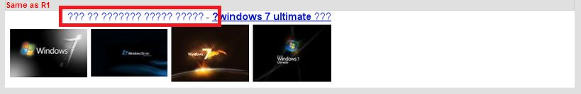

# タスクをリリースする

ほとんどの評価者は難しいタスクを抱えている。高度なテクニックについてのクエリ（コンピューター科学や物理学）や非常に特化した関心領域（例えば、ゲームやトレント）を必要とする。

評価インターフェイスの「Report a Problem/Release this Task」を使って問題とリリースしたタスクを報告する。

ボタンをクリックすると、以下のような報告・リリース用ホームが表示される。

このメニューには変更が加えられることがあるので、上に表示されているように変更されることがある。

一般的に、タスクをリリースした理由を最もよく記述しているオプションを選択すべきである。不明な点がある場合は、最も近いオプションを選択するか、詳細については雇用主や会社に問い合わせる。

Please leave a comment explaining the release when it makes sense to provide additional information, for example, when you are releasing for a "technical problem."

ここにリリースオプションの欠落したノウハウと技術的な問題の例がある。

**専門知識の欠如：**<!-- -->評価に専門知識が必要で、評価者によっては評価するのが難しいクエリです。

- コルチゾール分泌がブランクパターンを呈する、科学に関するクエリ
- マインクラフト 銃 車 1.1 mod インストーラ、ゲームに関するクエリ
- Python Panda マトリックス インデックス、技術的なクエリ

**技術的な問題：**<!-- -->テキストが表示されるべき場所に、クエスチョンマークや他の意味不明な文字が記載されています。

**注：**<!-- -->リリースしたタスクの量やタイプによっては、リリース原因の追加説明が必要になることがあります。
