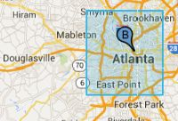

# タスクページのユーザーロケーションを理解する

多くのタスクでは、クエリの下にユーザーの位置が表示される。また、地図にもユーザーがクエリを実行したときの位置が表示され、さらに正確な位置を知ることができる。

地図には正確な現在地（青い点）が表示されることもあれば、おおまかな現在地（青い長方形）が表示されることもある。

画面中央の青い点がユーザーの正確な所在地を表しています。  

このように青い半透明の円が表示された場合、ユーザーは青い点にいる可能性が高いですが、円内の別の部分にいる可能性ちあります。

青い長方形がユーザーのおおまかな所在地を表しています。

この地図には訪れるリザルトブロックのマーカーであるレスポンスピンが表示されています。タスクに訪れるリザルトブロックが3件表示される場合、レスポンスピンも3本表示されます。

