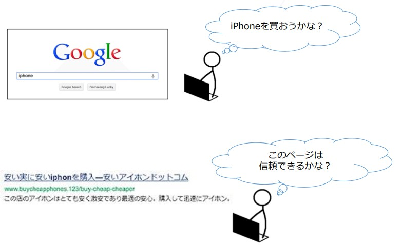

# 検索品質評価ガイドラインの概要

## 検索品質評価プログラムへようこそ！

この「検索品質評価ガイドライン」を通して、「Page Quality評価（PQ評価）」（初めにPage Qualityを評価する）と「Needs Met評価」（ユーザーニーズとの合致を評価する）理解していく。評価タスクでは、PQ評価・NM評価のコンセプトが重要である。

本ガイドラインでは「検索品質評価者」を省略して「評価者」とする。

© 2020 Google (<a href="https://static.googleusercontent.com/media/guidelines.raterhub.com///searchqualityevaluatorguidelines.pdf">source</a>)

