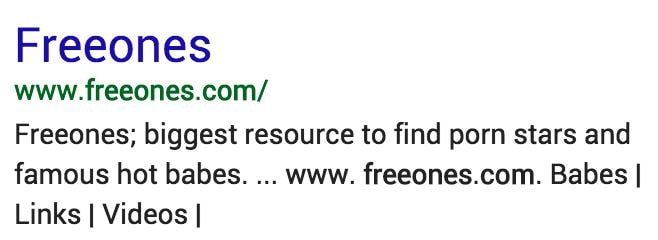
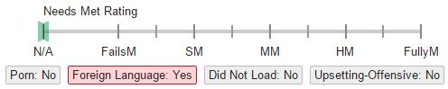
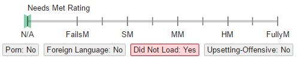
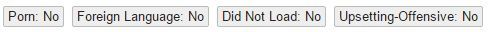
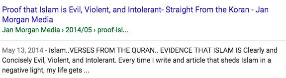
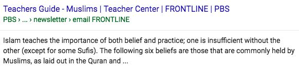
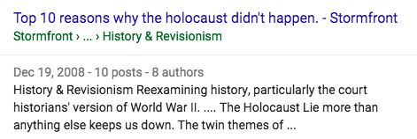
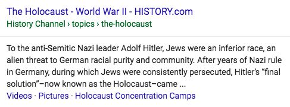

**注**：このページの翻訳はまだ完了していません。  
　　翻訳を手伝いたい場合は、ページの下部のリンクを使用できます。

# 「ポルノ」「外国語」「読み込めない」「使いにくい」検索結果

「**ポルノ**」「**外国語**」「**読み込めない**」「**使いにくい**」のいずれかに該当する検索結果には、フラグを立ててください。Some rating tasks may ask you to identify **Not‑for‑Everyone** results. フラグはクエリに依存しません。つまり、フラグはクエリに関係なく立てるようにしてください。下記がフラグのスクリーンショットです。

フラグ名をクリックすると、フラグブロックは赤色に変わり、いいえからはいに変わる。例えば、**ポルノ**フラグを使用する必要がある場合は以下のようになる。

**クエリ：**freeones、英語（アメリカ）  
**ユーザーの所在地：**<!-- -->カリフォルニア州マウンテンビュー  
**ユーザーの意図：**<!-- -->FreeonesのWebサイトを訪問

  
  

LPはポルノサイト「Freeones」のホームページ。

結果はFullyM評価だがポルノフラグに値する。

## ポルノフラグ

クエリにポルノを探す意図があってもなくても、ポルノページには「**ポルノ**」フラグを立ててください。「**ポルノ**」フラグはクエリやユーザーの意図とは無関係です。

ポルノページとは、ポルノに該当する画像・リンク・文章・ポップアップ・目立つ広告等のコンテンツがあるページのことです。ある文化圏やある国ではポルノと判断される画像も、他の文化圏・国ではポルノでないと判断されることもあります。評価者自身の判断と、現地についての知識に基づいて判断しましょう。

**注：**<!-- -->「**ポルノ**」フラグは結果がポルノであることを示すために使用され、クエリがポルノを探しているかどうかは関係ない。

## ポルノに該当する検索結果の評価

### ポルノを求める意図が全くないクエリのNeeds Met評価

ユーザーがポルノを**求めていない**のが明白な場合、MCがポルノのLPには**FailsM**評価が下される。

- ユーザーの意図が明確にポルノではない場合、結果は役に立たないとみなされる。
- ポルノに関心のない多くのユーザーにとって非常に悪い経験となる。

次のクエリはポルノの意図がないクエリとみなすべき。女の子、妻、成女【mature women】、女の子の写真、女性の写真、母と娘、チアリーダー、等。

評価者の判断とロケールで全てのポルノページに**ポルノ**フラグをつけることを忘れない。

**クエリ：**toys、英語（アメリカ）  
**ユーザーの意図：**<!-- -->購入するおもちゃを見つける  
**LP：**<!-- -->[LP例](https://guidelines.raterhub.com/images/RG1_6.2-1.jpg)　警告－ポルノページ  
**評価：**<!-- -->**FailsM**  
**ポルノフラグの有無：**<!-- -->有

**クエリ：**how tall is a camel、英語（アメリカ）  
**ユーザーの意図：**<!-- -->質問の答えを知る  
**LP：**<!-- -->[LP例](https://guidelines.raterhub.com/images/RG1_6.2-2.jpg)　警告－ポルノページ  
**評価：**<!-- -->**FailsM**  
**ポルノフラグの有無：**<!-- -->有

**クエリ：**car pictures、英語（アメリカ）  
**ユーザーの意図：**<!-- -->車の写真を見つける  
**LP：**<!-- -->[LP例](https://guidelines.raterhub.com/images/RG1_6.2-3.jpg)　警告－ポルノページ  
**評価：**<!-- -->**FailsM**  
**ポルノフラグの有無：**<!-- -->有

### ポルノを求めている可能性があるクエリのNeeds Met評価

クエリにはポルノとポルノでないものの、どちらともとれるクエリがある。例えば、胸、セックスなどのクエリはどちらの意図もありうる。これらのクエリを「ポルノ目的の可能性のある」クエリという。

こうしたクエリについては、評価者の皆さんが「ユーザーはポルノを求めているはず」と思っても、ポルノでない解 釈が支配的解釈だとみなして評価してください。例えば「ビキニ」(英語・アメリカ)の意図は「水着を買うこと」です。「ユーザーの大半はポルノを求めているはず」と思っても、ポルノ目的の解釈は少数派だと見なして評価しましょう。

**クエリ：**breasts、英語（アメリカ）  
**ユーザーの意図：**<!-- -->胸について、解剖学的な情報や健康に関する情報を知る。  
**LP：**<!-- -->[LP例](https://guidelines.raterhub.com/images/RG1_6.2-6.jpg)  
**評価：**<!-- -->**HM**  
**ポルノフラグの有無：**<!-- -->無  

**クエリ：**breasts、英語（アメリカ）  
**ユーザーの意図：**<!-- -->胸について、解剖学的な情報や健康に関する情報を知る。  
**LP：**<!-- -->[LP例](https://guidelines.raterhub.com/images/RG1_6.2-7.jpg) 警告－ポルノページ  
**評価：**<!-- -->**FailsM**  
**ポルノフラグの有無：**<!-- -->有  

### 明らかにポルノを求めているクエリのNeeds Met評価

非常に明確にポルノ目的クエリの場合、ポルノのLPがユーザーにとってどれだけ有益であるかに基づいて評価をする。ポルノの意図があるページにも**ポルノ**フラグを割り当てる。

クエリがポルノで、その結果がポルノだからといって**HM**や**MM**の評価を下さない。ページがクエリに適合し役に立たなければ、高いNeeds Met評価を得られない。

悪意のあるソフトウェアをダウンロードさせようとするページなどのUXの悪いページは、クエリに適した画像がいくつかあるとしても、低い評価を受けなければならない。

**クエリ：**freeones、英語（アメリカ）  
**ユーザーの意図：**<!-- -->Freeonesのトップページを訪問  
**LP：**<!-- -->[Example: http://www.freeones.com](https://guidelines.raterhub.com/images/RG1_6.2-10.jpg) 警告－ポルノページ  
**評価：**<!-- -->**FullyM**  
**ポルノフラグの有無：**<!-- -->有  

**クエリ：**freeones、英語（アメリカ）  
**ユーザーの意図：**<!-- -->Freeonesのトップページを訪問  
**LP：**<!-- -->[Example: http://www.baberoad.com](https://guidelines.raterhub.com/images/RG1_6.2-11.jpg) 警告－ポルノページ  
**評価：**<!-- -->**FailsM**  
**ポルノフラグの有無：**<!-- -->有  

**クエリ：**anime sex pictures、英語（アメリカ）  
**ユーザーの意図：**<!-- -->アニメのセックス画像を見つける  
**LP：**<!-- -->[Example](https://guidelines.raterhub.com/images/RG1_6.2-14.jpg) 警告－ポルノページ  
**評価：**<!-- -->**MM to HM**  
**ポルノフラグの有無：**<!-- -->有  

**クエリ：**cheerleader porn、英語（アメリカ）  
**ユーザーの意図：**<!-- -->チアリーダーのポルノ画像を見つける  
**LP：**<!-- -->[Example](https://guidelines.raterhub.com/images/RG1_6.2-15.jpg) 警告－ポルノページ  
**評価：**<!-- -->**MM to HM**  
**ポルノフラグの有無：**<!-- -->有  

## 違法画像の報告

### 児童ポルノ

**注：**<!-- -->評価をするときは働く場所、ロケールに関わらず、児童ポルノを違法とみなす米国連邦法に従わなければならない。

#### 児童ポルノの定義

性的に明示的な行為（例えば、膣や肛門性交、オーラルセックス、獣姦、マスターベーション、性器のみだらな描写など）またはSMに関与している未成年者（18歳未満）の画像。性的に明示的な行為の画像には、実際の子ども、子どものように見えるコンピューターで生成、加工、編集された画像（「Photoshop」を使用して編集された画像）、子どものように見える大人も児童ポルノ。被写体がわいせつな性的行為に表現される限り非写真的（絵画、漫画、アニメ、彫刻）も児童ポルノに含まれる。どちらか区別が付かない場合は児童ポルノ。

画像が文学（有名な本「Lolita」、政治（政治マンガ）、芸術的、科学的な文脈でも、下記の指示に従ってベンダーにリンクを送る。

陰部が隠れていても陰部の描写とみなされることがある。例えば未成年の十代の女の子がエロティックに踊っている陰部を接写した動画や、子どもが陰部をフォーカスした下着を着用した画像を児童ポルノとみなすことがある。

裸の子ども（入浴やヌードコロニーなど）の画像は、子どもが性的に露骨な行為をしていないか、子どもの生殖器にフォーカスしていない限り児童ポルノとはみなされない。子どものように見える大人（オムツを履いている35歳の男性、学生服を着た成人女性）も児童ポルノではない。それらを未成年だと思わないなら、おそらく児童ポルノではない。しかしながら、画像内の人物が18歳を超えていることが分からない場合（例えば、脱毛している未発達な18歳）などは、児童ポルノとみなされる。

#### 報告の手順

ベンダーの指示に従って、児童ポルノを含む画像（URLのみ）を報告する。

## 「外国語」フラグ

### 「外国語」フラグの使用

LPの言語が次のいずれかに該当しない場合は、「**外国語**」フラグを割り当てる。

- タスク言語
- タスクの場所でかなりの割合で一般的に使用される言語
- 英語

例えば、カタルーニャ語ユーザーのほとんどはスペイン語も話す。したがって、カタルーニャ語の評価タスクではカタルーニャ語、スペイン語、または英語のLPに外国語のフラグを割り当てない。

以下は外国語フラグが使用されるRBのスクリーンショット。

**クエリ：**baidu  
**ロケール：**<!-- -->英語（アメリカ）  
**ユーザーの所在地：**<!-- -->アラスカ州アンカレッジ  
**ユーザーの意図：**<!-- -->BaiduのWebサイトを訪問

  
  

LPはBaiduのWebサイト。結果はクエリのターゲットページだが外国語（中国語）この結果は**FullyM**評価と外国語フラグに値する。

**重要：**

- 評価者が個人的に言語を理解していても自身のロケールのほとんどのユーザーが理解できなければ外国語フラグを割り当てる。
- RBの見た目だけではなく、LPの言語に基づいて外国語フラグを割り当てる。
- ロケール内のほとんどのユーザーがクエリの外国語ページを期待している場合でも、外国語フラグを全ての外国語ページにつける。
- LPがどの言語に当たるか判断することは難しい。LPには複数の言語が含まれている場合もあれば、全くない場合もある。このような場合はロケールのユーザーになって考える。外国語のページのように感じるか。不確かな場合は、外国語フラグを使用しない。

### 「外国語」の検索結果のNeeds Met評価

RBに**外国語**のLPがある場合でもタスクの全てのRBにNeeds Met評価を割り当てる必要がある。

ほとんどの場合、**外国語**としてのフラグを立てるページは、ロケールのほとんどのユーザーが理解できず役に立たないため**FailsM**評価になる。ロケールのユーザーが読み取ることのできる言語には、**外国語**フラグを使用しない。場合によっては役に立つ**外国語**のページに出会うこともある。

ほとんどのユーザーが**外国語**の結果を期待または望んでいる場合は**外国語**ページに**FailsM**評価をしてはならない。例えば、クエリがbaidu.com（英語）の場合、baidu.comに**FullyM**評価と**外国語**フラグを割り当てる。

動画は**外国語**のページが有用で望ましいものであることが多い。ユーザーの意図と、ユーザーに適したページを考える。クエリで**外国語**の歌、バンド、映画、スポーツイベントなどを望んでいるとするとそれらの動画はおそらく理解され楽しむことができるので有用である。これらのタイプのクエリでは、**外国語**の結果がしばしば期待される。

動画が**外国語**の歌、バンド、映画、またはイベントについて話しているものの場合、その結果はおそらく理解できず、楽しむことができないので**FailsM**評価と**外国語**フラグを割り当てる。

**クエリ：**video of celine dion singing s'il suffisait d'aimer  
**ロケール：**<!-- -->英語（アメリカ）  
**ユーザーの所在地：**<!-- -->ミシガン州ランシング  
**ユーザーの意図：**<!-- -->この局を歌っているセリーヌディオンを見る

  

このビデオは英語ではないにもかかわらずアメリカのユーザーが探しているもの。ビデオはフランス語でもLPの言語はほとんどが英語なので**外国語**のフラグは不要。

**クエリ：**alex c  
**ロケール：**<!-- -->英語（アメリカ）  
**ユーザーの所在地：**<!-- -->アイオワ州ダベンポート  
**ユーザーの意図：**<!-- -->このドイツの作曲家の動画を見たり、曲を聴いたり、彼についての情報を見つけたりする。

  

このクエリは、ドイツの作曲家Alex Cのもの。LPにはY‑ass（YouTubeには「Yass」とスペルミス）にドイツ語で歌われた曲が含まれている。英語ではないにもかかわらず英語ユーザーの多くにとって役立つ。LPの言語は明確でないので、**外国語**フラグを割り当てるかどうかを決定するときは評価者の判断。

**クエリ：**kasal, kasali, kasalo  
**ロケール：**<!-- -->英語（アメリカ）  
**ユーザーの所在地：**<!-- -->カリフォルニア州ダリシティ  
**ユーザーの意図：**<!-- -->このフィリピンの映画の予告編を見るか、それに関する情報を見る

  

クエリはフィリピンの映画のKasal、Kasali、Kasalo。LPはフィリピンの言語であるタガログ語の動画。英語ではないにもかかわらず、クエリを英語ユーザーの多くにとって役立つ。**外国語**フラグを割り当てるかどうかを決定するときは評価者の判断。

## 「読み込めない」フラグ

### 「読み込めない」フラグの使用

「**読み込めない**」はLPコンテンツを表示できないような技術的問題を示すために使用される。

「**読み込めない**」フラグは次の場合使用する。

- リンク先のMCはWebサーバー、Webアプリケーションのエラーメッセージで、ページにはナビゲーションリンク、SC、ホームリンク、及び広告もない。さまざまな種類のエラーメッセージに関するWikipediaのページについては[ここ](http://en.wikipedia.org/wiki/List_of_HTTP_status_codes)を参照。
- LPが完全に空白。（MCなし、SCなし、広告なし）

RBではなくLPに基づいて「**読み込めない**」フラグを割り当てる。

「**読み込めない**」LPの例。RBだけを見てLPが読み込まれないことは分からない。

**クエリ：**douglas instruments  
**ユーザーの所在地：**<!-- -->インディアナ州サウスベンド  
**ユーザーの意図：**<!-- -->このWebサイトを訪問

このページは、一般的な404メッセージが表示され、ページにはMC、SC、広告がない。

この結果**FailsM**評価と「**読み込めない**」フラグを割り当てる。

「**読み込めない**」フラグに該当するLPの例です。[例①](https://guidelines.raterhub.com/images/RG1_4.6-5.jpg)　[例②](https://guidelines.raterhub.com/images/RG1_4.6-6.jpg)　[例③](https://guidelines.raterhub.com/images/RG1_4.6-7.jpg)

加えて、このような場合も「読み込めない」フラグを立てる

- マルウェアの警告（「警告-このWebサイトにアクセスするとコンピューターに損害を与える可能性があります」など）
- 証明書受諾要求を求めるページ

マルウェアの例

次に証明書受諾要求の例

### 「読み込めない」検索結果のNeeds Met評価

どのようなリザルトブロックにも評価を割り振る必要があります。LPが全く読み込めない場合、「**読み込めない**」フラグを立てて**FailsM**評価にしましょう。全く読み込めないページは、全く役に立ちません。

ページの一部が読み込めたり、完全に読み込めるページにエラーメッセージが表示されていたりすることがあります。「クエリに対して、その検索結果がどの程度役に立つか」という視点からNeeds Met評価を付けましょう。ウェブマスターがエラーメッセージをカスタマイズすることもできますし、エラーメッセージがしっかり機能しているWebサイトの一部であることもあります。そして、そうしたページがクエリに対して役立つこともあります。

**クエリ：**男の子 ピンク スノーシューズ  
**ユーザーの所在地：**<!-- -->インディアナ州サウスベンド  
**ユーザーの意図：**<!-- -->男の子のスノーシューズについての情報や、購入をしたい

  

MCにはエラーメッセージが表示されますが、多くのSCもある。しかしながら、このページには男の子のピンクのスノーシューズに関する情報はないため、このクエリは役に立たない。

「**読み込めない**」フラグを割り当てないでください。

**クエリ：**聖書 節  
**ユーザーの所在地：**<!-- -->インディアナ州サウスベンド  
**ユーザーの意図：**<!-- -->聖書の中の特定の場所を探す

  

LP上にカスタマイズされた「結果が見つかりません」というメッセージがあるのにもかかわらず、聖書のすべての節へのリンクがある。これは、ほとんどのユーザーにとって非常に役に立つ。

「**読み込めない**」フラグを割り当てないでください。

## Upsetting-­Offensiveフラグ

インターネットには、多くのユーザを不快にしたり動揺させたりするものも含め、あらゆる種類のコンテンツが含まれている。さらに、年齢、性別、人種、宗教、政治的所属に関わらず、すべての人々は、世界や他の人々の視点を理解する為にインターネットを使っている。ユーザーは敏感なトピックに対するクエリを発行することで、人々が信じる理由、発言する理由、動揺するまたは不快なことをする理由を理解することができる。検索エンジンは、ユーザーが探している情報を見つけられるようにするために存在している。

たとえ検索結果がユーザーの意図に沿うものであったとしても、ロケール内のユーザーの考え方を考慮し、動揺させたり不快にさせたりするコンテンツを含む全てのWeb結果に**Upsetting-­Offensive**フラグを割り当てる。

In addition, some rating tasks may ask you to identify **Not‑for‑Everyone** results in order to flag content that you feel may be uncomfortable for some users.

### Upsetting-­Offensiveフラグの使用

動揺させたり不快にさせたりするコンテンツを含むWeb結果にUpsetting-­Offensiveフラグを割り当てる。ロケール内のユーザーを代表し、ユーザーを動揺させるまたは不快にさせるコンテンツを構成するものを判断すること。大まかに言えば、不快感を伴う検索結果には、ユーザーを非常に動揺させたり不快にさせたりするコンテンツが含まれている。クエリがはっきりとこの種のコンテンツを探している場合のみ、それらは表示されるべきである。

動揺させるまたは不快にさせるコンテンツは一般的に以下のものを含む：

- Content that promotes hate or violence against a group of people, including but not limited to those grouped on the basis of race or ethnic origin, religion, disability, age, nationality, veteran status, sexual orientation, gender or gender identity.
- 人種差別や極めて不快な用語を含むコンテンツ
- 動物虐待や児童虐待を含む生々しい暴力
- 有害な活動に関する明示的なハウツー情報（人身売買や暴行に関するハウツーなど）
- ロケール内のユーザーが非常に動揺または不快な思いをする他の種類のコンテンツ

**重要：**<!-- -->Upsetting-­Offensiveフラグを割り当てるかどうかを決定する際は、ページの目的とコンテンツの表示方法について考える。Web上には児童虐待、暴力、人種差別のような敏感なトピックに焦点を当てた結果が数多くあるが、評価者はページ内コンテンツの目的や種類、および／または表示方法に基づいてUpsetting-­Offensiveフラグを割り当てなければならない。だからといってトピックそのものが敏感である、または潜在的に動揺させるものであるとは限らない。

例えば、児童虐待を推奨したり、生々しく描いていたりするコンテンツの検索結果は、不快感を伴うものとしてフラグを立てるべきである。児童虐待自体がユーザーを動揺させる敏感なトピックであるが、児童虐待に関する正確な情報ページ（児童虐待の統計や防止など）にはフラグを立ててはならない。

**クエリ：**holocaust history  
**ロケール：**<!-- -->英語（アメリカ）  
**ユーザーの所在地：**<!-- -->ニューヨーク州ニューヨーク  
**ユーザーの意図：**<!-- -->ホロコーストに関する歴史的情報を知りたい

  

ホロコーストは決して起こっていないと他者を説得する方法の議論である。ホロコーストの否定と反ユダヤ主義の直接的な関係のため、多くの人々はこの結果を不快であると感じる。

この結果にはUpsetting­-Offensiveフラグを割り当てなければならない。

  

ホロコースト自体が一部の人々にとっては潜在的に動揺するトピックであるが、この結果は事実上正確な歴史的情報源である。加えてこのページは人々に対して憎悪や暴力を促進したり、人種差別を含んだり、生々しい暴力を描写したりすることの為に存在していない。Upsetting­-Offensiveフラグを割り当ててはならない。

**クエリ：**黒人に対する人種差別  
**ロケール：**<!-- -->英語（アメリカ）  
**ユーザーの所在地：**<!-- -->ニューヨーク州ニューヨーク  
**ユーザーの意図：**<!-- -->黒人への人種差別に関する情報やニュース、他の情報源を探している

  

このページの目的は、黒人が劣っていると主張することである。誤った科学的研究を示しており、多くの人々がそれを不快であると感じている。この結果にはUpsetting-­Offensiveフラグを割り当てなければならない。

  

このWikipediaのページは、米国における人種差別や民族差別について、よく知られた歴史的に正確な概要を示している。Upsetting-­Offensiveフラグを割り当ててはならない。

**クエリ：**islam  
**ロケール：**<!-- -->英語（アメリカ）  
**ユーザーの所在地：**<!-- -->ニューヨーク州ニューヨーク  
**ユーザーの意図：**<!-- -->イスラムの宗教に関する情報が知りたい

  

このページの目的は、イスラム教を悪だとする著者の信念を説明すること。不寛容や憎悪を促進するために存在しているように見え、多くの人を不快にする可能性がある。

この結果にはUpsetting-­Offensiveフラグを割り当てなければならない。

  

これは評判の良いサイト上の高品質な記事。イスラム教の主要な信仰と慣習を正確にまとめたものである。

Upsetting­-Offensiveフラグを割り当ててはならない。

### 使いにくい耐性のあるクエリの設定に必要な評価

全年齢、性別、人種、宗教、政治的所属の人々は、さまざまなニーズに応じて検索エンジンを使用することに注意する。特に重要なユーザニーズの1つは、直接対話することが困難な可能性のあるテーマを探索することである。例えば、人種差別が何を意味するのか躊躇する人もいる。人々はまた、なぜ人種的に攻撃的な発言がなされたのか理解したいかもしれない。人種差別、憎しみ、およびその他の敏感なトピックを理解するのに役立つリソースにユーザーがアクセスできるようにすることは、社会にとって有益である。

ユーザーのクエリが潜在的に怒っている、攻撃的な、または敏感なコンテンツを求めているか許容しているように見える場合、我々はそのクエリを「Upsetting-Offensive tolerant query」と呼ぶ。Needs Met評価の目的のために、ユーザーがUpsetting-Offensiveトレンドトレンドの教育的/情報的な目的を持っていると仮定する。すべての結果は、本物の教育的/情報的な意図を前提として、ニーズ対応評価スケールで評価されるべきである。

特に、**Highly Meets**の評価を受けるには、Upsetting-Offensiveトピックに関する情報の結果が必要である。

1. ユーザーが別の視点を求めていることをクエリが明確に示していない限り、信頼性が高く、実際に正確で信頼性の高い情報源にあること。
2. 質問の特定のトピックに対処して、ユーザーが怒っているか不快であるのか、それにどのような感受性があるのかを理解できるようにすること。

**重要：**

- Upsetting-Offensive tolerant queriesが攻撃的な結果に「ふさわしい」と思ってはいけない。
- Upsetting-Offensive tolerant queriesは、不快な意見や不快な意見を持っている人によって考えられていると仮定しない。
- ユーザーが単に攻撃的または怒っている視点を検証しようとしていると仮定しない。

以下に、不安定な話題の話題に関するユーザーの意図を解釈する方法の例をいくつか紹介する。

- are  women  evil、英語（アメリカ）  
  - ユーザーはなぜ女性に対する差別があるのか、なぜ「女性は悪い」と言われるのかを理解したい可能性がある。
- women  are  evil、英語（アメリカ）  
  - このステートメントの意図は、「女性は悪いのですか？」という質問と同じであると仮定する。ユーザーは、なぜ人々が「女性は悪い」と言うのか理解したいかもしれない。
- did  the  holocaust  happen?、英語（アメリカ）  
  - ユーザーは、ホロコーストに関する事実上の正確な情報またはホロコースト拒否の問題に関する情報を必要としている。
- christians  worship  the  devil、英語（アメリカ）  
  - ユーザーは、キリスト教徒とキリスト教徒の教会が悪魔をどのように見ているか、そしてキリスト教徒が悪魔を崇拝しているかどうかについての情報を探している。
- racist  whites、racist  blacks、等、英語（アメリカ）  
  - ユーザーは、クエリで言及された民族に属する人々の人種差別に関する情報を探している。

ここにいくつかのUpsetting-Offensive tolerant queriesの評価例がある。あなたがユーザーの意図を満たしていても、すべてのupsetting/offensiveな結果にUpsetting-Offensiveフラグを割り当てる必要があることに注意する。

**クエリ：**holocaust history  
**ロケール：**<!-- -->英語（アメリカ）  
**ユーザーの所在地：**<!-- -->ワシントン州シアトル  
**ユーザーの意図：**<!-- -->ホロコーストに関する歴史的な情報を探す  
**Important：**<!-- -->Though there are some upsetting/offensive results on the topic of this query, the query holocaust history should not be considered an Upsetting‑Offensive tolerant query.

  
  
  

  
  
  

**クエリ：**stormfront.org  
**ロケール：**<!-- -->英語（アメリカ）  
**ユーザーの所在地：**<!-- -->ニューヨーク州ニューヨーク  
**ユーザーの意図：**<!-- -->Stormfront.orgのホームページにアクセスしたい

  
  
  

  
  
  

© 2020 Google (<a href="https://static.googleusercontent.com/media/guidelines.raterhub.com///searchqualityevaluatorguidelines.pdf">source</a>)

