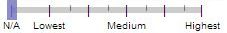
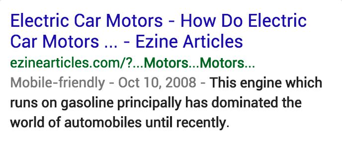
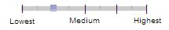

# Page QualityとNeeds Met評価の関係

Needs Met評価は、クエリと結果の両方に基づいている。Needs Met評価を割り当てるときは、クエリとユーザーの意図について注意深く考える必要がある。

Page Quality評価スライダーはクエリに依存しない。LPにPage Quality評価を割り当てる際には、クエリについて考えない。

一部の結果にはPage Qualityスライダーがない。RBにPage Quality評価スライダーがない場合、Page Quality評価を与える必要はない。Page Qualityスライダーがある場合は、リンク先ページに基づいてPage Qualityの評価を割り当てる。「**外国語**」のPage Quality評価をできない場合や「**読み込めない**」のPage Quality評価をできない場合、**Medium**評価にする。

Needs Met評価とページ品質評価の割り当てに関するガイダンス。

- 役に立たない検索結果は、Page Quality評価が高くても**FailsM**評価です。役に立たないものは役に立ちません。

- 「トピックに合致し、役にも立つがPage Quality評価が低い」検索結果には、「トピックに合致し、役にも立つしPage Quality評価も高い」検索結果よりも低いNeeds Met評価を付けてください。ユーザーはPage Qualityの低い検索結果よりは高いものの方が役に立つと思うはずですし、Needs Met評価が「有用性に影響する全ての要素」を反映するものである以上、皆さんのPage Quality評価にもその点が反映されているべきです。

- **HM**評価は「トピックに合致し、役に立つしPage Quality評価も高い」検索結果や、「トピックに合致し、とても役に立つうえに『情報が新鮮』などの他のプラス要素もあるが、品質は普通」の検索結果に適用できます。

- **HM**評価は「Page Quality評価が低い」検索結果や、「『情報が古すぎる』などのマイナス要素がある」検索結果には適用しないようにしてください。**HM**評価を受けるための基準は、高いものです。

- 「トピックに合致するが、品質が低い」検索結果には、基本的にはSM評価が適切です。しかし、Page Qualityが低すぎてどんなクエリに対しても役に立たないページもあります。意味不明なページはその代表例です。FailsM評価にしましょう。

- ページに有益な目的がない場合は、ページのニーズメット評価やページのデザインに関係なく、常に最低のページ品質と評価する必要があります。他の種類の最低ページ品質ページの概要については、「[Lowest評価のページ](../page-quality-rating-guideline/7-lowest-quality-pages)」をご覧ください。

**クエリ：**how do electric cars work  
**ユーザーの所在地：**<!-- -->テキサス州ダラス  
**ユーザーの意図：**<!-- -->電気自動車の仕組みを知る

  
  

**Page Quality評価：**<!-- -->この内容を声に出して読んでみる。LP上の記事は浅く、意図せずユーモラス。4つの段落があるが、基本的に電気自動車は電気を使用して充電する必要があるのみ。このページはE‑A‑Tがない。**低**は適切な評価です。

**Needs Met評価：**<!-- -->ほとんどのユーザーの役に立たない。

  
  

**Page Quality評価：**<!-- -->Wikipedia.orgのLPには多くの有益なMCがある。The page has high E‑A‑T. **中＋**または**高**は適切な評価です。

**Needs Met評価：**<!-- -->この質問は電気自動車の仕組みを尋ねるが、LPの記事はモビリティスクーターに関するもの。

**クエリ：**symptoms of dehydration  
**ユーザーの所在地：**<!-- -->テネシー州メンフィス  
**ユーザーの意図：**<!-- -->脱水症状について知る

  
  

**Page Quality評価：**<!-- -->YMYLの話題。このページには質の低いサイトの特徴が多くあり信頼できない。誰がそのコンテンツを書いたか分からず、専門家の権限や証拠がない。MCから気を散らす広告がある

**Needs Met評価：**<!-- -->例え記事が話題になっていても情報は信頼できず、潜在的に誤解を招くため危険。

  
  

**Page Quality評価：**<!-- -->YMYLの話題。非常に権威のある医学Webサイトで信頼性が高く正確なMCを持っている。

**Needs Met評価：**<!-- -->この結果は、ほとんどのユーザーにとって非常に役立つ。

© 2020 Google (<a href="https://static.googleusercontent.com/media/guidelines.raterhub.com///searchqualityevaluatorguidelines.pdf">source</a>)

