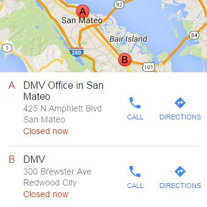
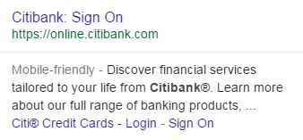

# Rating Queries with Multiple Interpretations and Intents

Some queries really only have one meaning. Consider the query [iphone], English (US). There may be different user intents for this query (research iPhones, buy an iPhone, go to the iPhone page on Apple's website), but all users are basically referring to the same thing: the phone made by Apple, Inc.

Some queries truly have different possible meanings. Consider the query [apple], English (US). Some users may want to find more information on the computer brand or the fruit. We refer to these different meanings as query interpretations.

When giving Needs Met ratings for results involving different query interpretations, think about how likely the query interpretation is and how helpful the result is.

- A very helpful result for a **dominant interpretation** should be rated **Highly Meets**, because it is very helpful for many or most users. Some queries with a **dominant interpretation** have a **FullyM** result.
- A very helpful result for a **common interpretation** may be **Highly Meets** or **Moderately Meets**, depending on how likely the interpretation is.
- A very helpful result for a very **minor interpretation** may be **Slightly Meets** or lower because few users may be interested in that interpretation.
- There are some interpretations that are so unlikely that results should be rated **FailsM**. We call these "no chance" interpretations.

## Rating Queries with Both Website and Visit-in-Person Intent

Some queries have two possible strong intents:

1. **Go to the website** intent: in order to, for example, find out information, buy something online, make a reservation, chedule an appointment, interact with customer support, or fulfill some other need that can be satisfied online
2. **Visit-in-person** intent: user wants to visit the store, business, etc. in person

We know the user intent is to accomplish one or the other, but it is unclear which one the user wants. For these queries, result blocks that only satisfy one intent should NOT get a **Fully Meets** rating.

Query and User Intent|Result Block and LP|Needs Met Rating and Explanation
---|---|---
**Query:** `target`  **User Location:** Jacksonville, Florida  **User Intent:** There are two possible strong user intents: most users probably want to visit a nearby Target location or go to the website to shop online, research products, find prices, etc.||  The result block shows three popular Target locations in Jacksonville, with information that is especially helpful for users who want to visit the store. This fulfills the user intent to find a nearby Target location.
*(Same as above.)*||  The result is very satisfying and fulfills the user intent to shop online or otherwise use the website.
**Query:** `dmv`  **User Location:** Belmont, California  **User Intent:** There are two possible strong user intents: most users probably want to visit a nearby DMV location or go to the DMV website to renew a license, pay a fee, find some information, etc.||  The result block shows two nearby DMV locations, with information that is especially helpful for users who want to visit the locations. This fulfills the user intent to find a nearby DMV location.
*(Same as above.)*||  The result is very satisfying and fulfills the user intent to find information or otherwise use the website (e.g., to review a license, pay a fee).
**Query:** `citibank`  **User Location:** Palo Alto, California  **User Intent:** There are two possible strong user intents: most users probably want to visit a nearby Citibank location or go to the website to bank online.||  The result block shows three nearby Citibank locations in the user location of Palo Alto. The information is especially helpful for users who want to visit the bank. This fulfills the user intent to find a nearby Citibank location.
*(Same as above.)*||  The result is very satisfying and fulfills the user intent to do online banking or otherwise use the website.
