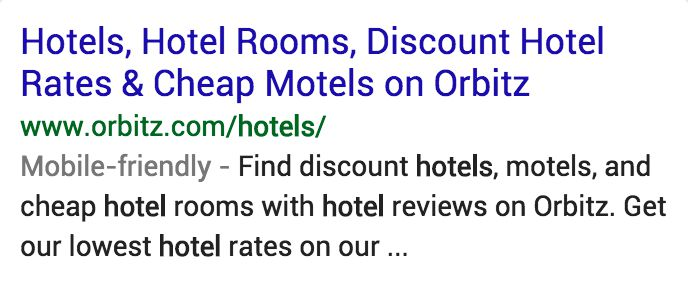
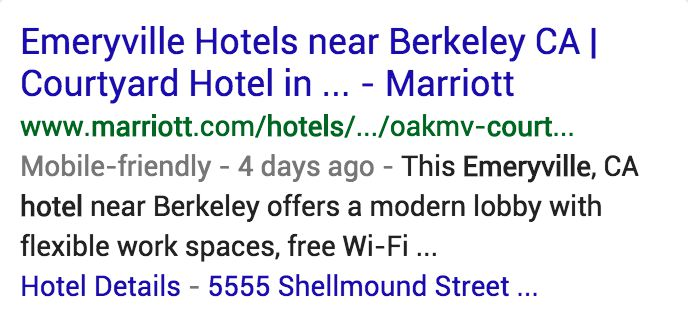
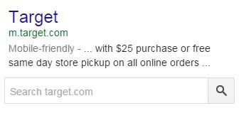
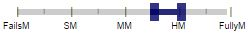
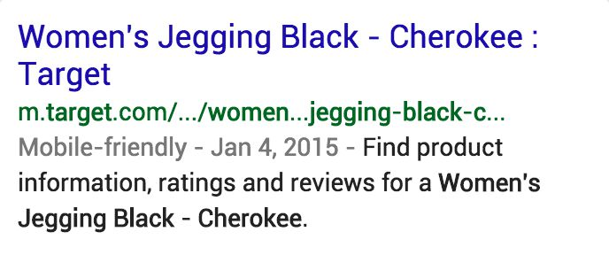
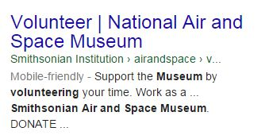

# クエリの限定性とLP

クエリには非常に一般的なものと限定的なものがある。クエリの特異性のレベルを比較するいくつかの例を以下に表示する。

クエリ|具体的なクエリ|より具体的なクエリ
---|---|---
`椅子`|`ダイニングルーム　椅子`|`IKEA　henrilsda　ハイバック　アップホルスター　椅子`
`図書館`|`ハーバード　図書館`|`ハーバード　人類学　図書館`
`面接　質問`|`教員のための面接質問`|`Teach for Americaの面接練習をする`
`レストラン`|`中華　レストラン`|`テイクアウト　中華　レストラン　ダウンタウン　オースティン`
`喫茶店`|`スターバックス`|`red rock coffee　マウンテンビュー`

クエリの限定性が強いほどユーザーの求めているものもわかりやすいので、Needs Met評価が簡単です。一方、幅の広いクエリのNeeds Met評価は難しいです。いつも通り、「この検索結果はどの程度クエリに合致しているか」を考えて、特定の解釈だけへの合致にとらわれないようにしましょう。

`喫茶店`、`レストラン`、`ホテル`、`本`、`パリの名所`、などの幅広いカテゴリーの場合、人気があるものや有名なものを「とても役に立つ」と判定します。Webを利用して、どんなものが人気で有名なのかを調べてみましょう。

クエリ・ユーザー所在地・ユーザーの意図|RB・LP・PQ評価・Needs Met評価|説明
---|---|---
**クエリ：** `credit cards`  **ユーザーの所在地：** アリゾナ州フェニックス  **ユーザーの意図：** 「オンラインで申し込み」「申し込む前に下調べ」など| |異なるカードを提供する多くのカード会社のページで非常に役立つ。  **Page Quality:** Visaは評判の良い有名なクレジットカード会社。「**High+**」～「**Highest**」評価が適切。  **Needs Met:** このLPはクエリよりも具体的だがVisaは一般的なクレジットカード会社であるため、多くのユーザーの役に立つ。
〃| |異なるカードを提供する多くのカード会社のページで非常に役立つ。  **Page Quality:** Discoverは、クレジットカード、銀行、ローンのサービスを提供する有名な会社であり、評判が良い。「**High+**」～「**Highest**」評価が適切。  **Needs Met:** このLPはクエリよりも具体的だが、Discoverは人気の高いクレジットカード会社であるため、多くのユーザーの役に立つ。
〃| |このページでは、様々なカテゴリのトップクレジットカードのリストを提供している。  **Page Quality:** このページは消費者がお金を決めるのを助けます。それは良い評判、高いE-A-Tを持ち、そしていくつかの主要な新聞によって推薦されました。「**High**」評価が適切。  **Needs Met:** このLPはクエリに適合する、多くのユーザーの役に立つ。
〃| |このページでは、ユニオンメンバーシップを必要とするクレジットカードについて説明している。  **Page Quality:** この会社は、評判が高く、E-A-Tが高い金融サービス組織であるHSBC銀行が発行した、独自のクレジットカードの専門家です。「**High**」評価が適切。  **Needs Met:** クレジットカードには組合のメンバーシップが必要なので、このページは一部のユーザーの役に立つ。
**クエリ：** `hotels`  **ユーザーの所在地：** フロリダ州ジャクソンビル  **ユーザーの意図：** ユーザーは旅行の計画を立てているかもしれない。しかしこのクエリは普遍的でありあいまいである。| |これは人気な旅行Webサイトで、ユーザーがアメリカのホテルを見つける手助けをする。ユーザーはレビューを読むことができ、ホテルを比較し予約することができる。  **Page Quality:** Orbitzは評判の良い人気の高いwebサイトである。「**High**」評価が適切。  **Needs Met:** このLPはクエリと合致する。
〃| |アメリカ国内の大部分で利用でき、幅広い価格帯にも対応しているホテルチェーン。  ホテル一覧のリストはとても長いが、様々な価格・要素・場所に対応したホテルチェーンのトップページであるため役に立つ。  **Page Quality:** Marriottのサイトは人気チェーンのMarriottの情報を与える。Marriot社はホテルについての専門性があり、権威性が高い。「**High+**」～「**Highest**」評価が適切。  **Needs Met:** LPはクエリよりも限定的だが、Marriottが評判のいいホテルチェーンなので多くのユーザーの役に立つ。
〃| |カリフォルニア州エメリービルの Marriott CourtyardホテルのWebページだ。  **Page Quality:** マリオットのWebサイトは、人気の高いホテルチェーンのマリオットホテルに関する情報を提供する。このページは専門的で、デザインも昨日も良い。Marriot社は評判もよく、Marriotホテルチェーンについての専門性があるため、掲載情報は権威性が高い。「**High+**」～「**Highest**」評価が適切。  **Needs Met:** LPはクエリに対して限定的過ぎるが、Marriottは有名ブランドであり、このページから他のMarriottホテルのページに移動できる。このページが役に立つユーザーはあまりいない。
**クエリ：** `target`  **ユーザーの所在地：** フロリダ州ジャクソンビル  **ユーザーの意図：** 「target.comに行く「近所のTarget店舗に行く」のどちらか| Page Quality評価は不要|**Needs Met:** ジャクソンヴィル付近のTarget店舗3軒と、店舗を訪問する目的のユーザーに役立つ情報を表示したリザルトブロック。
〃| |LPはTargetの公式サイト。  **Page Quality:** Target公式サイトでは様々な製品のオンライン販売・クーポン発行・店舗情報の表示などを行っており、それらの内容に対しての専門性もある。「**High**」～「**High+**」評価が適切。  **Needs Met:** 公式サイトに行きたいモバイルユーザーに対して、とても役に立つ。
〃| |LPはTarget公式サイトの店舗検索ページ。  **Page Quality:** Targetは自社の店舗情報に対して専門性がある。このトピックについて、一番権威性が高いページ。「**High**」～「**Highest**」評価が適切。  **Needs Met:** LPはクエリに対してやや限定的だが、多くのユーザーが関心を持つはず。
〃| |LPはTarget公式サイトの「電気機器」ページ。  **Page Quality:** Target自体の評判はいいが、個々の販売製品についての専門性・権威性が高いとは限らない。「**High**」～「**High+**」評価が適切。  **Needs Met:** LPはクエリに対してやや限定的だが、多くのユーザーが関心を持つはず。
〃| Page Quality評価は不要|**Needs Met:** リザルトブロックには役立つ情報が含まれているが、「Target」で検索するユーザーの大半は「Targetの株価」や「CEO・創業者の名前」を探しているわけではない。「**Slightly Meets**」～「**Slightly Meets+**」評価が適切。
〃| |LPはTargetの公式サイト内の、女性向けデニムの商品詳細ページ。  **Page Quality:** Target自体の評判はいいが、個々の販売製品についての専門性・権威性が高いとは限らない。「**High**」～「**High+**」評価が適切。  **Needs Met:** LPがクエリに対して限定的すぎるため、大半のユーザーには役に立たない。
**クエリ：** `chicken recipes`  **ユーザーの所在地：** テキサス州オースティン  **ユーザーの意図：** ユーザーは鶏料理を作りたいので、レシピをいろいろ見て選びたいと思っている。ユーザーが求めているのはおそらく「レシピの一覧」。| |LPは有名なレシピサイト内にあり、多くのレビュー付きレシピを掲載している。  **Page Quality:** Food Networkは高品質なレシピや料理に関する情報を提供する、評判のいいWebサイト。「**High+**」～「**Highest**」評価が適切。  **Needs Met:** LPはクエリに合致しており、大半のユーザーに対してとても役に立つ。
〃| |「チキン・パルメザン」のレシピ。  **Page Quality:** Food Networkは高品質なレシピや料理に関する情報を提供する、評判のいいWebサイト。「**High+**」～「**Highest**」評価が適切。  **Needs Met:** 人気のレシピサイトに掲載された、人気料理のレシピだが、クエリよりもやや限定的。一部のユーザーには役に立つ。
〃| |フライドチキン(人気のある鶏料理)のレシピが25点以上掲載されている。  **Page Quality:** Allrecipes.comは高品質なレシピや料理に関する情報を提供する、評判のいいWebサイト。「**High+**」～「**Highest**」評価が適切。  **Needs Met:** 25点以上のレシピがあるが、全て同一の料理についてのレシピなので、クエリよりも限定的。一部のユーザーには役に立つ。
〃| |鶏料理のレシピ検索結果に偽装した、偽の検索結果ページ。  **Page Quality:** 広告がメインコンテンツであるかのように偽装してはいけない。メインコンテンツに偽装した広告を利用するページは「虚偽」にあたるとみなされ、この偽検索結果ページは信頼できない。ユーザーを欺くので、「**Lowest**」評価が適切  **Needs Met:** 全くユーザーの役に立たないので、**FailsM**評価にすること。
**クエリ：** `smithsonian air and space museum store`  **ユーザーの所在地：** ワシントンD.C.  **ユーザーの意図：** 店舗のWebサイトにアクセスするか、ワシントンDCの博物館の店舗に関する営業時間などの情報を検索する| |LPは博物館のオフィシャルWebサイト。  **Page Quality:** 時間、電話番号、会員情報など、店舗に関する情報について専門性がある。「**High+**」～「**Highest**」評価が適切。  **Needs Met:** このWebサイトを訪問する目的のモバイルユーザーに対して、非常に役立つ。
〃| Page Quality評価は不要|**Needs Met:** RBはミュージアムショップ自体に関するものではなく、同博物館に関するもの。しかし掲載されている営業時間・住所・経路案内などはミュージアムショップの物と同じであるため、ミュージアムショップに関する情報を求めるユーザーにも役立つ。
〃| |LPは博物館でのボランティアの方法についての情報。  **Page Quality:** これは評判が高く、E-A-Tが高い人気のある博物館のためのボランティアページです。博物館は彼ら自身のボランティアの機会に関する専門家です。 「**High+**」～「**Highest**」評価が適切。  **Needs Met:** LPはクエリより限定的で、ほとんどの人の役に立たない。
〃| Page Quality評価は不要|**Needs Met:** クエリとは別の博物館に関するRBであり、ユーザの意図に一致しないので**FailsM**評価にする。
