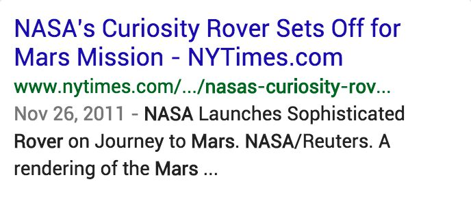
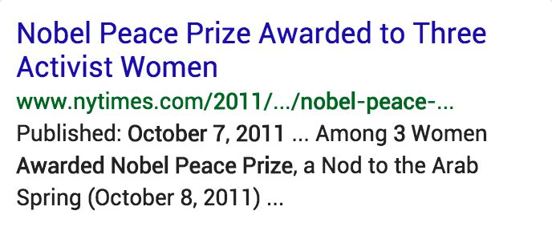
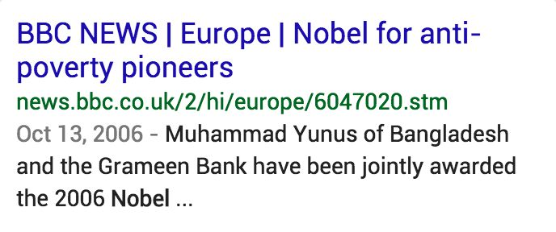
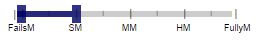

# 情報の鮮度とNeeds Met評価

クエリによっては、ごく最近の情報や「新鮮な」情報を強く求めていることがあります。ユーザーが現在進行中の重要イベントや自然災害などの「最新のニュース」を求めていることもあります。以下は、現在・ごく最近の情報を強く求めるクエリの一例です。

- **ニュース速報のクエリ**  
  - 例：トルネード、津波  
  - ユーザーはすぐに情報が必要だと推測すべきだ。嵐が近いから現在の天気の情報が欲しいユーザーを想像しなさい。去年の天気についての情報は役に立たないだろう。
- 選挙、スポーツイベント、TV、会議のように**繰り返されるイベントのクエリ**  
  - 例：オリンピック、アメリカン、アイドル、レッドソックス　日程、納税申告用、選挙  
  - ユーザーは現在のイベントの情報を探していると推測すべきだ。例えば、もしオリンピックがすぐに開催されるなら、ユーザーは現在のオリンピックの情報が欲しいのであって数年前の情報が欲しいわけではない。もし次のオリンピックが数ヶ月後なら今度のオリンピックに興味があるだろう。
- **現在の情報のクエリ**  
  - 例：パリの人口、アメリカの負債総額、ニューヨークからサンフランシスコまでの飛行機代、次の祝日  
  - ユーザーは航空運賃や値段のような現在の情報を探していると推測すべき。
- **商品名のクエリ**  
  - 例：iPhone、トヨタ　カムリ、Windows OS  
  - ユーザーはこれらのクエリの最新のモデル/バージョンについての情報を探していると推測すべきである。

クエリが最近の情報を要求するとき、現在、最近、アップデートされたページがあるコンテンツが高いNM評価を得るべきである。これらのクエリにとって、過去のイベント、古いモデルや価格、時代遅れな情報などについてのページは役に立たない。それらは「古い」と見なされるべきであり、低いNM評価を与えられるべきだ。いくつかのケースでは、古い結果は無益であり**FailsM**評価になるべきだ。

いくつかのクエリには、「ニュース」または最近の情報のユーザーの意図、さらに「時代を超越した」情報のユーザーの意図が存在する可能性がある。有名人や政治家についてのクエリを出すユーザーは経歴に興味があるのかもしれないし、最新のニュースやゴシップに興味があるのかもしれない。

新鮮さは一般的にページ品質とは関係性が少ない。「古い」ページは高いPQ評価を持つことができる。例えば、高い評価のWebサイトはアーカイブコンテンツを維持しているものもある。しかしながら、維持されてない/捨てられた「古い」Webサイトか維持されてなく、不正確/誤解させるコンテンツはPQ評価が低い理由とある。

**注：**<!-- -->コンテンツが最新にアップデートされた時か修正されたとき、そのページが作られた日は違うかもしれない。コンテンツがアップデートされたとき、ページは時々アップデートされた日を示すがページが作られた日は示されない。コンテンツの最新アップデートの日に関わらず、現在の日時を示すWebサイトもある。もしインターネットのページについて興味があるなら、[ここ](http://archive.org/web/web.php)をクリックしてインターネットアーカイブの"Wayback Machine"を見なさい。すべてのページを使えるわけではないが、このツールはページの作り方とコンテンツを時間の経過とともにコンテンツがどのように変化したかを理解するのに役立つかもしれない。

**クエリ：**nasa mars landing  
**ユーザーの所在地：**<!-- -->カリフォルニア州サンフランシスコ  
**ユーザーの意図：**<!-- -->NASAがランドローバー「キュリオシティ」の火星着陸に成功した直後の例。ユーザーの大半はこの件についての最新のニュース・画像を求めている。

  
  
  
このLPにはローバー（Curiosity）着陸についての記事があり、この例が書かれた日である着陸と同じ日に出版された。

  
  
  
このLPには、火星に着陸する9ヶ月前に公開されたローバー（Curiosity）の打ち上げに関する記事がある。このページのコンテンツは、クエリでは古いとみなされる。

**クエリ：**los angeles traffic  
**ユーザーの所在地：**<!-- -->カルフォルニア州ロサンゼルス  
**ユーザーの意図：**<!-- -->ユーサーは**現在の**ロサンゼルスの交通情報を求めている。「昨日の」交通情報であったとしても、このクエリに対しては陳腐とみなされる。

  
  
  
LPには、この例を作成した**当日**である、2012年8月7日のロサンゼルスの交通情報が表示されている。

  
  
  
LPには、この例を作成した**前日**である、2012年8月6日のロサンゼルスの交通情報が表示されている。1日古いだけだが、このクエリに対しては陳腐であり全く役に立たない。

**クエリ：**nobel peace prize winner  
**ユーザーの所在地：**<!-- -->カリフォルニア州サンディエゴ  
**ユーザーの意図：**<!-- -->最近の受賞者の名前を知りたい**簡単知識**クエリ。この例を作成した時点では、2011年度ノーベル賞が一番近い。

  
  
  
The New York TimesのWebサイト内のページで、この例を作成した時点では一番近い年の受賞者一覧。

  
  
  
BBCのWebサイト内のページで、2006年度の受賞者一覧。このクエリに対しては陳腐すぎる。

**クエリ：**arthritis  
**ユーザーの所在地：**<!-- -->ペンシルヴァニア州フィラデルフィア  
**ユーザーの意図：**<!-- -->この病気に関する情報を求めている。現代においては大半の病気が研究されており、治療法・対処法も確立されているため、ユーザーが求めているのは「権威性のある、最新の情報である。

  
  
  
Medline Plusは権威性のあるWebサイトで、定期的にコンテンツを更新している。

  
  
  
この記事は2006年のもので、医薬に関するクエリに対しては古すぎる。

**クエリ：**when was franklin d roosevelt born  
**ユーザーの所在地：**<!-- -->イリノイ州シカゴ  
**ユーザーの意図：**<!-- -->上記の一般的な事実を知りたい。

  
  
  
LPには、ユーザーが求めている情報がある。

このクエリに対して、「陳腐」なページは見つかりませんでした。

