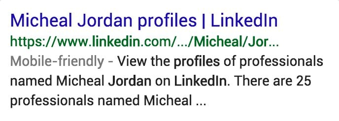
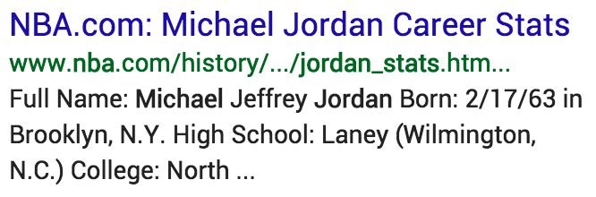
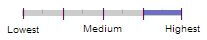

# Misspelled and Mistyped Queries and Results

## Misspelled and Mistyped Queries

You will notice that some queries are misspelled or mistyped. Here are some examples of queries that are obviously misspelled:

Misspelled Query|Query Interpretation
---|---
`federal expres`, English (US)|The only reasonable query interpretation is the company named Federal Express.
`new england patroits`, English (US)|The only reasonable interpretation is the NFL football team.
`byonce knowles`, English (US)|The only reasonable interpretation is the famous singer/actress, Beyonce Knowles.

Some misspelled or mistyped queries are more difficult to interpret. Use your judgment and do query research.

For **obviously** misspelled or mistyped queries, you should base your rating on user intent, not necessarily on exactly how the query has been spelled or typed by the user.

For queries that are **not** obviously misspelled or mistyped, you should **respect the query as written,** and assume users are looking for results for the query as it is spelled.

## Name Queries

Consider the query `john stuart`, English (US). There is a very famous Jon Stewart, the comedian and former host of a popular U.S. television show. However, we should not assume that the query `john stuart` has been misspelled. There are many people named John Stuart. We will respect the query as written and assume the user is looking for someone named "John Stuart."

Query and Possible User Intents|Result Block and LP, Needs Met Rating, E-A-T Rating|Explanation
---|---|---
**Query:** <code>micheal jordan</code>, English (US)  **User Location:** San Francisco, California  **User Intent:** There are many people named "Micheal Jordan."| |The page lists all members of the LinkedIn site named "Micheal Jordan." LinkedIn is a very popular social networking website for professionals in the U.S. This result would be very helpful for many or most users trying to find information about someone named "Micheal Jordan."
*(Same as above.)*  Helpful results for more prominent people named Micheal Jordan should receive higher ratings than helpful results for less prominent people named Micheal Jordan.| |LinkedIn page for Micheal Jordan, a facilities services professional in Atlanta, Georgia.
*(Same as above.)*  Because Michael Jordan is such a famous athlete/celebrity, we will consider Michael Jordan to be a minor interpretation.| |Michael Jordan’s player profile page on the NBA basketball website.
