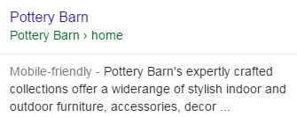
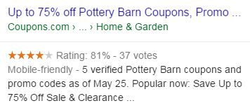

**注**：このページの翻訳はまだ完了していません。  
　　翻訳を手伝いたい場合は、ページの下部のリンクを使用できます。

# URLクエリに対する、Fully Meets評価以外の検索結果

評価者は時々、「クエリが正常に読み込めるURLであるならば、評価は**Fully Meets**であるか、**Fails to Meet**になるのではないか？」と尋ねるがそれはNoだ。URLクエリでも、他の評価に当てはまる役に立つ検索結果はある。

レビューや最近のニュースのようなWebサイトについての情報を見つけるためにURLクエリを使うユーザーもいる。PQ評価の指標を調査する方法の一つとして薦めている。実際のユーザーも使っている。レビューや評判などの情報はURLクエリにとって役に立つ。

しかしながら、webサイトに関する統計情報を提供するwebサイトは、URLクエリのときあまり役に立たない。多くのユーザーはその種類の情報に興味が無い。

**クエリ：**potterybarn.com  
**ユーザーの所在地：**<!-- -->カリフォルニア州パロアルト  
**ユーザーの意図：**<!-- -->Pottery Barn is a home furnishing store. Users may want to go to the website, do research, or find more information on the company.

  
  

This LP is the target of the query.

  
  

Online coupon codes are very popular in the U.S. and this LP (from a well-known coupon site) displays codes for online purchases on the Pottery Barn website. Users may be interested in coupon codes and this would be very helpful for those shopping online at potterybarn.com, especially frequent shoppers.

  
  

This LP (from a well-known review site) has reviews of the potterybarn.com website. Users may be interested in reading reviews when considering whether to make purchases at potterybarn.com, especially new shoppers.

**クエリ：**ratemyprofessors.com  
**ユーザーの所在地：**<!-- -->カリフォルニア州ロサンゼルス  
**ユーザーの意図：**<!-- -->学生が大学の教授を評価するWebサイト「[www.ratemyprofessors.com](http://www.ratemyprofessors.com/)」を訪問する

  
  

このURLクエリの対象ページ。

  
  

このLPはratemyprofessors.comについて2012年8月31日付のHuffington Postの記事だ。記事がガイドラインに追加されたときに新しく発表された。一部のユーザーはこの記事に興味がある。

  
  

このLPは、ratemyprofessors.comのWebサイトに関する2006年4月17日の記事だ。時代遅れの情報に興味を持つユーザーはほとんどまたはまったくいない。

© 2020 Google (<a href="https://static.googleusercontent.com/media/guidelines.raterhub.com///searchqualityevaluatorguidelines.pdf">source</a>)

