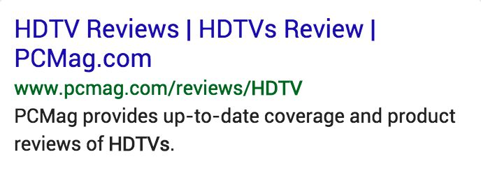

# 製品クエリ：閲覧と調査の重要性

ipad reviewsのような情報を探す（**知識**）意図が明白な商品名クエリがあれば、buy ipadのような購入する（**Do**）意図が明白な商品名クエリもある。そしてipad store.apple.comのようなWebサイトを訪れる（**Website**）意図が明白な商品名クエリもある。しかしながら、多くの商品名クエリは1つのタイプの意図を持っていない。

多くのユーザーは、実際のウィンドウショッピングと同様に、オンラインで商品を閲覧したり視覚的に探索したりすることを楽しんでいることに注意してください。 ユーザーが何を購入するかを調査、閲覧、決定できるようにする結果に、高いNeedsMet評価を与えます。

ユーザーは、自動車や大型家電製品など、閲覧および調査している製品をオンラインで購入することを常に計画しているとは限りません。最終的なゴールは製品を購入することだが、製品の調査（レビュー、技術仕様）、利用可能なオプションの理解（ブランド、モデル、価格設定）、さまざまなオプションの表示と検討(閲覧)など、多くの他のことが先に行われるかもしれない。

**重要：**<!-- -->製品の結果に対するPQ評価には、特別な注意と注意が必要だ。

商品名クエリの検索結果は、YMYLページであることがとても多い。商品を探すとき、ユーザーは権威性のある情報源からの質の高い情報が必要で、特に、製品が高価であるか、または重要な投資/重要な生活イベント（例えば、車、洗濯機、コンピューター、結婚披露宴、ベビー用品）を表す場合である。商品を買うとき、ユーザーは信頼できるWebサイトが必要である。良い評判、広範な顧客サービスサポートなど。商品の検索結果は、お金とあなたの人生（YMYL）の両方にとって重要なものになることがある。

**クエリ：**high definition tv  
**ユーザーの所在地：**<!-- -->カリフォルニア州ロサンゼルス  
**ユーザーの意図：**<!-- -->テレビのサイズ・メーカーなどは指定していない。購入に先立って調査をしているものと思われる。

  
  

このLPには、さまざまなタイプの高精細テレビ（プラズマ、LCD、LED）に関する包括的な情報と、多くの特定のモデルに関するレビューがある。Webサイトには電気製品に関しての役立つ情報とレビューがあることで知られている。

**クエリ：**girl toddler jeans size 3T  
**ユーザーの所在地：**<!-- -->カリフォルニア州ロサンゼルス  
**ユーザーの意図：**<!-- -->とても限定的なクエリ。商品を見比べて、購入しようとしている。

  
  

これは、小さい女の子のジーンズを閲覧して買い物するのに役立つページだ。サイズ3Tのジーンズには多くのオプションがある。これは、ジーンズを販売することで知られている高品質の店だ。

**クエリ：**cufflinks  
**ユーザーの所在地：**<!-- -->カリフォルニア州ロサンゼルス  
**ユーザーの意図：**<!-- -->色々なカフスボタンを見比べて、購入しようとしていると思われる

  
  

このLPは非常に評判の良い小売業者からのカフリンクスの大量のコレクションを持っている。たくさんのオプションとスタイルがある。これは閲覧に適したページだ。スタイル、価格帯などを選択する上で便利な機能がある。

**クエリ：**twist of fate ring pandora  
**ユーザーの所在地：**<!-- -->ペンシルベニア州フィラデルフィア  
**ユーザーの意図：**<!-- -->ユーザーは、Pandoraブランドで販売されている特定の指輪を探しており、指輪を調べたり、外観を確認したり、閲覧または購入するオプションを見つけたりしたいと考えています。

  

この結果には、さまざまな角度と素材を示すさまざまなリングの画像が含まれています。 リングがどのように見えるかを知ることは、製品を研究し、利用可能なオプションを閲覧しているユーザーにとって非常に役立ちます。

© 2020 Google (<a href="https://static.googleusercontent.com/media/guidelines.raterhub.com///searchqualityevaluatorguidelines.pdf">source</a>)

