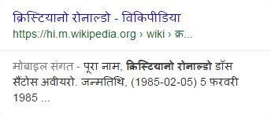

# Rating English Language Results in Non-English Locales

**The following rating guidance is for raters in non-English locales. You may stop reading this section if your task language is English, such as English (US), English (IN), English (NG), etc.**

Your Needs Met ratings should reflect how helpful the result is for users in your locale. When the query is in the language of your locale, assume that users want results in that language. We know that **you** can read English (you are reading this document!), but you should only give high Needs Met ratings to English results if users in your locale would expect or want them for a particular query. Unless requested by the query, English results should be considered useless if most users in the locale can't read them.

However, rating can be more difficult when the query includes English names, words, etc., or when it's unclear whether English results would be satisfying for a particular query. Please use your judgment and knowledge of your locale to determine the appropriate rating.

**Important:** Please keep in mind that every locale will have unique considerations regarding the number and variety of languages (such as official languages, regional languages, local dialects, etc.), writing systems, and keyboard input languages commonly in use. While this guideline may not include examples for your locale, it is important that you represent users in your task location and culture in order to interpret the query and rate results. When in doubt, please assume that users would prefer results in the task language unless the query clearly indicates otherwise.

## Examples of English (and Non-English) Results in Non-English Locales

The section includes some examples using Hindi (IN) and Korean (KR) as the locales. In both cases, we cannot assume that users in these locales—i.e., Hindi-speaking users in India, or Korean-speaking users in Korea—are able to read English. Unless most users in the locale would be satisfied by English results for the query, we will consider them unhelpful or even useless (**FailsM**).

Query and User Intent|Result Block and LP, Needs Met Rating|Explanation
---|---|---
**Query:** `राजा रव वमा`  **Locale:** Hindi (IN)  **User Location:** Delhi, India  **User Intent:** The user wants to find information about राजा रव वमा, an Indian artist.| |This Hindi language Wikipedia page on **राजा रव वमा** is very helpful for Hindi (IN) users.
*(Same as above.)*| |This English Wikipedia page about **राजा रव वमा** has similar content to the Hindi Wikipedia page. Although there are some helpful images on the page, few Hindi users would be able to read this page.
**Query:** `버락 오바마`  **Locale:** Korean (KR)  **User Location:** Seoul, Korea  **User Intent:** 버락 오바마 is Barack Obama in Korean, so the user wants to find information about Barack Obama.| |This Korean language Wikipedia page on Barack Obama is very helpful for Korean (KR) users.
*(Same as above.)*| |This English Wikipedia page about Barack Obama has similar content to the Korean Wikipedia page. Although there are some helpful images on the page, very few Korean users would be able to read this page.

Here are two examples where the query includes proper nouns typed in Latin script, such as famous people, places, titles of books or films, etc. For these queries, users would prefer to see results in the language of their locale.

Query and User Intent|Result Block and LP, Needs Met Rating|Explanation
---|---|---
**Query:** `ronaldo`  **Locale:** Hindi (IN)  **User Location:** Delhi, India  **User Intent:** The user wants to find information about Cristiano Ronaldo, a famous footballer.| |Although the query was typed in Latin script, most Hindi users would want to see information about this person in Hindi. This Hindi language Wikipedia page on Cristiano Ronaldo is very helpful for Hindi IN) users.
*(Same as above.)*| |This English Wikipedia page about Cristiano Ronaldo has similar content to the Hindi Wikipedia page. Although there are some helpful images on the page, few Hindi users would be able to read this page.
**Query:** `titanic 1997`  **Locale:** Korean (KR)  **User Location:** Seoul, Korea  **User Intent:** The user wants to purchase a DVD or find information about the movie "Titanic," released in 1997.| |Although the query was typed in Latin script, most Korean users would expect to see Korean language reviews or Korean stores for purchasing the movie. This Korean result on a Korean website is very helpful.
*(Same as above.)*| |This English language landing page has helpful content for users who can read English. Although there are some helpful images on the page, very few Korean users would be able to read this page.

Here are two additional examples where the query was typed in Latin script (including some English words), yet users would still prefer to see results in the language of their locale.

Query and User Intent|Result Block and LP, Needs Met Rating|Explanation
---|---|---
**Query:** `mahila cricket sri lanka ka match`  **Locale:** Hindi (IN)  **User Location:** Delhi, India  **User Intent:** The user wants to find information about a women's cricket match against Sri Lanka on February 17, 2016.| |Although the query includes some English words, it is a Hindi query typed in Latin script. Most Hindi users would expect to see Hindi results, like this helpful article.
*(Same as above.)*| |This English language landing page has helpful content for users who can read English, but few Hindi (IN) users would be able to read this page.
**Query:** `samsung tablet`  **Locale:** Korean (KR)  **User Location:** Seoul, Korea  **User Intent:** The user wants to purchase, find information, or go to the Galaxy tablet page on the Samsung website.| |Although the query was typed in Latin script and includes some English words, most Korean users would expect to see the Korean page on the Samsung website. This Korean result is very helpful.
*(Same as above.)*| |This English language page on the website of Samsung, the company that makes this tablet, has helpful content. Although there are some helpful images on the page, very few Korean users would be able to read this page.

On the other hand, there may be queries where the needs of most users would actually be satisfied by English language results, even if the query itself is typed in the task language.

For example, for queries about global businesses and organizations, users may expect or want to visit the English language version of the business/organization's official website in some locales. Similarly, for queries seeking technical information such as manufacturer part numbers, product specs, scientific or chemical formulas, etc., the answer to the query may be typically expressed in the English language in some locales.

For these queries, users may expect or want to see English results in order to satisfy their need. Please use your judgment and knowledge of your locale to determine the appropriate rating.

Query and User Intent|Result Block and LP, Needs Met Rating|Explanation
---|---|---
**Query:** `हावड वेबसाइट`  **Locale:** Hindi (IN)  **User Location:** Delhi, India  **User Intent:** हावड वेबसाइट is "Harvard website" in Hindi. Users want to go to the official website of Harvard University, which is a well-known research university in Cambridge, Massachusetts.| |This is the official website of Harvard University. Even though the query was typed in Hindi, this English website is clearly what users are looking for. Users would be fully satisfied by this result.
**Query:** `시스코 카탈리스트 스위치 IOS 복원하기`  **Locale:** Korean (KR)  **User Location:** Seoul, Korea  **User Intent:** This Korean query can be translated as "recovering IOS on Cisco Catalyst switches". The user wants to find out how to restore the IOS operating system on a Cisco Catalyst switch, which is a specific brand/model of computer networking device.| |This article comes from a blog that contains lots of technical information and troubleshooting tips about IT operations and programming. The landing page provides step-by-step instructions in Korean, along with the exact commands in English that users would need to type into a console in order to recover the operating system for the queried device. This tutorial would be very helpful and easy to follow for Korean users who are familiar with this type of networking device.

Finally, in some locales, English is one of the official languages or a commonly spoken language. In these locales, English websites are easy to use and could be helpful, depending on the query.

For example, the Singapore government recognizes four official languages: English, Malay, Chinese, and Tamil, but English is the first and most dominant language in Singapore.

Query and User Intent|Result Block and LP, Needs Met Rating|Explanation
---|---|---
**Query:** `barack obama`  **Locale:** English (SG)  **User Location:** Singapore, Singapore  **User Intent:** Find information about Barack Obama.| |This Wikipedia page in English about Obama would be very helpful to users in Singapore.
*(Same as above.)*| |This Wikipedia page in Chinese about Obama would also be very helpful to users in Singapore.
