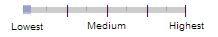

# 特定タイプのページに対するPage Quality評価の注意点

## Ratings for Encyclopedia Pages

エンサイクロペディア系のWebサイトは多く存在する。 一部は標準的な参考文献であり、一部は匿名ユーザーが作成し編集したコンテンツを含むWebサイトであり、編集上の監督や事実チェックはない。 Googleは、特定の記事の著者を常に知っているとは限らないので、記事のE‑A‑Tを判断するためにWebサイトの評判調査をもとに評価していかなくてはならない。 HighとHighestの評価は、正確さと専門知識に対する評判が非常に高く、記事自体は適切な参考文献で十分に調査されているエンサイクロペディアのみ使用する。

> Wikipediaに関する注意：一般的に言って、Wikipediaは評判も良く、大変人気のある情報源で正確さにも定評があり
ます。しかし全てのWikipedia記事の正確さを保証できるような、単一の著者がいるわけではありません。Wikipedia
記事の品質はページごとに異なるので、個々のWikipedia記事の評価をページ単位で確認しましょう。

豊富で詳しいメインコンテンツがあり、[外部の情報源](https://guidelines.raterhub.com/images/PrairieDogWikipediaReferences.jpg)も豊富な[Wikipedia記事](https://guidelines.raterhub.com/images/PrairieDogWikipedia.jpg)はHigh前後の評価になるケースが殆ど
です。Wikipedia記事がHighest評価になることもあります。ただし、医薬・経済・法律などのトピックには極めて高
い専門性が求められるので、大抵の場合Wikipedia記事に対してHighest評価は高すぎるでしょう。高品質なメインコ
ンテンツが多く、しっかりと調査しており、情報源の引用も適切なページはHigh評価まで評価を引き上げることがで
きます。そうでない場合は、Medium前後の評価になることがほとんどです。もちろん、メインコンテンツが大変少
なく、不正確なWikipedia記事にはそれ以下の評価が該当します。

## エラーメッセージ、MCのないページの評価

明示的なエラー（またはカスタム404）メッセージを表示するページや、Webサイトで他ページは機能しているが、一部のページが表示されないことがある。 場合によっては、MCが表示されないこともある。 このような時にページがユーザーのためのヘルプを提供するかどうかを考える。Webマスターは時間、労力、そしてページの管理に注意する。

以下はその例をまとめたものである。

ページとコンテンツのタイプ|ページの特徴|PQ評価点と説明
---|---|---
[意図的にMCなしで作成しているページ](https://guidelines.raterhub.com/images/PQ.3.6.3.jpg)|<ul><li>大量の目立つ広告</li><li>ユーザーの手助けをしていない</li></ul>|  これは、MCを持たないページの例である。 あなたは、MCがないこの特定のページの問題だと思うかもしれないが、実際には、このWebサイトには、同じ方法でMCがない、広告だけを見せる何百ものページがある。 このWebサイトは、ほとんどまたは全く役に立たない広告を表示している。最も低い品質と評価される必要がある。
[ページが完全に読み込まれず、MCがない](https://guidelines.raterhub.com/images/PQ.3.6.4.jpg)|<ul><li>MCなし（恐らく一時的な技術的エラー）</li><li>十分なSC</li><li>良い評判</li></ul>|  このページにはMCはなく、エラーメッセージも表示されない。 ミシガンの町の評判の良い新聞社Webサイトである。同サイトに同様のページは存在しない。すべてのナビゲーションリンクが機能し、このページは後で修正された。
[404カスタムのエラーページメッセージ1](https://guidelines.raterhub.com/images/PQ.3.6.6.jpg)|<ul><li>間違っていませんが、特別良い点もない</li></ul>|  訪問しようとしているURLが存在しなくなったことをユーザーに知らせる「カスタム404」ページの例。 一部のWebサイトでは、ユーザーに問題を知らせ、役に立つヒントを提供している。  このページは、評判の良いショッピングサイトである。 しかし、この部分のページには最低限のコンテンツしか表示されていない。ホームページへのリンクです。役に立つコンテンツへのリンクといえばトップページに戻るリンクのみである。
[404カスタムのエラーページメッセージ2](https://guidelines.raterhub.com/images/baby404.jpg)|<ul><li>その目的のための十分な量で高品質のMC</li><li>UXを向上させる便利なSC</li><li>良い評判</li></ul>|  訪問しようとしているURLが存在しなくなったことをユーザーに知らせる「カスタム404」ページの例。 このWebサイトは、問題を説明し、検索ボックスなどの役に立つヒントを提供する十分な誘導がある。
[404カスタムのエラーページメッセージ3](https://guidelines.raterhub.com/images/PQ.3.6.5.jpg)|<ul><li>その目的のための十分な量で高品質のMC</li><li>UXを向上させる便利なSC</li><li>とても良い評判</li></ul>|  ユーザーが訪問しようとしたURLが存在しないことを知らせる、カスタム404ページの一例。メインコンテンツはイラスト・カートゥーン・Webサイト内検索機能など。メインコンテンツの作成に時間・労力が費やされ、才能が活用されている。  この出版元は大変評判がよく、特にカートゥーンに定評があるため、High+評価からHighest評価にあたる。

## フォーラムとQ＆Aページの評価

フォーラムやQ＆Aページの評価は難しい。 最も重要なことは、ディスカッション参加者のEATであり、審査が難しい場合がある。 次の点に注意する。

- フォーラムとQ＆AページのMCには、質問だけでなく、回答や質問/回答と質問に伴うディスカッションが含まれる。
- ディスカッションに参加した参加者ではなく、そのページを訪れたユーザーの観点から、フォーラムとQ＆Aページを評価する。

以下に例をまとめた。

ページとコンテンツのタイプ|ページの特徴|PQ評価点と説明
---|---|---
[胸痛や喫煙に関するQ＆Aページ](https://guidelines.raterhub.com/images/ChestPainsSmoking.jpg) (YMYL)|<ul><li>不正確で、危険な医学的アドバイスを伴う可能性のあるYMYLページ</li></ul>|  参加者ではなく検索エンジンからこのページを訪れるユーザーの視点から評価する必要がある。質問は言葉に乏しく、理解するのが難しい。回答も言葉が不十分であり、間違った回答が危険な医療手段となり、最低評価のMCとなっている。
[未回答のQ＆Aページ](https://guidelines.raterhub.com/images/PQ.2.6.5.jpg)|<ul><li>誤解を招くページデザイン</li><li>ページの目的に合わないMCの量</li></ul>|  このページには回答がないだけでなく、広告が表示され、他の質問（誤解を招くほど「関連性の高い回答」というラベルが付けられている）へのリンクが目立つように表示されている。ページには実際には答えがないことに気をつけるのに時間がかかる。虚偽のデザインと答えがないこと、このページのUXは不満足となり、このページでは目的を達成できない。
[2002年のボルボ部品に関するQ＆Aページ](https://guidelines.raterhub.com/images/VolvoPart.jpg)|<ul><li>誤解を招くページデザイン</li><li>ページの目的に合わないMCの量</li></ul>|  完全に役に立たない "答え"を含めて、MCを確認する。 この回答は役に立たないので、Googleはこの質問に答えられないと考える。 このページにはMCが不足している。  非常に役に立たない「答え」に加えて、ページデザインによって、MCと広告を区別することが難しくなる。 たとえば、答えの下には、実際の回答と同じ形式の「スポンサー付きの回答」があるが、実際は広告であり、質問に対する回答ではない。 このページのデザインは誤解を招く。
[ゲーム機の問題に関するQ＆Aページ](https://guidelines.raterhub.com/images/2ds.jpg)|<ul><li>ページの目的に合わないMCの量</li></ul>|  一部のWebサイトでは、殆どすべてのMCの作成をユーザーが行っている場合がある。この場合、MCはユーザーの質問であり、回答がない場合、ページ上のMCの量は不足となる。
[ネイティブアメリカンの風習に関するQ＆Aページ](https://guidelines.raterhub.com/images/beliefcustoms.jpg)|<ul><li>ページの目的のためにEATが欠けている</li></ul>|  この質問には94件の回答があり、役に立つと思われる結果がいくつかあるが、トップに表示される答え（「ベストアンサー」と表示されているもの）を含め投稿の多くは間違っているか誤解を招くものである。
[バレエシューズの洗い方に関するQ＆Aページ](https://guidelines.raterhub.com/images/WashBalletShoes.jpg)|<ul><li>高品質・低品質要素が混在するが、埋め合わせができている</li></ul>|  フォーラムはダンス話題について書いてあり、そして、多くのページにはバレエダンサーのコミュニティからの専門知識がある。投稿者はバレエ靴を日常的に洗濯している経験をして、彼ら自身のおすすめ方法を投稿している。  このページは、様々なコンテンツが混在しているため、MCを読みにくい。しかし、これは美人コンテストではない！ページが複雑になっていても、毎日の貴重な専門知識がある。有用なMC、このページのため中間の評価にする。
[Roombaが動作に関するQ＆Aページ](https://guidelines.raterhub.com/images/Roomba.jpg)|<ul><li>ページの目的のための日常経験の専門知識</li></ul>|  多くの参加者は、これらの製品との個人的な経験を共有し、特定のモデルがペットの毛にどれだけうまく機能するかなどの詳細を共有している。 この製品の参加者自身の経験と、それがどの程度うまく機能しているか、豊富に提供されている。
[Build-A-Bearでのインタビューに関するQ＆Aページ](https://guidelines.raterhub.com/images/BuildABear.jpg)|<ul><li>ページの目的のための日常経験の専門知識</li></ul>|  このページの答えは、Build-A-Bearの従業員によって書かれているので、多少独自性と専門性の答えを提供している。  ページ設計は、広告が明確にラベル付けされ、質問と回答の両方が表示されるので、ユーザーは分かりやすくMCを読むことが出来る。
[編み物のマジックループテクニックに関するフォーラム記事](https://guidelines.raterhub.com/images/magicloop.jpg)|<ul><li>トピックと目的のEATの高レベル</li></ul>|  このフォーラムページに最初の投稿した人は、マジックループテクニックを習得する方法についての参考資料を提供している。 彼女はまた、古い青いジーンズを使用して、自分バージョンの写真を共有している。 Googleは、投稿者を20年以上の靴下を編む経験を持ち、彼女がその話題の専門家であると考えることが出来る。
[がん患者の平均生存期間に関するQ＆Aページ](https://guidelines.raterhub.com/images/CancerCompass.jpg)|<ul><li>毎日の専門知識</li><li>充実した高品質のMC</li></ul>|  このページの質問は、人々が癌でどれくらいの期間生存しているかを聞いている。 愛する人が診断後どのくらいの期間生存したかを説明する多くの投稿がある。 医療提供はほとんどなく、ページの焦点は個人的な経験を共有することである。 多くの結果は誠実でよく書かれている。
[財布の鑑定に関するフォーラムのページ](https://guidelines.raterhub.com/images/purseauthentication.jpg)|<ul><li>トピックと目的のEATの高レベル</li><li>充実した高品質のMC</li></ul>|  このフォーラムは高級デザイナーの財布に関する議論のためによく知られている。 この特定のフォーラムページでは、メンバーはこのブランドのバッグを鑑定する専門知識を持つフォーラム専門家に相談している。 これらの専門家は、特定のバッグが本物か偽物かを知ることができる。 トップに広告があり、フォーラムメッセージの中に広告があるが、それはMCから気をそらすものではなく、簡単に見つけることができる。
[追跡するKPIのフォーラムページ](https://guidelines.raterhub.com/images/kpi.jpg)|<ul><li>トピックと目的のEATの高レベル</li><li>充実した高品質のMC</li></ul>|  このフォーラムは、品質保証に関する専門家のコミュニティにとして有名である。回答はページの目的で信頼できるものである。 ページには広告があるが、MCを見つけるのは簡単で、「スポンサーリンク」というラベルが付いている。
[水族館の造園に関するフォーラムのページ](https://guidelines.raterhub.com/images/aquascaping1.jpg)|<ul><li>トピックと目的のEATの高レベル</li><li>充実した高品質のMC</li></ul>|  このディスカッションでは、特定の水槽（陸上・水中の要素を含んだアクアリウム）の造園に焦点を当てている。 水族館で使用されている材料や種の種類については、多くの議論や交流があり、 ポストは専門家に水族館造園のニッチな話題を示している。
[略語に関するQ＆Aページ](https://guidelines.raterhub.com/images/Abbreviation.jpg)|<ul><li>トピックと目的のEATの高レベル</li><li>極めて評判がよく、Webサイトがコンテンツの責任を負うことを明示している</li></ul>|  このページの目的は、略語の使用に関する質問に答えることである。 このWebサイトは、執筆、出版などに関する情報の参照として非常に良い評判を持っている。このページのトピックについては、信頼性が高く、信頼できると考えられる。
