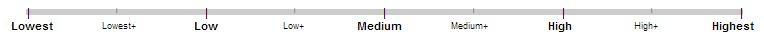

# Page Quality評価スケール

Page Quality評価のスケールは以下の通り。

1. ページの本当の目的がわかること。ユーザーの助けとならない再生成されたページや嫌悪感、害を与える可能性があるページ、ユーザーに誤解を与えるようなページのような、ユーザーにとって有益でないウェブサイトやページは**Lowest**評価を受ける。
2. そうでない場合、PQ評価はどのくらいページの目的に合致しているか、以下の章で上げる基準（**High**評価/**Highest**評価/**Low**評価/**Lowest**評価/**Medium**評価の基準）に基づいて評価される。

Page Quality 評価を行うにあたって、Page Quality スライドスケール（スライダー）を使用することで全体的なPage Quality評価をつけることができる。そのスライダーは以下の通り。

上で挙げた5つの評価の他に、**Lowest+**、**Low+**、**Medium+**、**High+**という評価メモリがある。ここでの「+」は「+2分の1」を表す。例えば**Lowest+**は**Lowest**に2分の1だけ評価を+したものとなる。つまり**Lowest+**は**Lowest**と**Low**の中間を、同様に**Low+**は**Low**と**Medium**の中間を意味する。

次のセクションでは、**Highest**、**High**、**Medium**、**Low**、**Lowest**の各評価段階に該当するページの特徴について解説する。

## Page Quality評価で最も重要な要素

Page Quality評価を考える上では、特に以下の要素が重要となる。

- **ページの目的**
- **専門性、権威性、信頼性：**<!-- -->質を確かめる重要な要素。調査する際には、追加要素として以下の3点を確認すること。
- **MCの質と量：**<!-- -->URLのLPをもとに評価する。
- **ウェブサイトに関する情報（サイト管理者は誰か）：**<!-- -->サイトの情報を調査するのに役立つリンクが提供される。
- **ウェブサイトの評判：**<!-- -->サイトの評判を調査するのに役立つリンクが提供されることがある。

**注：**<!-- -->「ページの確認はモバイル端末で行い、サイト管理者の情報やサイトの評判等の調査はデスクトップで行う」タスクもあれば、「すべての作業をデスクトップで行う」タスクもある。その時々でタスクごとの指示に従って調査をする。

## 専門性・権威性・信頼性（E‑A‑T）の詳細

Page Quality評価の最初の段階として、ページの目的が分かるようにすることだとはじめに言及した。ユーザーの助けとならない再生成されたページや嫌悪感、害を与える可能性があるページ、ユーザーに誤解を与えるようなページのような、ユーザーにとって有益でないウェブサイトやページは**Lowest**評価を受ける。

その他の有益なページに関しては、専門知識・権威性・信頼性（E-A-T）があるかどうかが重要となる。考えてみて欲しい。

- メインコンテンツの作成者の専門知識の量
- メインコンテンツの作成者の権威性、メインコンテンツ自体の権威性、ウェブサイトの権威性
- メインコンテンツの作成者の信頼性、メインコンテンツの信頼性、ウェブサイトの信頼性

どのようなタイプであっても、「E‑A‑Tの高い」Webサイトは存在する。ゴシップ情報に関するサイト、ファッション情報を集めたサイト、その他ユーモア、フォーラム、Q＆A等のサイトであっても例外ではない。情報源がフォーラムやディスカッションのサイト以外に存在しない場合は、専門家によるコミュニティが特定の情報に対し価値の高い見解を示してくれることもある。

- 医学的助言は、十分な専門知識、または資格をもつ個人や組織から提供されるものほど質が高くなる。その医学的助言や情報が、専門家によって記載・作成され、編集・校閲され、尚且つ定期的に更新されているものかを確認する。
- ニュース記事は、事実に基づいた正確な内容であるのはもちろんのこと、ユーザーにとって分かりやすい手法をとることで、その出来事に対するユーザーの理解をより深めることができるものの質が高いとされる。編集手法と校閲過程を確立するためには、一般に高い質の情報源が必要となる。([例1](https://static.googleusercontent.com/media/www.google.com/en//insidesearch/howsearchworks/assets/GG/news-editorial-policy1.jpg), [例2](https://static.googleusercontent.com/media/www.google.com/en//insidesearch/howsearchworks/assets/GG/news-editorial-policy2.jpg))
- 科学的な情報を集めたページは、十分に確立された一般論に基づいた科学的見解を示しているものほど質が高くなる。
- 資産、法、税金などに関する助言は、専門的な情報源によるもの、定期的に維持、更新がされているものほど質が高くなる。
- 家のリフォーム（数十万円はかかる／生活状況にも影響を与える）や育児（一家の未来の幸せに関わる）についての助言は、専門家によるものであるか、またはすでに経験した人による、ユーザーが信頼できる情報源であるものほど質が高くなる。
- 写真やギターのような趣味に関するページも、質の高いものとなると専門的知識が必要となる。

トピックによっては、正式な専門的知識はあまり必要でないものもある。例えば製品やレストランについて、とても詳細で役立つレビューを書く人は多くいる。そしてフォーラムやブログ等で、それら生活の知恵や経験を共有する人も多くいる。このような人生経験が生かされる場においては、一般の人であっても専門家としてみなされる可能性がある。コンテンツの制作者がそのトピックについて、専門家とみなされるだけの様々な経験を積んでいる場合、こうした「毎日の積み重ねで得られた専門性」をGoogleは評価する。その分野において正式な教育や訓練を受けていないからといって、コンテンツの制作者、およびWebページやWebサイトにペナルティを課すことはない。

YMYLに関するトピックであっても、日々の経験から専門性を持つことは可能である。病気の人々を支えるためのフォーラムやサポートページがそれに当たる。個人的な経験は、日々の経験から得られる専門性のひとつである。[このフォーラムの例](https://static.googleusercontent.com/media/www.google.com/en//insidesearch/howsearchworks/assets/GG/CancerCompass.jpg)を見てみましょう。このフォーラムでは、愛する人がどれくらいの間、肝臓がんと闘病していたのかを伝えている。彼らが経験による専門性を有していたとしても、これはあくまで個人的な経験の共有であり、医学的な助言ではない。明確な医学的情報や助言は、こういった人生経験の記述よりも医師または医療従事者に求めるべきである。

ここで、ページのトピックについて考えてみる。ページの目的を十分に達成させるためには、どのような専門知識が必要になるのだろうか。その基準は、トピックによって異なる。

*[MC]: メインコンテンツ
*[E‑A‑T]: 専門性、権威性、信頼性
