# モバイルのユーザー・クエリ・検索結果を理解する

どのようなことにスマートフォンを使うか？

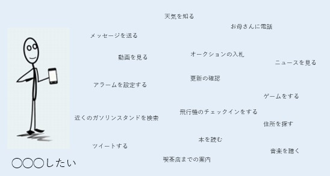

様々な用途でスマートフォンは使用され、使用する状況も多種多様である。Web検索をすることや、ある限定の動作をスマートフォンにさせることもある。簡単な作業から、様々な段階を経て完了する作業もある。例えば、「この映画の監督を誰か調べる」というのは簡単な作業であり、「近場で、この映画を上映している映画館を探し、チケットを買うこと、行き方を調べ、ナビ機能を使う」というのは、様々な段階を経た複雑な作業になる。

ユーザーは、スマートフォンに様々なことを求めます。デスクトップPCやノートPCに比べると使いにくいという弱点がある。

- **データの入力が不便：**<!-- -->スマートフォンでのタイピングは難しく、正確に音声入力が認識されない。
- **画面が小さい：**<!-- -->スマートフォン本体機能・アプリ・Webページ等が使いづらい
- **スマートフォンで使いにくいWebページがある：**<!-- -->メニューやリンクが小さいこと、Webサイトの見ることが難しいことがある。横方向のスクロールが必要なページや、画像サイズと画面サイズが合わずに表示できない。また、Flash等の機能を使用しているサイトは、大半のモバイル機器が接続できないなど。
- **ネット接続が不安定で遅い：**<!-- -->モバイルユーザーはネットワーク環境の圏内・圏外を行き来するので、接続が不安定である。また、アプリ起動時、音声操作の認識・Webページの読み込みに時間がかかる。

**重要：画面の小さなスマートフォンを始めとする端末でも、簡単に作業を完了させる必要がある。** ユーザーは「この瞬間に即した」結果を「今すぐに」入手したいと思っている。また、検索に時間をかけられないこともある。

モバイル評価を行うためには、評価者がスマートフォンを利用すること。スマートフォンの音声コマンド・機能・その他機能に慣れていない場合、少し時間を使ってスマートフォンに慣れる必要がある。例えば、以下の音声操作を試してみる。

- [iPhoneのSiri](https://www.apple.com/jp/siri/)
- [Androidの音声操作機能](https://support.google.com/websearch/answer/2940021?hl=ja)、またはAndroid端末に「OK Google, help」と話しかけてみる

## 評価に関する重要な定義・概念

**クエリ**
: ユーザーがスマートフォンにタイピングや音声で入力した、言葉や数字のことです。本ガイドラインでは、クエリは[ ]で囲んで表示します。ユーザーが「自宅までナビ」と言ったら自宅までナビ、検索窓に「iPhone」と入力したらiPhoneと表示します。  ユーザーはスマートフォンで「アプリを起動する」「友人に電話する」「Webを検索する」などさまざまなアクションをしようとするので、クエリにも色々なタイプがあります。

**ユーザー**
: （スマートフォンサイズの）画面が小さい端末に（クエリを）タイピング・音声入力して、何らかのタスクを達成しようとしている人を指します。

**ユーザーの意図**
: ユーザーがクエリを入力するときには、ある目的を達成しようとしています。このようなユーザーの目的を「ユーザーの意図」と呼びます。

**ロケール**
: すべてのクエリには対応する言語と地域があり、それらをロケールと呼びます。ロケールの表示にはアルファベット2文字の国コードを利用しています。現在のコード一覧は[こちら](https://guidelines.raterhub.com/images/RG1_1.2-1.jpg)です。タスクによっては、ロケールがそのままタスクの対象地域になることもあります。

**ユーザー所在地**
: ユーザーがいる場所です。

**SERP（検索結果ページ）**
: ユーザーがクエリを入力した後に、検索エンジンが表示するページです。SERPは複数の**リザルトブロック**の組み合わせで構成されています。

  **リザルトブロック（RB）**
  : クエリに対応して表示される、個々のブロックを指します。「リザルトブロック内に情報が表示される場合」「リンクが表示される場合」「情報+リンクが表示される場合」があります。

  **ランディングページ（LP）**
  : リザルトブロック内のリンクをクリックすると表示されるページのことです。

**機能**
: スマートフォンなどの端末は、「アラーム設定」「アプリ起動」などのアクションを目的とする音声入力に対応できます。こうしたアクションを求めるクエリを **｢機能｣** クエリといいます。

  **｢機能」クエリ**
  : スマートフォンに特定のアクションをさせようとするクエリです。通常ならスクリーン・デバイスの操作が必要な行為を、音声コマンドで行ってしまおうとする場合が多いです。

  **｢機能」検索結果**
  : スマートフォンは「機能」クエリに対して、 **｢電話をかける｣** などのアクションを返すことができます。

## クエリの理解

品質評価業務の最初は、クエリを理解すること。「クエリ」とは、ユーザーが文字入力や、音声入力をした際の言葉のことである。

いくつかの作業にはクエリのリサーチリンクが含まれている。クエリまたはユーザーの意図を理解していない場合に使用する必要がある。クエリやユーザーの意図が理解できない際は、Google検索、オンライン辞書、エンサイクロペディアなどを使い調べる。それでも解明されない場合は、評価タスクを手放す。

**重要：**<!-- -->Google検索でクエリを調べる時、上位ページのみに頼らない。クエリにはGoogle検索結果に出てこないような意図が含まれている可能性がある。「Google検索の上位に表示されるから」という理由での高評価は付けないようにする。

担当のロケールユーザーが、以下のクエリをスマートフォン文字入力・音声入力した場合を考える。

- **クエリ：**<!-- -->パリの人口、英語（米国での検索）  
  **ユーザーの意図：**<!-- -->現在の、フランスのパリの人口を知る。
- **クエリ：**<!-- -->近所のスターバックス、英語（米国での検索）  
  **ユーザーの意図：**<!-- -->距離の一番近いスターバックスの場所を知る。
- **クエリ：**<!-- -->天気、英語（米国での検索）  
  **ユーザーの意図：**<!-- -->現在のユーザーがいる位置の天気を知る。
- **クエリ：**<!-- -->母に電話、英語（米国での検索）  
  **ユーザーの意図：**<!-- -->「母」で登録している連絡先に電話をかける。

## タスクの言語・地域

全てのクエリには、必ず評価タスク用のロケール（言語と地域）が表示されています。クエリやユーザーの意図を理解するためには、ロケールが重要です。ユーザーの所在地が違うと、同じクエリであっても意味合いが異なることがあります。評価タスクにはユーザーの所在地情報が表示されます。「大体このあたり」というエリアで表示されることもあれば、具体的な場所が表示されることもあります。

> Note: Examples in the following sections will include a User Location in the form of a city and state. Note that in the actual rating tasks, you will need to infer the User Location based on the map that is provided, as discussed in [Understanding the User Location on the Task Page](/appendix-using-the-evaluation-platform/understanding-the-user-location-on-the-task-page).

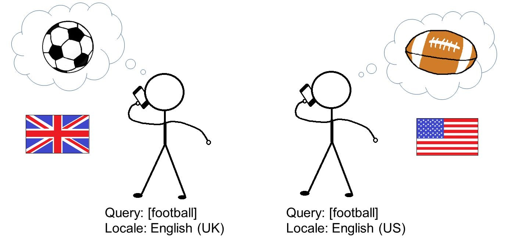

多くのクエリでは、ユーザーの所在地がクエリ・ユーザーの意図を汲み取ることに影響はない。例えば、facebook.com、子猫の写真、地球と月の距離、母に電話など。評価タスクにユーザー所在地の表示がないものは、所在地とクエリが関係ないと考えて評価を行う。

ユーザーの所在地が、クエリの解釈やユーザーの意図の汲み取りに重要なタイミングとはどんな時か？Webでの調査と評価者自身での判断で答えを出していく。「このユーザーと他の街にいるユーザーで探しているものに差異はあるのか？」と自問してみる。

## 「明示的なロケーションのあるクエリ」

ユーザーは、具体的な地名を入れて、ユーザーの所在地に関係なく、検索エンジンに「この結果が欲しい」と伝えてくれることがある。このようなクエリ内に含まれた地名を「明示的なロケーション」と呼ぶ。「明示的なロケーション」があると、クエリの理解・解釈は簡単になる。

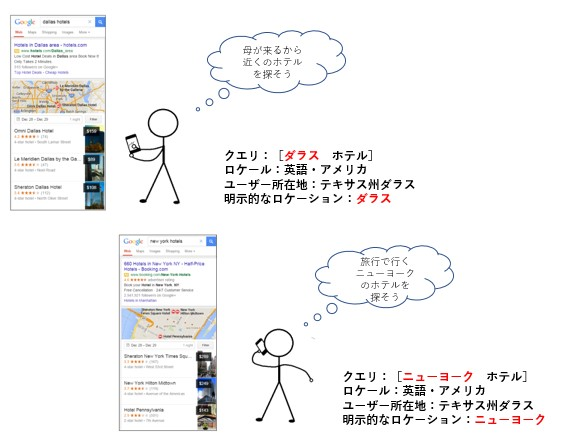

「明示的なロケーション」は、ユーザーの所在地と一致する時と、しない時がある。

クエリに「明示的なロケーション」が含まれている時は必ず考慮する。ユーザーが「明示的なロケーション」を使用する目的としては、自分の探しているものを的確に伝える為である。

## 複数の意味を持つクエリ

意味を複数持っているクエリもたくさんある。例えば、appleにはコンピューターのブランドと「果物のりんご」の意味がある。このように、単語の意味複数あるものを「**クエリの解釈**」と呼ぶ。

**支配的解釈**
: 大半のユーザーが意図を解釈しているクエリのことである。多数派の占める支配的な解釈がないクエリもある。支配的解釈は分かりやすく、簡単なWeb調査で明らかになる。

**一般的解釈**
: 一部から多数のユーザーが意図しているクエリであり、複数の解釈が存在する。

**少数派解釈**
: 一部のユーザーが意図するクエリ。一般的ではない。これを「**軽微な解釈**」という

例えば、

**クエリ：apple**  
**ロケール：英語・アメリカ**  
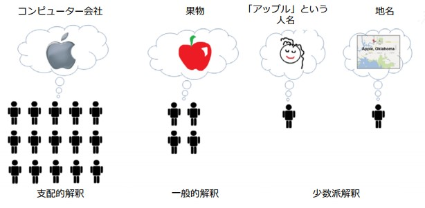

**クエリ：mercury**  
**ロケール：英語・アメリカ**  
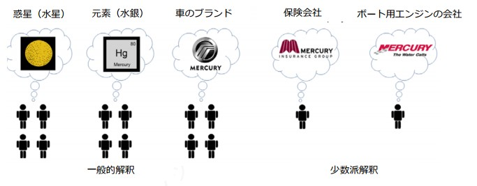

## 時間が経てば、クエリの意味も変わる

クエリは現時点での意味に注意して評価タスクを行う。ユーザーが特に明らかにしていない場合は、話題に関する「現在」「最新」の情報とモデル、「開催時期が一番近い」イベントの情報を求めているとGoogleは仮定する。

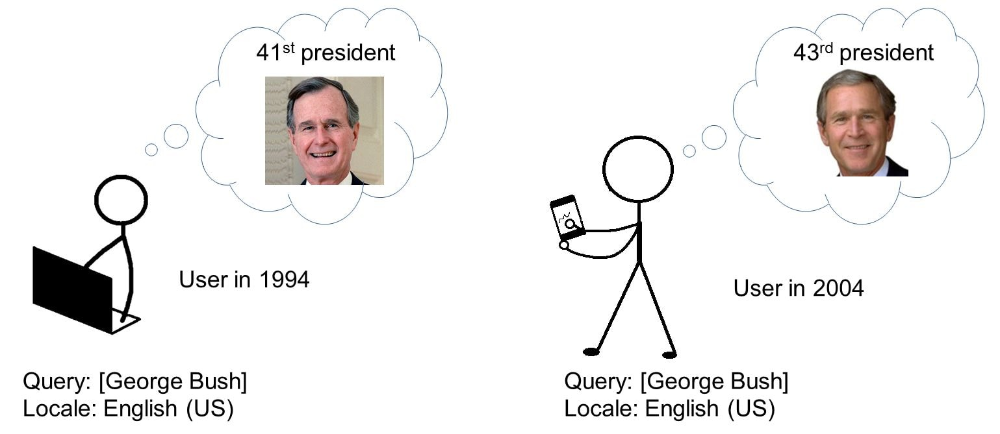

iPhoneのクエリの解釈は新規モデルが発表される度に変わる。2007年が最初のリリースで、当時は「iPhone」で検索したユーザーが求めている情報は、iPhone1だった。しかし、現在のユーザーが求めているのは最新のモデルのものや、今後発売されるモデルの情報である。これからも発売されるモデルとともに支配的解釈も変化してくる。

## ユーザーの意図を理解する

クエリを考える際、以下の意図のどれか又は、複数に該当させて考えると良い。

- **知識**クエリ：一部は**簡単知識**クエリに分類
- **行う**クエリ：一部は**スマートフォン機能**クエリに分類
- **ウェブサイト**クエリ：特定のWebサイト・ページを訪問しようとしているもの
- **訪れる**クエリ：特定のビジネス・組織や、特定カテゴリのビジネスを探しているもの

### 知識クエリ・簡単知識クエリ

**知識**クエリは、トピックに関する情報を見つける目的で、ユーザーは何かを知りたい。

**簡単知識**クエリは、**知識**クエリの中の特殊なものである。**簡単知識**クエリは一部の事実・図表などの限定的な答えを探すものを指す。回答には正確性が求められ、完全である必要がある。また、「モバイル端末の画面上に収まるような」狭いスペースにも表示できることがある。多くの人が認めるような回答と、その回答が１～２文の文や表で表せる場合、そのクエリを**簡単知識**クエリに分類する。

「オバマの身長どのくらい」のクエリは**簡単知識**クエリの一例である。また、「いつ」「何」などの疑問詞を含むことのない**簡単知識**クエリもある。「バラク・オバマ　身長」の意図は同じであるが、疑問詞はついていない。

クエリの多くは**簡単知識**クエリではない。例を挙げると

- 短い回答の得られない、幅広い情報、複雑な情報、深い情報を得るためのインフォメーショナルクエリ
- 曖昧・不明瞭な意図のインフォメーショナルクエリ
- 議論の余地がある（大人数の人が認める回答のない）トピックに関するクエリ
- 決定的な「正解」がないインフォメーショナルクエリ
- タイプや情報源がユーザーによって異なってくるクエリ

以下の表に「**簡単知識**クエリで正確で狭いスペースでも表示できる例」と**知識**クエリ「複雑な答えが必要となってくる**知識**クエリ」をまとめた。

1. **簡単知識：**バラク オバマ 身長、オバマの身長は  
1. **知識：**バラク オバマ

**知識**クエリでは幅広い情報を求めており、ユーザーによって必要な情報は異なる。（例：経歴・著書・ソーシャルメディアへの投稿など）

1. **簡単知識：**ニューヨーク市 人口 2013  
1. **知識：**ニューヨーク市

**知識**クエリでは幅広い情報を求めており、ユーザーによって必要な情報は異なる。（例:旅行に関する情報・事実・写真・歴史など）

1. **簡単知識：**Grave's Disease（バセドウ病）の語源になった人は誰  
1. **知識：**バセドウ病

**知識**クエリでは幅広い情報を求めており、ユーザーによって必要な情報は異なる。たった一つの「正解」が存在しない。

1. **簡単知識：**macy's 店舗 営業時間  
1. **知識：**macy's 贈り物ラッピング オプション

**知識**クエリは、あるデパートのサービスに関する幅広いクエリであり、短い回答はない。

1. **簡単知識：**ニッケルの元素記号は  
1. **知識：**ニッケルの用途は

**知識**クエリは幅広いクエリであり、短い完全な回答はない。

1. **簡単知識：**BCSナショナルチャンピオンシップの2014年度の勝者は 
1. **知識：**BCSナショナルチャンピオンシップはどこが勝つ？

**知識**クエリは意見を求めており、決定的な答えは存在しない。

1. **簡単知識：**スターバックスの株価は  
1. **知識：**スターバックスの株は買いかな？

**知識**クエリは論理的にはYes/Noで回答できるものだが、皆が納得できる正解が存在しない。

**簡単知識**クエリに該当するかを判断する際には、モバイルユーザーを想定して判断してください。

**重要な評価例：**「天気」のクエリは、幅広い情報に見えるが、モバイルユーザーの大半は、「現在のまたは、数日間の、所在地近辺の天候」を知りたいというシンプルな目的を持っている。その為、モバイルユーザーによる「天気」「天気　今日」「天気　明日」「天気　今週」などのクエリは**簡単知識**クエリになる。

### 行うクエリ・スマートフォン機能クエリ

**行う**クエリは、特定の行動やある目的を達成するためのクエリである。例として、「ダウンロードする」「購入する」「手に入れる」「楽しむ」「Webサイト・アプリを利用する」などがある。ユーザーは何かをしたい。

以下は、**行う**クエリの例をまとめたものである。

**クエリ：**入手 Candy Crush ゲーム  
**ユーザーの意図：**<!-- -->Candy Crushをインストールしたい。

**クエリ：**オンライン 性格診断  
**ユーザーの意図：**<!-- -->オンライン性格診断を受けたい。

**クエリ：**私のBMIはいくつか？  
**ユーザーの意図：**<!-- -->BMIを計算したい。

**クエリ：**買う citizen kane dvd  
**ユーザーの意図：**<!-- -->citizen kaneのdvdを買いたい。

**行う**クエリの中の**スマートフォン機能**クエリは特殊なものである。スマートフォンに何らかの動作の指示をユーザーが行うためのクエリである。このクエリを利用するユーザーの背景は、運転中などの理由で手を使わずにスマートフォンを操作したい時である。モバイル端末が**スマートフォン機能**クエリに対応することはとても重要であり、検索結果の評価にも厳しい基準を適用している。

普通、**スマートフォン機能**クエリは行動や意図や、行動させる為の指示が明らかに示されている。動詞や行動を表す単語が含まれる事が多いほか、最初に「OK Google」「Siri」で始まることもある。

**スマートフォン機能**クエリの例を以下にまとめた。

**動作のタイプ：**<!-- -->電話する  
**機能クエリの例：**母の携帯に**電話する**、アン・ジョーンに**電話する**、OK　Google、母さんに**電話する**

**動作のタイプ：**<!-- -->メッセージを送る  
**機能クエリの例：**ジョンにテキスト**送信**、メッセージ**送信** ジョン、**SMS** ジョン

**動作のタイプ：**<!-- -->道案内・交通情報などのマップ情報を**見る**  
**機能クエリの例：**セントラルパークまで**案内**、交通情報**見せて**、地図を**見せて**

**動作のタイプ：**<!-- -->アプリ・ページを開くか、アプリをインストールする  
**機能クエリの例：**amazon.comに**行く**、facebookアプリ **起動**、facebook.comを開く、NYタイムスのビジネスセクションを開く、siri、Facebookを**開いてくれる**？、**入手** Candy Crushアプリ

**動作のタイプ：**<!-- -->音楽・動画などのメディアを開く  
**機能クエリの例：**White albumの曲を**かける**、ライフ・オブ・パイを**見る**、かわいい子猫を**見せて**、かわいい子猫が**見たい**、imagine dragonsのradioactiveを**聴きたい**

**動作のタイプ：**<!-- -->スケジュールを登録  
**機能クエリの例：**午前9時にミーティングを**入れる**

**動作のタイプ：**<!-- -->アラーム・タイマーを設定  
**機能クエリの例：**午前6時にアラーム**設定**、午前6時に**アラーム**、30秒の**タイマー**

逆に、以下は**スマートフォン機能クエリではない**例です。

**クエリ：**エンパイアステートビルの電話番号  
**説明：**<!-- -->動作を表す単語はない。電話番号を知りたいだけで、実際に電話する意図はなから、**簡単知識**クエリに分類。

**クエリ：**facebook.com  
**説明：**<!-- -->「開く・訪問する」などの動作を表す単語はないので、**ウェブサイト**クエリに分類。

**クエリ：**amazon.com  
**説明：**<!-- -->「開く・訪問する」などの動作を表す単語はないので、**ウェブサイト**クエリに分類する。

**クエリ：**アン・ジョーンズ  
**説明：**<!-- -->「電話する・テキストメッセージを送る」などの動作を表す単語はないので、情報を求める**知識**クエリに分類。

### ウェブサイトクエリ

**ウェブサイト**クエリは特定のサイト・ページにいくことを目的としたクエリである。目的のサイト・ページを「**ターゲット**」と呼ぶ。

**ウェブサイト**クエリには以下のようなURLクエリを含む

- 実際に開くことの出来る、完全なURL：http://www.ibm.com、www.ibm.com、ibm.com.
- 実際には開けない不完全なURL。この時、クエリをアドレスバーに入れても機能しないが、ユーザーは特定のURLを意図して入れているとして判断する。

以下は**ウェブサイト**クエリの例をまとめたものである。

**クエリ：**kayak（英語・アメリカ）
**ユーザーの意図：**<!-- -->KayakのWebサイトを見る

**クエリ：**youtube（英語・アメリカ）
**ユーザーの意図：**<!-- -->YoutubeのWebサイトを見る

**クエリ：**ebay（イタリア語・イタリア）
**ユーザーの意図：**<!-- -->eBay（イタリア版）のWebサイトを見る

**クエリ：**NYタイムス 健康セクション（英語・アメリカ）
**ユーザーの意図：**<!-- -->NYタイムスのWebサイトの、健康に関するセクションを見る

**クエリ：**canon.com eos デジタルカメラ（英語・アメリカ）
**ユーザーの意図：**<!-- -->キヤノンのWebサイトの、EOSデジタルカメラのページを見る

### 訪れるクエリとユーザーの所在地

１日のほとんどをユーザーは、スマートフォンと共に行動する。仕事、学校、レストラン、その他用事などにスマートフォンを持ち歩く理由の１つとして、「喫茶店・ATM・レストランなどを探す」という**訪れる**クエリを解決するためである。スマートフォンの検索において**訪れる**クエリは使用されることが多く、スマートフォンを通しての検索では**訪れる**クエリの意図がある可能性を見落とさないようにすることが重要である。

所在地付近の情報や、検索結果であるビジネス・組織・場所が明確なクエリもある。以下には、意図の明確な**訪れる**クエリと意図が明確ではない**訪れる**クエリをまとめてみた。

**訪れるの意図があるクエリ**

  

**その他の例：**ピザ、ヨガ 教室、喫茶店、映画 上映時間、車の修理][歯医者、バンクオブアメリカ ATM 場所、近所のスターバックス

**訪れるの意図がないクエリ**

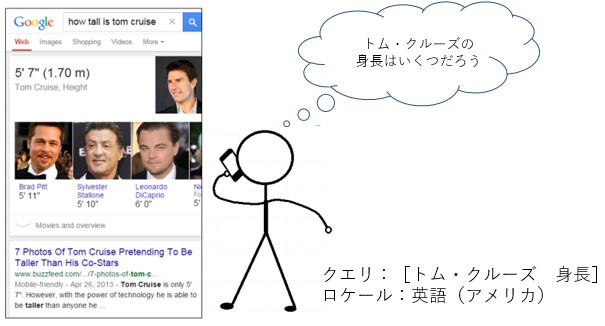  

**その他の例：**レッドソックス ワシントンポスト スクラブル（訳注：ゲーム名） コツ sedentary 意味 aapl（訳注:Apple社の株式コード） ビヨンセ Angry Birds（訳注:ゲーム） ダンス動画 オスカー 2012 口説き文句 バンクオブアメリカ ログイン

また「訪れるの意図があるユーザーもいれば、ないユーザーもいる」というクエリもあります。

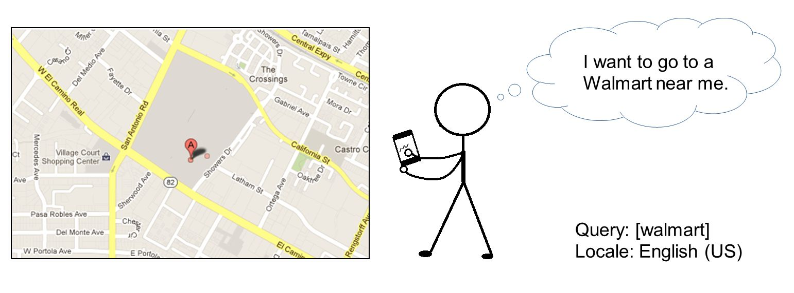

以下は、そのようなクエリの例です。

- [ホテル](https://www.google.com/search?q=ホテル)
- [郵便局](https://www.google.com/search?q=郵便局)
- [apple store](https://www.google.com/search?q=apple+store)
- [みずほ](https://www.google.com/search?q=みずほ)
- [東急ハンズ](https://www.google.com/search?q=東急ハンズ)
- [LABI](https://www.google.com/search?q=LABI)
- [Daiei](https://www.google.com/search?q=Daiei)
- [図書館](https://www.google.com/search?q=図書館)
- [三井住友](https://www.google.com/search?q=三井住友)
- [starbucks](https://www.google.com/search?q=starbucks)

クエリの解釈にはユーザーの位置情報が影響することがある。例えば[ターメリック]というクエリをカリフォルニア州サニーヴェール付近でユーザーが検索すると、以下のように検索結果が出てくる。

1. サニーヴェールにある「ターメリック」という有名レストラン
2. 香辛料の「ターメリック（ウコン）」

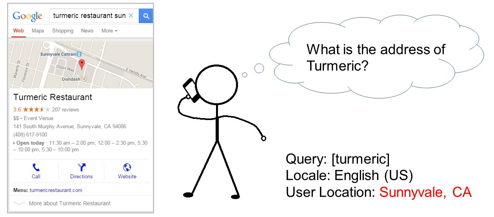

他の場所ではほとんど、「ターメリックという有名レストラン」は存在しない。その場合、[ターメリック]というクエリには「香辛料のターメリック」という解釈しか成立しなくなる。サニーヴェールのレストラン「ターメリック」が有名なのはサニーヴェールだけであると考えられる。

クエリを分析で、訪れるクエリの意図の有無を判断する時はこのようなことも頭において判断する必要がある。

### 複数の意図が考えられるクエリ

複数の意図が考えられるクエリも多く存在する。どの意図が正しく、どの意図が違うのかは自身で判断していく。

**クエリの例：**ハーバード  
**ユーザーの意図：**<!-- -->所在地などを考慮して、「公式ホームページを見る（**Website**）」「行き方を知る（**訪れる**）」「同校のことを知る（**知識**）」等が考えられる。

**クエリの例：**ウォルマート  
**ユーザーの意図：**<!-- -->「近所のウォルマートに行く（**訪れる**）」「Webサイトで買い物をする（**Website**）の両者が主流であり、「ウォルマート社のことを知る（**知識**）」の意図は少ないだろう。

## RBを理解する

この節ではクエリとその検索結果の例を挙げていく。特記事項以外は、このガイドラインに載せられているRBやページはスマートフォンで使いやすいものだと考える。

### 「Web検索のRB」の例

Web検索のRBを構成するものとして、「タイトル付きリンク」「URL」「ページ内容を表現する『スニペット』」などが含まれている。クエリの多くにとっては、Web検索のRBは最も役に立つ検索結果である。

**クエリ：**カシナート フードプロセッサ レビュー  
**ユーザーの所在地：**<!-- -->オクラホマ州オクラホマ  
**ユーザーの意図：**<!-- -->知識クエリ。カシナート社のフードプロセッサのレビューを見たい。  
**検索結果の説明：**<!-- -->カシナート社製品のレビューを掲載したLPへのリンクを含む、Web検索のRB。

**クエリ：**ブロードウェイ チケット  
**ユーザーの所在地：**<!-- -->ニューヨーク州ニューヨークシティ  
**ユーザーの意図：**<!-- -->知識または行うクエリ。ニューヨークシティで開催されるブロードウェイショーのチケット代を知りたい、または購入したい。

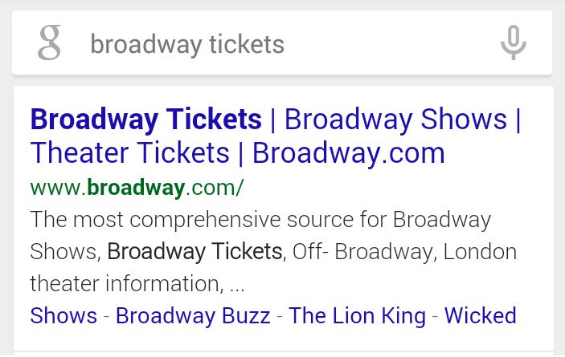

### SCRB（特殊なコンテンツのRB）の例

検索結果画面に表示されるのはWeb検索検索のRBだけではない。SCRB（特殊なコンテンツのRB）も表示されることがある。SCRBは検索結果画面の最上位に表示されることが多いが、必ずしも最上位に表示されるわけではない。

検索結果画面上で、直接ユーザーにコンテンツを提供する目的でSCRBはつくられている。ユーザーが瞬時にコンテンツを入手するため、検索結果画面上で利用できる計算機、再生可能な動画、操作可能な天気情報などが表示される。ページを開かずに情報を得ることができるため、ページの読み込みやクリック数を必要としない。

一部の**簡単知識**、**訪れる**、**行う**クエリでは、スマートフォン上の操作が楽になりSCRBは特に役に立つ。

**重要：**<!-- -->評価作業を行う時の前提として、インタラクティブ要素が適切に機能するものとして評価を行う。以下の点にも注意をする。

- リザルトブロックには、検索結果のスクリーンショットや、リンクだけを有効にした検索結果の画像が表示されます。残念ながら、画像内のインタラクティブ要素は機能しません。リザルトブロック内のボタン・タブ・その他の機能は動かないかもしれませんが、**評価タスクを行うときには、インタラクティブな要素が意図した通りに機能するものとして評価してください。**
- タスクの作成から皆さんが評価するまでに時間差があるので、SCRBの情報が数時間遅れていたり、全く現状に合っていなかったりすることがあります。株価や天気情報のSCRBはタイムリーな情報を提供するためのものですが、この時間差によって内容が不正確になっていることがあります。こうした場合、SCRBが現状に合っていないからといって評価を減算しないでください。**特記していない限り、リザルトブロックは現在の情報を表示していると仮定してください。**

**クエリ：**天気  
**ユーザーの所在地：**<!-- -->イリノイ州シカゴ  
**ユーザーの意図：**<!-- -->簡単知識クエリ。モバイルユーザーのニーズは「現在の天気・降水確率を知りたい」というシンプルなもの。ユーザー所在地付近の情報を求めている。  
**注意：**<!-- -->リザルトブロックには現時点の情報が表示されていると仮定して評価すること。.

**クエリ：**エマ・ストーン 映画  
**ユーザーの所在地：**<!-- -->アイオワ州デモワン  
**ユーザーの意図：**<!-- -->知識クエリ。エマ・ストーンが出演した映画を知りたい。  
**検索結果の説明：**<!-- -->ユーザーはRBから、エマ・ストーンが出演している映画を即座に知ることができ、個々の映画をクリックするとさらに詳しい情報を入手できる。スワイプ（横スクロール）することで、他の映画も表示できる。

**クエリ：**バナナのカロリー  
**ユーザーの所在地：**<!-- -->カリフォルニア州オークランド  
**ユーザーの意図：**<!-- -->簡単知識クエリ。バナナのカロリーを知りたい  
**注意：**<!-- -->下矢印をクリックすると、詳細が見られるようになっている

**クエリ：**野球 スコア  
**ユーザーの所在地：**<!-- -->カンザス州ウィチタ  
**ユーザーの意図：**<!-- -->知識クエリ。メジャーリーグの、現時点での点数を知りたい。

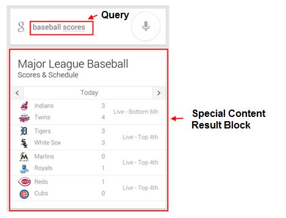

**クエリ：**coldplay fix you video  
**ユーザーの所在地：**<!-- -->ルイジアナ州ニューオリンズ  
**ユーザーの意図：**<!-- -->行うクエリ。Coldplayの「Fix You」という曲を聴きたい。  
**注意：**<!-- -->ユーザーはRBから、直接この曲を再生することや、リンクをクリックして詳しい情報を知ることができる。

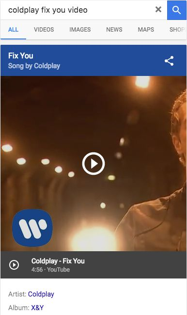

**クエリ：**一番背が高い木は  
**ユーザーの所在地：**<!-- -->アイオワ州ボイズ  
**ユーザーの意図：**<!-- -->簡単知識クエリ。一番背が高い木を知りたい。

### 「機能のRB」の例

ユーザーの**機能**にスマートフォンはユーザーの求める行動を返すことが出来る。**スマートフォン機能**クエリが「アプリを起動する」目的の場合は、ユーザーがアプリをインストールしていると仮定する。また、「アプリをダウンロードする」目的のクエリである場合は、アプリをインストールしていないと仮定する。

**クエリ：**開く アングリーバード  
**ユーザーの所在地：**<!-- -->アーカンザス州リトルロック  
**ユーザーの意図：**<!-- -->スマートフォン機能クエリ。アングリーバードを起動して、このゲームで遊びたい。  
**検索結果の説明：**<!-- -->RB内のリンクを開くと、アプリが起動する。

**クエリ：**amazon.comに行く  
**ユーザーの所在地：**<!-- -->カリフォルニア州グレンデル  
**ユーザーの意図：**<!-- -->スマートフォン機能クエリ。Amazon.comを訪問して利用したい。  
**検索結果の説明：**<!-- -->RB内のリンクをクリックすると、AmazonのWebサイトを訪問できる。

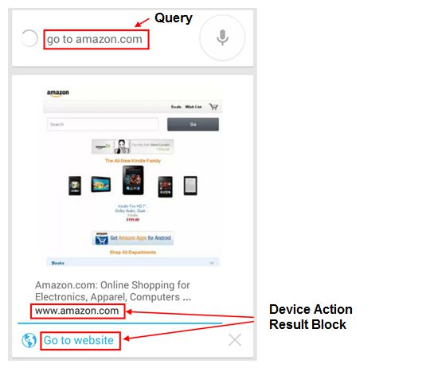

**クエリ：**午前5時にアラーム設定  
**ユーザーの所在地：**<!-- -->ワシントン州タコマ  
**ユーザーの意図：**<!-- -->スマートフォン機能クエリ。午前5時にアラームを設定したい。  
**検索結果の説明：**<!-- -->RBでは、午前5時にアラームを設定することができる。

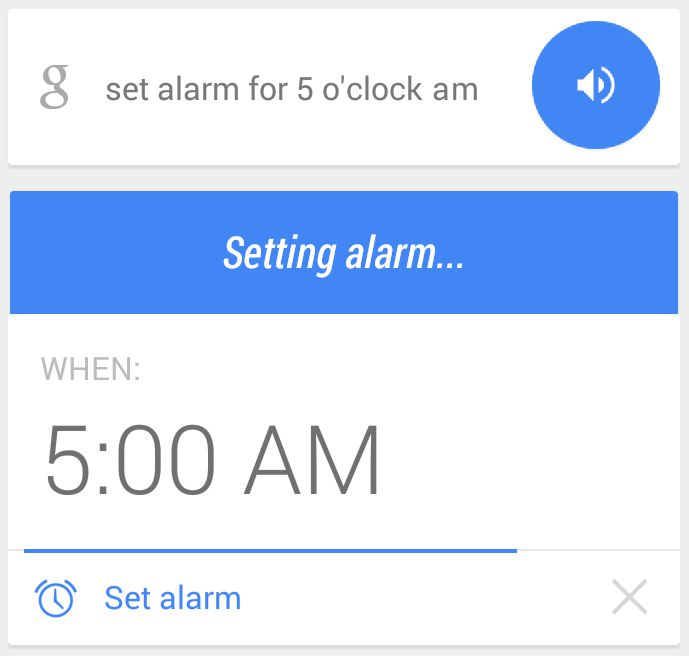

**クエリ：**母にテキストメッセージ  
**ユーザーの所在地：**<!-- -->ワシントン州タコマ  
**ユーザーの意図：**<!-- -->スマートフォン機能クエリ。「母」という連絡先にテキストメッセージを送りたい。  
**検索結果の説明：**<!-- -->RBでは、「母」という連絡先の、職場・携帯電話のどちらにメッセージを送るか選ぶことができる。

**クエリ：**best buyに電話  
**ユーザーの所在地：**<!-- -->カリフォルニア州マウンテンビュー  
**ユーザーの意図：**<!-- -->スマートフォン機能クエリ。最寄りのBest Buy店舗に電話したい。  
**検索結果の説明：**<!-- -->RBから、最寄りのBest Buy店舗に電話できる。

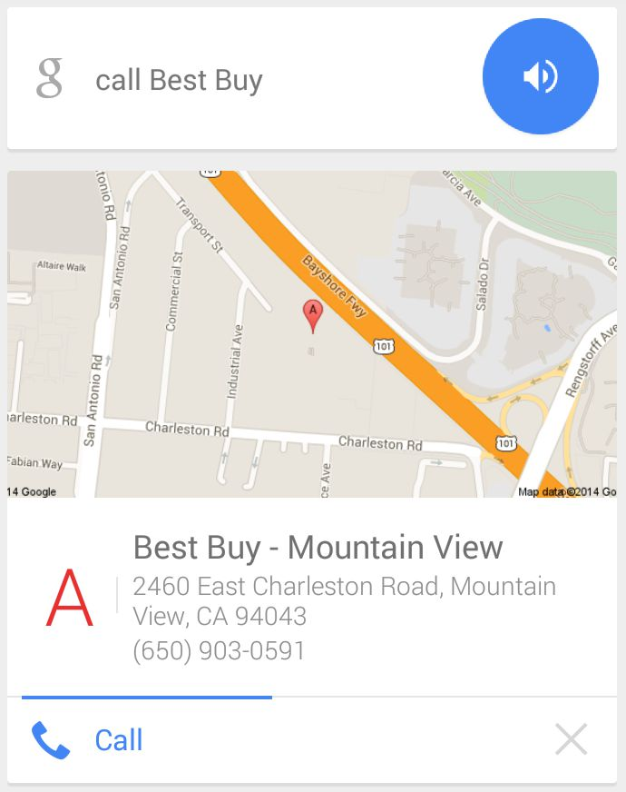

### 評価タスクでの「機能のRB」表示方法

**重要：**<!-- -->ユーザーがスマートフォン機能クエリを使うと、スマートフォンを操作することをユーザーは体験できる。評価者側に見えるものは、説明文のみである。例えばiPhoneユーザーが「Siri、お母さんに電話して」と言うと、実際に電話をかける画面がユーザー側には表示されるが、評価者側には電話をかけたという説明文しか見ることはできない。

この場合も、評価するときには、スマートフォンがアクションを実行できたと仮定して評価を行う。

以下は**スマートフォン機能**クエリと評価タスクで表示される説明文の一例をまとめたもの。

左は30分のタイマー設定というクエリに対してユーザーに表示される画面で、右は評価タスクに表示される説明文である。

説明文から、ユーザーがクエリを実行したのが13時48分で、アラームがちょうど30分後の14時18分に設定されたことがわかる。

左はFacebookアプリを開くというクエリに対してユーザーに表示される画面。「アプリを開いています……」というメッセージが表示され、アプリが起動する。

右は評価タスクに表示される説明文。説明文から、ユーザーのスマートフォンでFacebookアプリが起動したことがわかる。

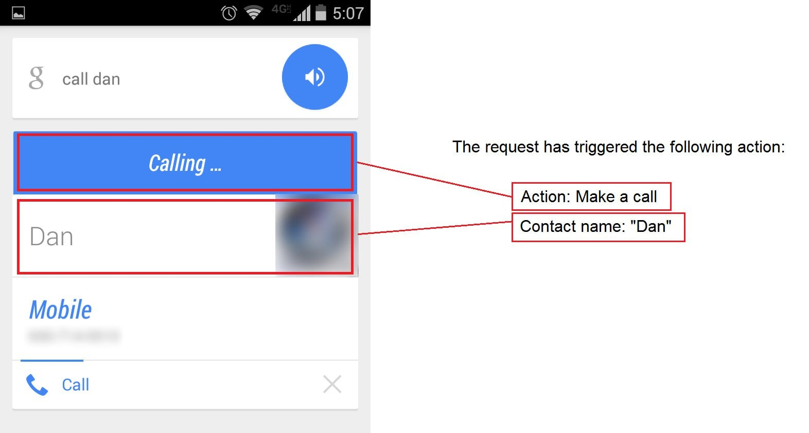

左はダンに電話というクエリに対してユーザーに表示される画面で、右は評価タスクに表示される説明文である。

ユーザーの目的は「ダン」という連絡先に連絡することであり、説明文から、ユーザーのスマートフォンがダンの電話番号と、電話をかけるためのボタンを表示したことがわかる。

一部の**スマートフォン機能**クエリでは、**スマートフォン機能**クエリに応答する前に選択するオプションのリストが表示される。次に、call targetというクエリの例を示す。ユーザーは、選択すべき領域内のターゲットストアのリストを表示する。

この例では、デバイスが実行した機能の結果は、ユーザーが選択した後に目的のターゲットストアを呼び出すことになる。

以下は、play adeleというクエリの例である。ユーザーには、「メディアを再生」と結果が表示される。この場合、ユーザーは音楽を再生したいので、表示される機能の結果は、クリックする「音楽を再生する」ボタンである。

このボタンをクリックすると、ユーザーが自分のデバイスに曲を持っている場合、指定した曲が再生される。そうでない場合は、結果ボックスをクリックすると、指定した曲をオンラインで聞くことができる。

## スマートフォンで評価を行う時の注意点

評価者自身が利用するスマートフォン・OS・ブラウザは各々異なるため、評価者ごとの利用体験が異なる点をGoogleは理解している。評価者は、いつもどおりに行動し、自身の体験に基づいて評価を行う。以下にスマートフォンでの評価を行う時の注意点を記載する。

- LPをスマートフォン上で開いた時に表示されるメッセージの対処法
  - 「Webページをブラウザで開くか、アプリで開くか」を選択するメッセージ：Webページを開いて評価を行う。ただし、端末側の設定が動でアプリに切り替わる（例：YouTubeの動画再生ではアプリを開く設定になっている）場合、アプリ体験に基づき評価を行う。スマートフォンの設定変更は不要。
  - 「モバイルページを開くか、デスクトップページを開くか」を選択するメッセージ：両者のLPが同じ場合、モバイルページから開く。一部、バイルページを開くと選択したURLのLPではなくモバイルサイトのトップページに転送されることがある。モバイルページのURLがデスクトップページと同じURLか確認を行う。
- PDFファイルは開いて確認する。利用している端末によって、PDFが開きにくいものもあるが、必ず確認する。
- 評価タスクをデスクトップで行うように指示されても、特記されていない限りはモバイルユーザー視点で評価を行う。
- You should assume queries were issued on a smartphone unless otherwise stated in the task or project-specific instructions.
