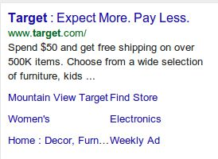
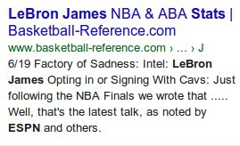
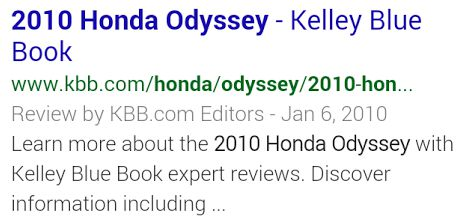
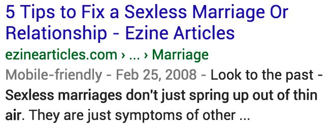
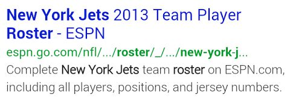
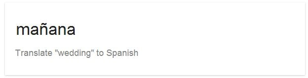

# Rating Using the Needs Met Scale

There are many different kinds of queries and results, but the process of rating is the same: **Needs Met rating tasks ask you to focus on mobile user needs and think about how helpful and satisfying the result is for the mobile users.**

This is what the Needs Met rating slider looks like:

## Needs Met Ratings

- **Fully Meets (FullyM)**  
A special rating category, which only applies to certain queries and results. All or almost all mobile users would be immediately and fully satisfied by the result and would not need to view other results to satisfy their need.
- **Highly Meets (HM)**  
Very helpful for many or most mobile users. Some users may wish to see additional results.
- **Moderately Meets (MM)**  
Helpful for many users OR very helpful for some mobile users. Some or many users may wish to see additional results.
- **Slightly Meets (SM)**  
Helpful for fewer mobile users. There is a connection between the query and the result, but not a strong or satisfying connection. Many or most users would wish to see additional results.
- **Fails to Meet (FailsM)**  
Completely fails to meet the needs of the mobile users. All or almost all users would wish to see additional results.

Please note that you may assign **in-between** ratings. Use in-between ratings if you think the rating of a result falls between two labels. You can either drag the slider or click on the point that you want the slider to land on.

## Rating Result Blocks: Block Content and Landing Pages

For Needs Met rating, you will assign a rating to each result. Each result includes the content inside the result block and landing pages associated with the result.

Which part of the result do you rate? It depends on both the query and the result block:

### Result Block Types

#### Special Content Result Block (SCRB)

Note: Assume that interactive result blocks function as intended. Try to interact with the result block as some links, buttons, or other features in your rating task may work.

**What to Rate:** The content inside this type of block should always play a large role in your rating. In addition, think about whether a user would click on the link(s) if available, in order to satisfy their user need.  

- If most users would not click, rate the Special Content Result Block based on the block content alone.
- If some or many users would click, you may consider the helpfulness of the landing page(s) in addition to the content in the block. In this case, both need to be helpful to justify a high rating.

#### Web Search Result Block

**What to Rate:** A click is required, and you should evaluate the landing page to assign a rating.

#### Device Action Result Block

**What to Rate:** Base your rating on the helpfulness of the action itself.

---

For example, think about the query what does love mean.

**Special Content Result Block**

Most users would probably not click on the Special Content Result Block, because the block contains a large amount of helpful content and has no obvious landing page link associated with it. Therefore, base your rating on the content inside the block itself.

**Web Search Result Block**

In this case, users would have to click on the web search result in order to get an answer to the question. Therefore, base your rating on the content of the landing page.

Here are some examples of Special Content Result Blocks where the block should be rated primarily on the content inside the block itself. As always, please use your judgment.

**Query:** utopia animal hospital

**Query:** chicago weather

**Query:** calories in a banana

**Query:** how to find security code on visa

**Query:** how did Lincoln die

**Query:** movies san francisco

## Fully Meets (FullyM)

**Fully Meets** is a special rating category, which can be used in the following situations:

- The query and user need must be specific, clear, and unambiguous.
- The result must be fully satisfying for mobile users, requiring minimal effort for users to immediately get or use what they are looking for.
- All or almost all users would be completely satisfied by the result—users issuing that query would not need additional results to fully satisfy the user intent.

In other words, the **Fully Meets** rating should be reserved for results that are the "complete and perfect response or answer" so that no other results are necessary for all or almost all users to be fully satisfied.

You will need to use your judgment to decide whether a result block can **Fully Meet** the user need. Here are some scenarios when the **Fully Meets** rating is appropriate:

- The user is clearly looking for a specific webpage or website and the result block with the specific webpage or website **Fully Meets** the user's need.
- The user is trying to complete a device action and the result block accomplishes the desired request.
- The user is looking for a very specific fact or piece of information and the result block provides the information immediately, thoroughly, accurately, and clearly. No other results would be needed. Before using the **Fully Meets** rating for queries seeking a very specific fact or piece of information, you must check for accuracy and confirm that the information is supported by expert consensus where such consensus exists.

**Fully Meets** may apply in other situations as well. Ask yourself whether the result block alone is the perfect and complete result that would fully satisfy all or almost all users. Be conservative when using the **Fully Meets** rating. When in doubt, consider a lower rating.

Note: If a result block is very close to being fully satisfying, but the block alone may not be sufficient in order to fully satisfy all or almost all users, a rating of **Highly Meets+** may be appropriate.*

Sometimes you have to think about how specific the user need is and will need to make a judgment call on whether it is specific enough to possibly have a **Fully Meets** rating.

### Examples of Fully Meets (FullyM) Result Blocks

**Query:** amazon.com  
**User Location:** Austin, Texas  
**User Intent:** Go to amazon.com.

**What you might see in the rating task:**  
Action: Open a specific webpage  
URL: http://www.amazon.com/

Website Name: Amazon.com:  
Online Shopping for Electronics, Apparel, Computers...  

The query has clear intent to go to amazon.com and the phone is opening the specified website.

**Query:** amazon  
**User Location:** Austin, Texas  
**User Intent:** Go to the Amazon website.

The query has clear intent to go to the amazon.com website. While there may be other interpretations for the query, the dominant one is by far the website.

**Query:** target website  
**User Location:** Jacksonville, Florida  
**User Intent:** Go to the Target website.

The query has clear intent to go to target.com.

**Query:** shop nordstrom online  
**User Location:** Monterey, California  
**User Intent:** Go to the Nordstrom website for online shopping.

The query has clear intent to go to the Nordstrom website.

**Query:** titanic imdb  
**User Location:** Lexington, Kentucky  
**User Intent:** Go to the IMDb page for Titanic.

The query has clear intent to go to the IMDb page for Titanic.

**Query:** www.yahoo.c0m  
**User Location:** Denver, Colorado  
**User Intent:** Go to the Yahoo website.

Even though this is an imperfect URL query, it's clear the user wants to go to the Yahoo website.

**Query:** cnn health  
**User Location:** Annapolis, Maryland  
**User Intent:** Go to the Health section of cnn.com.

The query has clear intent to go to the Health section of the cnn.com webpage.

**Query:** cnn  
**User Location:** Annapolis, Maryland  
**User Intent:** Go to the CNN website.

The query has clear intent to access CNN news and content. The website has the content the user is searching for, and fully satisfies the user intent.

**Query:** yelp  
**User Location:** Raleigh, North Carolina  
**User Intent:** Open the Yelp app or go to the website at yelp.com.

This result **Fully Meets** the user need whether they want the Yelp app or the Yelp website, which are both popular.

Note: If you see this kind of result, assume that the user has the app installed on their phone.

Clicking on the Yelp link above the logo opens the app directly, and clicking on the "Open on yelp.com" link gives the option of opening the app or website.

**Query:** lebron james stats basketball- reference.com  
**User Location:** Miami, Florida  
**User Intent:** Go to the player statistics page for LeBron James on a specific website.

The query has clear intent to go to the player statistics page for LeBron James on a specific website, basketball-reference.com.

**Query:** open instagram  
**User Location:** Laguna Beach, California  
**User Intent:** Open the Instagram app on the user's device.

**What the user sees:**  

**What you might see in the rating task:**  
Action: Open an app  
App: Instagram  

This **Device Action** query is clear and specific: the user wants to open the Instagram app. The result block shows the phone in the process of opening the specified app—it **Fully Meets** the user need.

**Query:** open bing search app  
**User Location:** Dallas, Texas  
**User Intent:** Open the Bing Search app on the user's device.

The result block shows that the phone has detected that the app is not installed and gives the option of downloading the app. This result **Fully Meets** the user need.

**Query:** open facebook app  
**User Location:** Richmond, Virginia  
**User Intent:** Open the Facebook app on the user's device.  

**What the user sees:**  

**What you might see in the rating task:**  
Action: Open an app  
App: Facebook  

This Device Action query is clear and specific: the user wants to open the Facebook app. The result block shows the phone's confirmation that it is opening the app—it Fully Meets the user need.

**Query:** set alarm for 5 o'clock am  
**User Location:** Tacoma, Washington  
**User Intent:** Set the device's alarm to go off at 5:00 AM.  

**What the user sees:**  

**What you might see in the rating task:**  
Action: Set alarm  
Alarm Time: 5:00 AM  

This Device Action query is clear and specific: the user wants to set the phone's alarm clock for 5:00 AM. The result block shows the phone in the process of setting the alarm at the specified time—it Fully Meets the user need.

**Query:** chef chu phone number  
**User Location:** Los Altos, California  
**User Intent:** Find the phone number for the restaurant called Chef Chu's.

Chef Chu's is a Chinese restaurant located in the user location. This result block immediately shows the correct phone number with the option to call the number directly on the device—it **Fully Meets** the user intent.

Note: You must check for accuracy before using the **Fully Meets** rating. You can verify that the phone number in this SCRB is correct by checking Chef Chu's official website.*

**Query:** call best buy  
**User Location:** Mountain View, California  
**User Intent:** Call the nearest Best Buy store. Note that there is only one Best Buy store located in Mountain View.  

**What the user sees:**  

**What you might see in the rating task:**  
Action: Make a call  
Business Name: Best Buy  
Location: 2460 E Charleston Rd, Mountain View, CA 94043  
Phone number: (650) 903-0591  
This **Device Action** query is clear and specific: the user wants to call the nearest Best Buy store. The result block shows the phone in the process of calling the store with the correct phone number—it **Fully Meets** the user need.

Note: You must check for accuracy before using the **Fully Meets** rating. You can verify that the phone number in this Device Action block is correct by checking Best Buy's official website for the location in Mountain View.

**Query:** open map of italy  
**User Location:** Baltimore, Maryland  
**User Intent:** Open a map of Italy on the user's device.  

**What the user sees:**  

**What you might see in the rating task:**  
Action: Open map  
Location: Italy  

This Device Action query is clear and specific: the user wants to see a map of Italy. The result block shows a map with a link to open it in Google Maps—it Fully Meets the user need.

**Query:** navigate to yosemite national park  
**User Location:** Seattle, Washington  
**User Intent:** Navigate to Yosemite National Park from the user's location.  

**What the user sees:**  

**What you might see in the rating task:**  
Action: Navigation  
Destination: Yosemite National Park  
Destination Address: Yosemite Village, CA 95389  

This **Device Action** query is clear and specific: the user wants to navigate to Yosemite National Park. The result block shows the phone in the process of opening up the Navigation app, which will give the user turn-by-turn directions from the user's locationーit **Fully Meets** the user need.

**Query:** how to find security code on visa  
**User Location:** Chicago, Illinois  
**User Intent:** Find out how to locate the security code on a Visa card.

The result block displays the complete and correct answer prominently in the result block, in a way that is easy for users on mobile devices to read. The block also includes an image showing users exactly where to find the code, and the block Fully Meets the user need.

**Query:** starbucks stock price  
**User Location:** Alexandria, Virginia  
**User Intent:** Find the current stock price for Starbucks.

The result block displays the complete and correct answer prominently in the result block, in a way that is easy for users on mobile devices to read—it Fully Meets the user need.

Note: Assume that the result shows current information for users.

**Query:** new york city population 2012  
**User Location:** Pasadena, California  
**User Intent:** Find the population of New York City back in 2012.

The result block displays the complete and correct answer prominently in the result block, in a way that is easy for users on mobile devices to read—it Fully Meets the user need.

**Query:** what is the weather forecast for today  
**User Location:** Mountain View, California  
**User Intent:** Find weather forecast information for the current day in Mountain View, California.

The result block displays the complete and correct answer prominently in the result block, in a way that is easy for users on mobile devices to read—it **Fully Meets** the user need.  
Remember that we consider weather queries, like this one, to be a **Know Simple** query for mobile phone users.

Note: Assume the result shows current information for users.

**Query:** london time  
**User Location:** New York, New York  
**User Intent:** Find the current time in London.

The result block displays the complete and correct answer prominently in the result block, in a way that is easy for users on mobile devices to read—it **Fully Meets** the user need.

Note: Assume that the result shows current information for users.

**Query:** who is the chancellor of germany  
**User Location:** New York, New York  
**User Intent:** Find the name of the current Chancellor of Germany.

The result block displays the complete and correct answer prominently in the result block, in a way that is easy for users on mobile devices to read—it **Fully Meets** the user need.

**Query:** chevron at shoreline and middlefield  
**User Location:** Mountain View, California  
**User Intent:** Find the specific gas station specified by the user in order to visit the location in person.

The intent is to visit the specific gas station specified by the user. This result block is for the specified Chevron location, with information to visit this location in person.

**Query:** decemberists crane wife 3 lyrics  
**User Location:** Long Beach, California  
**User Intent:** See the lyrics to The Decemberists song called "Crane Wife 3."

The result has exactly what the user wants, displaying the lyrics to the specified song clearly and completely inside the result block. The user does not need to click to a new page to see the complete lyrics for this song.

Note: The lyrics posted on Google Play are licensed.

**Query:** gas stations near me  
**User Location:** Mountain View, California  
**User Intent:** Find gas stations near the user location. Note that this may be an urgent query

The intent is to find gas stations near the specific user location, represented by the blue dot on the map.  
This result block has a very satisfying list of nearby, popular, and prominent options within one mile of the specific location. This kind of block is especially helpful for users who want to visit the business in person.  
This result would be very convenient for mobile users who need gas immediately, especially for those who are driving and cannot easily use their phone.

Note: A range is included because some users would be fully satisfied with these selections, while some users would want more information (e.g., gas prices, hours, distance from location, longer list of options).

**Query:** nearby coffee shops  
**User Location:** Mountain View, California  
**User Intent:** Find coffee shops near the user location.

The intent is to find coffee shops near the specific user location, represented by the blue dot on the map.  
This result block has a very satisfying list of nearby, popular, and prominent options within a few miles of the specific location. This kind of block is especially helpful for users who want to visit the business in person. Note that these blocks are interactive—clicking on a coffee shop will give options to call the business, get directions, read reviews, etc.

Note: A range is included because some users would be fully satisfied with these selections, while some users would want more information (e.g., hours, distance from location, longer list of options).

**Query:** 1600 pennsylvania ave washington dc  
**User Location:** Waterford, California  
**User Intent:** Find a map, directions, information about what is located at this address, etc

This block contains a map with the queried address, link to get directions, and specifies the landmark at the well-known address on the map ("The White House").  
It's not unusual to search for an address (or business) that is far from the user location. Here, the user has explicitly asked for a specific address in a far away place, and this result is very satisfying. For a query this specific, the user location does not change the rating.

Note: A range is included because some users would be fully satisfied with this result, while some users would want more information (e.g., photos, a brief description).

**Query:** metro center station  
**User Location:** Adams Morgan, Washington D.C.  
**User Intent:** The user wants to see a map, schedule, transfer options, and/or other train information for the Metro Center station, given that the user is close to the queried station

This block contains a map, link to get directions, departure times for the multiple train lines that operate at this station, link to a detailed schedule (i.e., the "Departure board"), and an option to see more information.

Since the user is located in the same city as the station, the information in this block is highly satisfying.

Note: A range is included because some users would be fully satisfied with this result, while some users may want more information (e.g., nearby attractions, ticket prices).

### Examples of Queries that Cannot Have Fully Meets Results

There are some queries that *cannot* have a **Fully Meets** result. Here are some examples.

- **Broad queries where no single result could fully satisfy all users**  
  - Example: knitting  
    This is a broad informational query. Knitting is an activity anyone can do and that anyone can create a website for. Different users may want different types of content: videos, instructions, patterns, etc. There is no one official source for knitting information and no one result could satisfy most users. Therefore, no Fully Meets result is possible for this query.
  - Famous names. Example: barack obama  
    This is a broad informational query and it is impossible to know exactly what the user is looking for.
- **Ambiguous queries without a clear user intent or dominant interpretation**  
  - Example: ada  
    There is no dominant interpretation for this query. The following entities are all common interpretations: Americans with Disabilities Act, American Dental Association, and American Diabetes Association. While each interpretation has an official homepage, none is Fully Meets since there is no dominant interpretation.
  - Non-famous people names. Example: sam wen  
    Queries for people's names can be tricky. Many or most people queries do not have a dominant interpretation. Even unusual sounding name queries may not have a dominant interpretation. For example, the queries sam wen, tran nguyen, and david mease can have no Fully Meets result because there are multiple people with each of these names, and it is not clear that most users are looking for any one particular individual.

## Highly Meets (HM)

A rating of **Highly Meets** is assigned to results that meet the needs of many or most users. **Highly Meets** results are highly satisfying and a good "fit" for the query. In addition, they often have some or all of the following characteristics: high quality, authoritative, entertaining, and/or recent (e.g., breaking news on a topic).

In order to receive a **Highly Meets** rating, information pages such as encyclopedia articles and news articles must be accurate and highly credible. **Highly Meets** medical and scientific information pages must represent well-established scientific/medical consensus unless the user is clearly seeking an alternative viewpoint. For all information pages, you must check for accuracy and confirm that the information is supported by expert consensus where such consensus exists.

A query can have many **Highly Meets** results.

Have high standards for the **Highly Meets** rating. This is especially important for queries with many on-topic results.

### Examples of Highly Meets (HM) Result Blocks

**Query:** trader joes  
**User Location:** Charlotte, North Carolina  
**User Intent:** There are two possible user intents: most users probably want to visit a nearby location or go to the website.

This result shows a complete list of all three locations in the Charlotte area, with information that is especially helpful for users who want to visit the store.

Note: This result block is not Fully Meets because users who want to go to the website to see coupons, promotions, etc. would have to see additional results.

**Query:** trader joes  
**User Location:** Charlotte, North Carolina  
**User Intent:** There are two possible user intents: most users probably want to visit a nearby location or go to the website.

This is the official website for Trader Joe's, which has highly authoritative information on the businesses' stores, promotions, recipes, news, etc.

Note: This result block is not Fully Meets because users who want information to visit the store have to do a bit of work to find that information—it is not immediately available.

**Query:** museum of modern art  
**User Location:** Manhattan, New York  
**User Intent:** There are two possible user intents: most users probably want to visit the museum (note that the user is located in NYC where the museum is located) or go to the website

This is the museum's official website and has very helpful information about exhibits, membership, the store, etc.

Note: This result block is not Fully Meets because users who want information to visit the museum have to do a bit of work to find that information—it is not immediately available.

**Query:** museum of modern art  
**User Location:** Manhattan, New York  
**User Intent:** There are two possible user intents: most users probably want to visit the museum (note that the user is located in NYC where the museum is located) or go to the website

The result block shows information about the museum, and is especially helpful for users who want to visit the museum.

Note: This result block is not Fully Meets— even though there is a website link,it is not very satisfying for users who want to go to the website because it is not as informative as a web search result block with a title, snippet, and URL.

**Query:** prestige bmw  
**User Location:** Ramsey, New Jersey  
**User Intent:** There are two possible user intents: most users probably want to visit the car dealership or go to the website.

The query is the name of a car dealership in New Jersey, which is the only dealership with that name in the user location (Ramsey, New Jersey). The result block shows information about the dealership, and is especially helpful for users who want to visit the business.

Note: This result block is not Fully Meets— even though there is a website link,it is not very satisfying for users who want to go to the website because it is not as informative as a web search result block with a title, snippet, and URL.

**Query:** prestige bmw  
**User Location:** Ramsey, New Jersey  
**User Intent:** There are two possible user intents: most users probably want to visit the car dealership or go to the website.

This is the car dealership's official website and has very helpful information about inventory, financing, etc.

Note: This result block is not Fully Meets because users who want information to visit the dealership have to do a bit of work to find that information—it is not immediately available.

**Query:** belmont library  
**User Location:** Belmont, Massachusetts  
**User Intent:** Find information about this library or go to the website.

There is only one library in the user location (Belmont, Massachusetts). The result block shows information about the library, and is especially helpful for users who want to visit the location.

Note: This result block is not Fully Meets— even though there is a website link,it is not very satisfying for users who want to go to the website because it is not as informative as a web search result block with a title, snippet, and URL.

**Query:** belmont library  
**User Location:** Belmont, California  
**User Intent:** Find information about this library or go to the website.

There is only one library in the user location (Belmont, California). The result block shows information about the library, and is especially helpful for users who want to visit the location.

Note: This result block is not Fully Meets— even though there is a website link,it is not very satisfying for users who want to go to the website because it is not as informative as a web search result block with a title, snippet, and URL.

**Query:** decemberists  
**User Location:** Long Beach, California  
**User Intent:** Learn more about the band, The Decemberists.

The user intent is too broad to have a Fully Meets result. However, this is The Decemberists' official website and has a lot of content including tour dates, music videos, the latest album, etc. The result is uniquely authoritative and most users would be very satisfied by this website.

**Query:** celine dion  
**User Location:** Bellevue, Washington  
**User Intent:** Learn more about the singer Celine Dion.

The user intent is too broad to have a Fully Meets result. However, this is Celine Dion's official website and has a lot of content including recent news, show information, music, photos, videos, etc. The result is uniquely authoritative and most users would be very satisfied by this website.

**Query:** fear the walking dead  
**User Location:** Mountain View, California  
**User Intent:** Find information about the TV show (e.g., show summary, episode guide, cast information, streaming options, etc.).

The user intent is too broad to have a Fully Meets result, and different users may be looking for different things.  

This interactive block has a large amount of helpful content for a TV show including a summary, episode and cast information, etc.—this result would be very helpful for many or most users.

**Query:** manresa reviews  
**User Location:** San Jose, California  
**User Intent:** Find reviews for this restaurant located in Los Gatos, California.

The LP for this web result has 127 reviews for the restaurant, and is easy to use on a mobile phone. The first three reviews show automatically, and then you can click to see more. This result would be very helpful for many or most users.

**Query:** who is the chancellor of germany  
**User Location:** New York, New York  
**User Intent:** The user wants to find the name of the current Chancellor of Germany.

This is a specific Know Simple query for the name of the current Chancellor of Germany. While the answer is in the description of the web result, it is not displayed prominently in a way that is very easy for mobile users to read.

**Query:** broadway tickets  
**User Location:** New York, New York  
**User Intent:** Research prices and/or purchase tickets to a Broadway show.

The LP for this web result offers many Broadway tickets for sale, from a highly trustworthy source. While you have to zoom in and scroll to navigate the site, this result would be very helpful for many or most users because it is so highly trustworthy.

**Query:** kids backpacks  
**User Location:** New York, New York  
**User Intent:** Research prices and/or purchase backpacks for kids.

The LP for this mobile-friendly web result offers many kids backpacks for sale. The company is well-known for manufacturing and selling high quality backpacks for kids of different ages. There is a lot of product information and many user reviews for each backpack, in addition to filter options that are easy to use on a phone. This result would be very helpful for many or most users.

**Query:** poison ivy  
**User Location:** Atlanta, Georgia  
**User Intent:** Find pictures of poison ivy plants, information about how to treat poison ivy, etc.

The LP for this mobile-friendly web result is part of an authoritative government website and provides a lot of helpful information about poison ivy. This result would be very helpful for many or most users. A few or some users may wish to see additional results.

**Query:** michael jordan  
**User Location:** Boston, Massachusetts  
**User Intent:** Find information, news, images, etc. about Michael Jordan.

The LP of this web result is a mobile-friendly Wikipedia article about Michael Jordan. This result would be helpful for many or most users.

**Query:** dance video  
**User Location:** New York, New York  
**User Intent:** Find a dance video to watch.

Users are looking for good or entertaining dance videos and there are many options online.  

There are many on-topic results for this query and this is one very popular video of a comedian demonstrating dance styles from previous decades.

**Query:** trestle bridge  
**User Location:** Colorado Springs, Colorado  
**User Intent:** The user wants to understand what a trestle bridge is or learn more information about them (e.g., what it looks like, how they are built, types of materials, well-known examples, etc.).

Seeing images of trestle bridges is very helpful in understanding this type of bridge. In this case, "a picture is worth a thousand words," meaning that a picture may be more helpful than a text description due to the unique design of the bridge.

**Query:** purple coneflowers  
**User Location:** New York, New York  
**User Intent:** Find images of or information about purple coneflowers.

This block contains many helpful images, and the landing page shows even more images—it Highly Meets the user intent.

**Query:** invasive species  
**User Location:** St. Louis, Missouri  
**User Intent:** Find more information about invasive species.

The result block has a good summary of what invasive species are, but some users would probably want to see more information like examples, impact, etc.

**Query:** turmeric  
**User Location:** Sunnyvale, California  
**User Intent:** Find information about the spice or the restaurant in Sunnyvale.

For users in Sunnyvale, California, the query turmeric could have two different interpretations: a popular restaurant named Turmeric or the spice turmeric. Because the user is located in Sunnyvale, many mobile users are probably looking for the restaurant. However, it is not completely clear because some users may want to find information about the spice. This result about the restaurant has satisfying information for users who want to visit —it Highly Meets the most likely user need.

**Query:** how to get from seattle to xpppzyfii  
**User Location:** Seattle, Washington  
**User Intent:** Get directions from Seattle to another place. Note that the location in the query ("xpppzyfii") is garbled and it is impossible to know what the user wanted. (The name was likely mistyped or mistranscribed from a voice query.)

Even though the user has to re-enter the destination, the result block recognizes that the user was asking for directions from Seattle. The user has to enter the destination manually because the name in the query ("xpppzyfii") is so garbled that there is no good guess as to what the user meant.  

Therefore, this block is satisfying because it helps the user correct the request and then immediately get the desired directions.

**Query:** kristen wiig  
**User Location:** New York, New York  
**User Intent:** Find more information about the actress, comedian, writer, and producer

This is a fan site dedicated to Kristen Wiig. The website has comprehensive info including over 50,000 pictures and 300 video clips, interviews, articles, and more. This website Highly Meets the need of many or most users.

**Query:** greek alphabet  
**User Location:** Albany, New York  
**User Intent:** Find historical information about the Greek alphabet, the names of the letters in the Greek alphabet, images of the letters, etc.

This is a broad query. Different users may be looking for different things.  

This result shows multiple tables of images with the letters in the Greek alphabet. This result would be helpful for many users. Some users may wish to see additional results.

**Query:** jennifer aniston  
**User Location:** Dover, Delaware  
**User Intent:** Find images, recent news, gossip, information, etc. about Jennifer Aniston

This is a broad query for an actress. Different users may be looking for different things.  

This result shows recent news about Jennifer Aniston. The articles are timely (at the time this was written) and relatively interesting, and not just common everyday news about the actress. Many users would be satisfied with the result and some users may wish to see more results.

**Query:** seattle, washington  
**User Location:** Arlington, Texas  
**User Intent:** Find information, news, maps, etc. related to Seattle, Washington.

This is a broad query for a city. Different users may be looking for different things.  

The result contains a wide variety of helpful information such as a map, weather information, several points of interest, and has an option to see more information containing nearby events and facts about the city. Moderately Meets+ to Highly Meets is an appropriate rating for this result.

**Query:** emily blunt  
**User Location:** Portland, Oregon  
**User Intent:** Find biographical information(e.g., filmography) or current news/celebrity gossip about Emily Blunt.

This is a broad query for an actress. Different users may be looking for different things.  

The result contains a variety of helpful information such as images, brief biography, recent movies, and an option to see more. Moderately Meets+ to Highly Meets is an appropriate rating for this result.

**Query:** coldplay yellow lyrics  
**User Location:** Billings, Montana  
**User Intent:** Find the lyrics to the song "Yellow", which was written by the band Coldplay

This page provides the requested lyrics on Coldplay's official website. Users can also navigate around the site to listen to the song, explore all albums the song appears on, listen to or view lyrics for other songs on the same album, or learn more about the artist overall.  

Additionally, users can trust that the lyrics on the LP are 100% accurate due to the uniquely authoritative nature of the source, which makes this result very helpful for many or most users.

**Query:** 1969 moon landing  
**User Location:** New Haven, Connecticut  
**User Intent:** Find accurate and authoritative information about this historical event

The LP for this web result contains authoritative information about the Apollo 11 moon landing on the official website of NASA, which was the organization that oversaw this mission in 1969. The MC has a lot of helpful information and content, including a detailed summary, video footage, and images of the moon landing that users can view and explore. This result would be very helpful for many or most users.

**Query:** stem education  
**User Location:** Memphis, Tennessee  
**User Intent:** Find information or recent news about education in STEM fields (i.e., Science, Technology, Engineering, and Mathematics).

This is an informational query on a fairly broad topic. Different users may be looking for different things, yet accuracy and credibility of the source are important.  

This LP is a news article published on a reputable news website. The MC of the article covers recent efforts to reform STEM education in the U.S., and it includes citations from expert sources. This result would be helpful for many or most users.

**Query:** mentos and coke death  
**User Location:** Las Vegas, Nevada  
**User Intent:** Find accurate information about a rumor that a mixture of Mentos and Coca-Cola can cause death, which was spread on the Internet in 2006.

This LP is on a well-known fact-checking and debunking website. The page calls this story "False", then provides a credible explanation of how the authors came to that conclusion, including history of similar urban legends. This result would be very helpful for users seeking to verify the credibility of this rumor.

**Query:** pj fleck  
**User Location:** Minneapolis, Minnesota  
**User Intent:** Find information or recent news about P.J. Fleck, who had just become the new head football coach at the University of Minnesota a few days before this example was written

This LP is an opinion piece written by the Editorial Board of the largest newspaper in the U.S. state of Minnesota. The MC of the article expresses well-informed opinions about Fleck's upcoming tenure as head coach, and it would likely be of interest to many or most users when this query was issued.

**Query:** batman lego movie review  
**User Location:** Orlando, Florida  
**User Intent:** Find reviews of the 2017 film _The LEGO Batman Movie_ on credible news or entertainment sources.

This LP is an in-depth review of the queried movie by a film critic at a reputable newspaper. This result would be very helpful for many or most users.

## Moderately Meets (MM)

A rating of **Moderately Meets** is assigned to results that are helpful and satisfying for many users or very satisfying for some users.

**Moderately Meets** results have fewer valuable attributes than **Highly Meets** results. **Moderately Meets** results should still "fit" the query, but they might be less comprehensive, less up-to-date, come from a less authoritative source, etc.

**Moderately Meets** results are not low quality, out-of-date, or inaccurate. **Moderately Meets** results are generally average to good.

### Examples of Moderately Meets (MM) Result Blocks

**Query:** shutterfly  
**User Location:** Boise, Idaho  
**User Intent:** Go to the Shutterfly website or find information about the company.

The LP for this web result is a high-quality page on crunchbase.com—a member site on the TechCrunch network—with a profile of Shutterfly. The MC has a lot of helpful and accurate information about the company and is easy to read on a mobile device. This result would be helpful for many users or very helpful for some.

**Query:** tom cruise  
**User Location:** Scottsdale, Arizona  
**User Intent:** Find biographical information or current news/celebrity gossip about Tom Cruise

The LP for this web result contains information about Tom Cruise, which would be helpful for many users or very helpful for some users. The photos and main links can easily be accessed on a phone.  

Note that there are many, many pages about Tom Cruise and this result is not helpful enough for a rating of Highly Meets.

**Query:** seattle, washington  
**User Location:** Denver, Colorado  
**User Intent:** Find information, news, maps, etc. related to Seattle, Washington.

This is a broad query for a city. Different users may be looking for different things.  

The result shows a map of Seattle, Washington and clicking on the map brings up a more detailed map. This result may be helpful for some users.

**Query:** city of angels  
**User Location:** Los Angeles, California  
**User Intent:** Find information about the movie, song, musical, school, or some other entity by this name.

This result reflects one of several possible user intents, as the query is also the name of a movie, song, musical, and more. However, since the user location is near the school, this result would be very helpful for some users—specifically, users who are looking for the school.

**Query:** youtube  
**User Location:** Tucson, Arizona  
**User Intent:** Go to the YouTube website.

This is a result to download one of the YouTube apps. Mobile users want answers and results right away and may not be able to spend a lot of time downloading and installing apps. It is possible that users want one of the YouTube apps, but it is probably not the dominant intent for mobile users on the go.

**Query:** nicaraguan money  
**User Location:** Miami, Florida  
**User Intent:** Find out what Nicaraguan currency is called, what it looks like, the exchange rate, etc.

This result displays the name of Nicaraguan currency. Some users may have their need met by learning the name of the currency, but many users may want images, know the exchange rate, etc. This result would be helpful for many users or very helpful for some users.

**Query:** where is virginia in the us  
**User Location:** Louisville, Kentucky  
**User Intent:** Find where the state of Virginia is located in the U.S.

The description in this result block may be helpful for users who are already familiar with this area in the United States. Many or most users would probably want to see a map or a clearer description.

**Query:** every breath you take lyrics  
**User Location:** Fort Davis, Texas  
**User Intent:** Find the lyrics to the song "Every Breath You Take," which was written by Sting

The LP for this lyrics website page has the requested lyrics. There are many lyrics websites on the web and many pages are not 100% accurate. **Moderately Meets** is an appropriate rating for average pages with the requested lyrics.

**Query:** kristen wiig  
**User Location:** New York, New York  
**User Intent:** Find more information about the actress, comedian, writer, and producer

This is Kristen Wiig's official website, but the only content is links to her talent and PR agencies, along with a note that says she is not on any social networking sites. While this information is helpful, many users would want to see more.

## Slightly Meets (SM)

A rating of **Slightly Meets** is assigned to results that are helpful and satisfying for some or few users. **Slightly Meets** results may serve a minor interpretation, be low quality, have stale or outdated information, have some minor inaccuracies, be too specific, too broad, too niche for the general user population considering the query, etc. to receive a higher rating.

**Important note:** On mobile phones, the "cost of a click" is high. Many users decide which result to click or tap on based on the title of the web result on the search results page. (Note that these titles usually come from webpages.) A result with a very misleading or exaggerated title should be rated **Slightly Meets** or lower, due to the poor user experience that occurs when the landing page does not match the expectation of the user when clicking or tapping on the result.

### Examples of Slightly Meets (SM) Result Blocks

**Query:** britney spears  
**User Location:** Baltimore, Maryland  
**User Intent:** Find information about Britney Spears (e.g., current news, pictures).

The LP of this mobile-friendly web result has a 2006 article about Britney Spears filing for divorce. This is very old, stale news, making the result helpful for few users.

**Query:** honda odyssey  
**User Location:** Miami, Florida  
**User Intent:** We will assume that users are interested in the current Honda Odyssey model, unless specified otherwise.

Although the LP has comprehensive information from a reputable source, and is easy to use on a mobile device, the information is about the 2010 Honda Odyssey. This information would be considered stale for the query today, making this result helpful for some or few users.

**Query:** hot dog  
**User Location:** Sunnyvale, California  
**User Intent:** Find information about hot dogs, such as recipes or nutrition information

The LP of this web result is about the movie "Hot Dog," which came out in 1984 and is a minor interpretation of this query. Because this is an unlikely interpretation, this web result would be helpful for few users, even though the landing page has good content from a reputable source, and is easy to use on a mobile device.

**Query:** motorcycles  
**User Location:** Potsdam, New York  
**User Intent:** Find information about motorcycles.

This result provides contact information for one of the two motorcycle shops in Potsdam, New York. It is possible this would be helpful for some users, but many users would be looking for information. Additionally, there is distracting information (a listing for an insurance agent).

**Query:** abe lincoln's birthday  
**User Location:** Fort Davis, Texas  
**User Intent:** Find this specific piece of information.

This is a Wikipedia page that has birthdays for all U.S. presidents, including Abraham Lincoln. However, his birthday is not prominently displayed and it is not obvious that the answer is there—users have to do some work and search around on the page to find the answer, making SM to SM+ an appropriate rating.

**Query:** lack of sex and problems with my marriage  
**User Location:** Waco, Texas  
**User Intent:** Find help for marital issues.

The quality of writing in this article, which was created by a person without expertise in marriage or relationship counseling, is poor. Even though the article is about the query, the page is low quality and untrustworthy. It would be helpful for few users.

**Query:** nail spa  
**User Location:** San Jose, California  
**User Intent:** Find a nail spa in or near San Jose.

Burke Williams is a day spa that offers many treatments like massage therapy, skin care, etc. While it does have nail care options, it is not a dedicated nail spa.

**Query:** what type of sharks live in rivers  
**User Location:** Tucson, Arizona  
**User Intent:** Find information about what types of sharks live in rivers.

This result block does not contain enough information to be fully satisfying and mentions only one type of shark. Most users would need to do further research.

**Query:** 210 area code  
**User Location:** Austin, Texas  
**User Intent:** Find what area uses the 210 area code for phone numbers.

The answer in this result block is really confusing. Even if users can figure it out, they would likely still have to click on the link, or go to another website, to confirm the information.  

While there is a map, you would have to expand or click on it to see the details, so it is not that helpful.

**Query:** ibm  
**User Location:** Rockville, Maryland  
**User Intent:** Go to the IBM website or find information about the company.

This block contains images of the logo for IBM, but these images are not particularly helpful for this query.

**Query:** where is nibiru  
**User Location:** Oklahoma City, Oklahoma  
**User Intent:** Find the location of "Nibiru", which was a fictional planet in the movie _Star Trek Into Darkness_, as well as a pseudoscientific outer planet in the solar system that doesn't actually exist.

The title of this article makes it appear as though the article describes an impending catastrophe. Yet, the MC states in its third paragraph that Nibiru "doesn't actually exist" and calls believers in it "conspiracy theorists". The title contradicts the content of the article, and as a result could mislead users who don't read the full article.

Note: The "cost of a click" is high on mobile phones. Results with very misleading or exaggerated titles should be rated Slightly Meets or lower.

## Fails to Meet (FailsM)

A rating of **Fails to Meet** should be assigned to results that are helpful and satisfying for no or very few users. **Fails to Meet** results are unrelated to the query, factually incorrect (please check for factual accuracy of answers), and/or all or almost all users would want to see additional results. These results completely fail to meet the user intent, such as a lack of attention to an aspect of the query (or user location) that is important for satisfying user intent. **Fails to Meet** may also be used for results that are extremely low quality, have very stale or outdated information, be nearly impossible to use on a mobile device, etc.

**Fails to Meet** should be used for the following types of **Lowest Page Quality** results:

- Results that harm users (e.g., malicious download pages, "phishing" pages or websites, etc.).
- Pages or websites that misrepresent the website's owner or purpose, such as by impersonating a different site
(e.g., copied logo or branding of an unaffiliated site, URL that mimics another site's name).
- Pages or websites that appear to be deliberate attempts to misinform or deceive users by presenting factually inaccurate content (e.g., fake product reviews, demonstrably inaccurate news, etc.).
- Pages or websites with factually inaccurate content that can cause harm to users, regardless of their purpose or intent (e.g., inaccurate medical information; inaccurate information about how to vote, obtain a visa or green card, pay government taxes, etc.).

The following should also be rated **Fails to Meet** because they lead to very poor and upsetting user experiences:

- Porn results for non-porn-seeking queries.
- Upsetting or offensive results for queries that are not obviously seeking upsetting or offensive content.
- Pages that directly contradict well-established scientific or medical consensus for queries seeking scientific or medical information, unless the query indicates the user is seeking an alternative viewpoint.
- Pages that directly contradict well-established historical facts (e.g., unsubstantiated conspiracy theories), unless the query clearly indicates the user is seeking an alternative viewpoint.

### Examples of Fails to Meet (FailsM) Result Blocks

**Query:** dogs  
**User Location:** Pittsfield Charter Township, Michigan  
**User Intent:** Find information (e.g., pictures, breeds, training details, etc.) related to dogs.

Note: For this query, it is very unlikely users want to go anywhere in person.

This is a broad informational query for an animal. Different users may be looking for different things.  

This result block shows visit-in-person information for three different dog care providers near the user location. However, the query is very broad and it is unlikely users want to go anywhere in person.

**Query:** mike  
**User Location:** Eustis, Florida  
**User Intent:** Find information about something related to Mike.

Note: For this query, it is unlikely users want to go anywhere in person.

This is a broad query and it is unclear exactly what the user is looking for.  

This result block shows visit-in-person information for two businesses that contain the name Mike. However, the query is very broad and it is very unlikely these businesses are what users seek given the query.

**Query:** tampa rays  
**User Location:** Tampa, Florida  
**User Intent:** Find information (e.g., scores, roster, recent news) about a professional baseball team in Florida called Tampa Bay Rays.

Note: For this query, it is unlikely users want to go anywhere in person.

This result block shows information to visit a sports card store in person, which happens to have the baseball team in the name. However, remember that for this query, it is unlikely users want to go anywhere in person. 

Note: This business was fabricated for the purposes of this example, and does not exist in real life.

**Query:** wral  
**User Location:** Wake County, North Carolina  
**User Intent:** Go to the WRAL website or find other information about the news station in North Carolina.

Note: Users generally would not go to a news station in person.

WRAL is a television news station in North Carolina. Users want to go to the website or find information about the station. In this example, clicking on the blocks show information about the businesses' corporate headquarters. Note that television stations (like radio stations, newspapers, etc.) usually have special contact information for the public that is different than their corporate headquarter information. Also, with the query just being the name of the station, it is very unlikely that users want this kind of information.

**Query:** texas farm fertilizer  
**User Location:** Dallas, Texas  
**User Intent:** Find information about, or where to buy, fertilizer from the company Texas Farm

This result block shows the Texas Farm corporate office, which is not helpful given the user intent—users could not physically go to the company's corporate office to buy or learn about the product. Fertilizer is the kind of product that you would have to buy at a store.

**Query:** united 656  
**User Location:** Skokie, Illinois  
**User Intent:** Find information about flight 656 operated by United Airlines (e.g., whether the flight is on time, what gate it is departing from).

This result shows information for a church, an event venue, and the closest airport. However, users clearly want to know details about a specific flight, and there is absolutely no information in the block about the flight. This result Fails to Meet the user intent.

**Query:** german cars  
**User Location:** Toledo, Ohio  
**User Intent:** Find information about German cars or go to the official homepage of a German automaker.

This LP is the homepage of Subaru, a Japanese car company, not a German car company.  

The page completely Fails to Meet the user intent and would be helpful for no or very few users.

**Query:** company to get rid of the possum in my attic  
**User Location:** Naperville, Illinois  
**User Intent:** Find a company to trap and remove a possum from the attic.

This LP is the homepage of a pest control company in Australia. U.S. users would need a U.S. company to take care of this problem. There is a mismatch between the page and the locale that makes this result helpful for no users—it completely Fails to Meet the user intent.

**Query:** starting jets quarterback 2001  
**User Location:** Chicago, Illinois  
**User Intent:** Find the name of the starting quarterback for the New York Jets football team in 2001.

Although this is a trustworthy website for information about NFL football, this LP does not contain the information requested by the user. This result completely Fails to Meet the user intent.

**Query:** navigate to yellowstone national park  
**User Location:** Denver, Colorado  
**User Intent:** Navigate to Yellowstone National Park from the user's location.

This web result (the official homepage of Yellowstone National Park) completely fails to respond to the specific **Device Action** query: to navigate to the park.

**Query:** doctor salary  
**User Location:** San Francisco, California  
**User Intent:** Find information about doctor salaries.

The answer in this block is about the cost of education, not salary, which is misleading and doesn't answer the user's query.

**Query:** stony child development center west point phone number  
**User Location:** West Point, New York  
**User Intent:** Find the telephone number for the Stony Child Development Center in West Point, New York.

The answer in this block provides the phone number for the West Point Club, not the Stony Child Development Center located in West Point, New York. This result Fails to Meet the user intent.

**Query:** who invented stairs  
**User Location:** Lubbock, Texas  
**User Intent:** Find out about the origin of stairs.

The answer provided in this result block is factually inaccurate. Stairs have been a common architectural feature of buildings, pathways, outdoor structures, etc. since long before 1948, and they were not invented by a person named Werner Bösendörfer.

**Query:** young famous app developers  
**User Location:** Lubbock, Texas  
**User Intent:** Find information about, or a list of, well-known app developers who are young

This result includes several apps to download, with an option to see more apps. The user is looking for information about app developers that are well-known, so it Fails to Meet the user intent.

Note: Unless you feel the user intent to download an app is strong, results that allow users to download apps are generally less helpful. Mobile users want answers and results right away, at that moment, and may not be able to spend a lot of time downloading and installing apps.

**Query:** send text message to john that i'm running late  
**User Location:** New York, New York  
**User Intent:** Send a text message to a contact named John with the message "I'm running late."  

Action: Send an email  
Subject:  
Recipient: John  
Body: I'm running late

The user clearly wants to send a text message. The Device Action result to "Send an email" is incorrect and completely Fails to Meet user intent.

**Query:** weather  
**User Location:** Mountain View, California  
**User Intent:** Find current weather information for Mountain View, California.  

Query Time: 2013-4-23 6:00:12  
Action: Set alarm  
Alarm Time: 22:43:00

The user clearly wants weather information. The Device Action result to set an alarm is inappropriate (and even absurd) for this information query. This result completely Fails to Meet the user intent.

**Query:** batman  
**User Location:** Anaheim, California  
**User Intent:** Find information about the fictional superhero that appears in American comic books, movies, and television shows.

It is extremely unlikely (potentially a no-chance interpretation) that this query is looking for information on a city in Turkey called Batman, given that the user is located in the United States. No or almost no users would be satisfied with this result.

**Query:** obama  
**User Location:** Austin, Texas  
**User Intent:** Find information about Barack Obama.

It is extremely unlikely (potentially a no-chance interpretation) that this query is looking for information on a city in Japan called Obama, given that the user is located in the United States. No or almost no users would be satisfied with this result.

**Query:** weather paris, texas  
**User Location:** Paris, Texas  
**User Intent:** Find current weather information for Paris, Texas.

This result completely fails to satisfy the user intent, which is to find weather information for Paris, Texas, and not Paris, France. No users would be satisfied with this result.

**Query:** what is the third quarter earnings for ge  
**User Location:** New York, New York  
**User Intent:** Find this most recent third quarter earnings information for General Electric

This result does not answer the user's question to show third quarter earnings for GE. No users would be satisfied with this result.

**Query:** city of angels  
**User Location:** Chicago, Illinois  
**User Intent:** Find information about the school, a movie by this name, or some other entity by this name.

This result reflects one of several possible user intents, as the query is also the name of a movie, song, musical, and more.  

Since the user location is in Chicago, very few or no users would be interested in seeing information about a school by this name in Los Angeles that is not well known outside of this city. It is very unlikely that people outside of Los Angeles would use this query to search for this school.

**Query:** go kart for sale  
**User Location:** Warrington, Pennsylvania  
**User Intent:** Find go karts for sale in the Warrington, Pennsylvania area.

This result block shows a go kart arcade in Warrington, Pennsylvania, and two other go kart arcades in the surrounding area. These arcades are places to go ride go karts, not purchase them, so the result completely Fails to Meet the user intent. No users would be satisfied with this result.

**Query:** ralphs  
**User Location:** San Clemente, California  
**User Intent:** There are two possible user intents: most users probably want to visit a nearby Ralphs location or go to the website.

Ralphs is a nationwide supermarket chain. These locations are all in San Diego, California, which is a major city south of the user location (about 60 miles away). These results are too far to be helpful.

**Query:** amazon  
**User Location:** Austin, Texas  
**User Intent:** Go to the Amazon website.

Users issuing this query want to go to the Amazon website.  

Showing information about how to visit or call the corporate office for an online company would not be helpful. Very, very few people ever go to an Amazon corporate office, which is not open to the public. If someone needed to go to the office for an interview or business visit, they would need to get that information from someone at the company or would use a more specific query.

**Query:** what is the closest large city  
**User Location:** Myrtle Beach, South Carolina  
**User Intent:** Find the closest large city to Myrtle Beach, South Carolina.

A news result is inappropriate and completely unhelpful for this query. No users would be satisfied with this result.

**Query:** australian open mens singles result 2008  
**User Location:**Kent, Washington  
**User Intent:** Find a page that displays the 2008 men's singles result for this tennis tournament.

This LP is about the 2004 Australian Open, not the 2008 Australian Open. It does not pay attention to an aspect of the query that is important for satisfying user intent (i.e., 2008). The result Fails to Meet the user intent.

**Query:** tooth loss five years old  
**User Location:** Denton, Texas  
**User Intent:** Find information about tooth loss in a five-year-old child.

This LP has information about tooth loss in pike fish and has the words "five years old" on the page. This result Fails to Meet the user intent because it has keyword matches only and would be helpful for no users.

**Query:** what is wedding in spanish  
**User Location:** Denton, Texas  
**User Intent:** Find how to say the word "wedding" in Spanish.

The translation in the result block is completely wrong and inaccurate.  

Mañana means "tomorrow," not "wedding."

**Query:** american express  
**User Location:** Denton, Texas  
**User Intent:** Go to the American Express card website or get information about the company and its products and services.

The LP is a humorous blog post about a wife helping her husband to buy a suit. The page mentions "American Express," but is insufficiently related to the query to be helpful for users, so it Fails to Meet the user intent.

**Query:** how to quit smoking  
**User Location:** Denton, Texas  
**User Intent:** Find information on ways to quit smoking.

This LP has gibberish text. Read this sentence: "How do you make a cigarette symbol on the keyboard? In." The quality of the landing page is so low that the page Fails to Meet the user intent.

**Query:** american beauty  
**User Location:** Mountain View, California  
**User Intent:** Learn more about the movie called "American Beauty".

This is the official website of the movie "American Beauty". However, the landing page is extremely difficult to use (even seems broken on a mobile phone) and there is no satisfying or helpful content on the page—it Fails to Meet the user intent.  
QR Code to view the page:

**Query:** starting order for today's nascar race  
**User Location:** Denton, Texas  
**User Intent:** Find information about the starting order of the Nascar race that day.

This result shows a NASCAR schedule, but does not have the starting order. The content is not what the user is looking for and Fails to Meet the user intent.

**Query:** air canada phone number  
**User Location:** Seattle, Washington  
**User Intent:** Find the customer service phone number for the airline Air Canada.

Remember that you should check for the factual accuracy of answers. For this result, go to the company's page at http://www.aircanada.com/en/customer care/int/ and select USA to check the number shown here. According to the airline's website, the correct phone number is 1-888-247-2262. Because this answer is incorrect, it should be rated Fails to Meet.

**Query:** obama news  
**User Location:** Norfolk, Virginia  
**User Intent:** Find recent news about Barack Obama, the 44th president of the United States

The MC of this page is an example of a demonstrably inaccurate news report, including a fictitious quotation by Barack Obama. Because the content is presented as a factual news article, it is inaccurate with an intent to deceive users and should be rated Fails to Meet.

**Query:** does smoking cause cancer  
**User Location:** Scottsdale, Arizona  
**User Intent:** Find out whether smoking causes cancer.

Despite strong medical consensus linking tobacco to lung cancer—which can be found at authoritative sources by searching lung cancer and smoking—this LP claims there is no connection between smoking and cancer by selectively interpreting some experiments done on animals.  

Additionally, this is a YMYL query on a medical topic, so accurate and trustworthy information is highly important. This page directly contradicts well-established medical consensus and may potentially cause harm to users, so it should be rated Fails to Meet.

**Query:** betty white  
**User Location:** Lexington, Kentucky  
**User Intent:** Find information about the American actress Betty White, such as biographical info, filmography, awards, current news, etc.

Betty White was alive at the time this example was written. This LP is a social media profile page created by an unknown author that was designed to look like a memorial page for Betty White and falsely states that she died. This page is factually inaccurate and deceptive to users, so it should be rated Fails to Meet.  

Remember: For informational queries/results, it is important to check other reputable sources to determine if the result is factually accurate. A quick online search for betty white would allow you to confirm that she was still alive.

**Query:** miley cyrus  
**User Location:** Lexington, Kentucky  
**User Intent:** Find information about the American singer/actress Miley Cyrus, such as biographical info, discography/filmography, current news, etc.

Miley Cyrus was alive at the time this example was written. This LP is an article written by an unknown author that was designed to look like a news story and falsely states that she died. Furthermore, the page is found on a low quality website, and the article has not been updated, clarified, or removed even days after having been proven false. This page is factually inaccurate and deceptive to users, so it should be rated Fails to Meet.  

Remember: Just because a website has the look and feel of a traditional news site does NOT mean that you should consider the reporting to be factually accurate without further research. Watch out for sites that present themselves as news, but were actually created with the intent to mislead or misinform users.

**Query:** holocaust history  
**User Location:** Cooperstown, New York  
**User Intent:** Find historical information about the Holocaust.

This query is seeking historical information. The LP of this web result is on a well-known white supremacist hate site (read more here or here). The discussion on this page is inaccurate and misleading, since the Holocaust is an extremely well-documented historical event.  

Remember: Pages that directly contradict well-established historical facts should be rated Fails to Meet, unless the query clearly indicates the user is seeking an alternative viewpoint.

**Query:** who is hitler's daughter  
**User Location:** Cooperstown, New York  
**User Intent:** Find the name of or information about Adolf Hitler's daughter, if Hitler in fact had a daughter.

This LP is a blog post presenting a factually unsupported conspiracy theory that Angela Merkel is the daughter of Adolph Hitler. Because the MC is inaccurate and misleading, it completely Fails to Meet the user intent, even though the topic of the page matches the query.

Note: A more helpful result for this query might confirm that Adolf Hitler had no children, or provide information on the novel Hitler's Daughter by Jackie French.

**Query:** islam  
**User Location:** Lexington, Kentucky  
**User Intent:** Find information about the religion of Islam.

This is a broad query seeking information about Islam. The LP was created for the purpose of stating the author's opinion that Islam is not a religion. The author lacks expertise in the topic; the writing has frequent misspellings, typos, and grammar errors; and the page seems to exist to promote intolerance or hate.

Remember: Upsetting or offensive results for queries that are not obviously seeking this type of content should be rated Fails to Meet.

Copyright 2020 © Google (<a href="https://static.googleusercontent.com/media/guidelines.raterhub.com///searchqualityevaluatorguidelines.pdf">source</a>)

