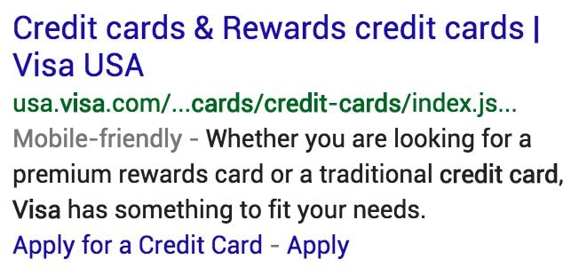
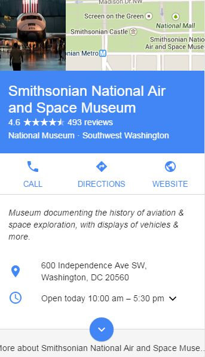

# Specificity of Queries and Landing Pages

Some queries are very general and some queries are specific. Here are some examples that compare levels of specificity of English (US) queries:

- **Query**
  - **More Specific Query**
    - **Even More Specific Query**
- chair
  - dining room chair
    - ikea "henriksdal" highback upholstered chair
- library
  - harvard library
    - harvard anthropology library
- interview questions
  - interview questions for teachers
    - practice interview questions used for teach for america
- restaurants
  - chinese restaurants
    - takeout chinese restaurants in downtown Austin
- coffee shops
  - starbucks
    - red rock coffee mountain view

Results for specific queries are easier to rate on the Needs Met scale because we know more about what the user is looking for. Giving a Needs Met rating for results for general queries can be difficult. As always, your rating is based on how helpful the result is for the query, not the specificity fit.

When the query is a broad category, such as cafes, restaurants, hotels, books, tourist attractions in paris, etc., popular and prominent examples may be considered very helpful. Please do web research to help you understand what is popular and prominent in different locations.

**Query:** credit cards  
**User Location:** Phoenix, Arizona  
**User Intent:** Users are probably looking to sign up for a credit card online, or want to research credit cards before signing up.

  
  

Even though there are many options, a page for an individual company that offers different cards could be very helpful.

**Page Quality:** Visa is a credit card company with high E‑A‑T that offers services for credit cards, banking, etc. and has a good reputation. **High+** to **Highest** is an appropriate rating.

**Needs Met:** This LP is more specific than the query, but it would still be helpful for many or most users because Visa is a popular credit card company.

  
  

Even though there are many options, a page for an individual company that offers different cards could be very helpful.

**Page Quality:** Discover is a company with high E‑A‑T that offers services for credit cards, banking, etc. with a good reputation. **High+** to **Highest** is an appropriate rating.

**Needs Met:** This LP is more specific than the query, but it would still be helpful for many or most users because Discover is a popular credit card company.

  
  

This page offers a list of top credit cards in a variety of categories.

**Page Quality:** This website helps consumers make money decisions. It has a good reputation, high E‑A‑T, and has been recommended by several major newspapers. **High** is an appropriate rating.

**Needs Met:** This LP fits the query. It would be helpful for most users.

  
  

This page describes a credit card that requires union membership.

**Page Quality:** This company is an expert on its own credit card, which is issued by HSBC Bank, a financial services organization with a good reputation and high E‑A‑T. **High** is an appropriate rating.

**Needs Met:** Since the credit card requires union membership, the page would be helpful for some users.

**Query:** hotels  
**User Location:** Jacksonville, Florida  
**User Intent:** Users are probably planning a trip, but this query is very general and vague.

  
  

This is a popular travel aggregator website, and the hotel page on the site can help users find hotels in the U.S. Users can read reviews, compare hotels, or make a reservation.

**Page Quality:** Orbitz is a popular website with high E‑A‑T and a good reputation. **High** is an appropriate rating.

**Needs Met:** This LP fits the query. It would be very helpful for most users.

  
  

This is a very popular hotel chain with hotels available in the majority of the U.S. at many different price points.

Even though the list of possible hotel chains is long, the homepage of an individual chain that offers different prices, features, and location options could be very helpful.

**Page Quality:** The Marriott website gives information on Marriott hotels, a popular chain of hotels. Marriott has a good reputation and is an expert on Marriott hotels, making the information on this page highly authoritative. **High+** to **Highest** is an appropriate rating.

**Needs Met:** This LP is more specific than the query, but it would still be helpful for many or most users because the Marriott is a popular chain of hotels.

  
  

This is the webpage of the Marriott Courtyard hotel in Emeryville, California.

**Page Quality:** The Marriott website gives information on Marriott hotels, a popular chain of hotels. Marriott has a good reputation and is an expert on Marriott hotels, making the information on this page highly authoritative. **High+** to **Highest** is an appropriate rating.

**Needs Met:** The LP is too specific for the query, but this is a well-known brand and users can navigate to other Marriott hotels from this page. Few users would find this page helpful.

**Query:** target  
**User Location:** Jacksonville, Florida  
**User Intent:** Go to target.com or find a nearby Target store.

  

No Page Quality rating required

**Needs Met:** The result block shows three popular Target locations in Jacksonville, with information that is especially helpful for users who want to visit the store.

  
  

The LP is the Target website.

**Page Quality:**  Target is a popular shopping website in the U.S. with high E‑A‑T and is trusted by users for online purchases. **High** to **High+** is an appropriate rating.

**Needs Met:** The result is very satisfying for mobile users that want to go to the website.

  
  

The LP is the "store locator" page on the Target website.

**Page Quality:** Target is the expert about where its stores are located. This page is the most authoritative page on this topic. **High** to **Highest** is an appropriate rating.

**Needs Met:** The LP is more specific than the query, but many or most users would be interested in this page.

  
  

The LP is the "electronics" page on the Target website.

**Page Quality:**  Target is a popular shopping website in the U.S. with high E‑A‑T and is trusted by users for online purchases. **High** to **High+** is an appropriate rating.

**Needs Met:** The LP is more specific than the query, but many or most users would be interested in this page.

  

No Page Quality rating required

**Needs Met:** While this result block has some helpful content, most people searching for Target are not looking for the stock price or the names of the CEO and Founder. A rating of **Slightly Meets** to **Slightly Meets+** is appropriate.

  
  

The LP on the Target website is for a specific type of women's pants.

**Page Quality:**  Target is a popular shopping website in the U.S. with high E‑A‑T and is trusted by users for online purchases. **High** to **High+** is an appropriate rating.

**Needs Met:** The LP is much more specific than the query and would be helpful for very few users.

**Query:** chicken recipes  
**User Location:** Austin, Texas  
**User Intent:** Users probably want to make a chicken dish and are looking for some recipes to choose from. Users probably expect and want a list of recipes.

  
  

This LP has many chicken recipes (with reviews) on a popular recipe website.

**Page Quality:**  Food Network is a popular website with high E‑A‑T and a good reputation for providing high quality recipes and cooking information. **High+** to **Highest** is an appropriate rating.

**Needs Met:** This LP fits the query. It would be very helpful for most users.

  
  

This LP has a single recipe for chicken parmesan.

**Page Quality:**  Food Network is a popular website with high E‑A‑T and a good reputation for providing high quality recipes and cooking information. **High+** to **Highest** is an appropriate rating.

**Needs Met:** This is a popular type of chicken recipe on a popular website, but the LP is more specific than the query. Some or few users would find this page helpful.

  
  

This LP has over 25 recipes for fried chicken, a popular chicken dish.

**Page Quality:** Allrecipes.com is a popular website with high E‑A‑T and a good reputation for providing high quality recipes with lots of reviews. **High+** to **Highest** is an appropriate rating.

**Needs Met:** Even though there are over 25 different recipes on the LP, they are all for the same basic dish. Therefore, this LP is also more specific than the query. Some or few users would find this page helpful.

  
  

This is a fake search page for chicken recipes.

**Page Quality:** Ads should never disguise themselves as the MC of the page. Pages with Ads that are designed to look like MC do not have a beneficial purpose. Since this page deceives users, it should receive the **Lowest** rating.

**Needs Met:** It should be rated **FailsM** as it would be helpful for no users.

**Query:** smithsonian air and space museum store  
**User Location:** Washington, DC  
**User Intent:** Go to the store website or find information, such as opening hours, about the museum's store in Washington, DC.

  
  

This LP is the official website for the museum store.

**Page Quality:**  This is the website of a popular museum store with a good reputation and high E‑A‑T. The museum is the expert on information about the store, including hours, phone numbers, membership information, etc. **High+** to **Highest** is an appropriate rating.

**Needs Met:** The result is very satisfying for mobile users that want to go to the website.

  

No Page Quality rating required

**Needs Met:** While the result is about the museum, the hours, address, and directions are the same as the museum store. This information is helpful for users searching for the store.

  
  
  

This LP has information about how to volunteer at the museum.

**Page Quality:** This is the volunteer page for a popular museum with a good reputation and high E‑A‑T. The museum is the expert on their own volunteer opportunities. **High+** to **Highest** is an appropriate rating.

**Needs Met:** The LP is more specific than the query and would be helpful for few users.

  

No Page Quality rating required

**Needs Met:** This is not the museum requested in the query so the result **Fails to Meet** the user intent.

Copyright 2020 © Google (<a href="https://static.googleusercontent.com/media/guidelines.raterhub.com///searchqualityevaluatorguidelines.pdf">source</a>)

