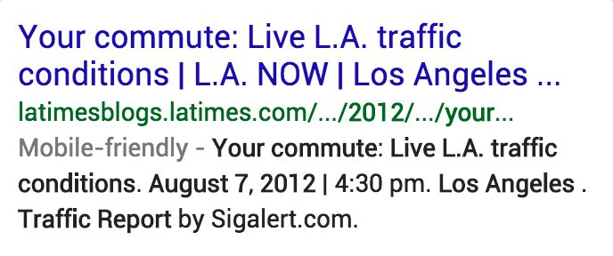

# Needs Met Rating and Freshness

Some queries demand very recent or "fresh" information. Users may be looking for "breaking news," such as an important event or natural disaster happening right now. Here are different types of queries demanding current/recent results.

Type of Query|Example Queries|Explanation
---|---|---
"Breaking news" queries|`tornado`, `tsunami`|Assume users need the information right away.  Imagine someone who needs immediate weather information because a big storm is coming. Information about last year's weather would not be helpful.
Recurring event queries, such as elections, sports events, TV shows, conferences, etc.|`olympics`, `american idol`, `redsox schedule`, `tax forms`, `elections`|Assume users are looking for the most recent or current information about the event.  For example, if the Olympics are happening right now, users searching `olympics` want information about the current Olympics, not results from years ago. If the next Olympics are a few months away, users are probably interested in the upcoming Olympics.
Current information queries|`population of paris`, `amount of u.s. debt`, `airfare from ny to sfo`, `next federal holiday`|Assume users are looking for the most current information, such as prices or airfare.
Product queries|`iphone`, `toyota camry`, `windows operating system`|Assume users are looking for information about the most recent model/version for these product queries.

When a query demands recent content, only pages with current, recent, or updated content should get high Needs Met ratings. For these queries, pages about past events, old product models and prices, outdated information, etc. are not helpful. They should be considered "stale" and given low Needs Met ratings. In some cases, stale results are useless and should be rated **FailsM**.

For some queries, there may be "newsy" or recent information user intent, as well as more "timeless" information user intent. Users issuing queries for celebrities or politicians may be interested in biographical information, or users may be looking for the latest news or gossip.

Freshness is generally less of a concern for Page Quality rating. "Stale" pages can have high Page Quality ratings. For example, some highly reputable news websites maintain "archival" content. However, unmaintained/abandoned "old" websites or unmaintained and inaccurate/misleading content is a reason for a low Page Quality rating.

**Note:** The date the page was created may be different from when the content was last updated or modified. When content is updated, the page will sometimes show the date of the update, not the date the page was created. Some websites always show the current date, regardless of when the content was last updated. If you are curious about the content of a page, see [here](http://archive.org/web/web.php) to try the "Wayback Machine" on the Internet Archive. Not all pages are available, but this tool may help you understand how some pages were created and how their content has changed over time.

Query and User Intent|Result Block and LP, Needs Met Rating, Page Quality Rating|Explanation
---|---|---
**Query:** `nasa mars landing`  **User Location:** San Francisco, California  **User Intent:** On the date this example was written, NASA had just landed the "Curiosity" rover on Mars. Most users are probably looking for breaking news and pictures about the event.| |This LP has an article about the "Curiosity" rover landing, published on the same day as the landing, which is the day this example was written.
*(Same as above.)*| |This LP has an article about the launching of the "Curiosity" rover, published nine months before its landing on Mars. The content on this page would be considered stale for the query.
**Query:** `los angeles traffic`  **User Location:** Los Angeles, California  **User Intent:** Users are looking for **current** information about traffic conditions in Los Angeles. Even pages about traffic conditions the day before would be considered stale for the query.| |This LP shows traffic conditions in Los Angeles on August 7, 2012, which is the day this example was written.
*(Same as above.)*| |This LP shows traffic conditions in Los Angeles on August 6, 2012. It is stale and useless for the query even though it is only one day old.
**Query:** `nobel peace prize winner`  **User Location:** San Diego, California  **User Intent:** Find the name of the most recent winner of this prize. This is a **Know Simple** query. At the time this example was originally written, 2011 was the most recent year that the Nobel Peace Prize was awarded.| |This LP on the New York Times website has information about the most recent winner of this prize, based on the date when this example was written.
*(Same as above.)*| |This LP on the BBC website has information about the 2006 winner of this prize. This page is stale for the query.
**Query:** `arthritis`  **User Location:** Philadelphia, Pennsylvania  **User Intent:** Users are looking for information about this disease. Because there is ongoing research done on treatments and cures for most diseases, users are probably looking for authoritative, up-to-date information on arthritis.| |Medline Plus is an authoritative website that regularly updates its content.
*(Same as above.)*| |This 2006 article would be considered stale for this medical query.
**Query:** `when was franklin d roosevelt born`  **User Location:** Chicago, Illinois  **User Intent:** Users want to find this well understood fact.| |This LP has the information users are looking for.
*(Same as above.)*|We couldn't find a stale page for this query.|N/A
