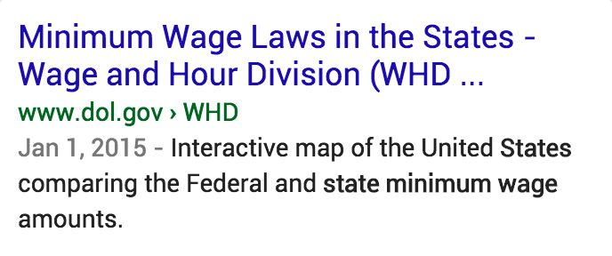

# Rating Visit-in-Person Intent Queries

When there is a user location for a visit-in-person intent query and a location has not been specified in the query itself, such as chinese restaurants with a user location of **Boston, MA**, results in or near the user location are the most helpful.

How close is "near"? The type of business and/or entity should be taken into consideration when deciding if the distance of the visit-in-person result is too far. For example, most people are not willing to travel very far for a gas station, coffee shop, supermarket, etc. Those are types of businesses that most users expect to find nearby.

However, users might be willing to travel a little farther for certain kinds of visit-in-person results: doctors' offices, libraries, specific types of restaurants, public facilities like swimming pools, hiking trails in open spaces, etc. Sometimes users may accept results that are even farther away, such as a very specialized medical clinic.

In other words, when we say users are looking for results "nearby," the word "nearby" can mean different distances for different queries. As always, please use your judgment.

## Examples Where User Location Does (and Does Not) Matter

As previously mentioned, the user location may not always change our understanding of the query and user intent. Below is one example where user location plays an important role, and two examples where user location does not matter.

**Query:** minimum wage rate  
**User Location:** Wichita, Kansas  
**User Intent:** Find out what the current minimum wage is. Different states in the U.S. have different minimum wage rates. Users might be interested in the minimum wage in their state and how it compares to other places.

  
  
This SCRB displays the complete and correct answer prominently in the result block, in a way that is easy for users on mobile devices to read.  
**Note:** Assume that the result shows current information for users at the time this example was written. If you were rating this task, you would need to verify that the minimum wage rate in this SCRB is accurate for the state of Kansas.

  
  
This is the official Kansas state website page on minimum wage for Kansas.

  
  
This LP has the minimum wage rates for all states. It is on the official U.S. Department of Labor website, which has high E‑A‑T on the topic, but it takes some work to find the information specific to Kansas.

  
  
This is the official California state website page on minimum wage for California.

---

**Query:** pictures of kittens  
**User Location:** Pittsburgh, Pennsylvania  
**User Intent:** Users are looking for pictures of kittens. This is a non-visit-in-person intent query. There is no obvious user intent to find pictures of kittens in Pittsburgh. The user location plays no role in the Needs Met rating.

  
  
The LP is a page full of kitten pictures. The result block has a nice assortment of pictures as well that would highly satisfy users.

  
  
This is a local listing of pets needing homes in the Pittsburgh area. There are no pictures of any pets directly on this page and few pictures on the individual listings.

---

**Query:** google jobs  
**User Location:** Miami, Florida  
**User Intent:** Users are looking for job opportunities at Google.

  
  
The user is looking for a job at Google and there is no information in this result block that will help the user explore job opportunities—it Fails to Meet the user need.

  
  
This is Google's official page on careers and jobs at Google, where users can search for currently open opportunities. This page is exactly what the user is looking for—it Fully Meets the user need.

Copyright 2020 © Google (<a href="https://static.googleusercontent.com/media/guidelines.raterhub.com///searchqualityevaluatorguidelines.pdf">source</a>)

